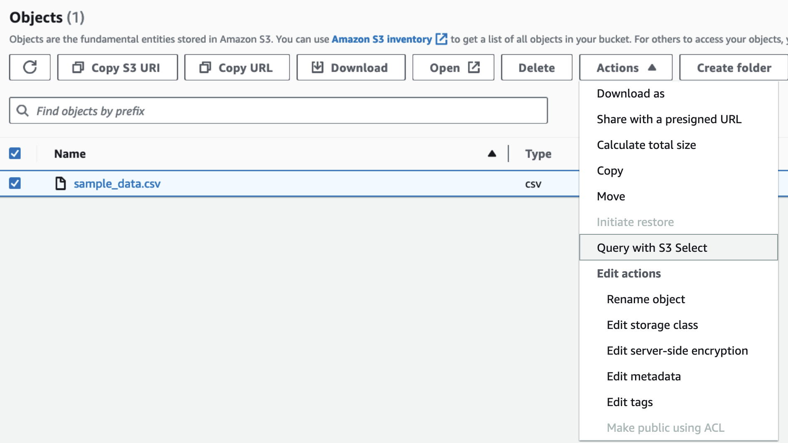
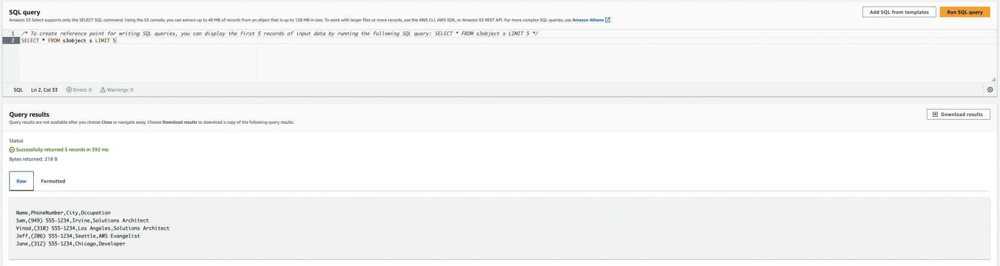

## 소개

Amazon Simple Storage Solution(S3)은 무한하고 내구성이 뛰어나며 탄력적이고 비용 효율적인 스토리지 솔루션입니다. 그러나 S3를 사용하는 애플리케이션은 방대한 데이터 세트의 하위 집합을 가져와야 하는 경우가 많으며, 매번 전체 개체를 처리하여 개체의 하위 집합을 가져오는 것은 불가능합니다. 이는 애플리케이션의 속도에 영향을 미치기 때문에 Amazon S3는 S3 Select라는 기능을 만들었습니다.

즉, S3를 사용하면 더 이상 다운로드, 추출, 처리 후 출력을 받을 필요가 없습니다. 또한 S3 Select는 GZIP 또는 BZIP2 압축 개체와 서버 측 암호화 개체 등 [다양한 파일 유형을 지원](https://docs.aws.amazon.com/AmazonS3/latest/API/API_SelectObjectContent.html)합니다.

### **제한점**

한 가지 제한 사항은 SQL 표현식의 최대 길이가 256KB라는 점입니다. 또한 입력 또는 결과에서 레코드의 최대 길이는 1MB입니다. 또한 복잡한 분석 쿼리 및 조인은 지원되지 않습니다. 마지막으로, 선택 쿼리는 한 번에 하나의 파일에서만 실행할 수 있습니다.

## **사용해보기**

### **SQL Query 결과**

