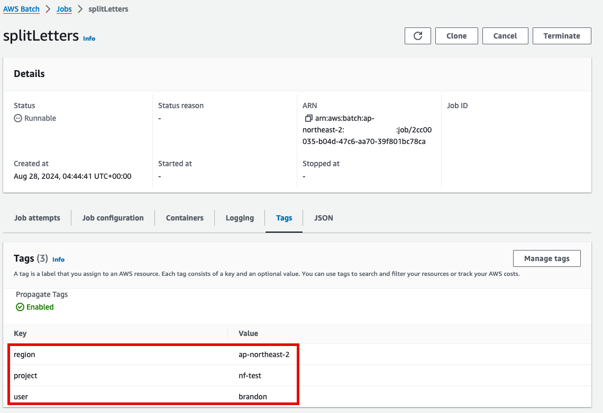
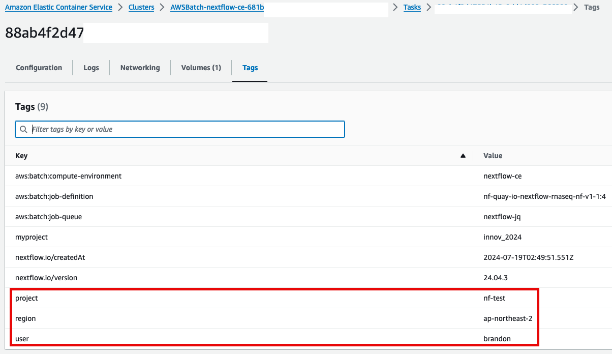

### Tagging 소개

태그 (Tag)는 AWS 리소스에 할당하는 레이블입니다. 태그는 키와 값으로 구성되니다. 예를들어 태그를 사용하여 부서, 유형, 애플리케이션 별로 리소스에 레이블을 지정할 수 있습니다.

AWS Batch 의 작업 정의의 태깅을 사용해서 aws batch에서 실행되는 작업에 대한 리소스 태그를 지정할 수 있습니다. 아래는 그 내용을 설명합니다.

### AWS Batch

#### Tagging your AWS Batch resources

Batch 의 작업 정의 (job definition)에서 Propagate Tags 옵션을 활성화하면 AWS Batch 작업들과 작업정의의 태그가 task로 태그가 전파됩니다.

AWS Batch jobs에 대해 tag propagation 기능을 제공합니다. (참고: [https://docs.aws.amazon.com/batch/latest/userguide/using-tags.html?icmpid=docs\_console\_unmapped#tag-resources](https://docs.aws.amazon.com/batch/latest/userguide/using-tags.html?icmpid=docs_console_unmapped#tag-resources))

### Nextflow

다음과 같은 Nextflow 코드가 있습니다. 이와 같이 Nextflow + AWS Batch 사용시 [resourceLabels](https://www.nextflow.io/docs/latest/process.html#resourcelabels) 기능을 사용하면 됩니다.

이 기능은 위에서 설명한 AWS Batch의 리소스 태깅 기능을 사용하여 제공됩니다. (참고: [https://github.com/nextflow-io/nextflow/blob/5a37e6177f7a0e02b2af922768a0df5984b07b7b/plugins/nf-amazon/src/main/nextflow/cloud/aws/batch/AwsBatchTaskHandler.groovy#L713C36-L713C53)](https://github.com/nextflow-io/nextflow/blob/5a37e6177f7a0e02b2af922768a0df5984b07b7b/plugins/nf-amazon/src/main/nextflow/cloud/aws/batch/AwsBatchTaskHandler.groovy#L421))

```java
params.str = 'Hello world!'

process splitLetters {
    resourceLabels region: 'ap-northeast-2', user: 'brandon', project: 'nf-test'

    output:
    path 'chunk_*'

    """
    printf '${params.str}' | split -b 6 - chunk_
    """
}

process convertToUpper {
    resourceLabels region: 'ap-northeast-2', user: 'brandon', project: 'nf-test'

    input:
    path x

    output:
    stdout

    """
    cat $x | tr '[a-z]' '[A-Z]'
    """
}

workflow {
    splitLetters | flatten | convertToUpper | view { it.trim() }
}
```

다음과 같이 AWS Batch 의 Job 내용에 Tags가 부여됩니다.

[](https://www.aws-ps-tech.kr/uploads/images/gallery/2024-08/U8qimage.png)

다음과 같이 ECS 에 작업 (Task)에도 Tag가 적용되었음을 확인할 수 있습니다.

[](https://www.aws-ps-tech.kr/uploads/images/gallery/2024-08/cQqimage.png)