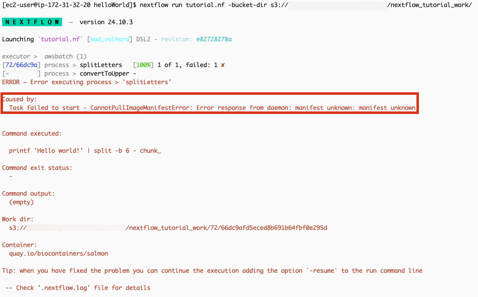
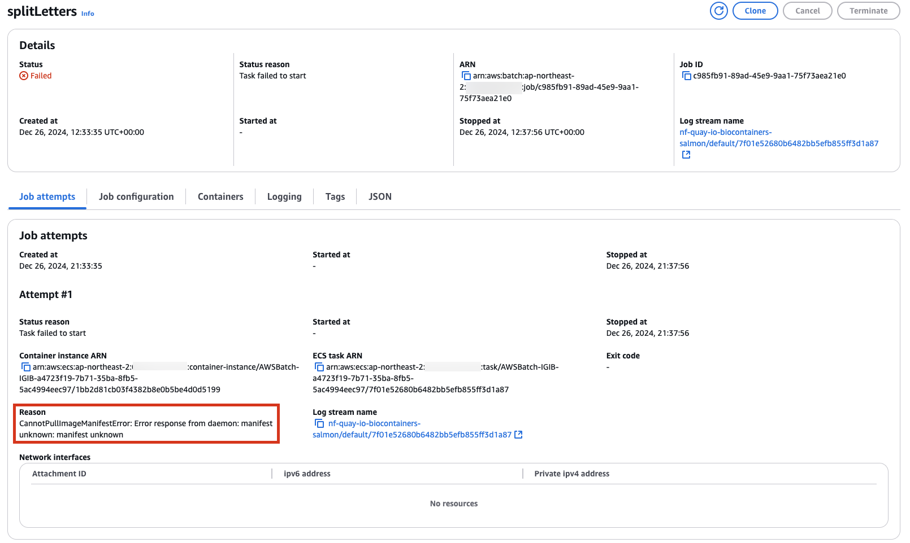
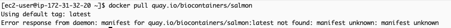
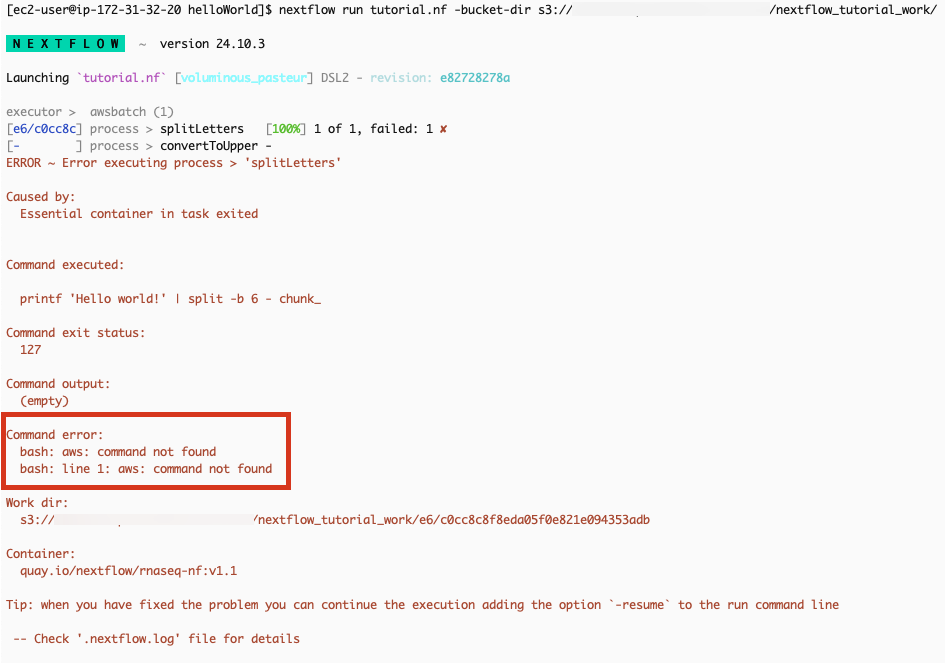
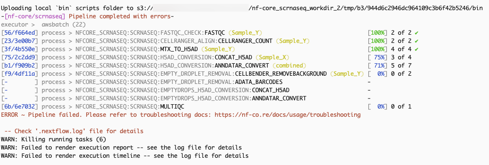
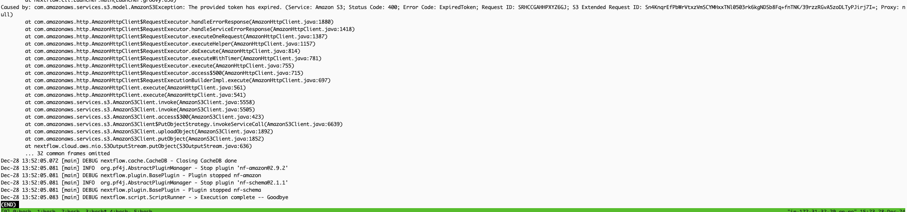

**CannotPullImageManifestError: Error response from daemon: manifest unknown: manifest unknown**

**Solution**

Check your docker image.

**bash: aws: command not found**

**Solution**

Check your container image has the aws cli program.

[https://www.nextflow.io/docs/latest/aws.html#custom-ami](https://www.nextflow.io/docs/latest/aws.html#custom-ami)

**ERROR ~ Pipeline failed. Please refer to troubleshooting docs: [https://nf-co.re/docs/usage/troubleshooting](https://nf-co.re/docs/usage/troubleshooting)**

Solution

Check the .nextflow.log file content. There may be various causes, but this appears to be because the token has expired.

