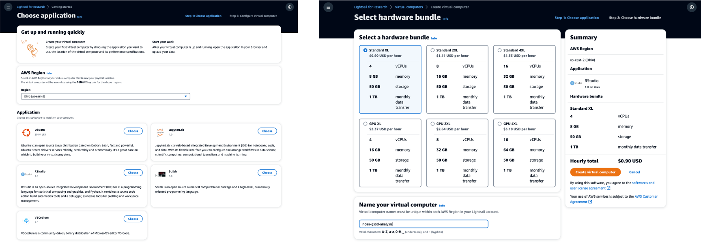

### 서비스 소개

[홈페이지](https://aws.amazon.com/ko/lightsail/research/)

연구용 Amazon Lightsail을 사용하면 클라우드의 강력한 컴퓨터에서 연구를 가속화할 수 있습니다. Scilab, RStudio, Jupyter 등 선호하는 연구 애플리케이션이 사전 설치되어 있어 몇 번의 클릭만으로 바로 사용할 수 있습니다. 브라우저를 통해 원격으로 실행되는 애플리케이션에 액세스하고 웹 인터페이스를 통해 가상 컴퓨터에 데이터를 업로드 및 다운로드할 수 있습니다. 가상 컴퓨터를 사용하는 기간 동안 번들 요금만 지불하면 됩니다.

### 관련 워크샵

- [Deploy RStudio and Perform Analysis with Amazon Lightsail for Research](https://catalog.us-east-1.prod.workshops.aws/workshops/79931708-eca5-4fcc-93eb-35328c5f9615/en-US "https://catalog.us-east-1.prod.workshops.aws/workshops/79931708-eca5-4fcc-93eb-35328c5f9615/en-US")
- [Deploying JupyterLab and Performing Machine Learning on Amazon Lightsail for Research](https://catalog.us-east-1.prod.workshops.aws/workshops/0e5810f1-99fa-40d2-b8f9-fbfaca896e43 "https://catalog.us-east-1.prod.workshops.aws/workshops/0e5810f1-99fa-40d2-b8f9-fbfaca896e43")

