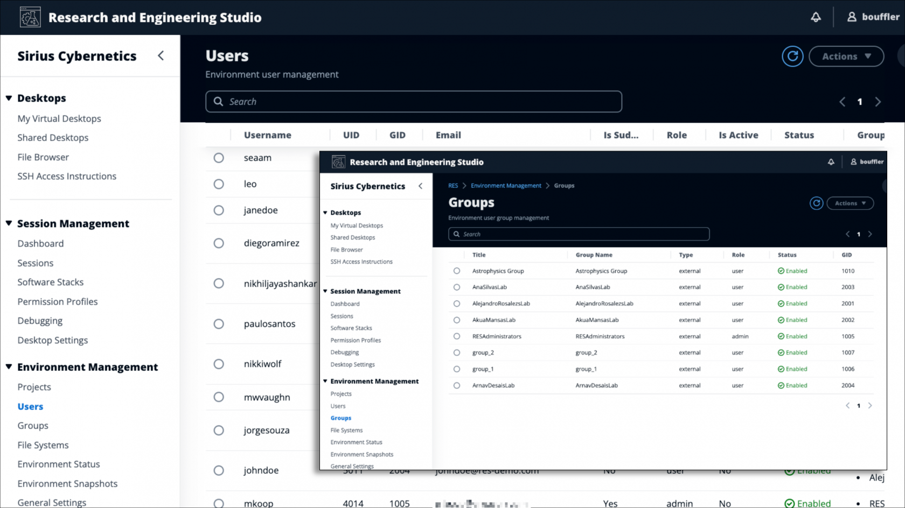
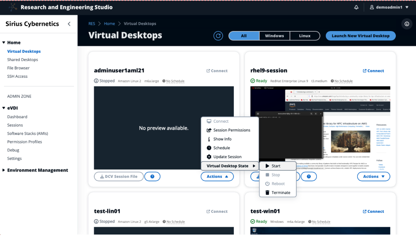
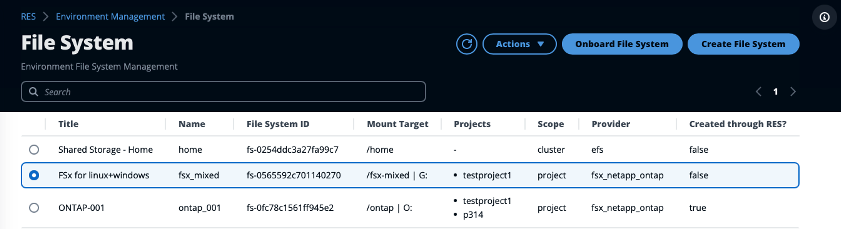
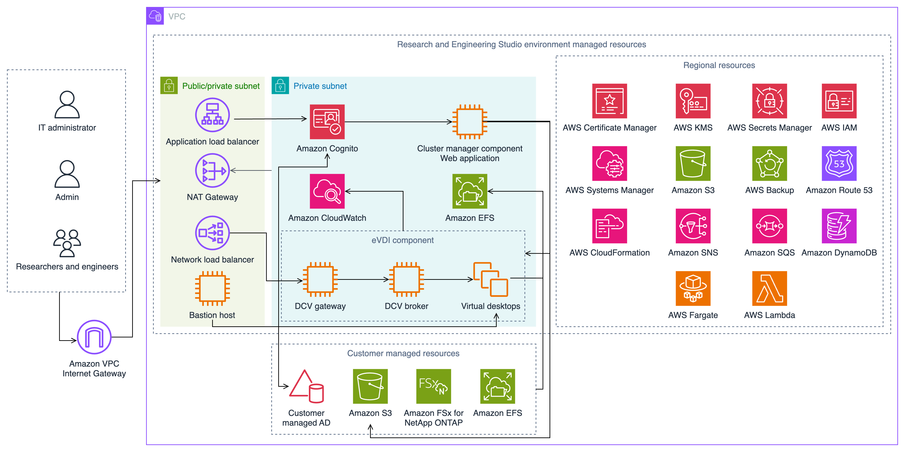

RES(Research and Engineering Studio on AWS)는 관리자가 안전한 클라우드 기반 연구 및 엔지니어링 환경을 만들고 관리할 수 있는 사용하기 쉬운 오픈 소스 웹 기반 포털입니다. 과학자와 엔지니어는 RES를 사용하여 클라우드 전문 지식 없이도 데이터를 시각화하고 대화형 애플리케이션을 실행할 수 있습니다.

[https://aws.amazon.com/hpc/res/](https://aws.amazon.com/hpc/res/)

[https://aws.amazon.com/blogs/hpc/new-research-and-engineering-studio-on-aws/](https://aws.amazon.com/blogs/hpc/new-research-and-engineering-studio-on-aws/)

