이제[ 앞 세션](https://www.aws-ps-tech.kr/books/aws/page/ec2-ami)에서 만들어낸 AMI로 부터 새로운 인스턴스를 생성하는 방법을 배우겠습니다.

## EC2 대시보드 시작

AWS 관리 콘솔 검색 창에 EC2를 입력합니다.

[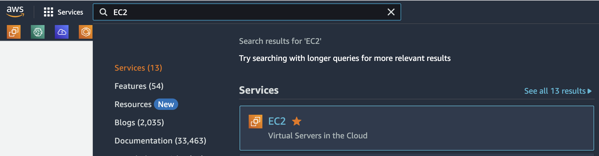](https://www.aws-ps-tech.kr/uploads/images/gallery/2023-09/screenshot-2023-09-26-at-10-49-54-pm.png)

**EC2**를 선택하여 **EC2 대시보드**를 엽니다.

인스턴스는 그래픽 사용자 인터페이스(콘솔) 또는 명령줄 스크립트를 통해 시작할 수 있습니다. 먼저 **EC2 대시보드**라고 하는 그래픽 콘솔 인터페이스부터 시작하겠습니다.

대시보드의 레이아웃에 익숙해지는 데 몇 분 정도 시간을 투자하세요:

- **왼쪽 탐색 창**: 저장된 Amazon 머신 이미지(AMI), 스토리지 볼륨, ssh 키와 같은 도구 및 기능.
- **가운데**: 리소스 목록 및 인스턴스 시작 기능.
- **오른쪽 창**: 문서 및 가격 등의 일반 정보.

[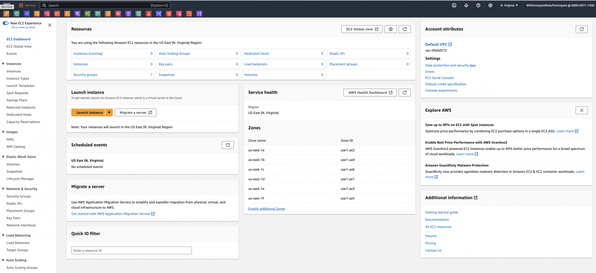](https://www.aws-ps-tech.kr/uploads/images/gallery/2023-09/screenshot-2023-09-26-at-10-51-20-pm.png)

## AMI에서 EC2 인스턴스 실행

이제 EC2 Linux 기반 인스턴스를 시작하겠습니다.

1\. AWS 관리 콘솔에 로그인하고 Amazon EC2 콘솔([https://console.aws.amazon.com/ec2](https://console.aws.amazon.com/ec2))을 엽니다. AWS 관리 콘솔의 오른쪽 상단 모서리에서 원하는 AWS 지역(예: **N.Virginia**)에 있는지 확인합니다.

실습을 하면서 가끔 사용하는 브라우저의 국가 설정에 의해 다른 리전으로 리전 정보가 바뀌는 경우가 있습니다. 워크샵에 사용하고 있는 리전 정보가 맞는지 꼭 확인해주세요.   

[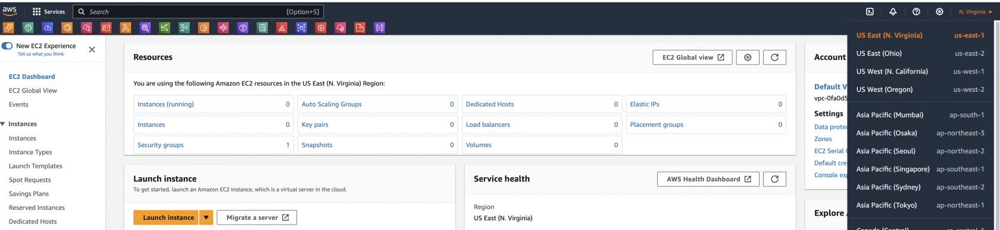](https://www.aws-ps-tech.kr/uploads/images/gallery/2023-09/screenshot-2023-09-26-at-10-53-20-pm.png)

2\. 왼쪽 탐색 창에서 이미지 섹션 아래의 AMI를 클릭합니다.3. 워크샵의 이전 섹션에서 만든 AMI를 선택한 다음 이미지에서 인스턴스 시작 버튼을 클릭합니다.

[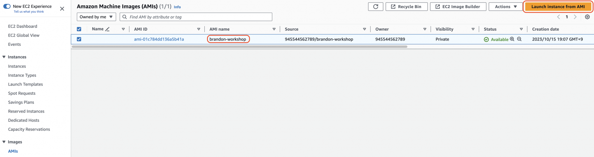](https://www.aws-ps-tech.kr/uploads/images/gallery/2023-10/screenshot-2023-10-15-at-7-26-10-pm.png)

4\. 인스턴스 시작 페이지에서 인스턴스 이름을 지정할 수 있습니다.

[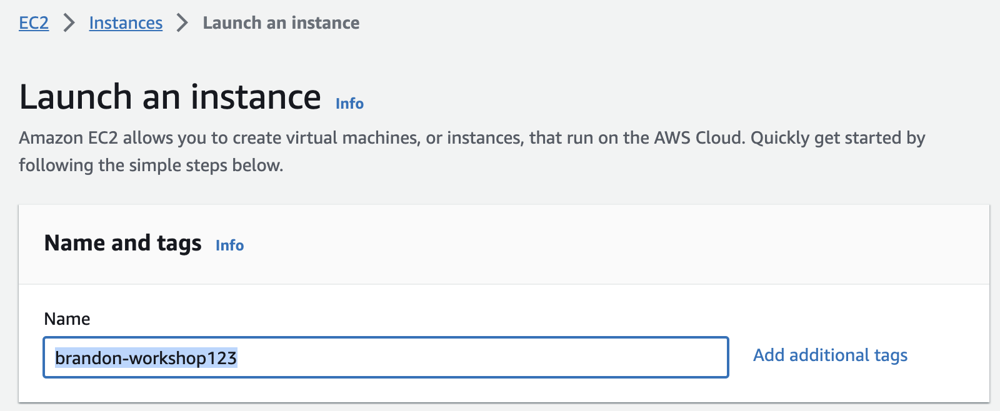](https://www.aws-ps-tech.kr/uploads/images/gallery/2023-10/screenshot-2023-10-15-at-7-27-27-pm.png)

5\. "추가 태그 추가" 및 "태그 추가"를 클릭합니다. 인스턴스에 대해 제공한 "이름"을 찾을 수 있습니다. 이제 키와 값을 입력합니다. 이 키(더 정확하게는 태그)는 인스턴스가 시작되면 콘솔에 나타납니다. 이를 통해 복잡한 환경에서 실행 중인 머신을 쉽게 추적할 수 있습니다. 이전에 키 쌍에 사용한 것과 유사한 태그를 추가로 생성하여 이 머신에 사용자와 부여 키를 지정하고 동일한 값을 입력합니다. 준비가 되면 리소스 유형 아래에서 인스턴스, 볼륨, 네트워크 인터페이스를 선택합니다.

[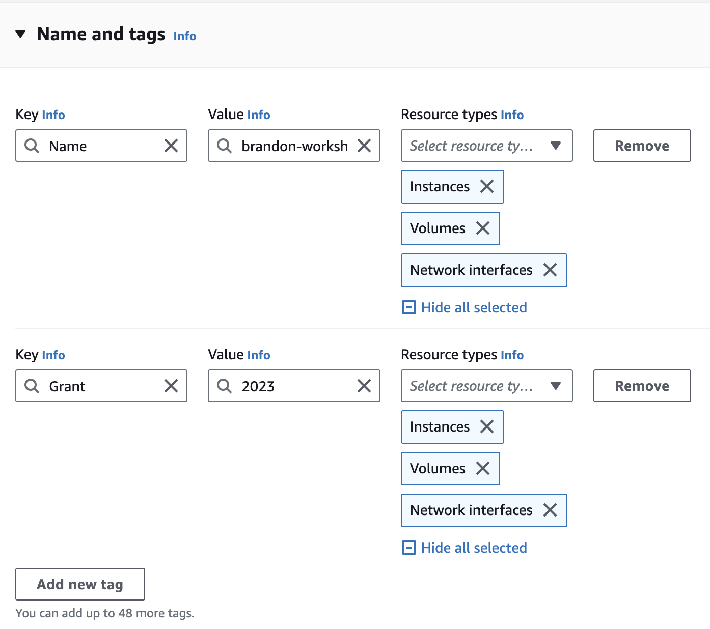](https://www.aws-ps-tech.kr/uploads/images/gallery/2023-10/screenshot-2023-10-15-at-7-28-18-pm.png)

[6. 인스턴스 유형 아래에서 드롭다운 화살표를 클릭하고 검색창에 **t2.2xlarge**를 입력합니다.](http://slchen-lab-training.s3-website-ap-southeast-1.amazonaws.com/images/hpc-aws-parallelcluster-workshop/EC2AddTags-2.png)

[**실제 환경에서 프로젝트 요구 사항에 따라 리소스를 고려**하기 전까지는 이 인스턴스를 **기본 인스턴스로 간주해서는 안 됩니다.** 지금은 어디까지나 실습입니다.](http://slchen-lab-training.s3-website-ap-southeast-1.amazonaws.com/images/hpc-aws-parallelcluster-workshop/EC2AddTags-2.png)

[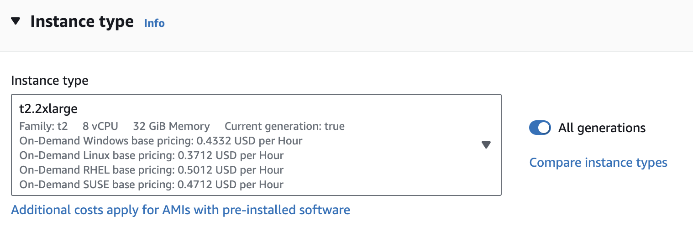](https://www.aws-ps-tech.kr/uploads/images/gallery/2023-10/screenshot-2023-10-15-at-7-29-09-pm.png)

7\. 키 쌍(로그인) 아래의 드롭다운 목록에서 이 실습의 시작 부분에서 만든 키 쌍을 선택합니다.

[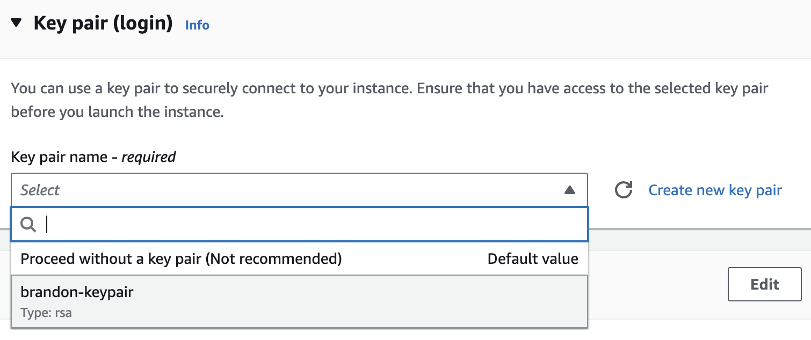](https://www.aws-ps-tech.kr/uploads/images/gallery/2023-10/screenshot-2023-10-15-at-7-28-46-pm.png)

8\. 다음으로 네트워크 설정에 대해 편집을 클릭합니다. 서브넷 및 보안 그룹 세부 정보를 입력하라는 메시지가 표시됩니다. 보안 그룹은 방화벽 규칙이 됩니다.

1. 서브넷 필드는 특정 가용 영역에서 인스턴스를 시작하도록 구성할 수 있습니다. 이 워크샵에서는 기본값을 유지하지만, 이렇게 하면 컴퓨터의 위치를 제어할 수 있습니다.
2. 기존 보안 그룹 선택을 선택합니다.

[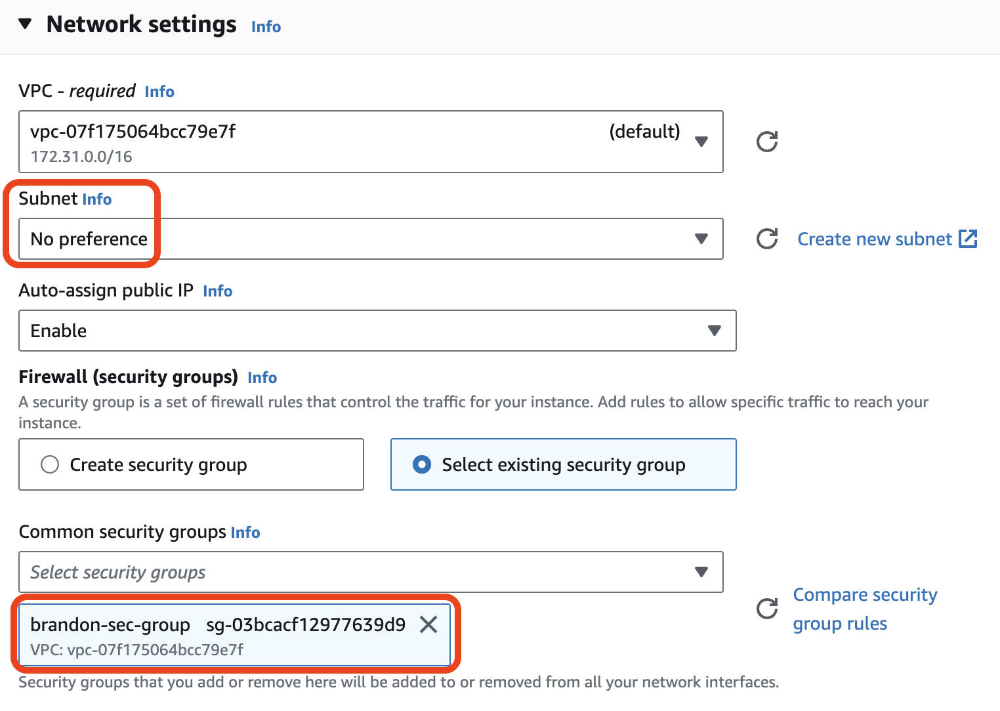](https://www.aws-ps-tech.kr/uploads/images/gallery/2023-10/screenshot-2023-10-15-at-7-29-42-pm.png)[9. 스토리지 구성에서 인스턴스에 스토리지 및 디스크 드라이브를 수정하거나 추가할 수 있습니다. 이 실습에서는 스토리지 기본값을 그대로 사용하겠습니다.](http://slchen-lab-training.s3-website-ap-southeast-1.amazonaws.com/images/hpc-aws-parallelcluster-workshop/EC2ConfigSecGroups-3.png)[10. 요약에서 구성을 검토하고 인스턴스 시작을 클릭합니다.](http://slchen-lab-training.s3-website-ap-southeast-1.amazonaws.com/images/hpc-aws-parallelcluster-workshop/EC2AddStorage-2.png)

[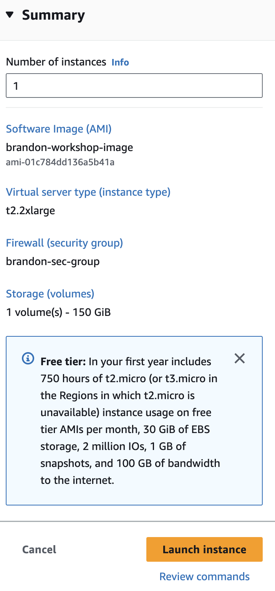](https://www.aws-ps-tech.kr/uploads/images/gallery/2023-10/screenshot-2023-10-15-at-7-56-28-pm.png)

이제 인스턴스가 시작되며 잠시 시간이 걸릴 수 있습니다. 인스턴스 시작이 성공적으로 시작되었습니다라는 메시지와 함께 시작 상태 페이지가 표시됩니다.

11\. 페이지 오른쪽 하단에서 모든 인스턴스 보기를 클릭하여 EC2 인스턴스 목록을 확인합니다. 인스턴스를 클릭합니다. 초기화 프로세스를 거치게 됩니다. 인스턴스가 시작되면 Linux 서버는 물론 인스턴스가 속한 가용 영역과 공개적으로 라우팅할 수 있는 DNS 이름이 표시됩니다.

[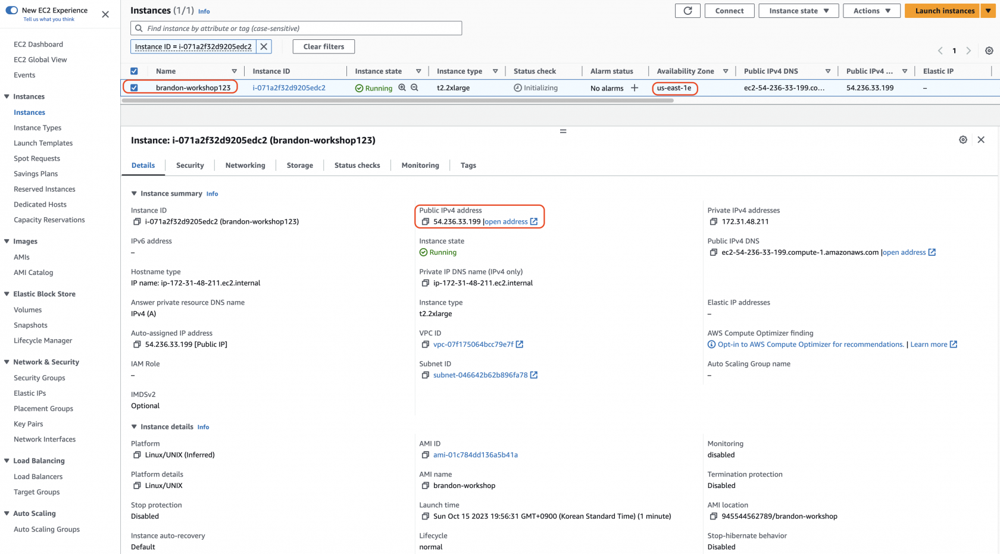](https://www.aws-ps-tech.kr/uploads/images/gallery/2023-10/screenshot-2023-10-15-at-7-58-02-pm.png)

12\. 새롭게 부여된 접속주소 (ip)로 인스턴스에 로그인 해서 기존에 사용했던 AMI가 맞는지 확인해볼 수 있습니다.

> 참고
> 
> 여기서는 history 명령어를 사용해 새로운 인스턴스 실행시 이전에 커맨드라인 사용내역을 확인해보았습니다.
> 
> [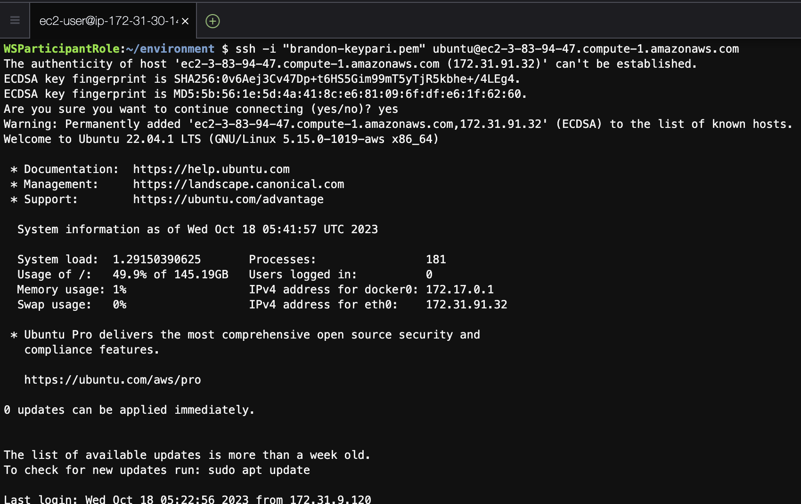](https://www.aws-ps-tech.kr/uploads/images/gallery/2023-10/screenshot-2023-10-18-at-2-42-42-pm.png)
> 
> [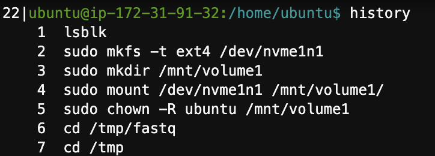](https://www.aws-ps-tech.kr/uploads/images/gallery/2023-10/screenshot-2023-10-18-at-2-43-42-pm.png)

