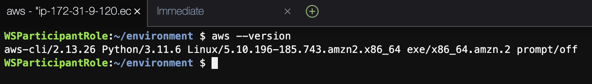
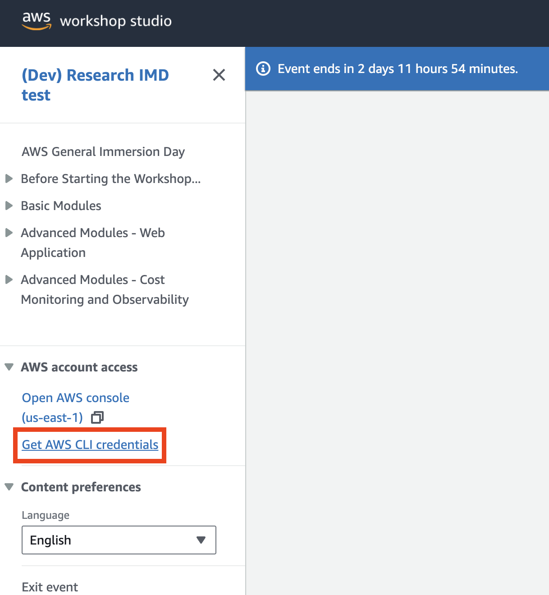
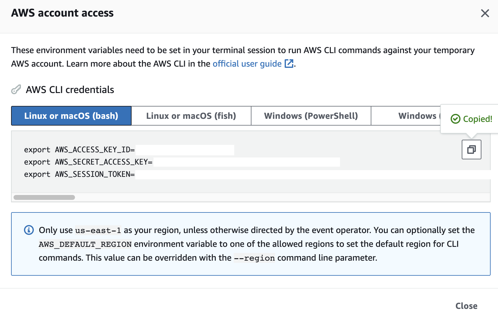
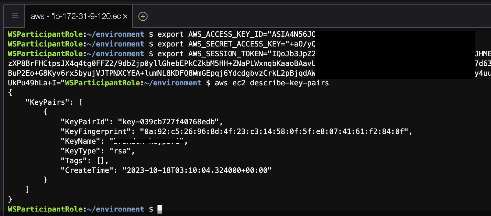

## AWS CLI 소개

[AWS CLI](https://aws.amazon.com/cli/)를 사용하면 명령줄을 사용하여 서비스를 관리하고 스크립트를 통해 서비스를 제어할 수 있습니다. 많은 사용자가 AWS CLI를 사용하여 일정 수준의 자동화를 수행합니다.

<p class="callout info">최신 버전의 AWS CLI 설치 또는 업데이트는 [다음](https://docs.aws.amazon.com/ko_kr/cli/latest/userguide/getting-started-install.html)을 참고해주세요. </p>

### AWS CLI 사용

다음 명령을 사용하여 AWS CLI를 탐색합니다(창을 종료하려면 q를 사용하세요):

- version
- general AWS CLI help
- help related to Amazon EC2 commands
- the list of your existing instances with their key characteristics
- the list of your registered SSH key-pairs

```bash
aws --version
```

예) Cloud9 과 AWS 에서 제공하는 OS 이미지에서는 기본적으로 AWS CLI가 설치되어 있습니다.

[](https://www.aws-ps-tech.kr/uploads/images/gallery/2023-10/screenshot-2023-10-18-at-12-05-36-pm.png)

```bash
aws help

```

```bash
aws ec2 help

```

```bash
aws ec2 describe-instances

```

```bash
aws ec2 describe-key-pairs

```

위의 `describe-instances` 및 `describe-key-pairs` 명령은 AWS 계정의 자격 증명인 액세스 키와 리전을 설정하지 않았기 때문에 실패할 가능성이 높습니다. EC2, S3 등과 같은 AWS 리소스에 액세스하려면 자격 증명이 필요하므로 권한 오류가 발생합니다(자격 증명이 없으면 AWS CLI는 사용자가 참조하는 계정을 알 수 없음). `aws configure` 명령을 사용하여 수동으로 입력할 수 있습니다.

아직 AWS 계정의 자격 증명으로 인스턴스를 구성하지 않았으므로 **~/.aws/** 폴더를 사용할 수 없습니다. 이제 **aws configure**를 진행하겠습니다.

### 계정 설정 (워크샵 스튜디오 사용자)

> AWS 에서 제공하는 워크샵 스튜디오 환경에서 실습을 할 경우는 아래와 같이 사전에 준비된 Credential을 사용하면 됩니다. 만일 그렇지 않을 경우 Access Key 를 만드는 방법은 다음 [링크](https://docs.aws.amazon.com/ko_kr/IAM/latest/UserGuide/id_credentials_access-keys.html#Using_CreateAccessKey)를 참고하세요.

[](https://www.aws-ps-tech.kr/uploads/images/gallery/2023-09/screenshot-2023-09-27-at-10-52-34-am.png)

[](https://www.aws-ps-tech.kr/uploads/images/gallery/2023-09/LPAscreenshot-2023-09-27-at-10-52-25-am-copy.png)

터미널 창에 바로 Copy &amp; Paste 할 수 있습니다.

이제 다시 한번 `aws ec2 describe-key-pairs` 명령어를 입력해보세요.

[](https://www.aws-ps-tech.kr/uploads/images/gallery/2023-10/untitled.png)


### 계정 설정 (개인 AWS 계정)

<p class="callout warning"><span lang="KO">워크샵 스튜디오 환경에서 진행할 경우 아래 내용을 따라갈 필요는 없습니다!</span></p>

<details id="bkmrk-%EA%B3%84%EC%A0%95-%EC%84%A4%EC%A0%95-%28%EC%9D%BC%EB%B0%98-aws-%EA%B3%84%EC%A0%95-%EC%82%AC%EC%9A%A9%EC%9E%90-1"><summary>계정 설정 (일반 AWS 계정 사용자)</summary>

#### Configuration

1\. aws configure 명령 실행

```bash
aws configure

```

2\. 계정의 AWS 액세스 키 ID를 입력합니다.

```bash
aws_access_key_id=[Access Key ID]

```

3\. 계정의 AWS 비밀 액세스 키를 입력합니다.

```bash
aws_secret_access_key=[Secret Access Key]

```

4\. 기본 지역 이름을 입력합니다. 이 워크샵이 실행되는 리전에 따라 설정합니다. 여기서는 예로써 `us-east-1` (미국 동부 지역)을 사용합니다.

```bash
Default region name=us-east-1

```

Enter 키를 눌러 출력 형식의 기본값을 수락합니다.

5\. `ec2 describe-instances` 명령을 실행하고 출력을 확인합니다.

```bash
aws ec2 describe-instances

```

여기에는 지정된 지역에 대한 계정의 모든 EC2 인스턴스에 대한 설명이 표시됩니다.

6\. 또한 선택한 지역에 대한 키 쌍을 살펴보세요.

```bash
aws ec2 describe-key-pairs

```

<p class="callout warning">이것은 AWS CLI에 대한 매우 간략한 소개입니다. 막강한 힘에는 막중한 책임이 따르므로 인스턴스 자동화에 사용하기 전에 충분히 숙지하고 연습하세요. </p>

#### Verifying AWS Credentials

Amazon S3와 상호 작용하기 전에 AWS 자격 증명의 중요성에 대해 살펴보겠습니다. AWS 보안 자격 증명은 다음을 확인하는 데 사용됩니다.

1. 사용자가 누구인지
2. AWS에 요청하는 리소스에 액세스할 수 있는 권한은 이러한 보안 자격 증명을 사용하여 요청을 인증하고 권한을 부여합니다.

이전 섹션에서 사용자를 구성했습니다. 이제 ~/.aws/ 폴더에 있는 자격 증명과 구성 파일을 살펴보겠습니다. (워크샵스튜디오를 사용한 AWS 구성에는 적용되지 않음)

```bash
cat ~/.aws/credentials

```

```bash
cat ~/.aws/config

```

이제 사용자 신원을 성공적으로 구성했습니다.

</details>### 참고자료

- [AWS CLI tips and tricks (Workshop)](https://catalog.us-east-1.prod.workshops.aws/workshops/79521eff-62b5-4792-a2e0-6dbb59d83f4a/en-US)
- [AWS CLI (Workshop)](https://catalog.us-east-1.prod.workshops.aws/workshops/74f5dee0-a709-4e9f-ada3-c48f25d36a0c/en-US)