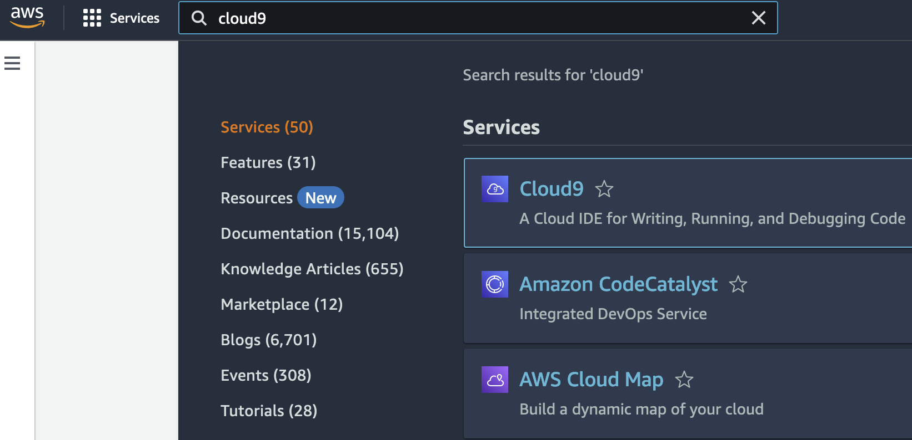
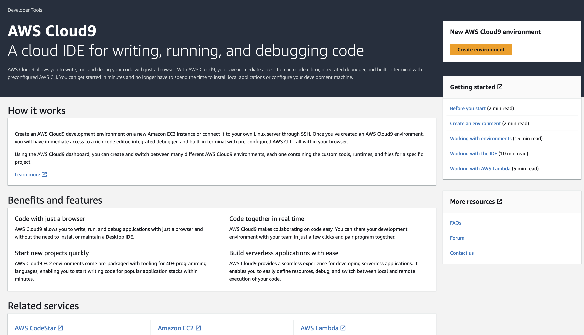
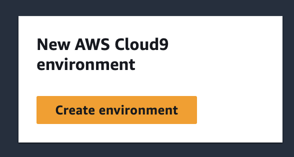
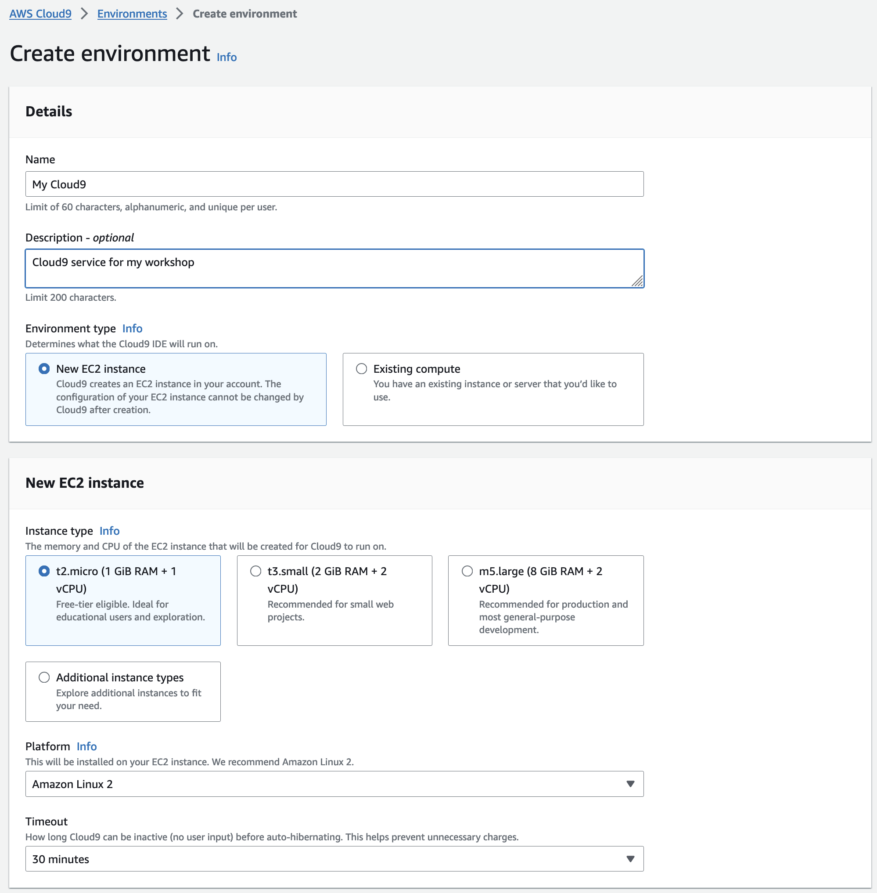
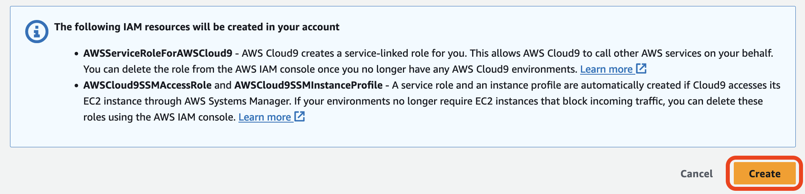
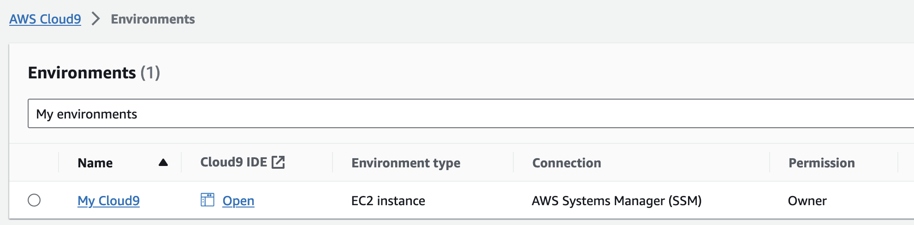
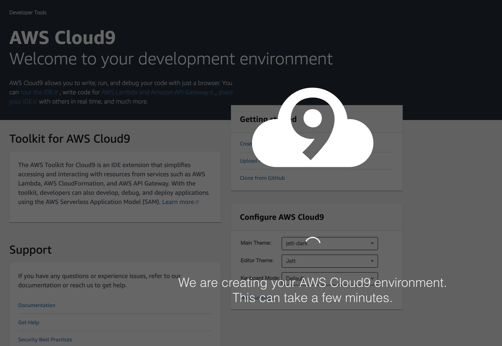
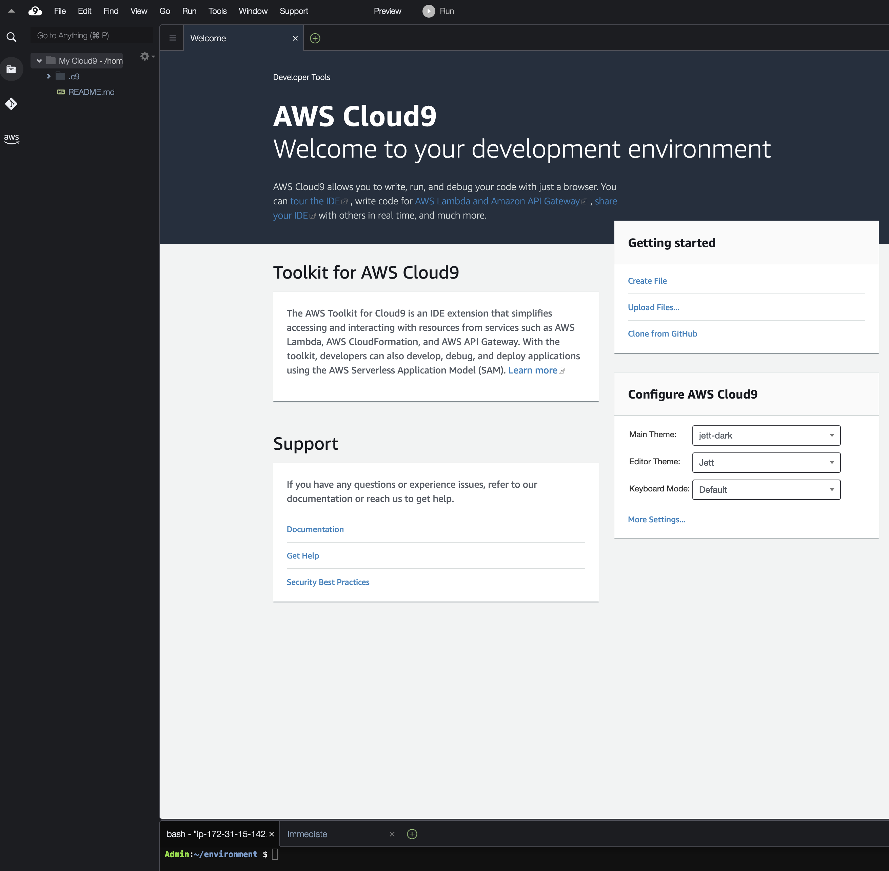
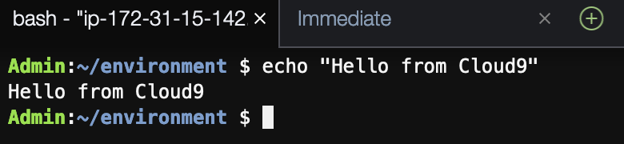

AWS Cloud9는 코드 편집기, 디버거, 터미널이 있는 통합 개발 환경(IDE)입니다. 클라우드에서 가상 서버를 제공하는 웹 서비스인 Amazon Elastic Compute Cloud(EC2)에서 실행됩니다. Cloud9은 **EC2 인스턴스의 시작과 종료를 처리하므로 사용자가 직접 할 필요가 없습니다**. 또한 **Cloud9에는 웹 인터페이스가 있어 SSH와 같은 특수 포트를 사용할 필요 없이 가상 서버에 간편하게 연결**할 수 있습니다.

Cloud9는 클라우드 애플리케이션을 개발하고 실행하기 위해 보안에 중점을 둔 안정적이고 고성능 실행 환경인 Amazon Linux 2를 실행합니다.

[AWS Cloud9 콘솔](https://docs.aws.amazon.com/ko_kr/cloud9/latest/user-guide/create-environment-main.html#create-environment-console) 또는 [코드](https://docs.aws.amazon.com/ko_kr/cloud9/latest/user-guide/create-environment-main.html#create-environment-code)를 사용하여 AWS Cloud9 EC2 개발 환경을 생성할 수 있습니다. 여기서는 콘솔을 통해 생성하는 방법을 안내합니다. ([참고](https://docs.aws.amazon.com/ko_kr/cloud9/latest/user-guide/create-environment-main.html))

AWS 웹사이트의 콘솔화면에서 cloud9 을 검색하여 서비스 페이지로 접속합니다.

[](https://www.aws-ps-tech.kr/uploads/images/gallery/2024-05/screenshot-2024-05-08-at-8-55-42-pm.png)

Cloud9의 AWS 관리 콘솔 페이지는 다음과 같습니다.

[](https://www.aws-ps-tech.kr/uploads/images/gallery/2024-05/screenshot-2024-05-08-at-8-56-25-pm.png)

## 1) Cloud9 환경 생성하기

환경 만들기 버튼을 선택합니다(환경 만들기 버튼이 보이지 않는 경우 아이콘을 선택하여 왼쪽 탐색 평면을 확장하고 환경을 선택한 다음 환경 만들기 버튼을 선택할 수 있습니다).

[](https://www.aws-ps-tech.kr/uploads/images/gallery/2023-10/screenshot-2023-10-18-at-11-19-38-am.png)

이제 Cloud9 환경을 생성할 수 있는 옵션이 표시됩니다:

[](https://www.aws-ps-tech.kr/uploads/images/gallery/2023-10/screenshot-2023-10-18-at-11-21-45-am.png)

Cloud9 환경의 이름과 설명(선택 사항)을 입력합니다. 생성 옵션을 아래로 스크롤하여 모든 항목을 기본값으로 설정합니다.

> **Cloud9 시간 제한**
> 
> Cloud9의 기본 "시간 초과" 값은 30분입니다. 환경에 연결된 모든 웹 브라우저 인스턴스가 닫히면 Cloud9는 해당 시간 동안 기다린 다음 환경의 EC2 인스턴스를 종료합니다. 이렇게 하면 Cloud9 환경에 적극적으로 액세스하지 않을 때(하루 업무를 종료하기 전에 EC2 인스턴스를 중지하는 것을 잊어버리는 경우) EC2 비용을 절약할 수 있습니다. 이 워크샵 중에 Cloud9이 시간 초과될 가능성은 거의 없지만, 시간 초과가 발생하면 언제든지 Cloud9 콘솔로 돌아가서 환경을 다시 시작하고 중단한 부분부터 다시 시작하도록 선택할 수 있습니다.

페이지 오른쪽 하단에서 생성 버튼을 선택합니다.[](https://www.aws-ps-tech.kr/uploads/images/gallery/2023-10/screenshot-2023-10-18-at-11-22-01-am.png)

환경이 생성되면 Cloud9 환경 목록에 해당 환경이 표시됩니다:

[](https://www.aws-ps-tech.kr/uploads/images/gallery/2023-10/screenshot-2023-10-18-at-11-26-40-am.png)

이제 Cloud9 IDE 열에서 열기 링크를 선택합니다.Cloud9 로딩 페이지가 표시됩니다. Cloud9 IDE가 시작되는 데 몇 분 정도 걸릴 수 있습니다.

[](https://www.aws-ps-tech.kr/uploads/images/gallery/2023-10/screenshot-2023-10-18-at-11-52-24-am.png)

EC2에서 실행되는 Cloud9 환경에 오신 것을 환영합니다! 클라우드에 웹 인터페이스가 있는 가상 서버를 만들었습니다.

[](https://www.aws-ps-tech.kr/uploads/images/gallery/2023-10/screenshot-2023-10-18-at-11-27-52-am.png)

## 2) Bash 셸 사용해보기

Cloud9 환경의 하단에는 Linux 명령줄(Bash 셸)이 있습니다. 오른쪽에 있는 "내용 복사" 겹쳐진 사각형 아이콘을 선택하여 아래 코드를 복사한 다음, Bash 셸 창을 선택하고 Ctrl-V(Mac의 경우 ⌘-V)를 사용하여 코드를 창에 붙여넣은 다음 Return 키를 누릅니다.

```bash
echo "Hello from Cloud9"
```

Bash 셸 창의 결과는 다음과 같아야 합니다:

[](https://www.aws-ps-tech.kr/uploads/images/gallery/2023-10/screenshot-2023-10-18-at-11-28-41-am.png)

  
이제 콘솔로 돌아가서 Cloud9 환경이 실행되는 EC2 인스턴스를 확인하겠습니다.