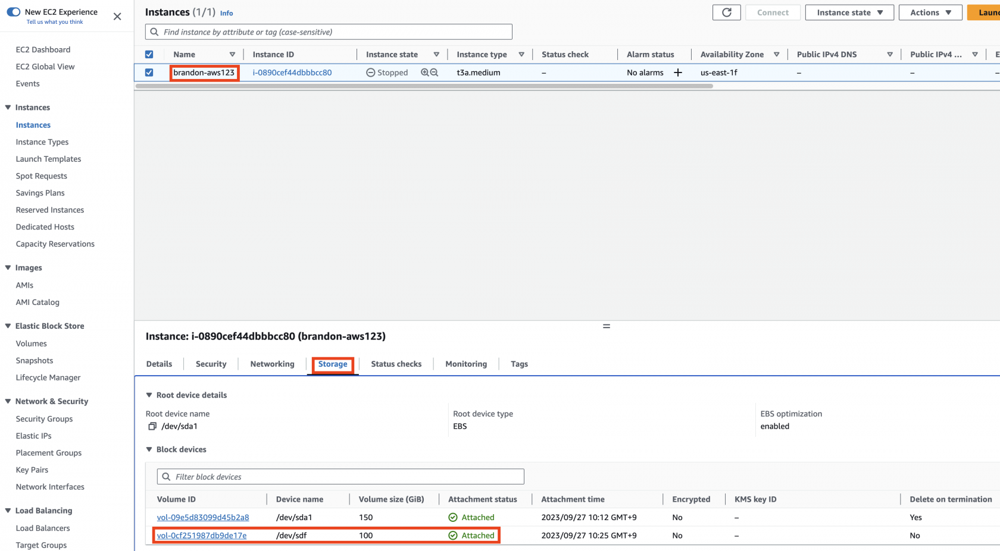
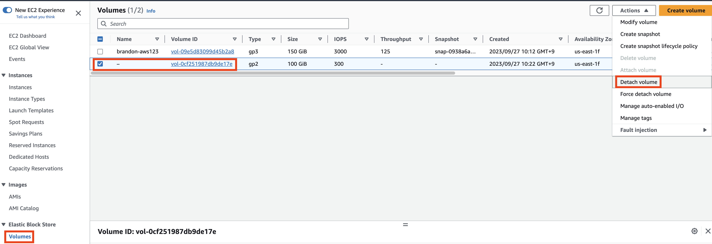
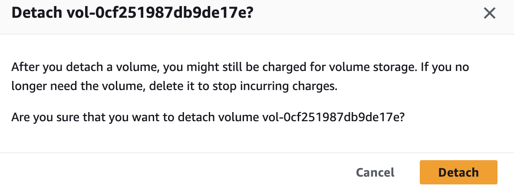
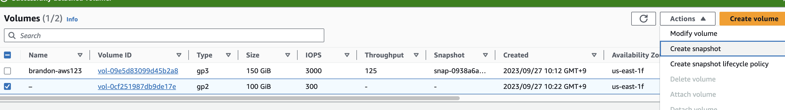
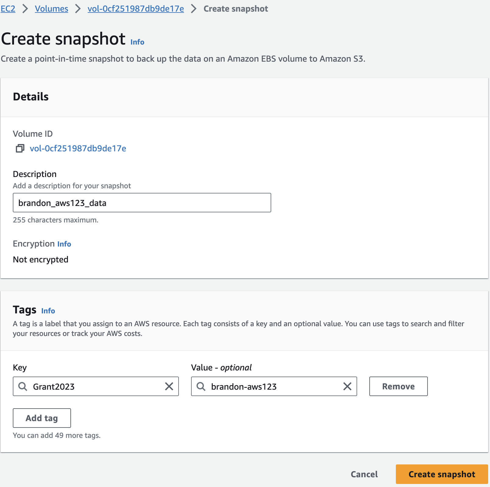
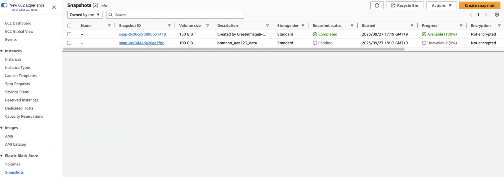
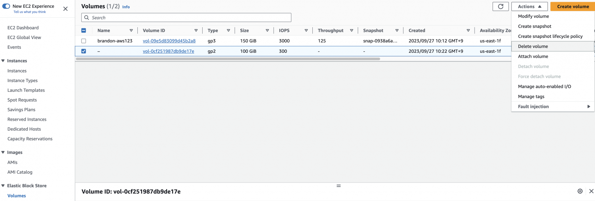
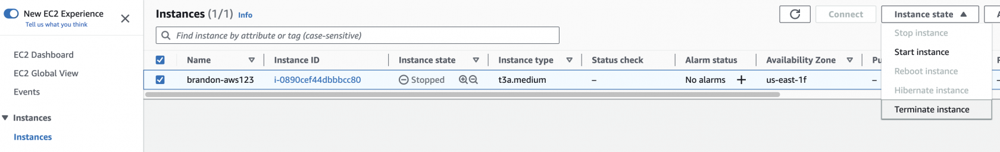
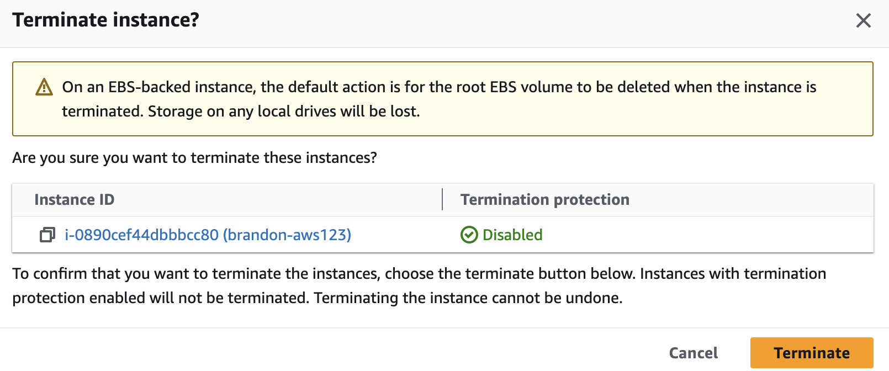

클라우드에서 워크로드를 실행할 때 비용은 중요한 고려 사항입니다. 서비스에서 비용이 발생하는 방식을 인식하면 비용을 절감하고 효율적인 워크플로우를 채택하며 현재 워크로드에 더 적합한 정교한 서비스를 사용하는 데 도움이 됩니다. 특정 기능과 서비스의 사용이 어떻게 비용 절감으로 이어질 수 있는지 이해하는 것은 좋은 습관입니다.

이 워크샵 섹션에서는 AWS의 서비스와 관련된 비용에 대해 간략하게 소개하고, EC2 및 EBS와 같은 서비스를 사용하는 특정 서비스에 대해 비용을 절감할 수 있는 방법을 보여드리겠습니다.

## Exploring EC2 Instance Lifecycle

Amazon EC2 인스턴스는 수명 주기 동안 다양한 상태로 전환됩니다.

EC2 인스턴스의 현재 인스턴스 상태를 보려면 다음과 같이 하세요:

1. AWS 관리 콘솔 검색 창에 **EC2**를 입력합니다.
2. EC2를 선택하여 EC2 Dashboard를 엽니다.
3. 왼쪽 탐색 창에서 Instances 섹션 아래의 Instances 를 선택합니다.
4. 현재 인스턴스 상태를 확인하려면 EC2 인스턴스를 선택하고 Instances state 열 아래의 값을 관찰합니다. 상태는 실행 중 (Running), 중지됨(Stopped) 또는 종료됨 (Terminated)으로 표시됩니다.

아래는 EC2 인스턴스 수명 주기의 다이어그램입니다. 인스턴스 상태는 EC2를 사용하는 동안 비용에 영향을 줍니다. 자세한 내용은 [Instance Lifecycle](https://docs.aws.amazon.com/AWSEC2/latest/UserGuide/ec2-instance-lifecycle.html)를 참조하세요.

간단히 설명하자면, EC2 인스턴스는 실행되는 동안 비용이 누적됩니다. EC2 인스턴스를 중지하면 더 이상 관련 비용이 누적되지 않습니다.

하지만 머신의 스토리지에 대한 비용은 항상 청구됩니다. 루트 드라이브의 스토리지든 루트에 연결된 EBS 볼륨이든, 머신이 중지되어도 이러한 비용은 중지되지 않습니다. 이러한 볼륨을 영구적으로 삭제할 때만 중단됩니다. 또한 사용하는 용량뿐만 아니라 디스크에 있는 전체 스토리지에 대한 비용도 지불해야 합니다. 프로젝트에 적합한 리소스를 선택해야 합니다.

## Detach the additional EBS Volume

1. In the AWS Management Console search bar, type **EC2**.
2. In the left Navigation pane click on **Instances** under the **Instances** section.
3. Select your EC2 Instance and in the Instance Details pane below, select **Storage** to view the **Block Devices** and then click on the **Volume ID** of your additional EBS Volume attached previously (e.g. /dev/sdh; the device name may be different in your case).

This will open the Volumes page showing the specific Volume details.

4. Click on the **Actions** button and further click on **Detach Volume** to detach the volume from the EC2 Instance.

5. In the **Detach Volume** dialog box, click **Detach**; the volume will now be detached and in a few moments the **Status** of the volume will change to **available**, indicating that it could be attached to another instance if required.

## Create snapshot of detached Volume

1. lick on **Actions**, then select **Create Snapshot**.

2. In the **Create Snapshot** screen, provide a **Description** for the Volume; this will be an identifier to search for the Snapshot of the Volume.

3. Click on **Add Tag** to provide a unique name tag for better identificaiton of the snapshot. Enter “Name” in the **Key** field, and “\[your initials\]-snapshot” for the **Value** field. Add the “User” and “Grant” tag you’ve previously used as well.
4. Click on **Create Snapshot**.
5. A Snapshot creation task will be started, and a message indicating the same will be displayed in a green bar on the top of the screen.
6. Click on **Snapshots** under the **Elastic Block Store** section in the left Navigation pane to view all the snapshots created.

## Delete the detached Volume

Now that a Snapshot has been taken of the volume, we will delete the volume itself.

1. In the left Navigation pane click on **Volumes** under the **Elastic Block Store** section to view all the volumes.

2. Click on **Actions** and select **Delete Volume**.

3. On the **Delete Volume** dialog click on **Delete** to confirm the delete. The EBS Volume will now be deleted. This volume no longer exists on AWS, and you will no longer be charged for it.

## Terminate EC2 Instance

We will now Terminate the EC2 Instance.

**NOTE**: Ensure your previous EC2 Image was successful; we’ll be using it in the next portion of the workshop. In this segment, you will be terminating your EC2 Instance. This is permanent and irreversible. However, using this EC2 Image, it is possible to spin up an identical machine. In general, be very cautious when terminating machines.

1. Select the EC2 Instance from the list of instances. Click on **Instance State** &gt; **Terminate Instance**.

2. On the Terminate Instance dialog, observe the note “Associated resources may incur costs after these instances are terminated” and click **Delete EBS Volume**. Read the additional note. To proceed, select **Yes, terminate**. This is an important safeguard, and never click this automatically!

The instance will now be terminated.

3. After a minute view the **Instance State** of the instance, it will indicate **Terminated**.