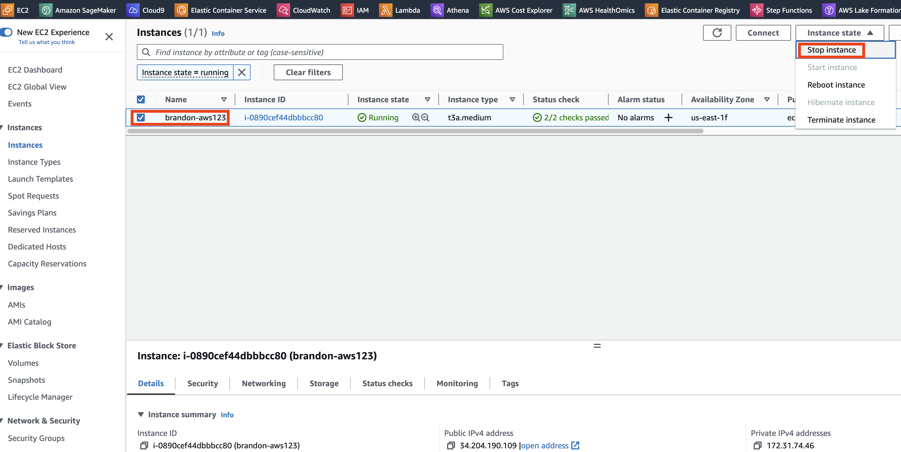
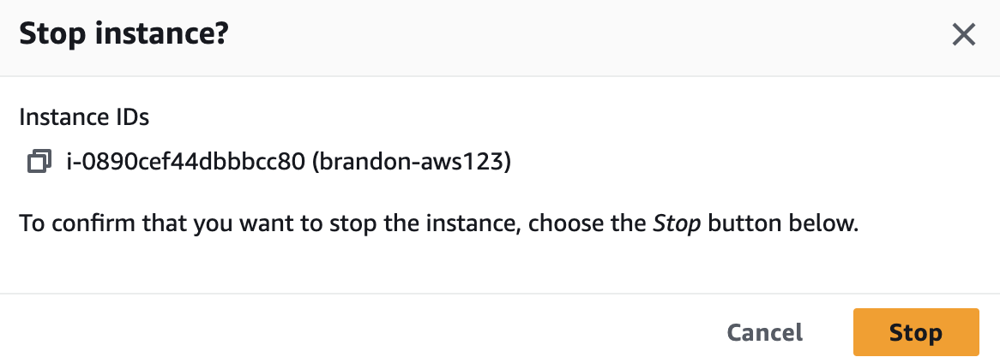
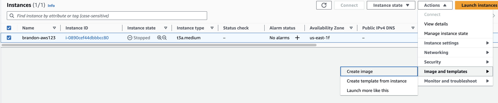
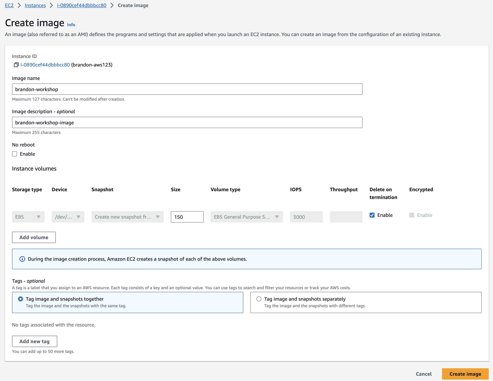
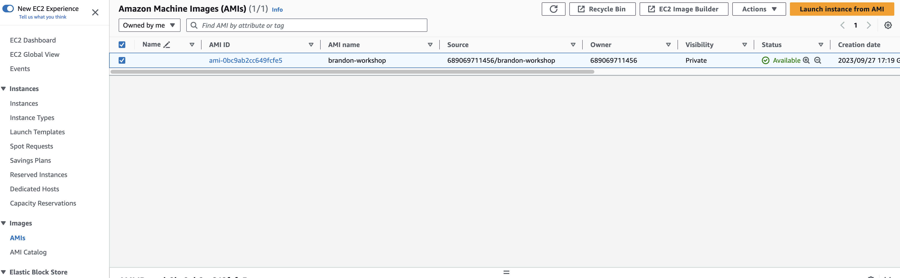
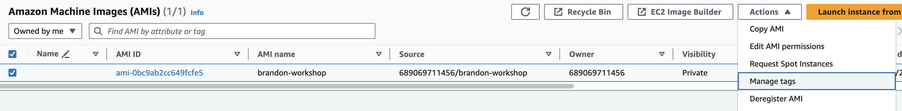
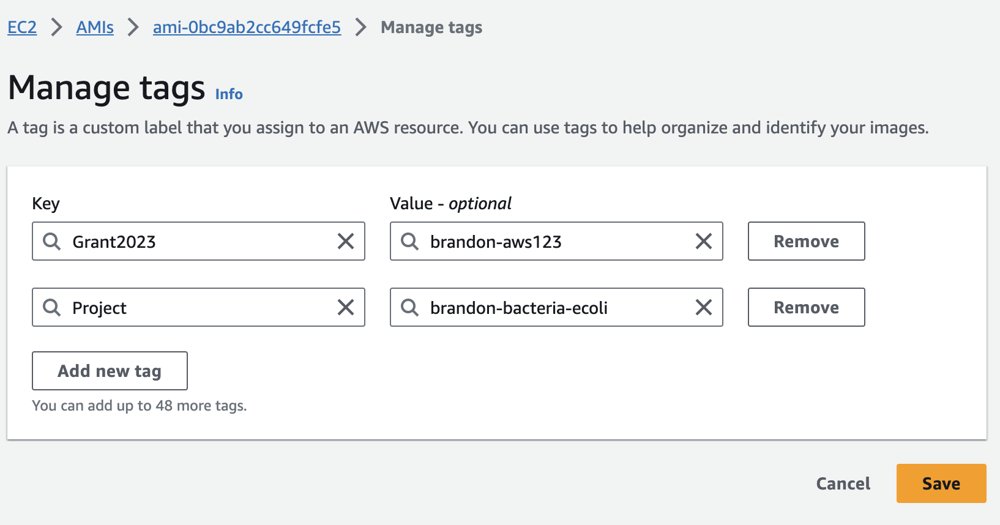

### EC2 인스턴스 중지  


이제 실행 중인 인스턴스를 중지하겠습니다. 계속 진행하기 전에 실행 중인 애플리케이션을 모두 중지하고 데이터가 저장되어 있는지 확인하는 것이 좋습니다. 인스턴스를 중지하는 것은 컴퓨터/서버를 끄는 것과 같습니다.

<p class="callout warning">이미지를 만들기 전에 인스턴스를 중지하는 것이 가장 좋지만 필수는 아닙니다. 그러나 이미지를 만드는 동안 인스턴스가 재부팅되므로 실행 중인 애플리케이션이 없는지 확인해야 합니다.</p>

1\. 인스턴스를 중지하면 /tmp가 지워지므로 중지하기 전에 필요한 모든 데이터를 /tmp에서 보다 영구적인 스토리지로 복사하세요. 계속 진행하기 전에 모든 필수 파일을 이전에 마운트한 EBS 볼륨(**/mnt/volume1**)에 복사합니다.

복사하기 전에 디렉터리에 대한 권한을 설정해야 합니다.

```bash
sudo chmod -R 777 /mnt/volume1/

```

> 만일 기본분석(옵션) 단계를 수행하지 않았다면 아래 명령어에서 No such file or directory 에러 메세지가 나옵니다. 다음 단계를 진행해도 무방합니다.

```bash
cp -ax /tmp/fastq /tmp/outbreaks /mnt/volume1/

```

2\. AWS 콘솔에 로그인하고, AWS 관리 콘솔 검색창에 **EC2**를 입력합니다.

**3. EC2**를 선택하여 **EC2 Dashboard**를 엽니다.

4\. 왼쪽 탐색 창에서 **Instances** 를 클릭하여 실행 중, 중지 중, 종료된 모든 인스턴스를 확인합니다.

5\. 인스턴스를 선택합니다.

<p class="callout info">EC2 인스턴스의 **Instance State**는 머신이 **Running** 중임을 보여줍니다.</p>

**6. Actions** 버튼을 클릭한 다음 **Instance State**를 클릭하고 마지막으로 **Stop**를 클릭합니다.

[](https://www.aws-ps-tech.kr/uploads/images/gallery/2023-09/screenshot-2023-09-27-at-4-34-50-pm.png)

7\. 대화 상자에서 Stop를 클릭하여 인스턴스 중지를 확인합니다.

[](https://www.aws-ps-tech.kr/uploads/images/gallery/2023-09/screenshot-2023-09-27-at-4-35-51-pm.png)

8\. 이제 인스턴스가 중지를 시도하고 잠시 후 Instance State가 Stopped으로 변경됩니다. 창을 새로 고쳐야 할 수도 있습니다.


### EC2 이미지 생성  


이제 EC2 인스턴스의 이미지를 생성하겠습니다.

1\. 중지한 EC2 인스턴스를 선택하고, **Actions** 버튼을 클릭한 다음, **Image**를 클릭하고, **Create Image**을 클릭합니다.

[](https://www.aws-ps-tech.kr/uploads/images/gallery/2023-09/screenshot-2023-09-27-at-5-17-43-pm.png)

2\. 이미지 생성 페이지에서 이미지 이름과 이미지 설명을 입력합니다**. "x" 버튼을 클릭하여 EC2 인스턴스에 연결한 추가 EBS 볼륨을 제거**해야 합니다(아래 이미지 처럼 1개만 남으면 됩니다). 이미지 생성을 클릭하여 이미지 생성 작업을 시작합니다.

<p class="callout info">**<span lang="EN-US">여기서 추가되어 있는 EBS 볼륨을 삭제하는 이유  
</span>**<span lang="EN-US">기본 EBS<span lang="KO">에 필요한 연구용 Tool과</span> <span lang="KO">라이브러리가 설치될 것이고, 추가로 부착한</span> EBS<span lang="KO">에는 데이터만 저장되므로 이미지에 포함 시키지 않습니다</span></span></p>

[](https://www.aws-ps-tech.kr/uploads/images/gallery/2023-09/screenshot-2023-09-27-at-5-19-05-pm.png)

이미지 생성 작업이 백그라운드에서 시작되고 준비가 완료되면 EC2 대시보드 페이지 상단에 "성공적으로 생성됨 ..."이라는 메시지가 표시됩니다.

<p class="callout info">인스턴스를 중지하지 않고 계속 로그인한 상태였다면 인스턴스가 재부팅되고 ssh 세션이 종료되었을 것입니다. 다시 연결해야 합니다 (**IP 주소 새로 확인 필요**).</p>

3\. 이미지 생성 작업이 진행되도록 잠시 기다립니다. 이미지가 생성되었는지 확인하려면 왼쪽 탐색 창의 이미지 섹션에서 **AMIs**를 클릭하면 이전에 생성된 모든 AMI와 진행 중인 새 AMI를 볼 수 있습니다.

새 AMI가 생성 중이거나 이미 생성되어 사용자가 지정한 이름으로 사용할 준비가 된 것을 확인할 수 있습니다.

[](https://www.aws-ps-tech.kr/uploads/images/gallery/2023-09/screenshot-2023-09-27-at-6-03-26-pm.png)

4\. 새 AMI 인스턴스를 선택하고 **Actions** 버튼을 클릭한 다음 **Manage Tags** 를 클릭합니다. 이전과 마찬가지로 이미지에 이름, 사용자 등 태그 기능을 사용해 리소스에 태깅할 수 있습니다.

[](https://www.aws-ps-tech.kr/uploads/images/gallery/2023-09/screenshot-2023-09-27-at-6-03-55-pm.png)

[](https://www.aws-ps-tech.kr/uploads/images/gallery/2023-09/screenshot-2023-09-27-at-6-04-24-pm.png)