## AMI 소개

Amazon Machine Image(AMI)는 **인스턴스를 시작하는 데 필요한 정보를 제공하는 AWS에서 지원되고 유지 관리되는 이미지**입니다. **인스턴스를 시작할 때 AMI를 지정해야 합니다.** 동일한 구성의 인스턴스가 여러 개 필요할 때는 한 AMI에서 여러 인스턴스를 시작할 수 있습니다. 서로 다른 구성의 인스턴스가 필요할 때는 다양한 AMI를 사용하여 인스턴스를 시작할 수 있습니다.

AMI에 관한 보다 자세한 사항은 AWS 공식문서의 [다음 링크](https://docs.aws.amazon.com/ko_kr/AWSEC2/latest/UserGuide/AMIs.html)를 참고해주세요.

## 워크샵 소개

이 워크샵 섹션에서는 워크샵의 뒷부분에서 분석을 실행하는 데 사용할 사전 제작된 AMI에서 자체 EC2 Linux 인스턴스를 설정하는 방법을 안내합니다.

여기서는 National University of Singapore (NUS와 Genome Institute of Singapore (GIS)의 Chen Lab에서 구축한 이미지를 사용할 것입니다. 여기에는 박테리아(및 일반) 유전체학에 유용한 많은 공통 도구가 설치되어 있습니다. 이 [AMI에 무엇이 있고 어떻게 설정](https://github.com/swainechen/chenlab-training/tree/main/sysadmin)되었는지는 함께 제공되는 [GitHub 리포지토리](https://github.com/swainechen/chenlab-training)에 문서화되어 있습니다. 이러한 지침은 다른 시스템에서 동일한 소프트웨어를 설정하려는 경우 유용할 수 있으며, 자신의 작업을 위해 다른 소프트웨어를 설치할 때 몇 가지 힌트를 얻을 수 있습니다.

구체적으로 다음과 같은 방법을 배웁니다:

a. AWS 관리 콘솔에 로그인하여 탐색합니다.

b. AMI에서 Amazon EC2 인스턴스를 생성합니다.

c. EC2 인스턴스에 SSH로 접속하여 Linux 명령을 실행합니다.

## EC2 대시보드 시작

1\. AWS 관리 콘솔 검색 창에 **EC2**를 입력합니다.

**2. EC2**를 선택하여 **EC2 Dashboard**를 엽니다.

대시보드의 레이아웃에 익숙해지는 데 몇 분 정도 시간을 할애하세요:

- 왼쪽 창: 저장된 Amazon 머신 이미지(AMI), 스토리지 볼륨 및 ssh 키와 같은 도구 및 기능입니다.
- 가운데: 리소스 목록 및 인스턴스 시작 기능.
- 오른쪽 창: 문서 및 가격 등의 일반 정보.

[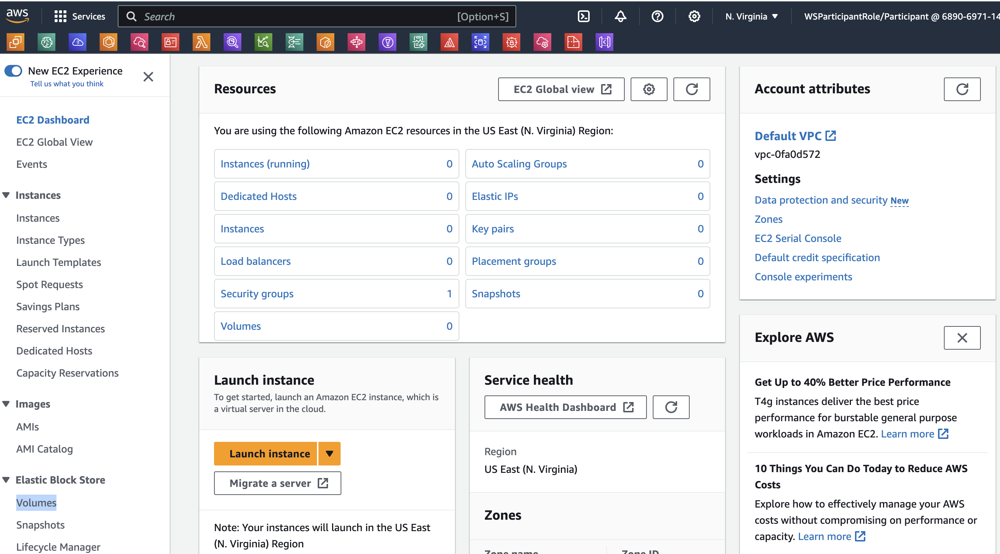](https://www.aws-ps-tech.kr/uploads/images/gallery/2023-09/screenshot-2023-09-26-at-11-36-10-pm.png)

## EC2 인스턴스 시작

이제 EC2 Linux 기반 인스턴스를 시작하겠습니다.

**1. Launch Instance** 을 클릭한 다음 드롭다운 메뉴에서 **Launch Instance**을 다시 클릭합니다.

[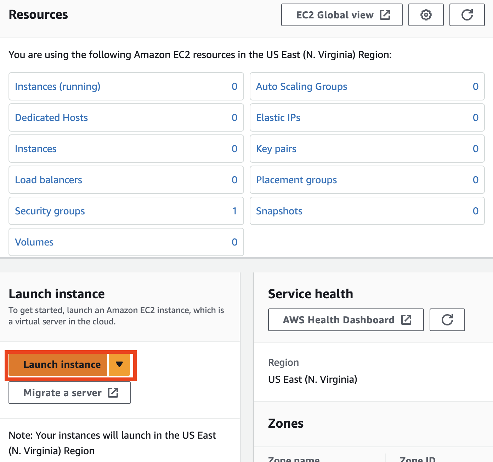](https://www.aws-ps-tech.kr/uploads/images/gallery/2023-09/screenshot-2023-09-26-at-11-36-35-pm.png)

**2. Launch an instance** 페이지에서 인스턴스의 원하는 이름을 지정할 수 있습니다.

### [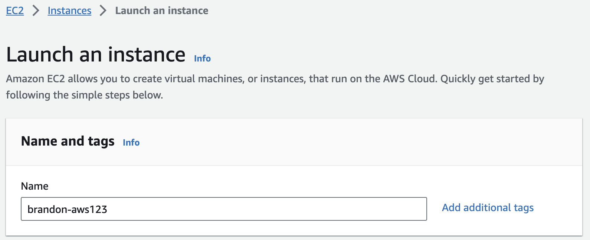](https://www.aws-ps-tech.kr/uploads/images/gallery/2023-09/screenshot-2023-09-26-at-11-37-10-pm.png)

**3. Add additional tags** 를 클릭하고 "Add Tag"를 클릭합니다. 인스턴스에 대해 제공한 "Name"을 찾을 수 있습니다. 이제 키와 값을 입력합니다. 이 키(더 정확하게는 태그)는 인스턴스가 시작되면 콘솔에 나타납니다. 이를 통해 복잡한 환경에서 실행 중인 머신을 쉽게 추적할 수 있습니다. 이전에 키 쌍에 사용한 것과 유사한 태그를 추가로 생성하여 이 머신에 사용자와 부여 키를 지정하고 동일한 값을 입력합니다. 준비가 되면 **Resource types** 아래에서 **Instances**, **Volumes**, **Network interfaces** 선택합니다.

[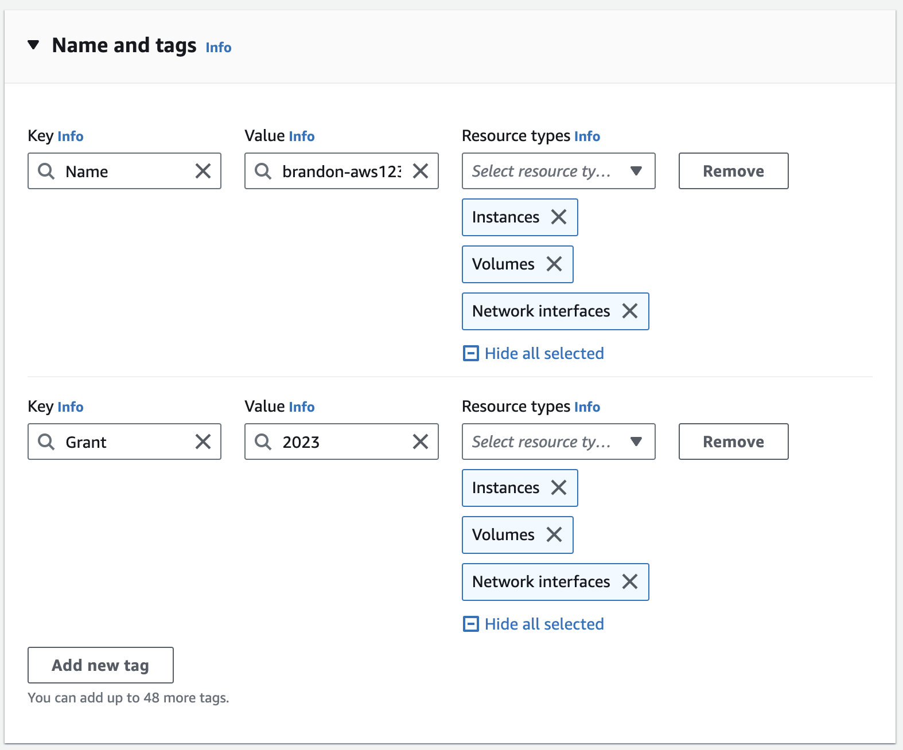](https://www.aws-ps-tech.kr/uploads/images/gallery/2023-10/screenshot-2023-10-07-at-12-03-29-am.png)

**4. Application and OS images (Amazon Machine Image)** 아래에서 검색 상자에 교육용으로 공유된 AMI ID를 입력 또는 `CHENLAB`을 검색하여 선택합니다. **AMI**는 사진과 다를 수 있으므로 **강사의 안내를 참조**하세요. **특히 `N.Virginia` 리전이 아닌 `Seoul` 리전 등 다른 리전에서 실습할 경우 강사에 의해 AMI가 사전에 공유되어야지만 사용할 수 있습니다.**

 **참고로 AMI는 각 리전 별로 모두 AMI ID 가 다릅니다. 리전 간 AMI를 복사하는 방법은 [다음](https://repost.aws/ko/knowledge-center/copy-ami-region)을 참고하세요. [그외 (AMI 공유 방법 참고](https://docs.aws.amazon.com/AWSEC2/latest/UserGuide/sharingamis-explicit.html))**

**5. Community AMIs에서** 결과를 클릭합니다. 검색 결과는 **Community AMIs**에 표시됩니다.  **Select** 버튼을 클릭하여 AMI를 선택합니다. 최신 버전의 AMI를 선택해야 합니다.

[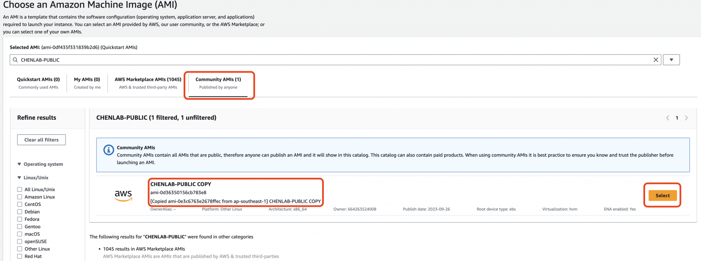](https://www.aws-ps-tech.kr/uploads/images/gallery/2023-10/screenshot-2023-10-18-at-12-17-13-pm.png)

[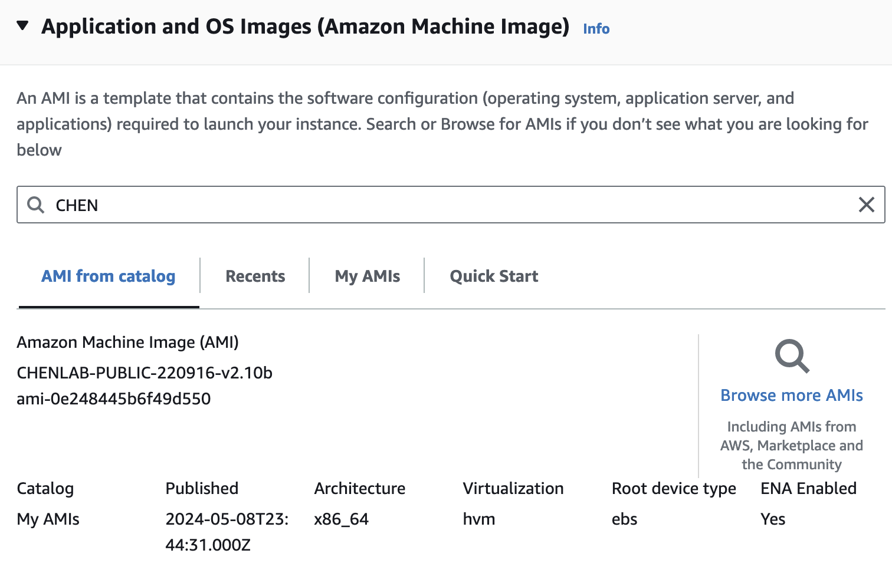](https://www.aws-ps-tech.kr/uploads/images/gallery/2024-05/screenshot-2024-05-09-at-9-31-13-am.png)

**6. Instance type**에서 드롭다운 화살표를 클릭하고 검색창에 **c5.4xlarge**을 입력합니다.

[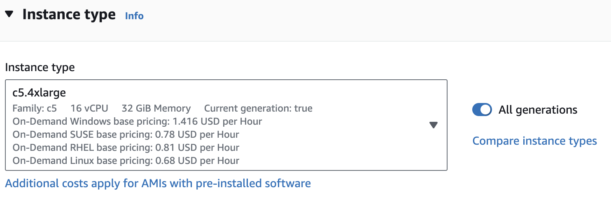](https://www.aws-ps-tech.kr/uploads/images/gallery/2023-10/screenshot-2023-10-07-at-12-08-34-am.png)

**7. Key pair (login)** 아래의 드롭다운 목록에서 이 실습의 시작 부분에서 만든 키 쌍을 선택합니다.

[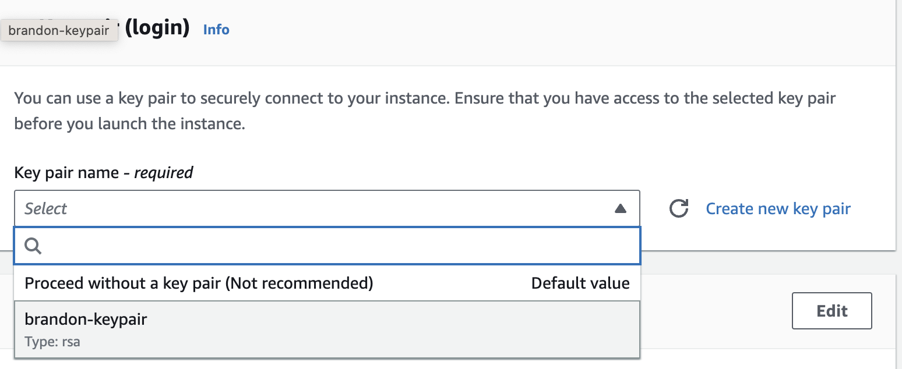](https://www.aws-ps-tech.kr/uploads/images/gallery/2023-09/screenshot-2023-09-27-at-10-08-50-am.png)

8\. 다음으로 **Network settings**에 대해 Edit을 클릭합니다. **Subnet** 및 **Security group** 세부 정보를 입력하라는 메시지가 표시됩니다. 보안 그룹은 방화벽 규칙이 됩니다. 앞 챕터에서 진행했다면 [만들어진 보안 그룹](https://www.aws-ps-tech.kr/books/aws/page/dc6a6#bkmrk-launch-an-ec2-instan)을 사용할 수도 있습니다.

Network에서 VPC ID, 보안 그룹 아이디는 사용자마다 다르게 보입니다.  

[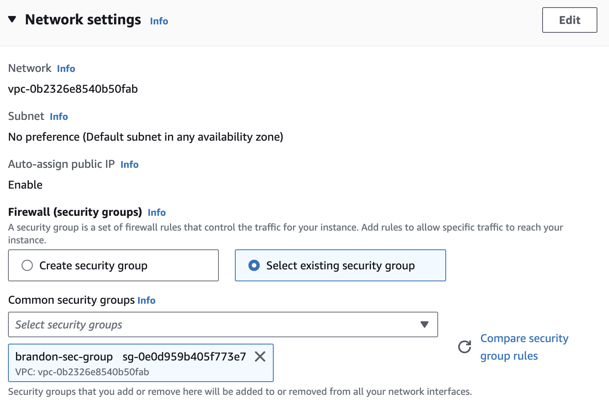](https://www.aws-ps-tech.kr/uploads/images/gallery/2023-10/screenshot-2023-10-07-at-12-10-00-am.png)

**9. Configure storage** 에서 인스턴스에 스토리지 및 디스크 드라이브를 수정하거나 추가할 수 있습니다. 이 실습에서는 AMI를 선택한 뒤 제시된 용량 기본값 그대로 사용하겠습니다.

[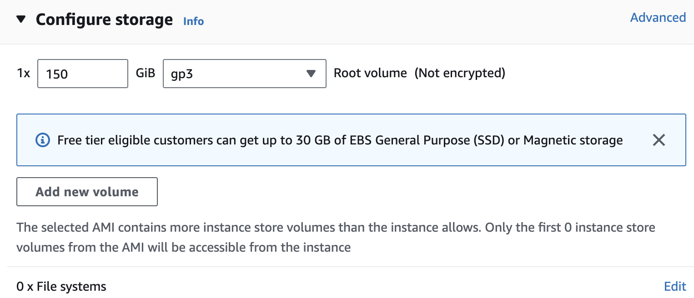](https://www.aws-ps-tech.kr/uploads/images/gallery/2023-09/screenshot-2023-09-27-at-10-10-08-am.png)

**10. Summary** 에서 구성을 검토하고 **Launch instance**를 클릭합니다.

<table border="1" id="bkmrk-%EB%98%90%EB%8A%94-%28%EC%8B%A4%EC%8A%B5-%ED%99%98%EA%B2%BD%EC%9D%B4-us-east-1" style="border-collapse: collapse; width: 84.5238%; height: 551px;"><colgroup><col style="width: 50.0596%;"></col><col style="width: 50.0596%;"></col></colgroup><tbody><tr><td>[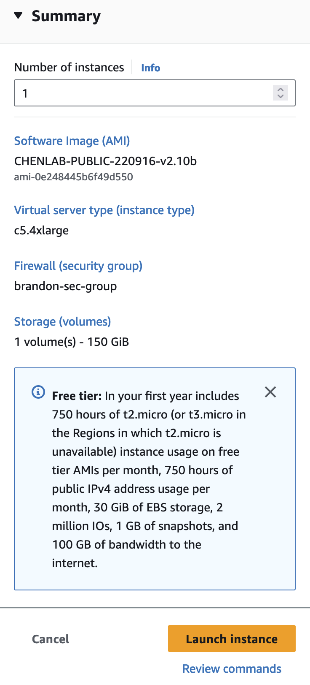](https://www.aws-ps-tech.kr/uploads/images/gallery/2024-05/screenshot-2024-05-09-at-9-33-45-am.png)</td><td class="align-center">또는

(실습 환경이 us-east-1일 경우 보이는 AMI ID 다름)

[  
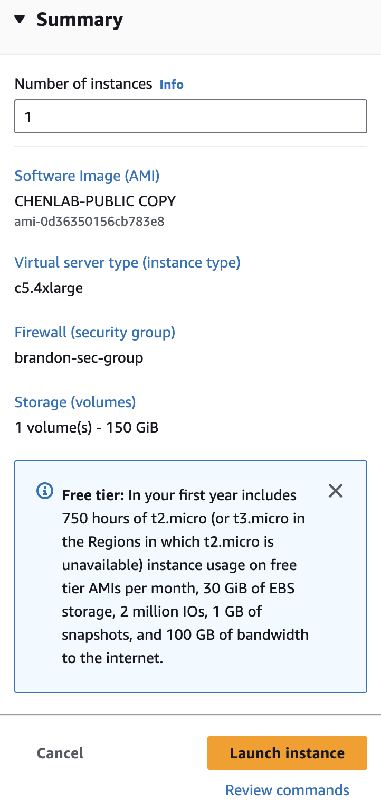](https://www.aws-ps-tech.kr/uploads/images/gallery/2023-10/screenshot-2023-10-07-at-12-15-06-am.png)

</td></tr></tbody></table>

이제 인스턴스가 시작되며 잠시 시간이 걸릴 수 있습니다. **Successfully initiated launch of instance** 메시지와 함께 **Launch Status** 페이지가 표시됩니다.

[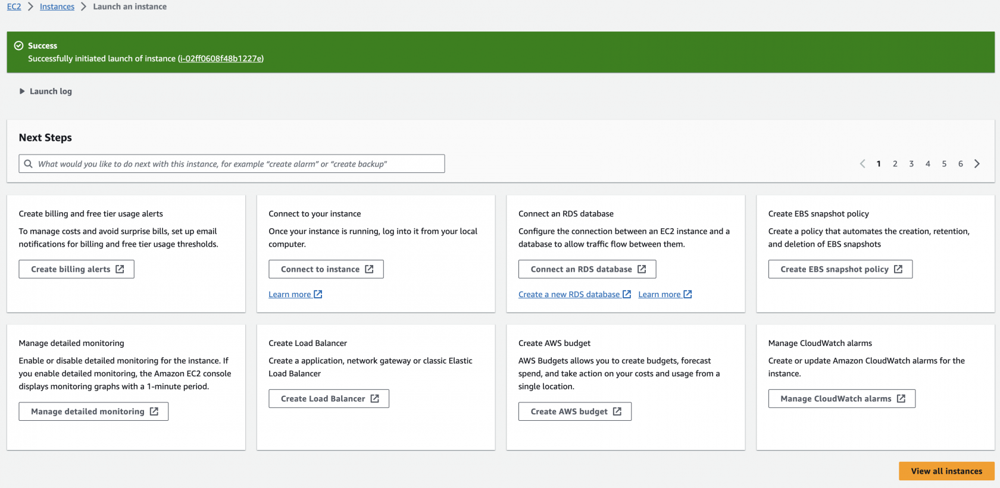](https://www.aws-ps-tech.kr/uploads/images/gallery/2023-10/screenshot-2023-10-07-at-12-24-53-am.png)

11\. 페이지 오른쪽 하단에서 **View all Instances**를 클릭하여 EC2 인스턴스 목록을 확인합니다. 인스턴스를 클릭합니다. 초기화 프로세스를 거치게 됩니다. 인스턴스가 시작되면 Linux 서버는 물론 인스턴스가 속한 가용 영역과 공개적으로 라우팅할 수 있는 DNS 이름이 표시됩니다.

[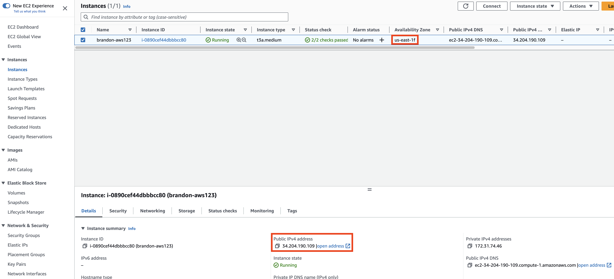](https://www.aws-ps-tech.kr/uploads/images/gallery/2023-09/screenshot-2023-09-27-at-10-17-42-am.png)

## SSH를 통해 EC2 인스턴스 접속하기

**Connect** 를 클릭해서 접속 방법을 가이드 받을 수 있습니다.

[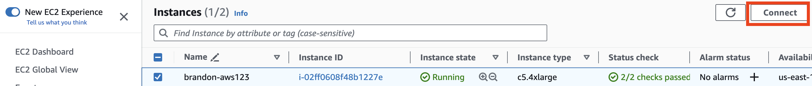](https://www.aws-ps-tech.kr/uploads/images/gallery/2023-10/screenshot-2023-10-07-at-12-48-06-am.png)

사전 제작된 `CHENLAB-PUBLIC` AMI는 우분투이므로 사용자 이름은 "**ubuntu**"가 됩니다. 참고로 이전 챕터에서 실습에 사용했던 Amazon Linux 2 이미지에 대한 사용자 이름은 "ec2-user" 였습니다.

[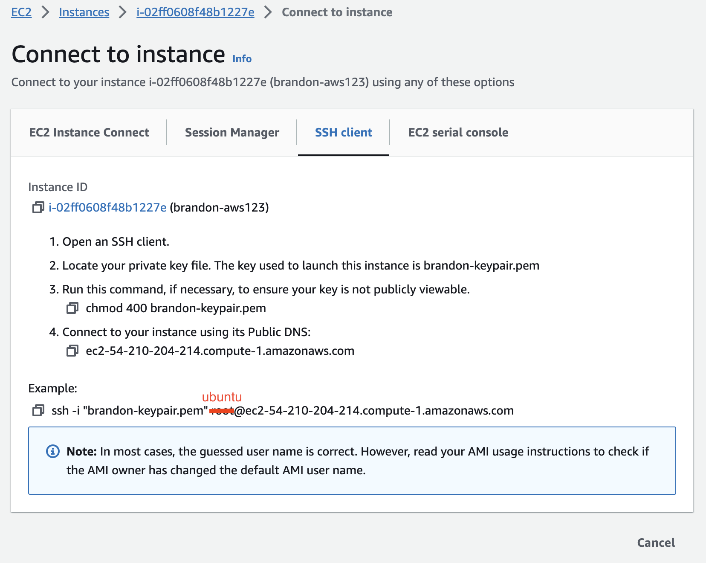](https://www.aws-ps-tech.kr/uploads/images/gallery/2023-10/screenshot-2023-10-07-at-12-49-34-am.png)

앞에서 설명한 Cloud9 환경에서의 접속방법대로 해보세요. ([SSH 를 통한 EC2 인스턴스 접속](https://www.aws-ps-tech.kr/link/7#bkmrk-ssh-into-an-ec2-inst))