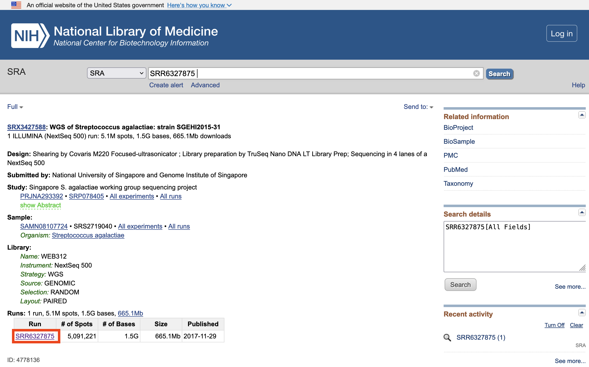
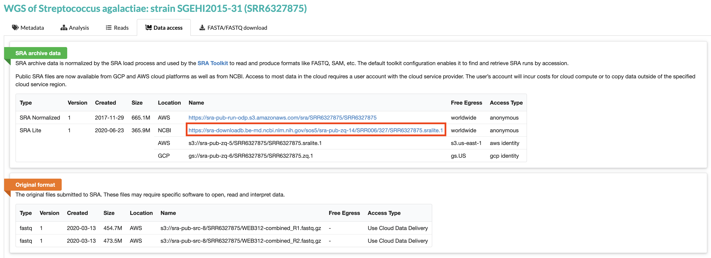
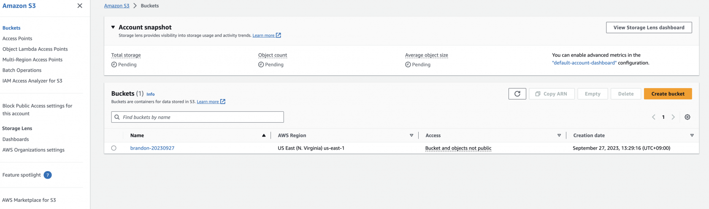
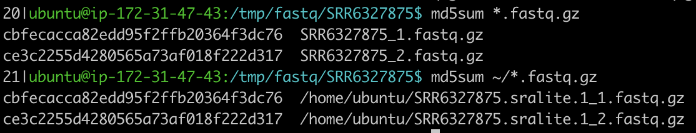

## 실습 데이터 소개

[https://www.ncbi.nlm.nih.gov/sra/?term=SRR6327875](https://www.ncbi.nlm.nih.gov/sra/?term=SRR6327875)

[](https://www.aws-ps-tech.kr/uploads/images/gallery/2023-09/screenshot-2023-09-27-at-11-45-33-am.png)[SRA Lite 포멧에 대한 설명](https://www.ncbi.nlm.nih.gov/sra/docs/sra-data-formats/)

[](https://www.aws-ps-tech.kr/uploads/images/gallery/2023-09/screenshot-2023-09-27-at-11-44-42-am.png)

<p class="callout success">아래 실습을 하는 환경을 다시 설명하자면, Cloud9 환경(EC2 인스턴스)에서 다른 EC2 인스턴스로 SSH 형태로 접속한 환경입니다. ([SSH 를 통한 EC2 인스턴스 접속](https://www.aws-ps-tech.kr/link/7#bkmrk-ssh-into-an-ec2-inst))  
</p>

## 실습 데이터 준비

**다운로드**

```bash
cd /mnt/volume1
wget https://sra-downloadb.be-md.ncbi.nlm.nih.gov/sos5/sra-pub-zq-14/SRR006/327/SRR6327875.sralite.1
```

**R1, R2 파일로 추출**

참고: c5.4xlarge 인스턴스에서 아래 명령어는 6분 30초 정도 소요되었습니다.

```bash
fastq-dump --split-files --gzip SRR6327875.sralite.1
```

**Registory of Open Data on AWS 사용해보기**

SRR6327875 데이터를 [Registry of Open Data on AWS](https://registry.opendata.aws/)에서 마찬가지로 다운로드 받는 방법도 있습니다. fastqerq-dump에 대해 더 알아보고 싶다면 [여기](https://github.com/ncbi/sra-tools/wiki/HowTo:-fasterq-dump)를 참고해주세요.

```bash
mkdir -p /tmp/fastq/SRR6327875
cd /tmp/fastq/SRR6327875

# note here the --no-sign-request makes an anonymous request to this public S3 bucket
aws s3 sync --no-sign-request s3://sra-pub-run-odp/sra/SRR6327875/ /tmp/fastq/SRR6327875/

# convert the sra formatted file to fastq, then gzip them and clean up
fasterq-dump ./SRR6327875
gzip SRR6327875_1.fastq
gzip SRR6327875_2.fastq
rm -f SRR6327875

```

<p class="callout danger">download failed: s3://sra-pub-run-odp/sra/SRR6327875/SRR6327875 to ./SRR6327875 \[Errno 28\] No space left on device  
위와 같은 에러가 나면 df -h 로 현재 다운로드 받고자 하는 경로의 용량을 확인해보세요. 그리고 /tmp 경로가 아닌 용량이 충분한 디렉토리로 이동해서 다시 다운로드 받을 수 있습니다.</p>

<p class="callout success">**여기서 문제!**  
  
SRR6327950 샘플에 대한 것도 위와 같이 동일하게 다운로드 받아보세요. 이 다운로드가 성공해야 다음 선택 실습인 [기본 분석 수행하기](https://www.aws-ps-tech.kr/books/aws/page/d61e4)를 진행할 수 있습니다.</p>

<details id="bkmrk-%28optional%29-aws-cli%EB%A1%9C-"><summary>(Optional) AWS CLI로 Amazon S3 사용해보기</summary>

**버킷 생성**

이때 `--bucket` 의 값으로는 임의로 버킷을 생성하게 됩니다. 단, 전세계 S3 사용자 누군가가 이미 사용중인 버킷명은 사용할 수 없습니다.

여기서는 `brandon-20230927` 로 예를 들었습니다.

```bash
aws s3api create-bucket \
    --bucket {본인의 버킷명} \
    --region us-east-1

```

**AWS 계정 내 생성된 버킷 확인**

생성된 버킷은 S3 콘솔에서도 확인할 수 있습니다 (브라우저의 AWS 콘솔에서 S3 로 검색하고 선택)

[](https://www.aws-ps-tech.kr/uploads/images/gallery/2023-09/screenshot-2023-09-27-at-1-30-49-pm.png)


**S3로 데이터 복사**

```bash
aws s3 cp SRR6327875.sralite.1_1.fastq.gz s3://{앞에서 만든 본인이 사용한 버킷명}/raw/SRR6327875_1.fastq.gz
aws s3 cp SRR6327875.sralite.1_2.fastq.gz s3://{앞에서 만든 본인이 사용한 버킷명}/raw/SRR6327875_2.fastq.gz
```

**참고. 많은 파일을 다룰 때 자주 사용하는 AWS S3 CLI 명령어**

```
1) S3의 폴더 내용 조회 (주의: recursive 앞에 마이너스 기호(-) 2개 사용)
  . aws s3 ls
  . aws s3 ls s3://aws-lab-james
  . aws s3 ls --recursive s3://aws-lab-james
 
2) local 폴더를 서브폴더까지 s3로 upload
  . aws s3 cp --recursive ./video/ s3://aws-lab-james/video/
 
3) s3 에서 local 폴더로 서브폴더까지 download
  . aws s3 cp --recursive s3://aws-lab-james/video/ ./video/
 
4) local 폴더의 내용을 서브폴더까지 s3로 변경된 파일만 upload (cp 와 다르게 변경된 파일만 upload합니다. 삭제는 하지 않습니다)
  . aws s3 sync ./video/ s3://aws-lab-james/video/
 
5) s3에서 local 폴더로 서브폴더까지 변경된 파일만 download (cp 와 다르게 변경된 파일만 download 합니다. 삭제는 하지 않습니다)
  . aws s3 sync s3://aws-lab-james/video/ ./video/
```

**S3 버킷에서 데이터 다운로드**

이제 공유 S3 버킷에 액세스할 수 있으므로 S3 버킷에서 사용자 컴퓨터로 데이터를 다운로드합니다.

1\. 먼저 S3 버킷에 폴더를 나열합니다:

```bash
aws s3 ls s3://{앞에서 만든 본인이 사용한 버킷명}/raw/SRR6327875_1.fastq.gz --region us-east-1
```

예) `aws s3 ls s3://brandon-20230927/raw/SRR6327875_1.fastq.gz --region us-east-1`

이제 이 폴더 내의 특정 위치에서 컴퓨터로 파일을 복사하겠습니다. 그 전에 이 데이터를 저장할 디렉터리를 컴퓨터에 만들어 보겠습니다.

2\. 다음 명령을 실행하여 데이터를 저장할 디렉터리를 만들고 해당 디렉터리로 복사합니다

```bash
mkdir -p /tmp/fastq/SRR6327875
```

```bash
cd /tmp/fastq/SRR6327875
```

3\. AWS CLI 명령어를 이용해 S3 bucket에서 새로운 디렉토리로 데이터를 다운로드합니다.

```bash
aws s3 cp s3://{앞에서 만든 본인이 사용한 버킷명}/raw/SRR6327875_1.fastq.gz .
```

```bash
aws s3 cp s3://{앞에서 만든 본인이 사용한 버킷명}/raw/SRR6327875_2.fastq.gz . --region us-east-1
```

4\. MD5 checksum을 통해 원본 파일과 S3에서 다운로드한 데이터를 비교해볼 수 있습니다.

```bash
md5sum *.fastq.gz

```

예)

[](https://www.aws-ps-tech.kr/uploads/images/gallery/2023-10/screenshot-2023-10-07-at-1-06-55-am.png)

5\. S3의 NCBI SRA repository ([Registry of Open Data on AWS](https://registry.opendata.aws/ncbi-sra/))를 사용하여 다른 데이터 세트를 다운로드합니다:

```bash
mkdir -p /tmp/fastq/SRR6327950
cd /tmp/fastq/SRR6327950

# note here the --no-sign-request makes an anonymous request to this public S3 bucket
aws s3 sync --no-sign-request s3://sra-pub-run-odp/sra/SRR6327950/ /tmp/fastq/SRR6327950/

# convert the sra formatted file to fastq, then gzip them and clean up
fasterq-dump ./SRR6327950

gzip SRR6327950_1.fastq
gzip SRR6327950_2.fastq
rm -f SRR6327950
```

이제 몇 가지 데이터 분석을 실행할 준비가 되었습니다.

</details>##   