AWS 관리 콘솔 검색 창에 EC2를 입력합니다.

[](https://www.aws-ps-tech.kr/uploads/images/gallery/2023-09/screenshot-2023-09-26-at-10-49-54-pm.png)

**EC2**를 선택하여 **EC2 대시보드**를 엽니다.

인스턴스는 그래픽 사용자 인터페이스(콘솔) 또는 명령줄 스크립트를 통해 시작할 수 있습니다. 먼저 **EC2 대시보드**라고 하는 그래픽 콘솔 인터페이스부터 시작하겠습니다.

대시보드의 레이아웃에 익숙해지는 데 몇 분 정도 시간을 투자하세요:

- **왼쪽 탐색 창**: 저장된 Amazon 머신 이미지(AMI), 스토리지 볼륨, ssh 키와 같은 도구 및 기능.
- **가운데**: 리소스 목록 및 인스턴스 시작 기능.
- **오른쪽 창**: 문서 및 가격 등의 일반 정보.

[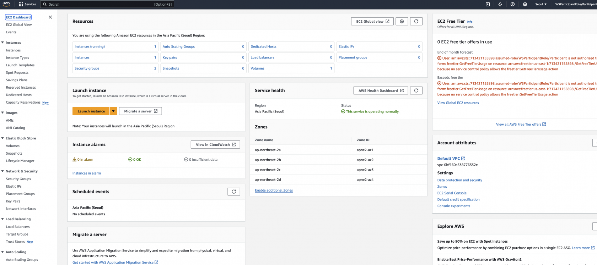](https://www.aws-ps-tech.kr/uploads/images/gallery/2024-05/screenshot-2024-05-08-at-9-01-22-pm.png)

## 신규 키페어 생성하기

이 실습 섹션에서는 Linux 인스턴스를 생성하고 로그인하여 몇 가지 Linux 명령을 실행합니다. 인스턴스에 로그인하려면 SSH를 통해 연결할 수 있어야 합니다. 인스턴스에 액세스하기 위한 몇 가지 **보안** 계층이 있으며, AWS에서 **기본적으로 사용**하도록 설정되어 있습니다. 그 중 하나는 (아주 대략적으로) 고유한 **사용자 이름과 비밀번호와 비슷**하다고 생각할 수 있는 SSH 키 쌍을 사용하는 것입니다.

다음 단계에서는 새 Linux 인스턴스에 로그인하는 데 사용할 새 SSH 키 쌍을 만드는 방법을 간략하게 설명합니다.

1\. AWS 관리 콘솔에 로그인하고 Amazon EC2 콘솔([https://console.aws.amazon.com/ec2](https://console.aws.amazon.com/ec2))을 엽니다.

2\. AWS 관리 콘솔의 오른쪽 상단 모서리에서 원하는 AWS 지역(예: **N.Virginia 또는 Seoul**)에 있는지 확인합니다.

> 실습을 하면서 가끔 사용하는 브라우저의 국가 설정에 의해 다른 리전으로 리전 정보가 바뀌는 경우가 있습니다. 워크샵에 사용하고 있는 리전 정보가 맞는지 꼭 확인해주세요. 다른 리전일 경우 실습이 정상적으로 진행되지 않을 수 있습니다.

[](https://www.aws-ps-tech.kr/uploads/images/gallery/2023-09/screenshot-2023-09-26-at-10-53-20-pm.png)

[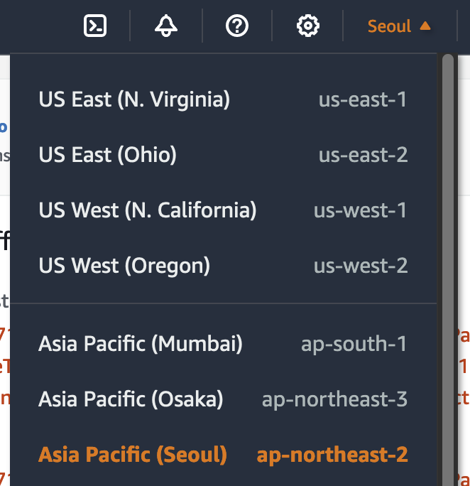](https://www.aws-ps-tech.kr/uploads/images/gallery/2024-05/screenshot-2024-05-08-at-9-02-12-pm.png)

참고: 만일 실습환경이 Seoul 일 경우 위와 같이 선택될 수도 있습니다.

3\. 왼쪽 탐색창의 **Network &amp; Security** 섹션에서 **Key Pairs** 을 클릭합니다. 그러면 SSH 키 쌍을 관리할 수 있는 페이지가 표시됩니다.

[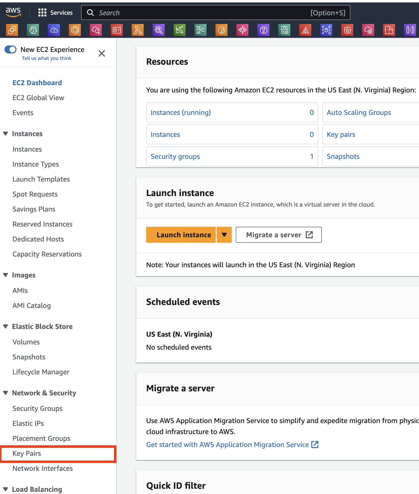](https://www.aws-ps-tech.kr/uploads/images/gallery/2023-09/screenshot-2023-09-26-at-10-57-19-pm.png)

**4. Key Pairs** 페이지에서 브라우저 창 상단의 **Create Key Pair** 버튼을 클릭합니다.

[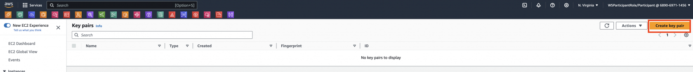](https://www.aws-ps-tech.kr/uploads/images/gallery/2023-09/screenshot-2023-09-26-at-10-59-25-pm.png)

5\. 결과 팝업 창에서 원하는 키 쌍 (Key pair) 이름을 입력하고 EC2 인스턴스에 연결하는 데 사용할 ssh 클라이언트에 따라 .ppk 또는 .pem을 선택합니다(**PuTTY의 경우 .ppk 선택**). Windows 하위 시스템 Linux, MacOS-X ssh 클라이언트, Linux ssh 클라이언트, Windows ssh 클라이언트의 경우 **.pem을 선택**합니다.)

기본값 그대로 Key pair type `RSA`를 그리고 실습에서 Cloud9 을 사용할 것이므로 Private key file format으로는 `.ppk` 를 선택합니다.

**(Optional)** Add new tag 를 클릭합니다. 태그는 AWS에서 리소스를 추적하는 효율적인 방법입니다. 이 리소스에 User(이니셜 입력)와 Grant(숫자를 입력하되 일관성 있게 입력)이라는 두 개의 태그를 추가하겠습니

[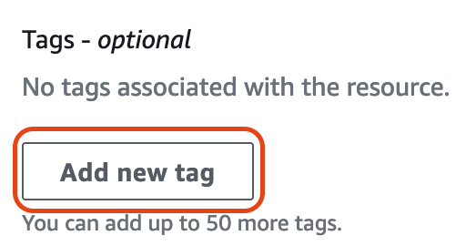](https://www.aws-ps-tech.kr/uploads/images/gallery/2024-05/screenshot-2024-05-09-at-8-07-33-am.png)

마지막으로 키페어를 만들기 위해 `Create key pair`를 선택합니다.

> 이 워크샵의 목적을 위해 여러 명이 **동일한 AWS 계정을 사용하는 경우에는** 다른 참가자가 제공한 키 쌍 이름과 충돌하지 않도록 고유한 키 쌍 이름을 제공하세요. 쉽게 식별할 수 있도록 키 쌍에 이름 이니셜을 사용할 수 있습니다.

[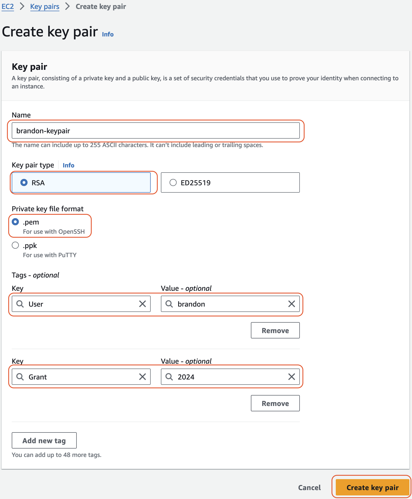](https://www.aws-ps-tech.kr/uploads/images/gallery/2024-05/screenshot-2024-05-09-at-8-04-53-am.png)

6\. 생성한 키 쌍이 시스템에 자동으로 다운로드됩니다. 브라우저의 안내에 따라 파일을 기본 다운로드 위치에 저장합니다. 파일이 다운로드되었는지 확인하고 파일을 찾을 수 있는지 확인합니다. 방금 다운로드한 .**ppk/pem** 파일의 전체 경로를 기억하세요. 이 파일에는 향후 SSH 연결을 위한 개인 키가 포함되어 있습니다.

7\. 화면 상단에 **Successfully created key pair**라는 메시지가 표시됩니다. 생성한 키 쌍을 볼 수 있습니다.

[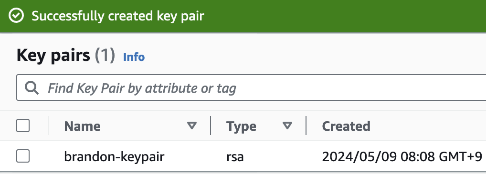](https://www.aws-ps-tech.kr/uploads/images/gallery/2024-05/screenshot-2024-05-09-at-8-08-47-am.png)

## EC2 인스턴스 실행하기  


이제 EC2 Linux 기반 인스턴스를 시작합니다.

1\. AWS 관리 콘솔로 돌아가서 Amazon EC2 대시보드를 엽니다

2\. AWS 관리 콘솔의 오른쪽 상단 모서리에서 원하는 AWS 지역(예: **N. Virginia 또는 Seoul**)에 있는지 확인합니다.

[](https://www.aws-ps-tech.kr/uploads/images/gallery/2023-09/screenshot-2023-09-26-at-10-53-20-pm.png)

**3. Launch instance**를 클릭한 다음 드롭다운 메뉴에서 **Launch instance**를 다시 클릭합니다.

[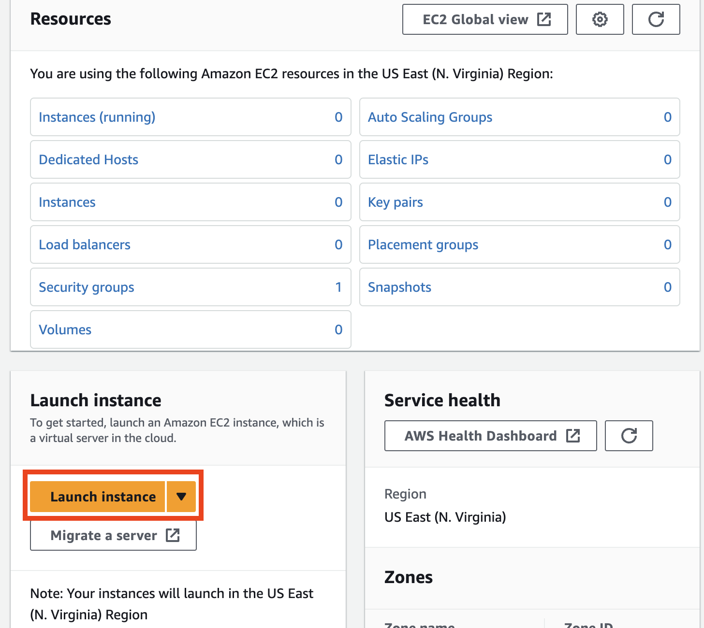](https://www.aws-ps-tech.kr/uploads/images/gallery/2023-09/screenshot-2023-09-26-at-11-04-50-pm.png)

**4. Launch an instance** 페이지에서 인스턴스에 대해 원하는 이름을 지정(작성)할 수 있습니다.

5\. "추가 태그 추가" 및 "태그 추가"를 클릭합니다. 인스턴스에 대해 제공한 "이름"을 찾을 수 있습니다. 이제 키와 값을 입력합니다. 이 키(더 정확하게는 태그)는 인스턴스가 시작되면 콘솔에 나타납니다. 이를 통해 복잡한 환경에서 실행 중인 머신을 쉽게 추적할 수 있습니다. 이전에 키 쌍에 사용한 것과 유사한 태그를 추가로 생성하여 이 머신에 사용자와 부여 키를 지정하고 동일한 값을 입력합니다. 준비가 되면 **Resource types** 아래에서 Instances, Volumes, Network interfaces 를 선택합니다.

[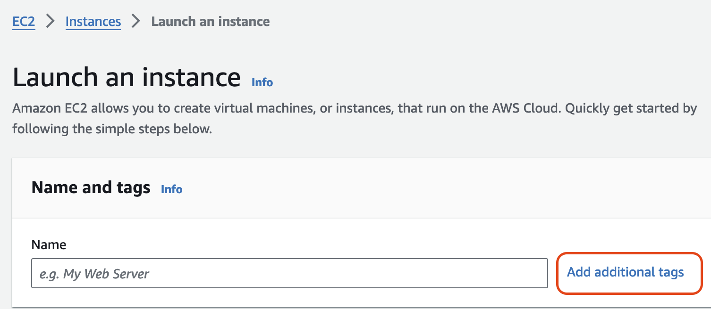](https://www.aws-ps-tech.kr/uploads/images/gallery/2024-05/screenshot-2024-05-09-at-7-58-20-am.png)

[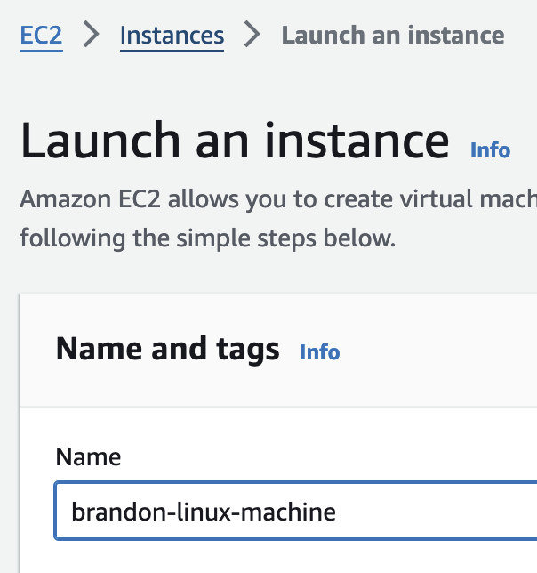](https://www.aws-ps-tech.kr/uploads/images/gallery/2024-05/screenshot-2024-05-09-at-8-09-18-am.png)

[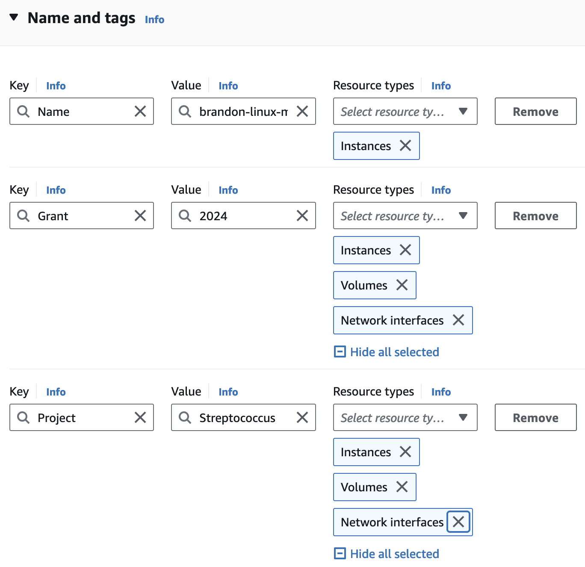](https://www.aws-ps-tech.kr/uploads/images/gallery/2024-05/screenshot-2024-05-09-at-8-10-28-am.png)

6\. 이제 첫 번째 **Amazon Linux 2023 AMI**를 선택하고 **Architecture** 드롭다운 목록에서 **64-bit(x86)**를 선택합니다.

> 설치된 패키지의 ami-xxxxxxxxx 레이블 및 특정 버전은 아래 이미지와 다를 수 있습니다.

[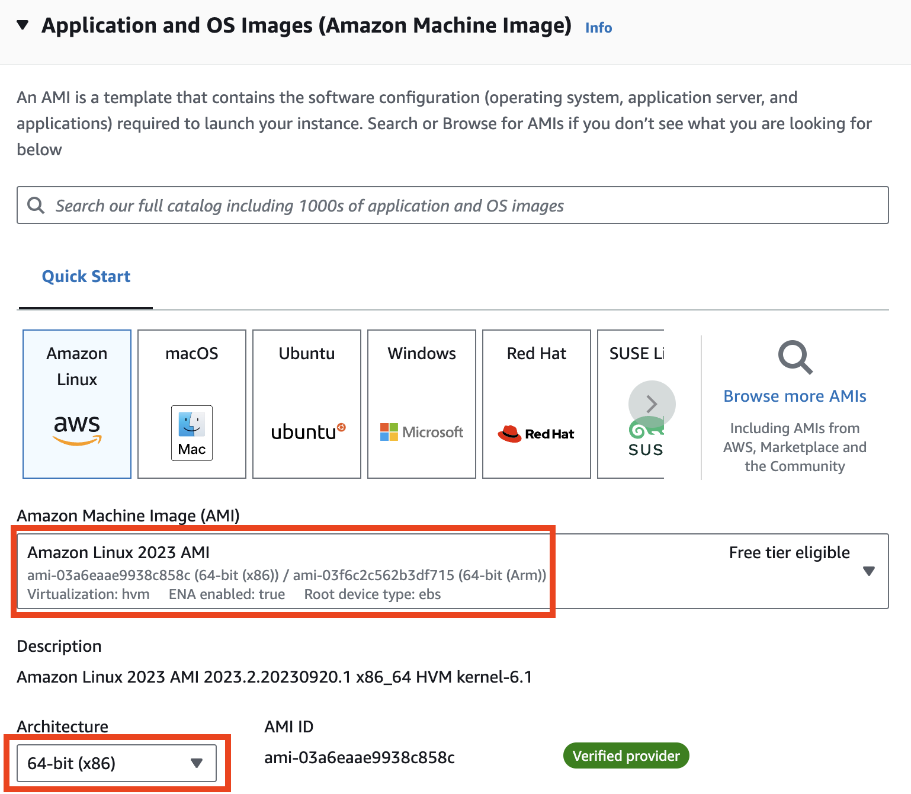](https://www.aws-ps-tech.kr/uploads/images/gallery/2023-09/screenshot-2023-09-26-at-11-08-49-pm.png)

**7. Instance type**에서 드롭다운 화살표를 클릭하고 검색창에 **c5.2xlarge**를 입력합니다.

> 일반적으로 작업/분석에 필요한 RAM 및 CPU의 양을 분석하여 사용 사례에 맞는 적정 크기의 인스턴스를 선택해야 합니다.

[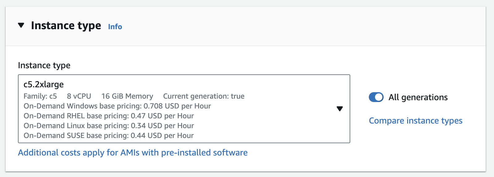](https://www.aws-ps-tech.kr/uploads/images/gallery/2023-09/screenshot-2023-09-26-at-11-09-52-pm.png)

**8. Key pair (login)** 아래의 드롭다운 목록에서 이 실습의 시작 부분에서 만든 키 쌍을 선택합니다. 여기 예시는 앞에서 만들었던 `brandon-keypair` 입니다. 여러분들이 각자 만들었고 사용할 Key pair를 선택해주세요.

[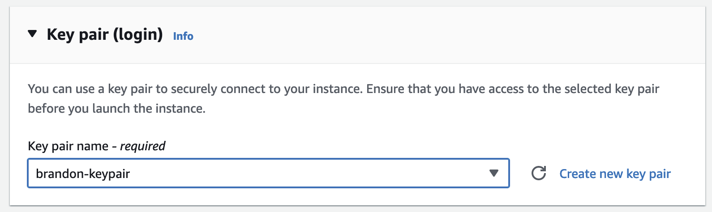](https://www.aws-ps-tech.kr/uploads/images/gallery/2024-05/screenshot-2024-05-09-at-8-11-29-am.png)

9\. 다음으로 **Network settings** 에 대해 **Edit**을 클릭합니다. **Subnet** 및 **Security group** 세부 정보를 입력하라는 메시지가 표시됩니다. 보안 그룹은 방화벽 규칙이 됩니다.

[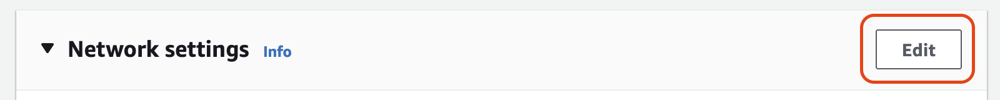](https://www.aws-ps-tech.kr/uploads/images/gallery/2024-05/screenshot-2024-05-09-at-8-00-35-am.png)

  
 a. 서브넷(Subnet) 필드는 특정 가용 영역(AZ)에서 인스턴스를 시작하도록 구성할 수 있습니다. 이 워크샵에서는 기본값을 유지하지만, 이렇게 하면 컴퓨터의 위치를 제어할 수 있습니다.  
 b. 새 **Security group name**과 **Description**을 입력합니다. **참고**: 이 실습에서는 "`[사용자 이니셜]-sec-group`"을 사용합니다.  
 c. TCP 포트 22를 허용하는 기존 SSH 규칙이 있는지 확인합니다.  
 d. 어디서든 연결을 허용하려면 **Source type** 열 아래의 드롭다운 상자를 선택하고 **0.0.0.0/0**에 해당하는 **Anywhere**를 선택합니다.

[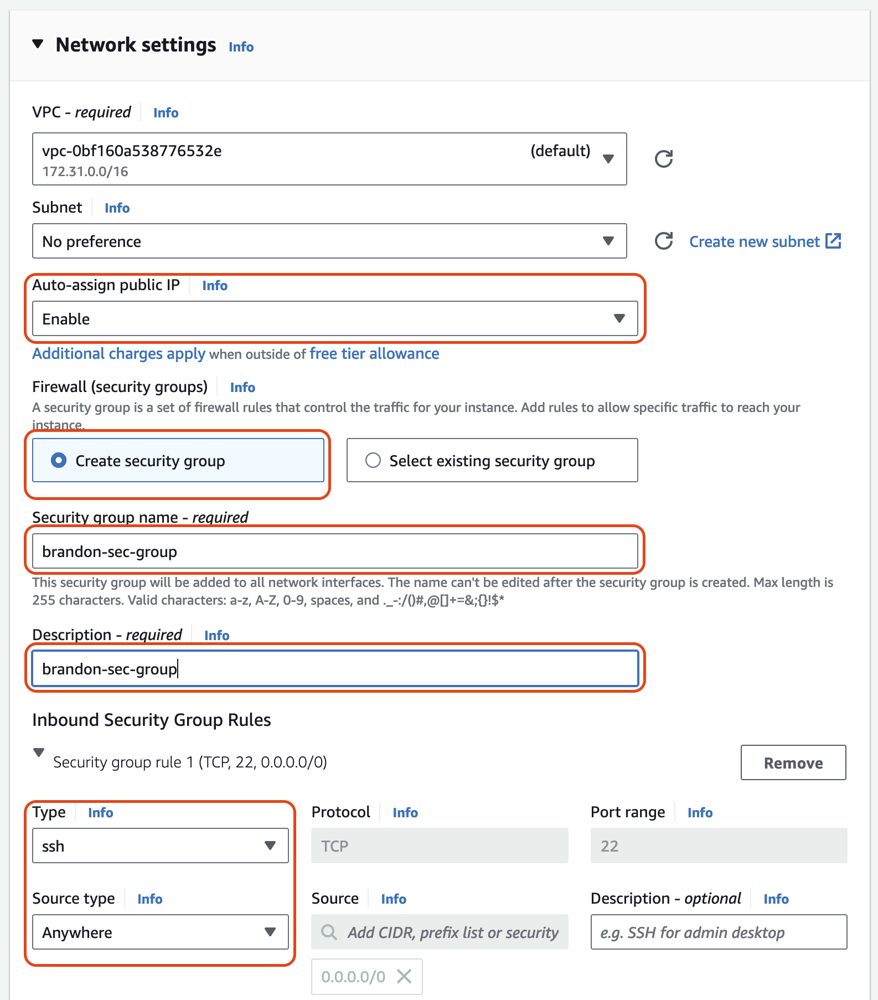](https://www.aws-ps-tech.kr/uploads/images/gallery/2024-05/screenshot-2024-05-09-at-8-12-30-am.png)

10\. **Configure storage** 에서 인스턴스에 스토리지 및 디스크 드라이브를 수정하거나 추가할 수 있습니다. 이 실습에서는 스토리지 기본값을 그대로 사용하겠습니다.

[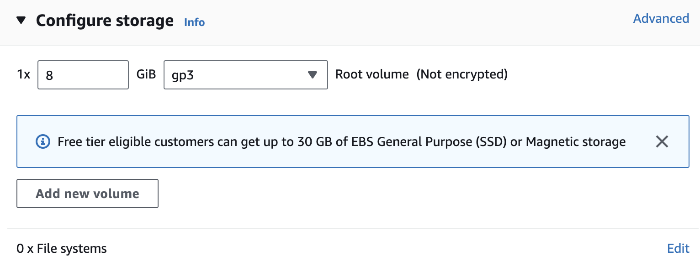](https://www.aws-ps-tech.kr/uploads/images/gallery/2023-09/screenshot-2023-09-26-at-11-12-12-pm.png)

11\. **Summary**에서 구성을 검토하고 **Launch Instance**을 클릭합니다.

[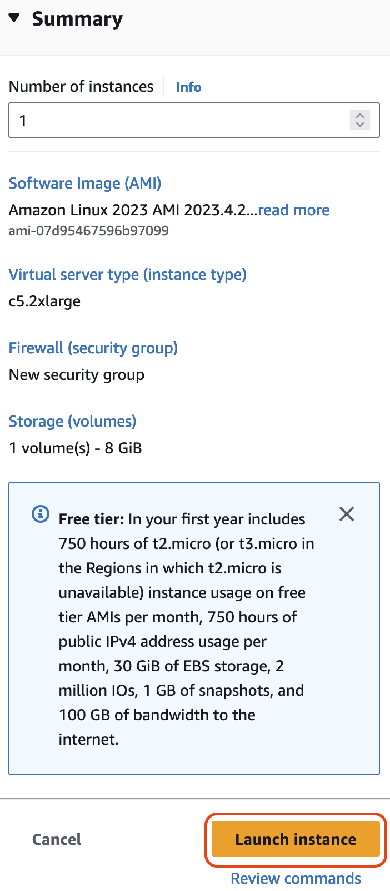](https://www.aws-ps-tech.kr/uploads/images/gallery/2024-05/screenshot-2024-05-09-at-8-01-43-am.png)

이제 인스턴스가 시작되며 잠시 시간이 걸릴 수 있습니다. **Successfully initiated launch of instance** 라는 메시지와 함께 **Launch Status** 페이지가 표시됩니다.

[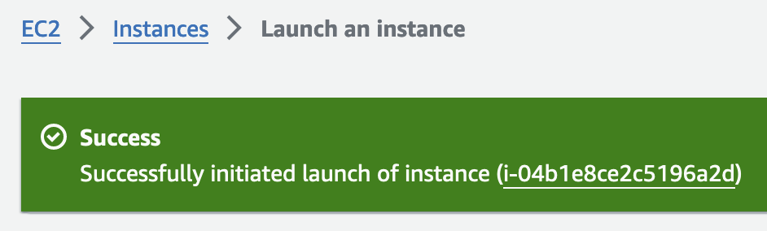](https://www.aws-ps-tech.kr/uploads/images/gallery/2024-05/screenshot-2024-05-09-at-8-02-33-am.png)

12\. 페이지 오른쪽 하단에서 **View all Instances**를 클릭하여 EC2 인스턴스 목록을 확인합니다. 인스턴스를 클릭합니다. 초기화 프로세스를 거치게 됩니다. 인스턴스가 시작되면 Linux 서버는 물론 인스턴스가 속한 가용 영역(Availability Zone)과 공개적으로 라우팅할 수 있는 DNS 이름이 표시됩니다.

[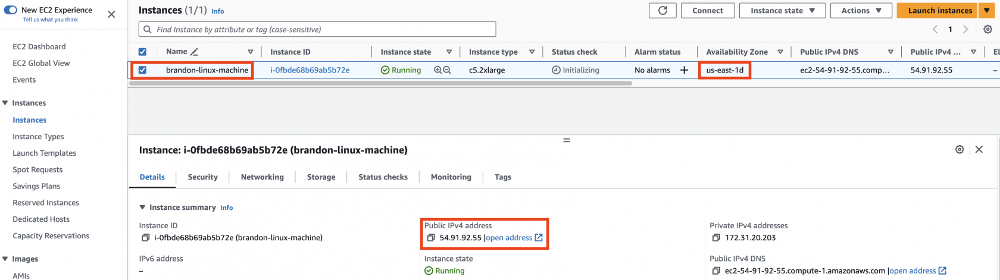](https://www.aws-ps-tech.kr/uploads/images/gallery/2023-10/screenshot-2023-10-06-at-11-39-11-pm.png)

## SSH 를 통한 EC2 인스턴스 접속

[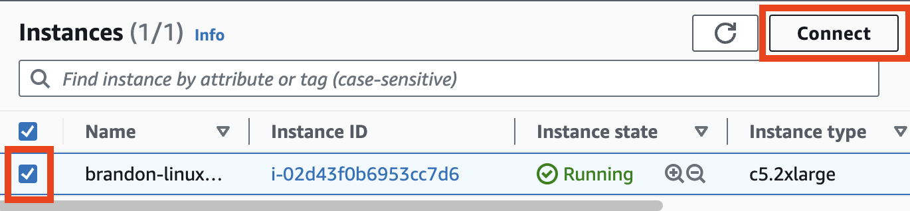](https://www.aws-ps-tech.kr/uploads/images/gallery/2023-09/screenshot-2023-09-26-at-11-17-14-pm.png)

[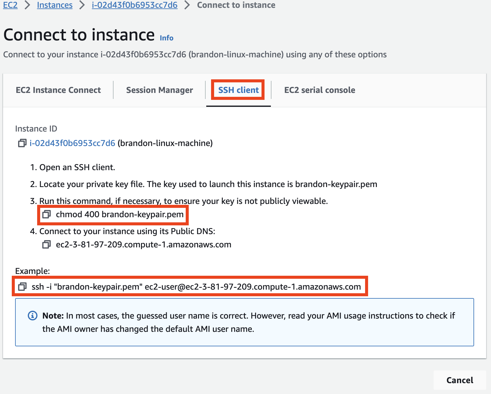](https://www.aws-ps-tech.kr/uploads/images/gallery/2023-09/screenshot-2023-09-26-at-11-19-01-pm.png)

> 각 사용자의 OS 별로 아래의 내용을 참고하되 위와 같이 Connect 버튼을 눌러서도 쉽게 명령어를 참고할 수 있습니다.

> 사용되는 AMI는 Amazon Linux 머신의 AMI이므로 사용자 이름은 "**ec2-user**"가 됩니다. 더 많은 정보는 [여기](https://docs.aws.amazon.com/AWSEC2/latest/UserGuide/managing-users.html#ami-default-user-names)를 참고하세요.
> 
> For Amazon Linux 2023, Amazon Linux 2, or the Amazon Linux AMI, the user name is **ec2-user**.  
> For a **CentOS** AMI, the user name is centos or **ec2-user**.  
> For an **Ubuntu** AMI, the user name is **ubuntu**.

> 아래의 EC2 접속 방법 중 선호하는 방법 1가지로 사용하면 됩니다. 여기서는 로컬에 설치된 Putty 나 Terminal 프로그램이 아니라 ***앞 단계에서 만들었던 Cloud9 환경에서 접속*** 하는 방법을 안내합니다.

**Connecting EC2 using Cloud9 (추천)**

1\. 키페어를 업로드합니다.

`{본인의 키페어 이름}.pem`

[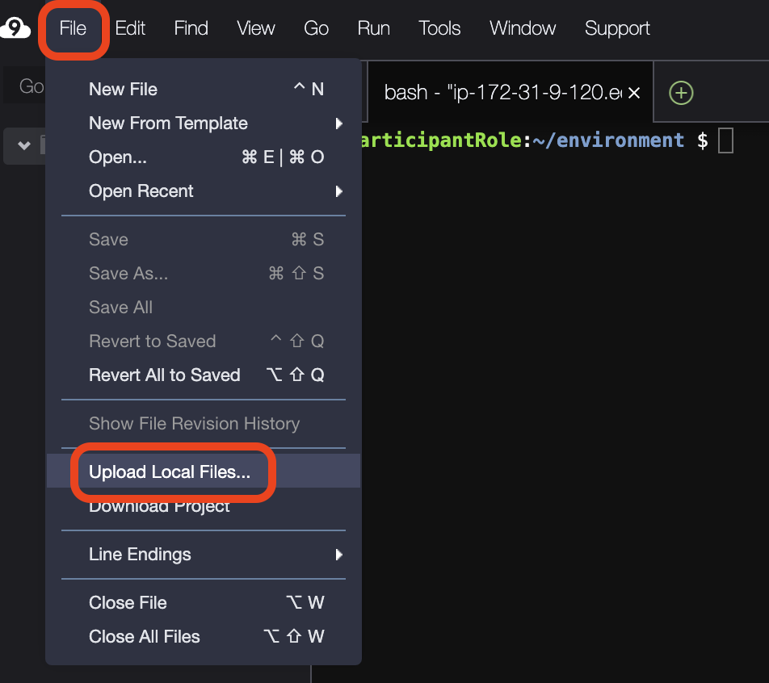](https://www.aws-ps-tech.kr/uploads/images/gallery/2023-10/screenshot-2023-10-18-at-12-28-40-pm.png)

2\. 해당 키페어를 사용해 EC2에 접속합니다.

키페어 파일에 대하여 사용가능하게 파일 권한 수정

```bash
chmod 400 /path/my-key-pair.pem

```

주어진 키페어를 사용해 ssh로 EC2 서버 로그인

```bash
ssh -i /path/my-key-pair.pem ec2-user@<ip-address>

```

[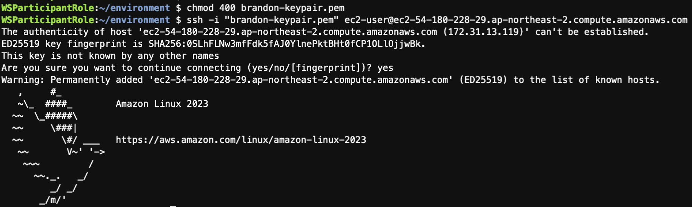](https://www.aws-ps-tech.kr/uploads/images/gallery/2024-05/screenshot-2024-05-09-at-8-26-39-am.png)

로컬 컴퓨터의 운영체제에 따라 로컬 컴퓨터에서 Linux 인스턴스로 연결하는 데 필요한 옵션이 결정됩니다. 다음은 Windows에서 PuTTY 또는 OpenSSH를 사용하여 연결하는 방법, Linux 및 MacOS-X에서 ssh 클라이언트를 사용하여 연결하는 방법입니다. Cloud9 환경이 아니라면 필요시 아래 안내에 따라 각자 맞는 방식으로 접속할 수도 있습니다.

<details id="bkmrk-connecting-from-wind"><summary>Connecting from Windows using PuTTY, MobaXterm, Windows Subsystem for Linux, OpenSSH (mac OS)</summary>

**Connecting from Windows using PuTTY**

We will now use the private **.ppk** file of the key pair generated earlier to open a SSH session to the EC2 instance.

1. Start the PuTTY application.
2. Enter in the IP address of the EC2 instance in the **Host Name (or IP address)** field.
3. To save the session (so we dont have to repeat the configuration everytime) provide a name in the **Saved Sessions** field.
4. In the left navigation pane under **Connections** click on **SSH** and next click on **Auth**.
5. In the **Private key file for authentication** field click **Browse** and browse in the **.ppk** file downloaded when creating the key pair earlier.
6. Next in the left navigation pane click on **Session** (**scroll up if you need to**) and and further click on **Save** to save the session.
7. Next click on **Open** to start the SSH session.
8. PuTTy will now attempt to start an SSH Session.

**NOTE**: You will get a security alert **The Servers host key is not cached in the registry**, click on **Yes** to continue.

9. You will now be presented with the **login as** prompt.
10. At the **login as** prompt type **ec2-user** and hit enter.

**NOTE**: Username to be used here is **ec2-user** if your image is Amazon Linux OS and **ubuntu** if your image is Ubuntu Linux OS.

You would have now logged into the EC2 instance on AWS.

---

**Connecting from Windows using MobaXterm**

We will use the private **.pem** key pair to open an SSH session to the EC2 instance.

1. Start the MobaXterm application.
2. To open a session, click on **Session** in the top-left corner, then click **SSH**.
3. Enter in the IP address of the EC2 instance in the **Host Name** field.
4. To the right, select username and enter your username for the session.

**NOTE**: Username to be used here is **ec2-user** if your image is Amazon Linux OS and **ubuntu** if your image is Ubuntu Linux OS.

5. Below, click on **Advanced Settings**, and select **private key** (use your .pem file).
6. Click **Ok**.

MobaXterm will have logged you in to your EC2 instance.

---

**Connecting from Windows using Windows Subsystem for Linux**

We will now use the private **.pem** file of the key pair generated earlier to open a SSH session to the EC2 instance.

1. Copy the private key from Windows to WSL - In a WSL terminal window, copy the .pem file (for the key pair that you specified when you launched the instance) from Windows to WSL. Note the fully-qualified path to the .pem file on WSL to use when connecting to your instance.

```bash
cp /mnt/<Windows drive letter>/path/my-key-pair.pem ~/WSL-path/my-key-pair.pem

```

2. In a terminal window, use the ssh command to connect to the instance. Specify the path and file name of the private key (.pem), the user name for your instance, and the public DNS name or IP Address.

**NOTE**: Username to be used here is **ec2-user** if your image is Amazon Linux OS and **ubuntu** if your image is Ubuntu Linux OS.

```bash
sudo ssh -i /path/my-key-pair.pem ec2-user@<ip-address>

```

You will see the following response:

```bash
The authenticity of host '<ip-address>'
can't be established.
RSA key fingerprint is 1f:51:ae:28:bf:89:e9:d8:1f:25:5d:37:2d:7d:b8:ca:9f:f5:f1:6f.
Are you sure you want to continue connecting (yes/no)?

```

3. Enter **Yes**

you will now be logged into the EC2 Instance.

---

**Connecting using SSH on Linux &amp; MacOS and OpenSSH on Windows**

We will now use the private **.pem** file of the key pair generated earlier to open a SSH session to the EC2 instance.

1. In a terminal window, use the ssh command to connect to the instance. Specify the path and file name of the private key (.pem), the user name for your instance, and the public DNS name or IP Address of your instance.

**NOTE**: You might need to change the permissions of the key file by running the **chmod** command as follows

**NOTE**: Username to be used here is **ec2-user** if your image is Amazon Linux OS and **ubuntu** if your image is Ubuntu Linux OS.

```bash
chmod 400 /path/my-key-pair.pem

```

```bash
ssh -i /path/my-key-pair.pem ec2-user@<ip-address>

```

You see a response like the following:

```bash
The authenticity of host 'ec2-198-51-100-1.compute-1.amazonaws.com (198-51-100-1)' can't be established.
ECDSA key fingerprint is l4UB/neBad9tvkgJf1QZWxheQmR59WgrgzEimCG6kZY.
Are you sure you want to continue connecting (yes/no)?

```

2. Enter **Yes**

You will now be logged into the Instance.

이에 대한 자세한 안내는 다음 링크를 참조하세요: [PuTTY](https://docs.aws.amazon.com/AWSEC2/latest/UserGuide/putty.html), [Windows Susbsystem for Linux](https://docs.aws.amazon.com/AWSEC2/latest/UserGuide/WSL.html), [MacOS-X ssh Client](https://docs.aws.amazon.com/AWSEC2/latest/UserGuide/AccessingInstancesLinux.html), [Linux ssh client](https://docs.aws.amazon.com/AWSEC2/latest/UserGuide/AccessingInstancesLinux.html)

</details>## Linux 명령 실행

몇 가지 Linux 명령을 실행하여 몇 가지 소프트웨어 패키지를 설치해 보겠습니다. 다음 명령을 입력하고 필요한 경우 **y**를 누른 다음 **Enter** 키를 누릅니다. 이제 시작한 인스턴스는 완전히 비어 있으며 다운로드한 프로그램이나 소프트웨어가 포함되어 있지 않습니다. 처음부터 새로 구축해야 합니다.

From yum **(nmap)**: 네트워크 도구를 설치하기 위해

```bash
sudo yum install -y nmap
```

From source **(seqtk)**:

```bash
sudo su -
```

```bash
yum install git make
```

```bash
cd /usr/local/src
git clone https://github.com/lh3/seqtk.git

cd seqtk/
make
```

Oops! 명령이 실패했습니다. 아직 뭔가 빠졌습니다. 이제 gcc, zlib-devel을 설치합니다:

```bash
yum install -y gcc zlib-devel
make
```

이제 명령이 인식되어야 합니다! 이제 됐어요. seqtk를 다시 시도합니다:

```bash
./seqtk
```

보시다시피, 기본 이미지는 운영 체제만 깔끔하게 초기 설치한 것입니다. 이 이미지는 필요한 소프트웨어가 정확히 설치되도록 사용자 지정하는 데 적합하지만 **약간의 설정이 필요**합니다. 또 다른 옵션은 이미 일부 소프트웨어가 설치되어 있는 **AMI**(Amazon 머신 이미지)를 사용하는 것입니다. 본 실습에서 이후에 사용할 AMI에는 꽤 많은 유전체학 소프트웨어가 사전 설치되어 있어 누구나 사용할 수 있습니다. 다음 섹션에서 이 작업을 수행하겠습니다.

## 가상컴퓨터 멈추기 및 종료  


이제 인스턴스를 중지하고 종료하겠습니다. **이 단계를 수행하기 전에 강사의 말을 들어보세요.** 교육 목적으로 단계를 검토하도록 요청할 수 있지만 실제로 인스턴스를 종료하지는 않을 수 있습니다.

1\. AWS 콘솔로 돌아갑니다. AWS 관리 콘솔 검색창에 "EC2"를 입력하거나 왼쪽 메뉴에서 **EC2 Dashboard** 항목을 클릭합니다.

**2. EC2**를 선택하여 EC2 대시보드를 엽니다.

3\. 왼쪽 탐색 창의 **Instances** 섹션에서 **Instances**를 클릭하여 실행 중, 중지된 인스턴스 및 종료된 인스턴스를 모두 확인합니다.

4\. 생성된 인스턴스를 선택하고 **Instance state** 를 클릭한 다음 **Stop instance** 를 클릭합니다.

[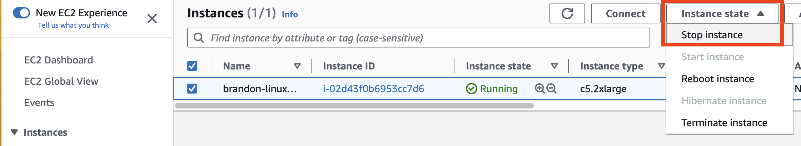](https://www.aws-ps-tech.kr/uploads/images/gallery/2023-09/screenshot-2023-09-26-at-11-26-35-pm.png)

**5. Stop**를 클릭하여 인스턴스 중지를 확인합니다.

이제 인스턴스가 중지를 시도하고 인스턴스 상태 열에 중지됨이 표시될 때까지 인스턴스가 중지될 때까지 몇 분간 기다립니다.

[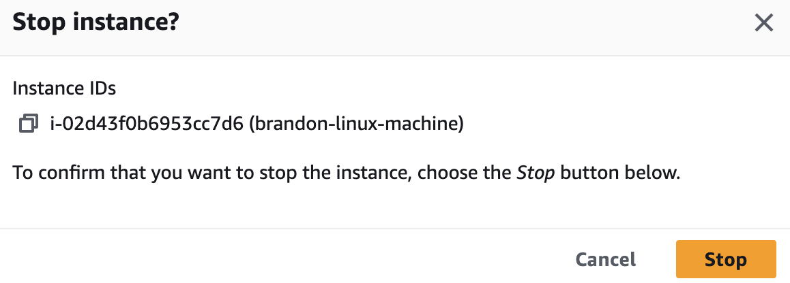](https://www.aws-ps-tech.kr/uploads/images/gallery/2023-09/screenshot-2023-09-26-at-11-27-07-pm.png)

6\. 인스턴스 목록에서 EC2 인스턴스를 선택합니다. **Instance State**를 클릭한 다음 **Terminate instance**를 클릭합니다.

[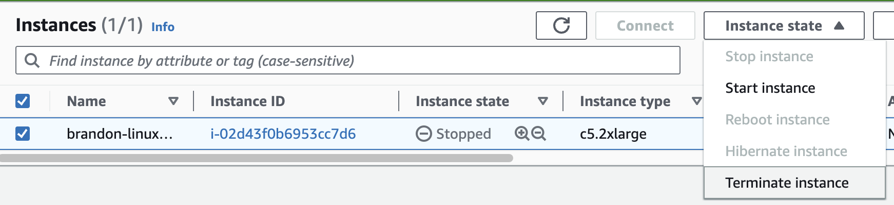](https://www.aws-ps-tech.kr/uploads/images/gallery/2023-09/screenshot-2023-09-26-at-11-30-49-pm.png)

7\. 인스턴스 종료 대화 상자에서 **EBS 지원 인스턴스에서는 인스턴스가 종료될 때 루트 EBS 볼륨이 삭제되는 것이 기본 동작입니다. 로컬 드라이브의 모든 스토리지는 손실**됩니다. 계속하려면 **Terminate**를 선택합니다.

[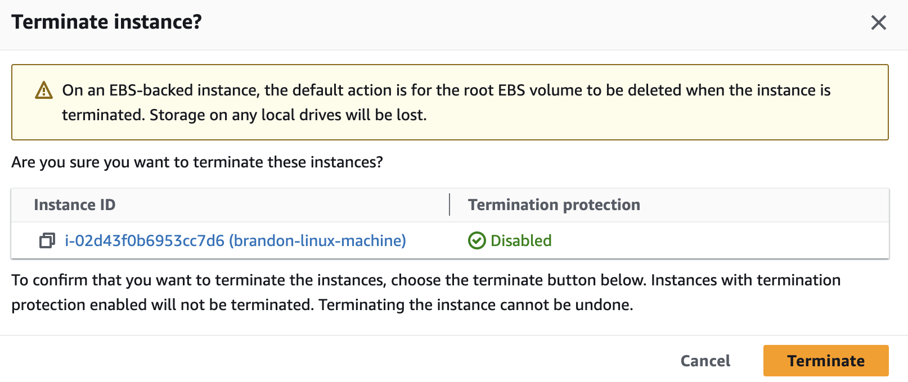](https://www.aws-ps-tech.kr/uploads/images/gallery/2023-09/screenshot-2023-09-26-at-11-31-00-pm.png)이제 인스턴스가 종료됩니다.

8\. 몇 분 후에 인스턴스의 **Instance state**가 업데이트되어 **Terminated**을 표시합니다.

[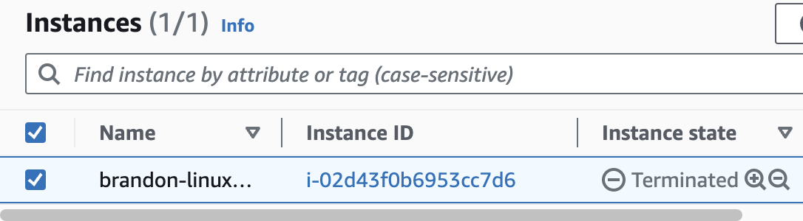](https://www.aws-ps-tech.kr/uploads/images/gallery/2023-09/screenshot-2023-09-26-at-11-33-02-pm.png)