생성된 EC2 인스턴스에는 운영 체제를 지원하기에 충분한 저장 용량을 갖춘 루트 볼륨과 분석을 지원하는 데 필요한 몇 가지 추가 애플리케이션이 있습니다. 대용량 데이터(예: Raw reads, aligned sequences 등)를 EC2 인스턴스를 통해 다운로드 하려면 추가 스토리지가 필요할 수도 있습니다. 따라서 추가 스토리지를 연결해야 합니다.

이 섹션에서는 다음과 같이 설명합니다:

a. EBS(Elastic Block Store) 볼륨을 생성합니다.

b. 새 볼륨을 EC2 인스턴스에 연결합니다.

c. 새 볼륨을 포맷하고 마운트합니다.

 1. 파일 시스템으로 새 볼륨을 포맷합니다.

 2. 볼륨을 마운트하고 일부 데이터를 복사합니다.

## Amazon Elastic Block Store ([EBS](https://aws.amazon.com/ko/ebs/)) 볼륨 만들기

1\. AWS 관리 콘솔 검색 창에 EC2를 입력하여 EC2 서비스로 이동합니다.

2\. 왼쪽 탐색 표시줄에서 **Elastic Block Store** 아래의 **Volumes**을 클릭합니다.

**[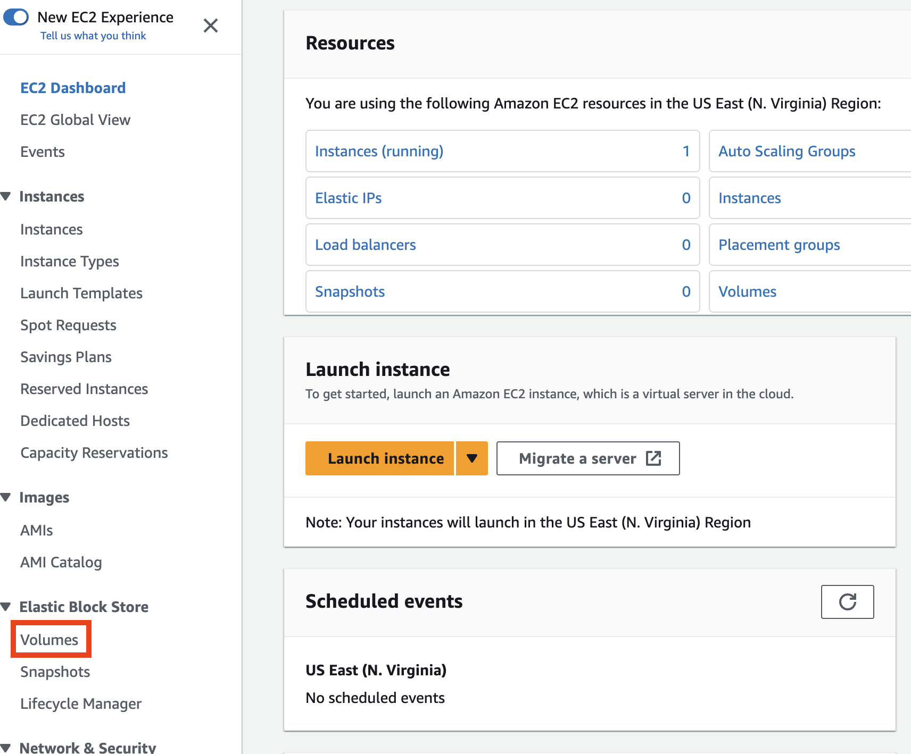](https://www.aws-ps-tech.kr/uploads/images/gallery/2023-09/screenshot-2023-09-27-at-10-19-25-am.png)**

**3. Create Volume** (오른쪽 상단 모서리)를 클릭하여 새 볼륨을 만듭니다.

**4. Create Volume** 페이지에서 볼륨의 필요한 크기(예: 데이터 세트 크기에 따라 10GB 이상)를 GB 단위로 입력합니다.

<p class="callout warning">볼륨을 연결할 EC2 인스턴스의 **Availability Zone (AZ)** 을 확인하여 새로 추가하는 볼륨의 프로비저닝 할 AZ가 동일한지 확인하세요.</p>

[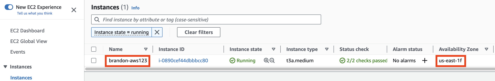](https://www.aws-ps-tech.kr/uploads/images/gallery/2023-09/screenshot-2023-09-27-at-10-21-34-am.png)

[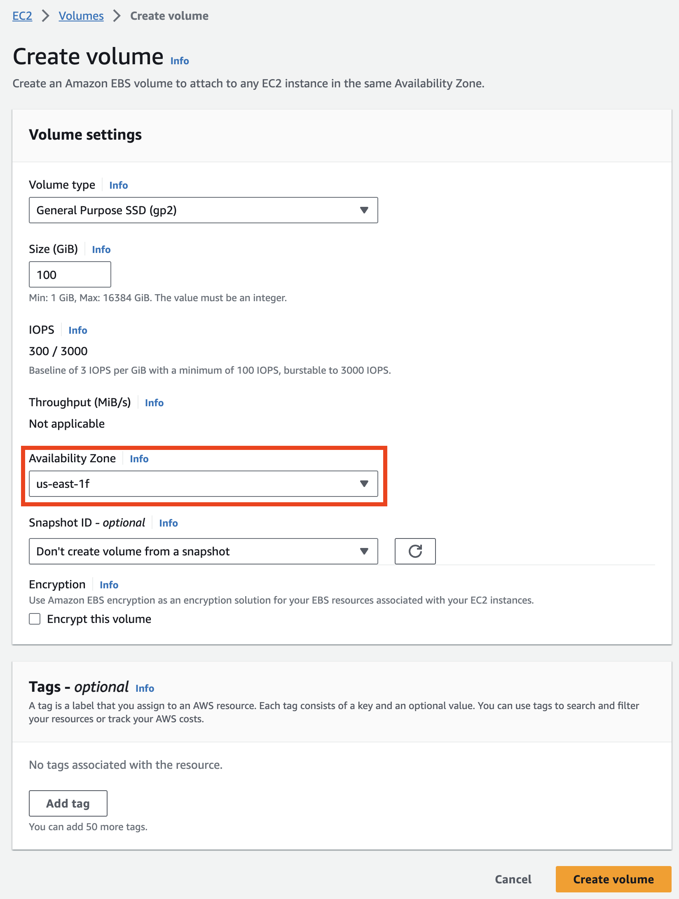](https://www.aws-ps-tech.kr/uploads/images/gallery/2023-09/screenshot-2023-09-27-at-10-22-23-am.png)

**5. Add Tag**를 클릭하여 리소스에 고유한 태그를 지정합니다. 키에 '이름'을 입력하고 값에 '\[your initials\]-EBS'를 입력합니다.

## 실행 중인 인스턴스에 EBS 볼륨 연결하기

왼쪽 탐색 표시줄에서 Elastic Block Store 아래의 **Volumes**을 클릭하여 모든 볼륨을 확인합니다. 목록에서 이전 단계에서 제공된 고유 이름 태그를 검색하여 새로 생성한 볼륨을 선택할 수도 있습니다.

[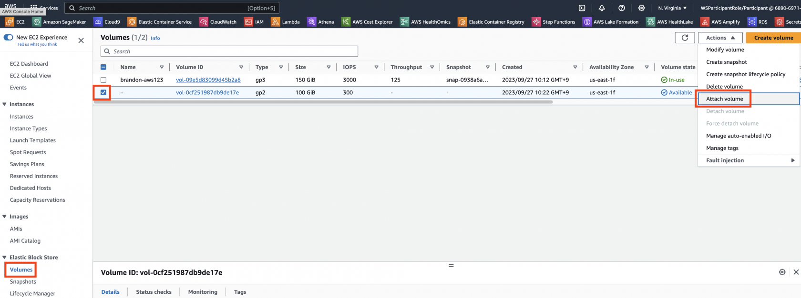](https://www.aws-ps-tech.kr/uploads/images/gallery/2023-09/screenshot-2023-09-27-at-10-24-55-am.png)

**1. Actions**을 클릭하고 **Attach Volume**을 추가로 클릭합니다.

**2. Attach Volume** 대화 상자에서 인스턴스 필드를 클릭하고 목록에서 **Instance** ID 또는 이름 태그를 찾아 EC2 인스턴스를 선택합니다. **Attach**(연결)를 클릭하여 볼륨을 연결합니다.

[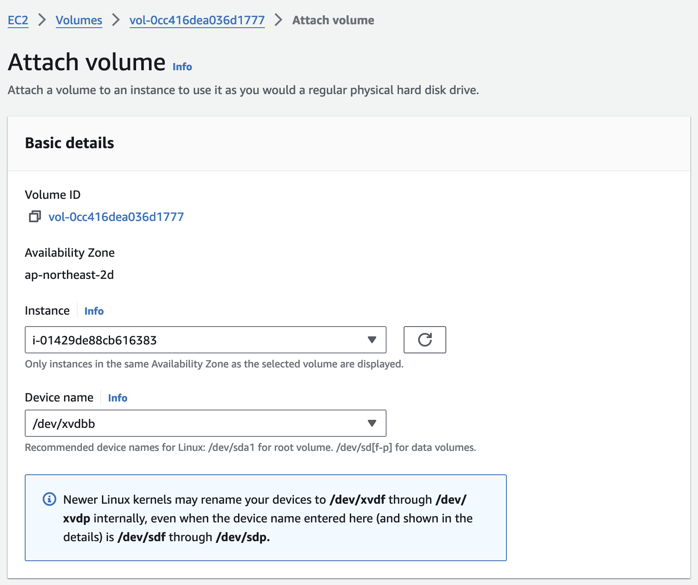](https://www.aws-ps-tech.kr/uploads/images/gallery/2024-05/screenshot-2024-05-09-at-9-49-28-am.png)성공적으로 연결된 경우 - 표시된 볼륨 목록에서 새 볼륨의 상태(상태 열 아래)가 **In Use**임을 나타내는 것을 볼 수 있습니다.

[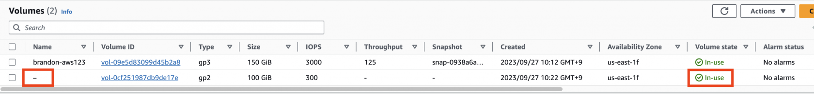](https://www.aws-ps-tech.kr/uploads/images/gallery/2023-09/screenshot-2023-09-27-at-10-26-22-am.png)

3\. 왼쪽 탐색 창에서 항목 목록 맨 위에 있는 EC2 Dashboard 를 클릭하여 해당 인스턴스에 볼륨이 잘 연결되었는지 확인해볼 수 있습니다.

[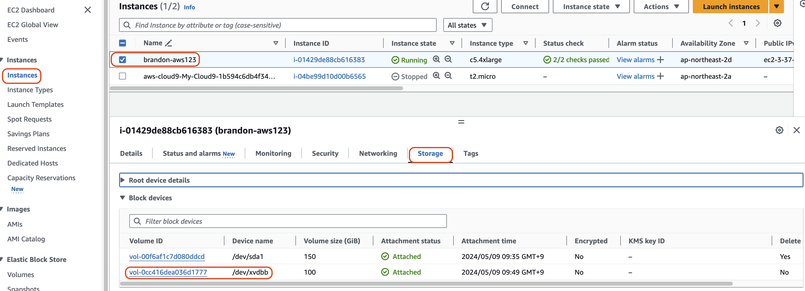](https://www.aws-ps-tech.kr/uploads/images/gallery/2024-05/screenshot-2024-05-09-at-9-50-18-am.png)

<p class="callout info">**중요**: 볼륨을 마운트하는 다음 단계를 위해 특정 장치 이름을 적어 두세요. 드라이브 이름은 표시된 것과 다를 수 있습니다. ([Device names on Linux instances](https://docs.aws.amazon.com/ko_kr/AWSEC2/latest/UserGuide/device_naming.html))  
</p>

> **NOTE**: Depending on the Linux version and the machine type, the device names may differ. The EC2 Console will generally show **/dev/sdX**, where X is a lower-case letter, but you may see **/dev/xvdX** or **/dev/nvmeYn1**.
> 
> 선택한 디바이스 이름을 지정하기 전에 해당 이름을 사용할 수 있는지 확인하세요. 그렇지 않으면 디바이스 이름이 이미 사용 중이라는 오류가 발생합니다. 예를 들어 Linux에서는 **lsblk** 명령을 사용하여 디스크 디바이스 및 탑재 지점을 확인할 수 있습니다. Windows에서는 디스크 관리 유틸리티 또는 **diskpart** 명령을 사용할 수 있습니다.

## 볼륨 마운트

1\. EC2 인스턴스에 접속 및 로그인합니다. 앞에서 설명한 Cloud9 환경에서의 접속방법대로 해보세요. ([SSH 를 통한 EC2 인스턴스 접속](https://www.aws-ps-tech.kr/link/7#bkmrk-ssh-into-an-ec2-inst))

2\. 다음 명령어를 사용해 사용 가능한 디스크 목록을 확인합니다.

```bash
lsblk
```

인스턴스에 연결된 디스크의 목록이 출력됩니다.

예)

[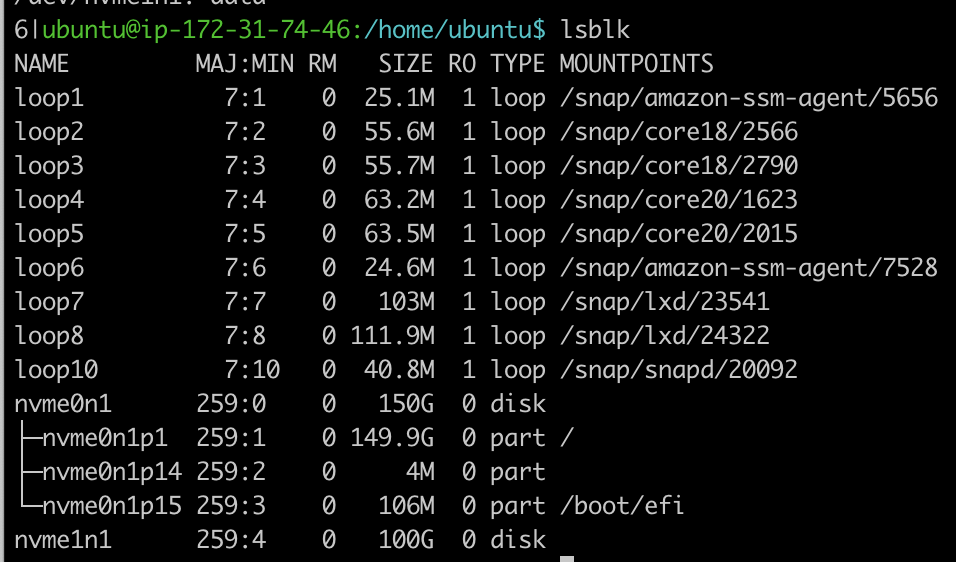](https://www.aws-ps-tech.kr/uploads/images/gallery/2023-09/screenshot-2023-09-27-at-10-30-52-am.png)

**NOTE**: Depending on the Linux version and the machine type, the device names may differ. The EC2 Console will generally show **/dev/sdX**, where X is a lower-case letter, but you may see **/dev/xvdX** or **/dev/nvmeYn1**. The following table may help with translating. Another way to help track is to pick different sizes for your EBS volumes (such as 151, 152, 153 GB for different volumes).

<table id="bkmrk-device-name-%28console"><thead><tr><th>Device name (Console)</th><th>Alternate 1</th><th>Alternate 2</th></tr></thead><tbody><tr><td>/dev/sda</td><td>/dev/xvda</td><td>/dev/nvme0n1</td></tr><tr><td>/dev/sdb</td><td>/dev/xvdb</td><td>/dev/nvme1n1</td></tr><tr><td>/dev/sdc</td><td>/dev/xvdc</td><td>/dev/nvme2n1</td></tr><tr><td>/dev/sdd</td><td>/dev/xvdd</td><td>/dev/nvme3n1</td></tr><tr><td>/dev/sde</td><td>/dev/xvde</td><td>/dev/nvme4n1</td></tr><tr><td>/dev/sdf</td><td>/dev/xvdf</td><td>/dev/nvme5n1</td></tr></tbody></table>

3\. 마운트되지 않은 파일 시스템 크기가 앞에서 추가한 볼륨의 스토리크기와 동일한지 확인합니다. 예를 들어 아래와 같이 "nvme1n1":

```bash
NAME        MAJ:MIN RM  SIZE RO TYPE MOUNTPOINT
nvme0n1     259:0    0  150G  0 disk
└─nvme0n1p1 259:1    0  150G  0 part /
nvme1n1     259:2    0   100G  0 disk

```

4\. 다음 명령을 사용하여 볼륨에 데이터가 있는지 확인합니다:

```bash
sudo file -s /dev/nvme1n1
```

여기서 "nvme1n1"은 EC2 인스턴스에 장치를 연결한 후 이전 섹션에서 언급한 장치입니다.

<p class="callout success">If the above command output shows "/dev/nvme1n1: data", it means your volume is empty.</p>

예)

[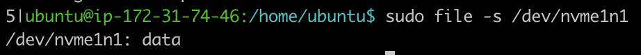](https://www.aws-ps-tech.kr/uploads/images/gallery/2023-09/screenshot-2023-09-27-at-10-30-43-am.png)

5\. 다음 명령을 사용하여 볼륨을 ext4 파일 시스템으로 포맷합니다. 실습이므로 새 장치입니다. 포멧이 되도 무방합니다.

```bash
sudo mkfs -t ext4 /dev/nvme1n1
```

<p class="callout danger">참고: 이 파일 시스템 포맷 단계는 <span style="color: rgb(224, 62, 45);">**새로 추가한 신규 볼륨 즉, 새로운 장 에만 해당**</span>되며 그렇지 않을 경우는 기존 볼륨을 마운트하는 동안에는 장치의 모든 데이터가 지워지므로 **<span style="color: rgb(224, 62, 45);">이 단계를 실행하지 마세요</span>**.</p>

예)

[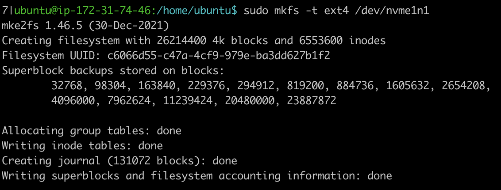](https://www.aws-ps-tech.kr/uploads/images/gallery/2023-09/screenshot-2023-09-27-at-10-32-11-am.png)

6\. 새 ext4 볼륨을 마운트할 디렉터리를 원하는 대로 만듭니다. "volume1"이라는 이름을 사용하겠습니다.

```bash
sudo mkdir /mnt/volume1
```

7\. 다음 명령을 사용하여 볼륨을 "volume1" 디렉터리에 마운트합니다.

```bash
sudo mount /dev/nvme1n1 /mnt/volume1
```

8\. 디렉터리로 이동하여 디스크 공간을 확인하여 볼륨 마운트를 확인합니다.

```bash
cd /mnt/volume1
df -h .
```

<p class="callout info">위의 명령은 volume1 디렉터리의 여유 공간을 표시합니다.</p>

9\. 이 시점에서 드라이브의 소유권은 사용자가 아닌 루트에 있습니다. 드라이브의 소유권을 변경해야 드라이브의 콘텐츠(파일 추가/제거 등)를 변경할 수 있습니다.

```bash
sudo chown -R ubuntu /mnt/volume1
```

예)

[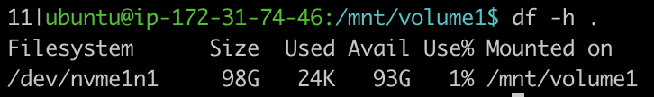](https://www.aws-ps-tech.kr/uploads/images/gallery/2023-09/screenshot-2023-09-27-at-10-33-16-am.png)

[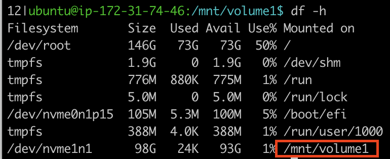](https://www.aws-ps-tech.kr/uploads/images/gallery/2023-09/screenshot-2023-09-27-at-10-33-48-am.png)

10\. 참고로 나중에 이 장치를 제거할 수 있습니다. 마운트 해제 후 다시 마운트하는 연습을 해보세요. 볼륨을 마운트 해제하려면 다음 명령을 사용해야 합니다. 볼륨을 마운트 해제하려면 디렉터리 외부에 있어야 합니다.

```bash
sudo umount /dev/nvme1n1
```

<p class="callout warning">umount: /mnt/volume1: target is busy. 이런 메세지를 보았다면, 장치가 사용중입니다. 현재 디렉토리가 해당 볼륨의 위치에 있다면 다른 디렉토리로 변경하거나, 해당 볼륨 경로에 사용중인 (읽거나 쓰고 있는 등) 파일이 존재할 수 있습니다.  
</p>

하지만 나중에 이 장치가 필요하므로 다시 마운트하는 것을 잊지 마세요.

```bash
sudo mount /dev/nvme1n1 /mnt/volume1
```