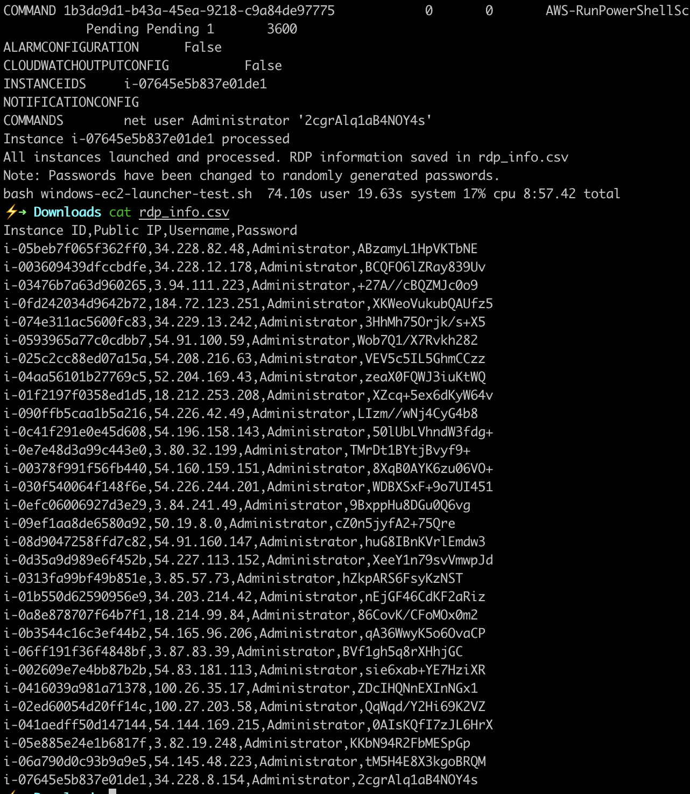

이 가이드는 AWS CLI를 사용하여 윈도우 서버 EC2 인스턴스를 여러 개 자동으로 설정하는 과정을 상세히 설명합니다. 실제 환경에서는 사용자의 요구사항에 맞게 설정을 조정해야 하며, 실제 테스트가 반드시 필요합니다.

## 사전 요구사항

- AWS CLI 설치 및 구성
- Bash 스크립트에 대한 기본 지식
- AWS 계정 및 필요한 권한

## 전체 워크플로우

1. 초기 EC2 인스턴스 실행
2. 윈도우 인스턴스에 접속하여 필요한 프로그램 설치
3. 커스텀 AMI 생성
4. 커스텀 AMI를 이용해 필요한 만큼의 인스턴스 실행
5. 결과 CSV 파일 확인

## 상세 과정

### 1. 초기 EC2 인스턴스 실행

먼저, 커스텀 AMI를 만들기 위한 초기 인스턴스를 실행합니다. 다음 AWS CLI 명령어를 사용하세요:

```
aws ec2 run-instances \
  --image-id ami-04df9ee4d3dfde202 \
  --instance-type m5.large \
  --key-name your-key-pair-name \
  --security-group-ids sg-your-security-group-id \
  --subnet-id subnet-your-subnet-id \
  --count 1 \
  --associate-public-ip-address
```

**주의:** `--image-id`, `--instance-type`, `--key-name`, `--security-group-ids`, `--subnet-id`를 사용자의 환경에 맞게 수정하세요.

### 2. 윈도우 인스턴스에 접속 및 프로그램 설치

RDP를 사용하여 윈도우 인스턴스에 접속한 후, 필요한 프로그램을 설치합니다.

### 3. 커스텀 AMI 생성

다음 Bash 스크립트를 사용하여 커스텀 AMI를 생성할 수 있습니다:

```
#!/bin/bash

# AMI 생성 함수
create_ami() {
    local instance_id=$1
    local ami_name=$2
    local ami_description=$3

    aws ec2 create-image \
        --instance-id "$instance_id" \
        --name "$ami_name" \
        --description "$ami_description" \
        --no-reboot \
        --query 'ImageId' \
        --output text
}

# AMI 상태 확인 함수
check_ami_status() {
    local ami_id=$1
    aws ec2 describe-images \
        --image-ids "$ami_id" \
        --query 'Images[0].State' \
        --output text
}

# 메인 스크립트
echo "인스턴스 ID를 입력하세요:"
read instance_id

echo "새 AMI의 이름을 입력하세요:"
read ami_name

echo "새 AMI의 설명을 입력하세요:"
read ami_description

echo "AMI 생성 중..."
ami_id=$(create_ami "$instance_id" "$ami_name" "$ami_description")

echo "AMI 생성이 시작되었습니다. AMI ID: $ami_id"
echo "AMI가 사용 가능할 때까지 대기 중..."

while true; do
    status=$(check_ami_status "$ami_id")
    if [ "$status" = "available" ]; then
        echo "AMI가 사용 가능합니다."
        break
    elif [ "$status" = "failed" ]; then
        echo "AMI 생성에 실패했습니다."
        exit 1
    else
        echo "현재 상태: $status. 30초 후 다시 확인합니다..."
        sleep 30
    fi
done

echo "최종 AMI ID: $ami_id"
```

### 4. 커스텀 AMI를 이용한 다수의 인스턴스 실행

다음 Bash 스크립트를 사용하여 커스텀 AMI로부터 여러 인스턴스를 실행하고 설정할 수 있습니다:

```
#!/bin/bash

# 랜덤 비밀번호 생성 함수
generate_password() {
    openssl rand -base64 12
}

# 인스턴스 실행 함수
launch_instance() {
    local instance_number=$1
    local initial_password=$2
    aws ec2 run-instances \
        --image-id ami-your-custom-ami-id \
        --count 1 \
        --instance-type m5.large \
        --key-name your-key-pair-name \
        --security-group-ids sg-your-security-group-id \
        --subnet-id subnet-your-subnet-id \
        --tag-specifications 'ResourceType=instance,Tags=[{Key=Name,Value=WindowsInstance-'$instance_number'}]' \
        --user-data "net user Administrator '${initial_password}'" \
        --query 'Instances[0].InstanceId' \
        --output text
}

# 공개 IP 가져오기 함수
get_public_ip() {
    local instance_id=$1
    aws ec2 describe-instances \
        --instance-ids $instance_id \
        --query 'Reservations[0].Instances[0].PublicIpAddress' \
        --output text
}

# SSM을 사용한 비밀번호 변경 함수
change_password() {
    local instance_id=$1
    local new_password=$2
    aws ssm send-command \
        --instance-ids "$instance_id" \
        --document-name "AWS-RunPowerShellScript" \
        --parameters "commands=[\"net user Administrator '${new_password}'\"]" \
        --output text
}

# 초기 비밀번호 입력 받기
read -s -p "모든 인스턴스의 초기 비밀번호를 입력하세요: " INITIAL_PASSWORD
echo

# 생성할 인스턴스 수 입력 받기
read -p "생성할 인스턴스 수를 입력하세요: " INSTANCE_COUNT

# CSV 파일 준비
echo "Instance ID,Public IP,Username,Password" > rdp_info.csv

# 인스턴스 실행
echo "$INSTANCE_COUNT 개의 인스턴스를 실행 중..."
instance_ids=()
for i in $(seq 1 $INSTANCE_COUNT); do
    instance_id=$(launch_instance $i "$INITIAL_PASSWORD")
    instance_ids+=($instance_id)
    echo "인스턴스 $i 실행됨: $instance_id"
done

# 인스턴스 실행 대기 및 추가 5분 대기
echo "인스턴스가 실행되고 안정화될 때까지 대기 중..."
aws ec2 wait instance-running --instance-ids "${instance_ids[@]}"
echo "인스턴스가 실행 중입니다. 완전한 초기화를 위해 추가로 5분 대기합니다..."
sleep 300

# 각 인스턴스 처리
for instance_id in "${instance_ids[@]}"; do
    echo "인스턴스 처리 중: $instance_id"
    
    # 공개 IP 가져오기
    public_ip=$(get_public_ip $instance_id)
    
    # 새 비밀번호 생성
    new_password=$(generate_password)
    
    # 비밀번호 변경
    echo "인스턴스 $instance_id의 비밀번호 변경 중..."
    change_password "$instance_id" "$new_password"
    
    # CSV에 추가
    echo "$instance_id,$public_ip,Administrator,$new_password" >> rdp_info.csv
    
    echo "인스턴스 $instance_id 처리 완료"
done

echo "모든 인스턴스가 실행되고 처리되었습니다. RDP 정보가 rdp_info.csv 파일에 저장되었습니다."
echo "주의: 비밀번호가 무작위로 생성된 새 비밀번호로 변경되었습니다."
```

**주의사항:**

- 스크립트 실행 전 EC2 인스턴스 할당량이 충분한지 확인하세요.
- 선택한 가용 영역(AZ)에 충분한 인스턴스 용량이 있는지 확인하세요.
- `--image-id`, `--instance-type`, `--key-name`, `--security-group-ids`, `--subnet-id`를 사용자의 환경에 맞게 수정하세요.

### 5. 결과 CSV 파일 확인

스크립트 실행이 완료되면 `rdp_info.csv` 파일에 각 인스턴스의 접속 정보가 저장됩니다. 이 파일을 안전하게 보관하세요.

*참고: 30개의 인스턴스를 실행하는데 약 74초 정도 소요되었습니다.*

[](https://www.aws-ps-tech.kr/uploads/images/gallery/2024-07/screenshot-2024-07-06-at-12-24-23-am.png)

## 결론

이 가이드를 통해 AWS CLI를 사용하여 윈도우 EC2 인스턴스를 자동으로 설정하는 방법을 배웠습니다. 이 과정을 통해 다수의 윈도우 인스턴스를 효율적으로 관리할 수 있습니다. 하지만 실제 환경에 적용하기 전에 반드시 테스트를 진행하고, 보안 설정을 신중히 검토해야 합니다.

추가 질문이나 도움이 필요하다면 언제든 문의해주세요!