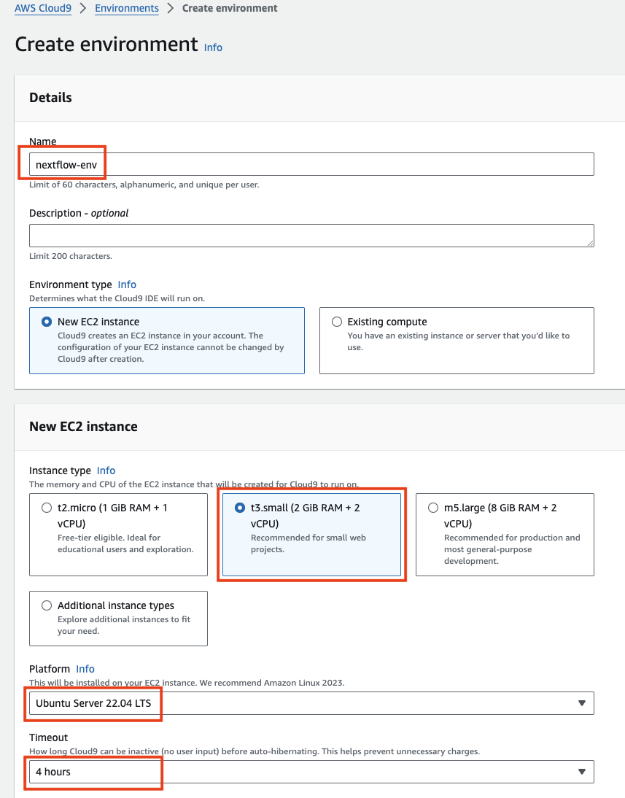
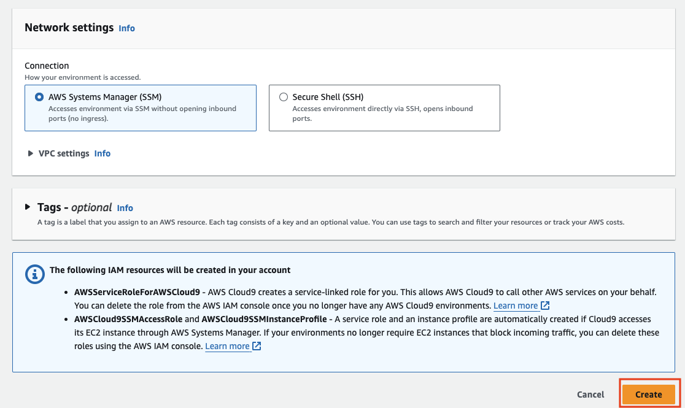
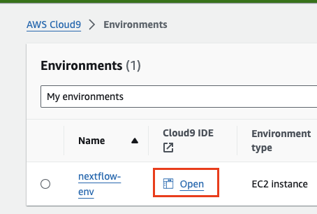
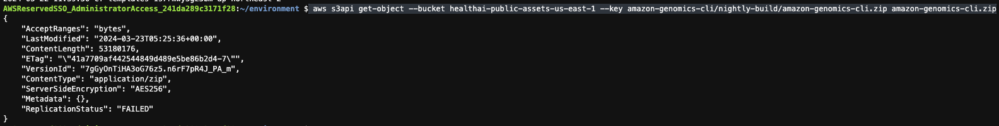
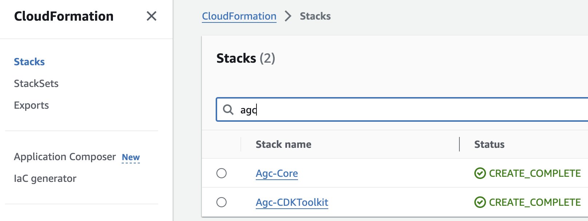
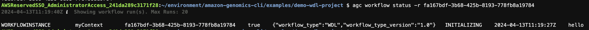
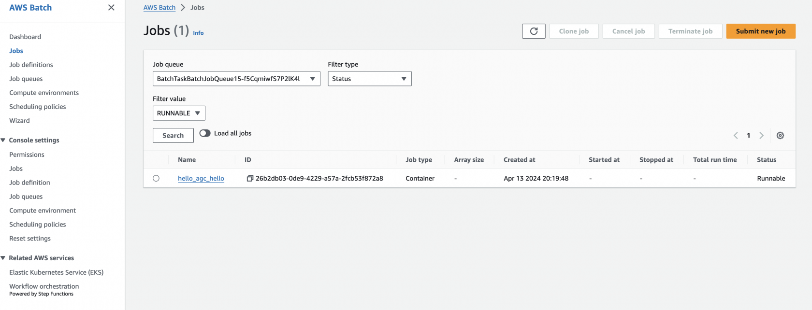

여기서는 Amazon Genomics CLI (이하 AGC)를 간단히 AWS Cloud9 에서 세팅하고, 실행하는 방법을 안내합니다.

### AWS Cloud9에서 Nextflow 환경 세팅

아래와 같이 목적에 맞는 Cloud9 환경을 세팅합니다.

[](https://www.aws-ps-tech.kr/uploads/images/gallery/2024-04/screenshot-2024-04-12-at-10-46-06-pm-copy.png)[](https://www.aws-ps-tech.kr/uploads/images/gallery/2024-04/screenshot-2024-04-12-at-10-46-19-pm-copy.png)

만들어진 Cloud9 환경을 접속합니다.

[](https://www.aws-ps-tech.kr/uploads/images/gallery/2024-04/screenshot-2024-04-12-at-10-50-46-pm.png)

#### AGC 설치 ([참고](https://aws.github.io/amazon-genomics-cli/docs/getting-started/installation/))  


```bash
 aws s3api get-object --bucket healthai-public-assets-us-east-1 --key amazon-genomics-cli/nightly-build/amazon-genomics-cli.zip amazon-genomics-cli.zip
```

[](https://www.aws-ps-tech.kr/uploads/images/gallery/2024-04/screenshot-2024-04-12-at-10-54-35-pm.png)

```bash
unzip amazon-genomics-cli.zip
cd amazon-genomics-cli/
./install.sh
```

설치 확인

```bash
agc --help
```

```
agc --version
```

#### AGC 사용을 위한 Provisoning

아래 명령어를 사용해 agc사용을 위해 AWS 계정에 필요한 자원을 provisoning합니다.

이렇게 하면 DynamoDB 테이블, S3 버킷 및 VPC를 포함하여 Amazon Genomics CLI가 작동하는 데 필요한 핵심 인프라가 생성됩니다. 이 작업은 완료하는 데 약 5분 정도 소요됩니다. 이 작업은 계정 리전당 한 번만 수행하면 됩니다.

DynamoDB 테이블은 CLI에서 영구 상태에 사용됩니다. S3 버킷은 영구 워크플로우 데이터 및 Amazon Genomics CLI 메타데이터에 사용되며, VPC는 컴퓨팅 리소스를 격리하는 데 사용됩니다. 필요한 경우 `--bucket` 및 `--vpc` 옵션을 사용하여 기존 S3 버킷 또는 VPC를 직접 지정할 수 있습니다.

```
agc account activate
```

정상적으로 완료되었다면 AWS CloudFormation에서 확인할 수도 있습니다.

[](https://www.aws-ps-tech.kr/uploads/images/gallery/2024-04/screenshot-2024-04-12-at-11-15-39-pm.png)

이메일을 세팅해줍니다.

```bash
 agc configure email you@youremail.com
```

### 실행하기

#### Hello World

```bash
cd ~/environment/amazon-genomics-cli/examples/demo-wdl-project/
agc context deploy --context myContext
agc workflow run hello --context myContext
```

Check status

```bash
agc workflow status -r <workflow-instance-id>
```

[](https://www.aws-ps-tech.kr/uploads/images/gallery/2024-04/screenshot-2024-04-13-at-8-19-45-pm.png)

AWS Batch 에서도 Job을 확인할 수 있습니다.

[](https://www.aws-ps-tech.kr/uploads/images/gallery/2024-04/screenshot-2024-04-13-at-8-20-53-pm.png)

#### 워크플로우 결과 확인  


```shell
AGC_BUCKET=$(aws ssm get-parameter \
    --name /agc/_common/bucket \
    --query 'Parameter.Value' \
    --output text)

```

 `aws s3` 명령어를 사용해 데이터를 확인해보세요.

Workflow 출력은 다음과 같을 것입니다.

`s3://agc-<account-num>-<region>/project/<project-name>/userid/<user-id>/context/<context-name>/workflow/<workflow-name>/`

나머지 경로는 워크플로우를 실행하는데 사용되는 엔진에 따라 조금씩 다를 수 있습니다. Cromwell 의 경우라면 다음과 같을 것입니다.

 `.../cromwell-execution/<wdl-wf-name>/<workflow-run-id>/<task-name>`

워크플로우 결과에 대해 조회하는 명령어는 다음과 같습니다.

```shell
agc workflow output <workflow_run_id>
```

You can also obtain task logs for a workflow using the following form `agc logs workflow <workflow-name> -r <instance-id>`.

예를들어 다음과 같습니다.

`agc logs workflow hello -r fa167bdf-3b68-425b-8193-778fb8a19784  --all-tasks`

### Cleaning Up

Once you are done with `myContext` you can destroy it with:

```shell
agc context destroy myContext

```

This will remove the cloud resources associated with the named context, but will keep any S3 outputs and CloudWatch logs. If you want stop using Amazon Genomics CLI in your AWS account entirely, you need to deactivate it:

<div class="highlight" id="bkmrk--6"><div class="code-toolbar"><div class="toolbar">  
</div></div></div>This will remove Amazon Genomics CLI’s core infrastructure. If Amazon Genomics CLI created a VPC as part of the activate process, it will be *removed*. If Amazon Genomics CLI created an S3 bucket for you, it will be *retained*.

To uninstall Amazon Genomics CLI from your local machine, run the following command

```shell
./agc/uninstall.sh


```

Note uninstalling the CLI will *not* remove any resources or persistent data from your AWS account.

### **여기서 문제!**   


gatk-best-pratices-project/gatk4-germline-snps-indels 폴더의 워크플로우를 실행해보세요.

***Hint: 입력파일 및 Context를 먼저 확인해보세요.***

<details id="bkmrk-%EC%A0%95%EB%8B%B5-cd-%7E%2Fenvironment%2F"><summary>정답</summary>

cd ~/environment/amazon-genomics-cli/examples/gatk-best-practices-project/gatk4-germline-snps-indels

agc context deploy -c onDemandCtx

agc workflow run gatk4-germline-snps-indels --context onDemandCtx

</details>