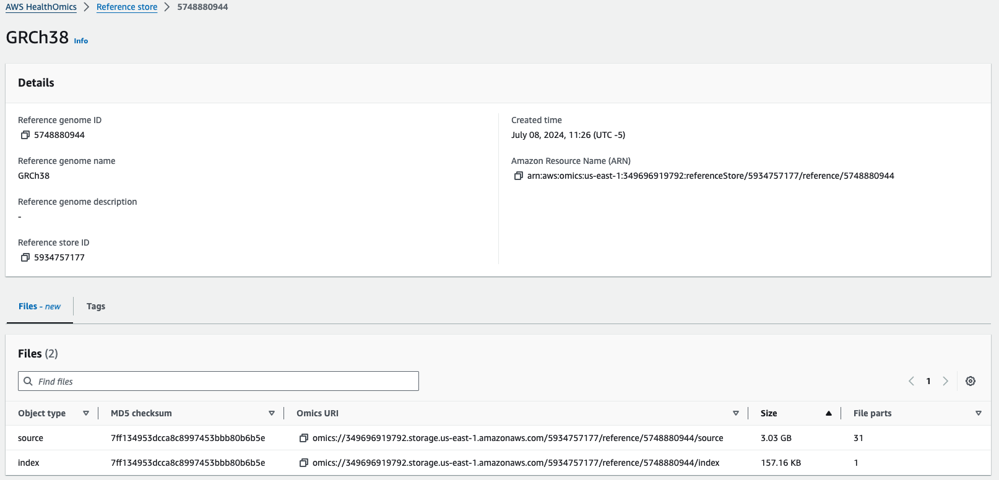
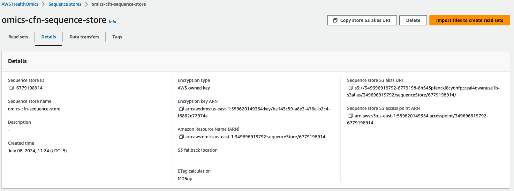

오믹스의 스토리지 컴포넌트는 2개가 있습니다.

- Reference store
- Sequence stores

이름에서도 알 수 있듯이 레퍼런스 스토어는 1개만 생성이 가능하며, 이 스토어 1개 안에 다수의 레퍼런스를 등록할 수 있습니다. 사람 유전체 지도 외에도 모델 Organism등 FASTA 파일 형식의 데이터는 모두 레퍼런스로 등록하여 관리할 수 있습니다. 가장 놀라운 사실은 Reference 스토어에 관리되는 참조 유전체 데이터의 **저장 비용은 무료** 입니다.

## 레퍼런스 스토어

아래와 같이 GRCh38 참조 유전체 정보를 하나 등록해보았습니다.

Omics URI 즉, omics://로 시작하는 주소로 언제든지 참조 유전체 정보에 접속할 수 있습니다.

## 시퀀스 스토어

> 가져오기 시간은 데이터 소스에 따라 다릅니다. 위의 FASTQ 소스에 대한 가져오기는 완료하는 데 약 3~5분이 소요됩니다. BAM 및 CRAM 소스는 가져오기 중에 서비스에서 데이터에 유효성 검사 단계를 적용하므로 시간이 더 오래 걸립니다. FASTQ는 처리가 덜 필요하므로 가져오는 데 시간이 덜 걸립니다.

[2024년 4월 15일부](https://aws.amazon.com/about-aws/whats-new/2024/04/aws-healthomics-reading-sequence-stores-s3-apis/)로 시퀀스에 등록한 시퀀스에 접근하기 위해서 S3:// alias URI로 접근할 수 있습니다. 이 덕분에 도메인별 메타데이터, 비용 절감, 확장성의 이점을 누리면서 HealthOmics 데이터 저장소를 생물정보학 에코시스템에 보다 쉽게 통합할 수 있습니다. Mountpoint for S3 와 같은 서비스를 활용할 수도 있습니다.

**예)** **s3://**349696919792-6779198-8h543pfencki8cydnfpcceai4owanuse1b-s3alias/349696919792/sequenceStore/6779198914/

## 참고

- https://catalog.workshops.aws/amazon-omics-end-to-end/en-US/010-xp-console/100-omics-storage/reference-stores