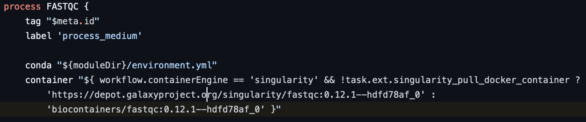
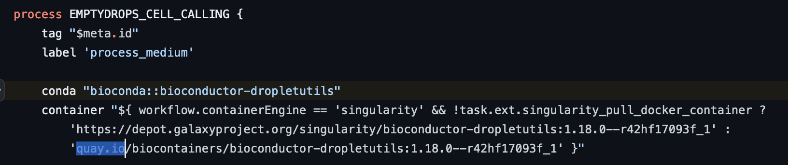
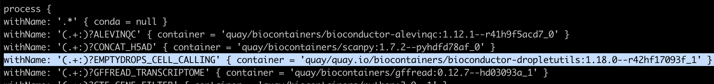
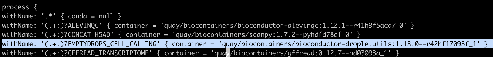

공식문서

[https://docs.aws.amazon.com/omics/latest/dev/troubleshooting.html](https://docs.aws.amazon.com/omics/latest/dev/troubleshooting.html)

**ECR\_PERMISSION\_ERROR**

Unable to access image URI: {account_id}.dkr.ecr.us-east-1.amazonaws.com/quay/quay.io/biocontainers/bioconductor-dropletutils:1.18.0--r42hf17093f_1. Ensure the ECR private repository exists and has granted access for the omics service principle to access the repository.
{account\_id}.dkr.ecr.us-east-1.amazonaws.com/quay/biocontainers/python:3.9--1  
{account\_id}.dkr.ecr.us-east-1.amazonaws.com/quay/nf-core/seurat:4.3.0  
{account\_id}.dkr.ecr.us-east-1.amazonaws.com/quay/biocontainers/fastqc:0.12.1--hdfd78af\_0

위와 같은 다른 이미지 주소와 달리 bioconductor-dropletutils는 주소가 다르게 ecr에 등록되어 있음을 확인.

[참고 코드](https://github.com/nf-core/scrnaseq/blob/4171377f40d629d43d4ca71654a7ea06e5619a09/modules/nf-core/fastqc/main.nf#L8)

{account\_id}.dkr.ecr.us-east-1.amazonaws.com/**quay/quay.io**/biocontainers/bioconductor-dropletutils:1.18.0--r42hf17093f\_1

[참고 코드](https://github.com/nf-core/scrnaseq/blob/4171377f40d629d43d4ca71654a7ea06e5619a09/modules/local/emptydrops.nf#L5)

따라서 scrnaseq/conf/omics.config 파일을 수정을 필요로함.

to

