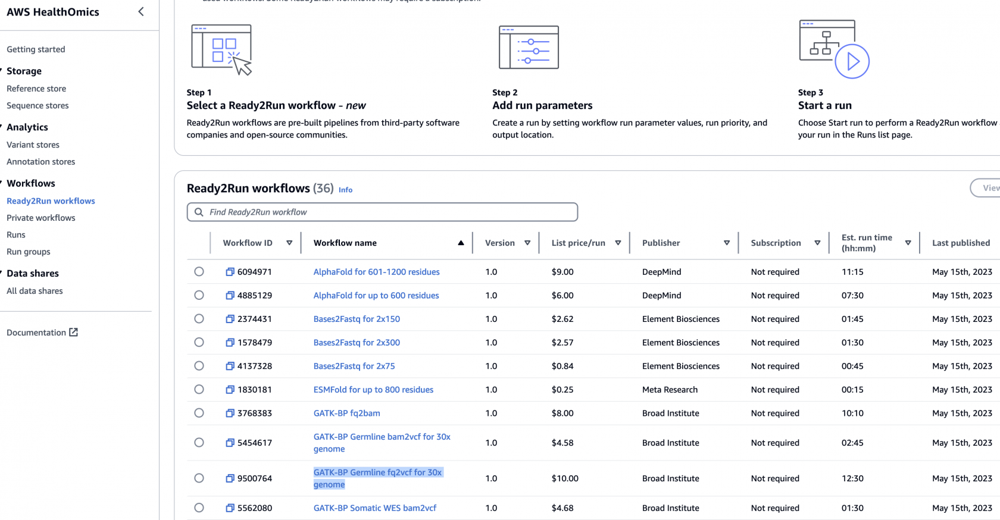
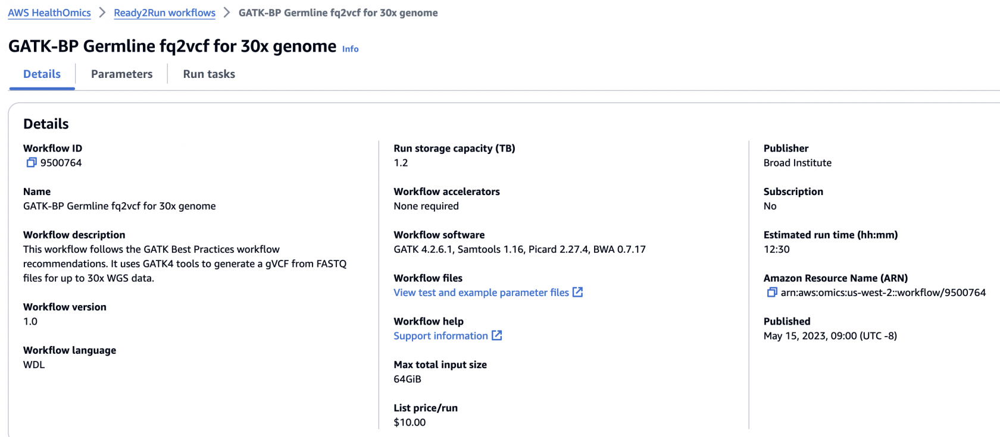
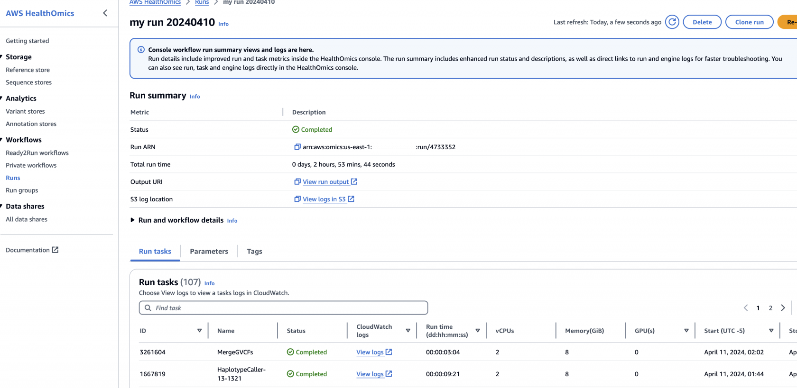

[홈페이지](https://aws.amazon.com/ko/healthomics/), [공식 유저 가이드](https://docs.aws.amazon.com/omics/latest/dev/what-is-healthomics.html#sequence-store-concepts)

AWS HealthOmics는 생물정보학자, 연구원, 과학자와 같은 사용자가 유전체학 및 기타 생물학적 데이터를 저장, 쿼리, 분석 및 분석하여 인사이트를 생성할 수 있도록 지원하는 AWS 서비스입니다.연구 및 임상 조직의 게놈 정보 저장 및 분석 프로세스를 단순화하고 가속화하며 과학적 발견과 통찰력 생성을 가속화합니다.

HealthOmics에는 **2가지 주요 구성 요소**가 있습니다. Healthomics 워크플로는 생물정보학 계산을 위한 기본 인프라를 자동으로 프로비저닝하고 확장합니다. Healthomics Storage를 사용하면 기가베이스당 저렴한 비용으로 페타바이트의 게놈 데이터를 효율적으로 저장하고 공유할 수 있습니다.

## **AWS HealthOmics는 무엇입니까?**

### 중요 공지

HealthOmics는 전문적인 의학적 조언, 진단 또는 치료를 대체하지 않으며 질병이나 건강 상태를 치료, 치료, 완화, 예방 또는 진단하기 위한 것이 아닙니다.임상 의사 결정에 정보를 제공하기 위한 타사 제품과 연계하는 것을 포함하여 AWS Healthomics를 사용할 때 인적 검토를 실시할 책임은 귀하에게 있습니다.

HealthOmics는 데이터를 전송, 저장, 형식 지정 또는 표시하고 워크플로 관리를 위한 인프라 및 구성 지원을 제공하기 위한 용도로만 사용됩니다. AWS Healthomics는 변종 호출 또는 유전체 분석 및 해석을 직접 수행하기 위한 것이 아닙니다. AWS HealthOmics는 임상 실험실 테스트 또는 기타 디바이스 데이터, 결과 및 결과를 해석하거나 분석하기 위한 것이 아니며, 게놈 분석에 사용하기 위한 타사 도구를 대체하지도 않습니다.

- [Workflows](https://docs.aws.amazon.com/omics/latest/dev/what-is-healthomics.html#workflows-concepts) - 워크플로우 (Nextflow, WDL, CWL 등 유전체학 워크플로우를 간단하게 실행할 수 있도록 하는 인프라에 대한 관리형 서비스)
- [Storage - 저장 (FASTQ, BAM, CRAM과 같은 유전체학 포멧을 저장하기 위한 서비스)](https://docs.aws.amazon.com/omics/latest/dev/what-is-healthomics.html#sequence-store-concepts)

### 이점 

\- 게놈 데이터를 안전하게 저장하고 결합. AWS HealthOmics는 AWS 레이크 포메이션 및 Amazon Athena와 같은 다른 AWS 서비스와 통합됨. 유전체학 데이터를 안전하게 저장한 후 이를 쿼리하거나 병력 데이터와 결합하여 더 나은 진단과 맞춤형 치료 계획을 수립할 수 있음

\- 환자 개인 정보 보호 — HealthOmics는 HIPAA 자격을 갖추고 있음. 또한 IAM 및 Amazon CloudWatch와 통합되므로 데이터 액세스를 제어 및 기록하고 데이터가 분석에 사용되는 방식을 추적할 수 있음

\- 확장 가능한 설계 — 간소화된 청구 및 새로운 협업 도구를 사용하여 대규모 데이터 분석을 지원

\- 효율성 극대화 — 자동화된 워크플로우와 통합 도구를 사용하여 데이터 처리 및 분석을 간소화

### Storage

- Reference store는 무료
- Sequence store는 S3의 Intelligent Tiering보다 저렴하게 사용 가능함; [블로그](https://aws.amazon.com/blogs/industries/store-omics-data-cost-effectively-at-any-scale-with-aws-healthomics/)

### Workflows

##### Ready2Run

 Ready2Run (R2R) 워크플로우를 제공합니다. GATK, Singlecell, AlphaFold 등 이미 최적화된 파이프라인을 사용해보세요.

##### Private workflow

Private 워크플로우 또는 R2R 워크플로우를 사용해 분석을 수행하면 아래와 같이 하나의 Run 에 수많은 Task단위의 로그 및 컴퓨팅 사용량을 확인할 수도 있습니다.

### 

### 사용 방법

**AWS 관리 콘솔** — HealthOmics에 액세스하는 데 사용할 수 있는 웹 인터페이스를 제공합니다.

**AWS 명령줄 인터페이스 (AWS CLI)** — AWS 헬스 오믹스를 비롯한 다양한 AWS 서비스에 대한 명령을 제공하며 윈도우, macOS 및 Linux에서 지원됩니다.AWS CLI 설치에 대한 자세한 내용은 AWS 명령줄 인터페이스를 참조하십시오.

**AWS SDK** — AWS는 다양한 프로그래밍 언어 및 플랫폼 (자바, Python, Ruby, .NET, iOS 및 Android 포함) 용 라이브러리와 샘플 코드로 구성된 SDK (소프트웨어 개발 키트) 를 제공합니다.SDK는 헬스오믹스를 프로그래밍 방식으로 사용할 수 있는 편리한 방법을 제공합니다.자세한 내용은 AWS SDK 개발자 센터를 참조하십시오.

**AWS API** — API 작업을 사용하여 프로그래밍 방식으로 HealthOmics에 액세스하고 관리할 수 있습니다.자세한 내용은 헬스오믹스 API 레퍼런스를 참조하십시오.

### 사용 가능한 리전 및 Quota  

https://docs.aws.amazon.com/general/latest/gr/healthomics-quotas.html

## 기타 링크

아래에는 HealthOmics에서 Private workflow로 등록하여 돌릴 수 있는 예제 파이프라인들을 제공합니다.

- WDL workflows
    
    
    - 📂 [GATK Best Practice workflows](https://github.com/aws-samples/amazon-omics-tutorials/blob/main/example-workflows/gatk-best-practices)
        
        
        - [Analysis ready germline BAM to VCF](https://github.com/aws-samples/amazon-omics-tutorials/blob/main/example-workflows/gatk-best-practices/workflows/analysis-ready-germline-bam-to-vcf)
        - [CRAM to BAM](https://github.com/aws-samples/amazon-omics-tutorials/blob/main/example-workflows/gatk-best-practices/workflows/cram-to-bam)
        - [FASTQs to analysis ready BAM](https://github.com/aws-samples/amazon-omics-tutorials/blob/main/example-workflows/gatk-best-practices/workflows/fastqs-to-analysis-ready-bam)
        - [Germline FASTQs to VCF](https://github.com/aws-samples/amazon-omics-tutorials/blob/main/example-workflows/gatk-best-practices/workflows/germline-fastqs-to-vcf)
        - [Somatic SNPs and InDELs](https://github.com/aws-samples/amazon-omics-tutorials/blob/main/example-workflows/gatk-best-practices/workflows/somatic-snps-and-indels)
    - 📂 [Protein folding workflows](https://github.com/aws-samples/amazon-omics-tutorials/blob/main/example-workflows/protein-folding)
        
        
        - [AlphaFold](https://github.com/aws-samples/amazon-omics-tutorials/blob/main/example-workflows/protein-folding/workflows/alphafold)
        - [ESMFold](https://github.com/aws-samples/amazon-omics-tutorials/blob/main/example-workflows/protein-folding/workflows/esmfold)
    - 📂 [Other WDL workflows](https://github.com/aws-samples/amazon-omics-tutorials/blob/main/example-workflows/other_WDL)
        
        
        - [HISAT-Genotype HLA Caller](https://github.com/aws-samples/amazon-omics-tutorials/blob/main/example-workflows/other_WDL/workflows/HISAT-genotype)
- Nextflow workflows
    
    
    - 📂 [NF-Core workflows](https://github.com/aws-samples/amazon-omics-tutorials/blob/main/example-workflows/nf-core)
        
        
        - [FASTQC](https://github.com/aws-samples/amazon-omics-tutorials/blob/main/example-workflows/nf-core/workflows/fastqc)
        - [RNAseq](https://github.com/aws-samples/amazon-omics-tutorials/blob/main/example-workflows/nf-core/workflows/rnaseq)
        - [scRNAseq-cellranger](https://github.com/aws-samples/amazon-omics-tutorials/blob/main/example-workflows/nf-core/workflows/scrnaseq-cellranger)
        - [scRNAseq](https://github.com/aws-samples/amazon-omics-tutorials/blob/main/example-workflows/nf-core/workflows/scrnaseq)
        - [TaxProfiler](https://github.com/aws-samples/amazon-omics-tutorials/blob/main/example-workflows/nf-core/workflows/taxprofiler)
    - 📂 [Other Nextflow workflows](https://github.com/aws-samples/amazon-omics-tutorials/blob/main/example-workflows/other_nextflow)
        
        
        - [VEP](https://github.com/aws-samples/amazon-omics-tutorials/blob/main/example-workflows/other_nextflow/workflows/vep)

[https://github.com/aws-samples/amazon-omics-tutorials/tree/main/example-workflows](https://github.com/aws-samples/amazon-omics-tutorials/tree/main/example-workflows)

Learn more about HealthOmics from these workshops and tutorials:

- HealthOmics workshop – [HealthOmics end to end workshop<svg aria-hidden="true" focusable="false" viewbox="0 0 16 16" xmlns="http://www.w3.org/2000/svg"><path class="stroke-linejoin-round" d="M14 8.01v-6H8M14.02 2 8 8.01M6 2.01H2v12h12v-3.99"></path></svg>](https://catalog.workshops.aws/amazon-omics-end-to-end/en-US)
    
    
    - [Migrating Nf-core Workflows Into AWS HealthOmics](https://catalog.us-east-1.prod.workshops.aws/workshops/76d4a4ff-fe6f-436a-a1c2-f7ce44bc5d17/en-US)
- AWS genomics resources – [Public Amazon ECR repositories<svg aria-hidden="true" focusable="false" viewbox="0 0 16 16" xmlns="http://www.w3.org/2000/svg"><path class="stroke-linejoin-round" d="M14 8.01v-6H8M14.02 2 8 8.01M6 2.01H2v12h12v-3.99"></path></svg>](https://gallery.ecr.aws/aws-genomics?page=1) related to genomics
- Python tutorials – [Jupyter notebook tutorials<svg aria-hidden="true" focusable="false" viewbox="0 0 16 16" xmlns="http://www.w3.org/2000/svg"><path class="stroke-linejoin-round" d="M14 8.01v-6H8M14.02 2 8 8.01M6 2.01H2v12h12v-3.99"></path></svg>](https://github.com/aws-samples/amazon-omics-tutorials) on GitHub, covering HealthOmics storage, analytics, and workflows

Become familiar with additional HealthOmics tools that AWS provides:

- WDL linter – [HealthOmics linter for WDL<svg aria-hidden="true" focusable="false" viewbox="0 0 16 16" xmlns="http://www.w3.org/2000/svg"><path class="stroke-linejoin-round" d="M14 8.01v-6H8M14.02 2 8 8.01M6 2.01H2v12h12v-3.99"></path></svg>](https://gallery.ecr.aws/aws-genomics/healthomics-linter)
- Nextflow linter – [HealthOmics linter for Nextflow<svg aria-hidden="true" focusable="false" viewbox="0 0 16 16" xmlns="http://www.w3.org/2000/svg"><path class="stroke-linejoin-round" d="M14 8.01v-6H8M14.02 2 8 8.01M6 2.01H2v12h12v-3.99"></path></svg>](https://gallery.ecr.aws/aws-genomics/linter-rules-for-nextflow)
- HealthOmics Amazon ECR helper tool – [Amazon ECR helper tool for HealthOmics<svg aria-hidden="true" focusable="false" viewbox="0 0 16 16" xmlns="http://www.w3.org/2000/svg"><path class="stroke-linejoin-round" d="M14 8.01v-6H8M14.02 2 8 8.01M6 2.01H2v12h12v-3.99"></path></svg>](https://github.com/aws-samples/amazon-ecr-helper-for-aws-healthomics)
- HealthOmics tools on GitHub – [Tools for working with HealthOmics<svg aria-hidden="true" focusable="false" viewbox="0 0 16 16" xmlns="http://www.w3.org/2000/svg"><path class="stroke-linejoin-round" d="M14 8.01v-6H8M14.02 2 8 8.01M6 2.01H2v12h12v-3.99"></path></svg>](https://github.com/awslabs/amazon-omics-tools) (Transfer manager, URI parser, Omics rerun, Run analyzer).

  
동일 워크플로우를 개선하거나 업데이트할 시 버전별로 관리하시면 좋습니다. (여러개의 워크플로가 아닌 단일 워크플로 내에서 버전으로 관리)  
https://docs.aws.amazon.com/omics/latest/dev/workflow-versions.html

워크플로우 개발시 또는 필요할 경우 이미 기존 특정 작업을 캐시로 사용해서 특정 단계를 재실행하지않고 건너뜀으로써 빠르게 워크플로를 디버깅하거나 런 시간을 단축할 수 있는 기능입니다.  
https://docs.aws.amazon.com/omics/latest/dev/workflows-call-caching.html

 Run Analyzer 에 대한 설명입니다.   
https://docs.aws.amazon.com/omics/latest/dev/workflows-run-optimize.html

워크플로 실행시 설정할 수 있는 **스토리지 옵션**에 관한 설명입니다. https://docs.aws.amazon.com/omics/latest/dev/workflows-run-types.html

HealthOmics가 지원하는 COmpute/Memory 인스턴스 타입 목록입니다.  
https://docs.aws.amazon.com/omics/latest/dev/memory-and-compute-tasks.html  
워크플로 정의에서 WDL, Nextflow 문법으로 cpu/memory 크기를 제어할 수 있습니다.   
https://docs.aws.amazon.com/omics/latest/dev/task-resources.html

  
가격 소개페이지 &amp; AWS 비용 계산기  
https://aws.amazon.com/healthomics/pricing/  
https://calculator.aws/#/

### 관련 블로그

- [Secure Your Genomic Workflows and Data with AWS HealthOmics](https://aws.amazon.com/blogs/industries/secure-your-genomic-workflows-and-data-with-aws-healthomics/)
- [Category: AWS HealthOmics / AWS for Industries](https://aws.amazon.com/blogs/industries/category/artificial-intelligence/amazon-machine-learning/amazon-omics/)