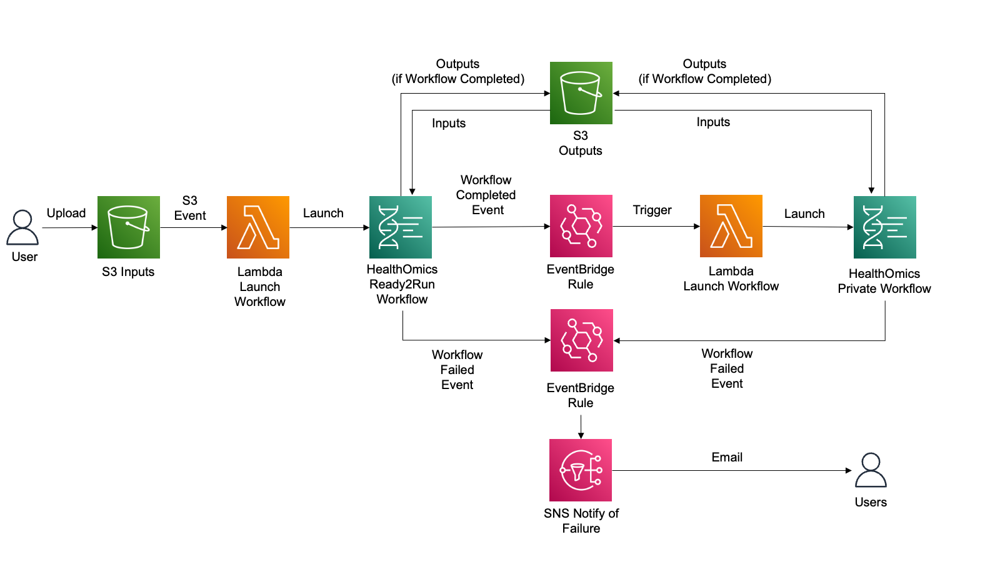
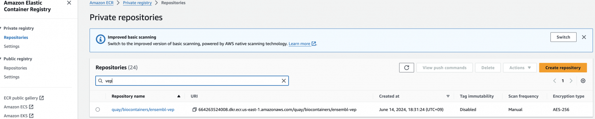
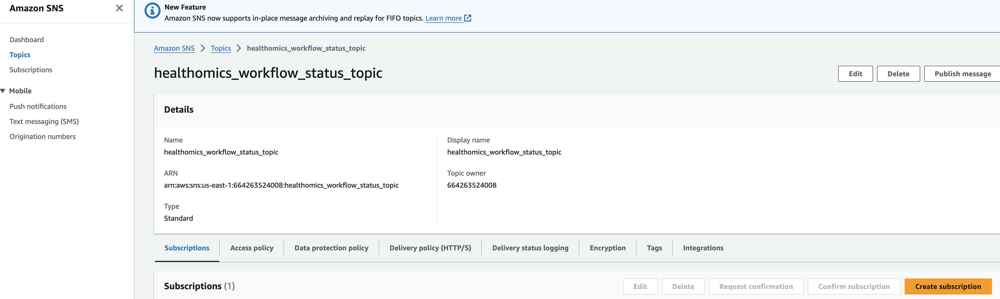
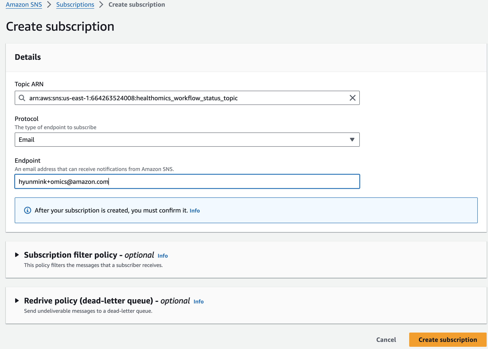
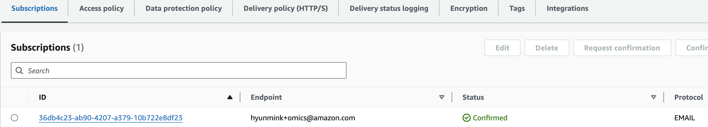
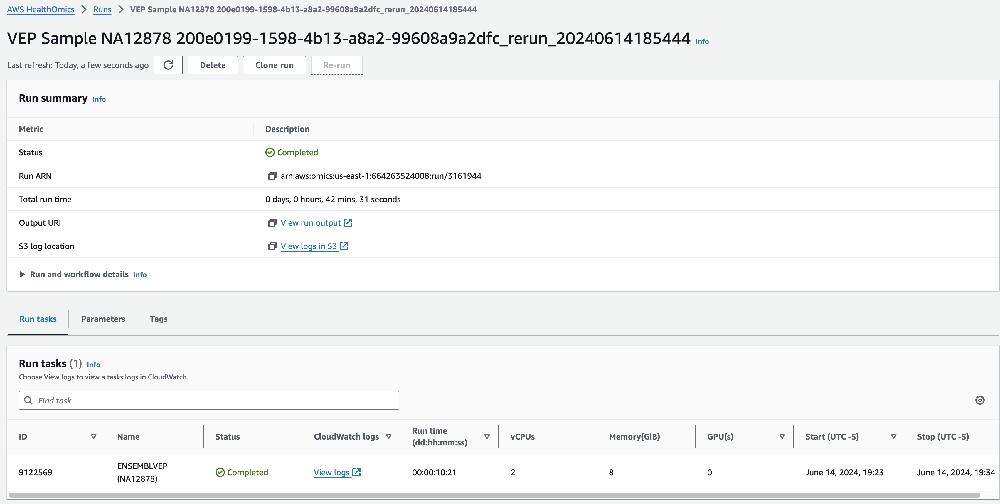
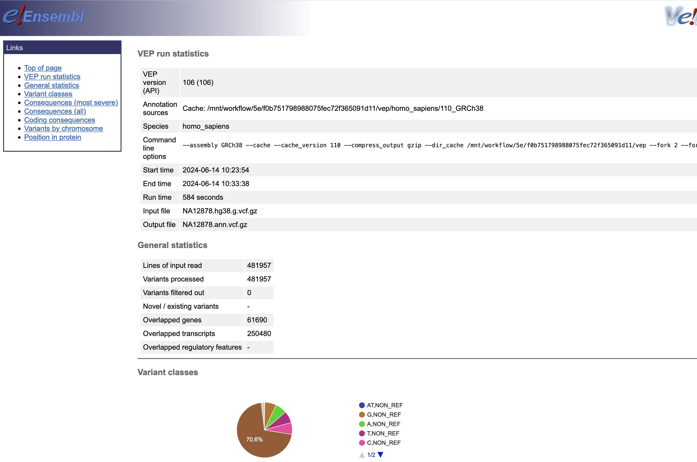

```
cd aws-healthomics-eventbridge-integration/workflows/vep

aws stepfunctions start-execution \
    --state-machine-arn arn:aws:states:<aws-region>:<aws-account-id>:stateMachine:omx-container-puller \
    --input file//container_image_manifest.json
```


AWS HealthOmics 워크플로 기능을 사용해 자체 워크플로를 가져오거나 기존의 Ready2Run 워크플로를 실행하여 유전체학 또는 기타 다중 오믹스 데이터를 처리할 수 있습니다.

고객은 종종 워크플로우를 자동으로 시작하고, 첫 번째 워크플로우가 성공적으로 완료된 후 다른 AWS HealthOmics 워크플로우와 같은 새로운 프로세스를 트리거하며, 워크플로우 실패 시 사용자에게 알림을 제공하는 자동화를 원합니다.

여기서는 이것을 다뤄봅니다.

Ready2Run의 GATK-BP Germline fq2vcf for 30x genome 워크플로우로부터 입력한 FASTQ 를 VCF로 변환하고 이 VCF파일에 대해 VEP workflow (Private workflow에 등록하여)를 수행하여 최종적으로 Annotation된 결과 VCF를 얻게 됩니다.

[](https://www.aws-ps-tech.kr/uploads/images/gallery/2024-06/omics-eventbridge-architecture.png)

## 사전 요구사항

- Access to an AWS account and relevant permissions to create/use the following services: 
    - AWS Lambda, AWS HealthOmics, Amazon S3, Amazon Eventbridge, AWS IAM, Amazon SNS, Amazon ECR, Amazon CloudWatch Logs, AWS KMS, Cloud9 (optional)
- Node.js and npm installed
- Python 3 installed
- AWS CLI installed and configured
- AWS CDK CLI installed

## 구현

이 솔루션은 클라우드에서 리소스를 배포하고 관리하기 위해 CDK 및 Python과 함께 IaC를 사용합니다. 다음 단계는 솔루션을 초기화하고 배포하는 방법을 보여줍니다.

### 초기 설정

아래 명령을 실행하여 배포를 위한 CDK 파이프라인을 초기화합니다.

```
python3 -m pip install aws-cdk-lib
npm install -g aws-cdk
npm install -g aws-cdk --force
cdk bootstrap aws://<ACCOUNTID>/<AWS-REGION>   # do this if your account hasn't been bootstraped
cdk --version

```

- Make sure to replace "ACCOUNTID" placeholder with actual account number
- Replace “AWS-REGION” with a valid AWS region where you plan to deploy the solution. e.g. us-east-1

### 인프라스트럭처 생성

아래 명령을 실행하여 CDK를 사용하여 HealthOmics-EventBridge 통합 솔루션을 복제하고 배포하세요. "cdk deploy"를 실행하면 인프라를 배포하기 위한 AWS CloudFormation 템플릿이 생성됩니다.

아래 예시에서 github은 예를들어 [https://github.com/hmkim/aws-healthomics-eventbridge-integration](https://github.com/hmkim/aws-healthomics-eventbridge-integration)

proj-dir은 개별적으로 만든 프로젝트 디렉토리명으로 바꿔야합니다.

```
git clone <github>
cd <proj-dir>
python3 -m venv .venv
source .venv/bin/activate
pip install -r requirements.txt
cdk synth
cdk deploy --all
```

### Amazon ECR 에 VEP 툴 이미지 저장  


VEP workflow 수행을 위해 vep 툴 정보가 준비되있는 container정보를 자동으로 [Amazon ECR](https://aws.amazon.com/ecr/)의 private repository에 등록하기 위한 솔루션을 다운받습니다.

```
git clone https://github.com/hmkim/amazon-ecr-helper-for-aws-healthomics
```

다음을 사용하여 AWS HealthOmics 워크플로우를 실행하려는 각 리전에서 애플리케이션에 사용되는 [AWS CloudFormation](https://aws.amazon.com/cloudformation/) 스택을 배포합니다:

```
# install package dependencies
npm install

# in your default region (specify profile if other than 'default')
cdk deploy --all --profile <aws-profile>
```

앞에서 받은 본 솔루션의 폴더로 이동하여 container image 주소로부터 ECR에 자동 등록할 수 있습니다. (AWS Step Function 을 활용하게 됨)

Execute the following to pull this list of container images into your ECR private registry:

```
cd aws-healthomics-eventbridge-integration/workflows/vep

aws stepfunctions start-execution \
    --state-machine-arn arn:aws:states:<aws-region>:<aws-account-id>:stateMachine:omx-container-puller \
    --input file//container_image_manifest.json
```

최종적으로 Amazon ECR에 접속해서 컨테이너 이미지 정보가 repository에 잘 등록되었는지 확인해볼 수 있습니다.

[](https://www.aws-ps-tech.kr/uploads/images/gallery/2024-06/screenshot-2024-06-14-at-7-08-03-pm.png)

## 솔루션 살펴보기 및 테스트

### 워크플로우 오류 SNS 알림 구독

솔루션을 테스트하기 전에 이메일 주소로 Amazon SNS 주제(이름은 \*\_workflow\_status\_topic이어야 함)를 구독하여 HealthOmics 워크플로우 실행이 실패할 경우 이메일 알림을 받아야 합니다. 구독 방법은 여기를 참조하세요: [https://docs.aws.amazon.com/sns/latest/dg/sns-create-subscribe-endpoint-to-topic.html](https://docs.aws.amazon.com/sns/latest/dg/sns-create-subscribe-endpoint-to-topic.html)

Amazon SNS 로 진입해 healthomics workflow status topic 주제 세부 페이지에서 Subscrition을 만들면됩니다.

[](https://www.aws-ps-tech.kr/uploads/images/gallery/2024-06/screenshot-2024-06-14-at-6-49-56-pm.png)

[](https://www.aws-ps-tech.kr/uploads/images/gallery/2024-06/screenshot-2024-06-14-at-6-50-30-pm.png)

이메일을 통해 구독 확인을 하면 아래와 같이 최종적으로 구독이 완료됬음을 알 수 있습니다.

[](https://www.aws-ps-tech.kr/uploads/images/gallery/2024-06/screenshot-2024-06-14-at-6-50-38-pm.png)


### 샘플 manifest CSV 파일 만들기 및 업로드

샘플의 시퀀스 데이터 배치가 생성되어 생물정보학 워크플로를 사용하여 분석이 필요한 경우, 사용자 또는 실험실 정보 관리 시스템(LIMS)과 같은 기존 시스템은 샘플과 샘플 이름 및 시퀀싱 기기 관련 메타데이터와 같은 관련 메타데이터를 설명하는 매니페스트(샘플 시트라고도 함)를 생성합니다. 아래는 이 솔루션에서 테스트에 사용되는 CSV의 예시입니다:

```csv
sample_name,read_group,fastq_1,fastq_2,platform
NA12878,Sample_U0a,s3://aws-genomics-static-{aws-region}/omics-tutorials/data/fastq/NA12878/Sample_U0a/U0a_CGATGT_L001_R1_001.fastq.gz,s3://aws-genomics-static-{aws-region}/omics-tutorials/data/fastq/NA12878/Sample_U0a/U0a_CGATGT_L001_R2_001.fastq.gz,illumina
```

우리는 공용 AWS 테스트 데이터 버킷에서 호스팅되는 공개적으로 사용 가능한 테스트 FASTQ 파일을 사용할 것입니다. S3 버킷에서도 자체 FASTQ 파일을 사용할 수 있습니다.

1. 솔루션 코드에 제공된 테스트 파일을 사용하세요: "workflows/vep/test\_data/sample\_manifest\_with\_test\_data.csv". 파일 내용 중 {aws-region} 문자열을 솔루션을 배포한 AWS 리전으로 바꿉니다. CSV에서 참조된 공개적으로 사용 가능한 FASTQ 데이터는 AWS HealthOmics를 사용할 수 있는 모든 지역에서 사용할 수 있습니다.
2. 이 파일을 솔루션에서 생성한 입력 버킷에 "fastq" 접두사를 붙여 업로드합니다.

```
aws s3 cp sample_manifest_with_test_data.csv s3://<INPUTBUCKET>/fastqs/
```

이제 위 솔루션에 구축한 워크플로우가 자동으로 실행됩니다. 여러 서비스들을 살펴보면서 솔루션 전체 내용을 이해하는 과정이 필요할 것입니다.

### 결과파일

Omics Run 내에 연결된 정보를 통해 최종 결과는 S3에서 확인할 수 있습니다.

[](https://www.aws-ps-tech.kr/uploads/images/gallery/2024-06/screenshot-2024-06-14-at-8-27-04-pm.png)

[](https://www.aws-ps-tech.kr/uploads/images/gallery/2024-06/screenshot-2024-06-14-at-8-28-19-pm.png)


## 참고

- [https://github.com/hmkim/aws-healthomics-eventbridge-integration](https://github.com/aws-samples/aws-healthomics-eventbridge-integration)
- [https://github.com/hmkim/amazon-ecr-helper-for-aws-healthomics](https://github.com/hmkim/amazon-ecr-helper-for-aws-healthomics)