<p class="callout warning">AWS HealthOmics variant stores and annotation stores are no longer open to new customers. Existing customers can continue to use the service as normal. For more information, see [AWS HealthOmics variant store and annotation store availability change](https://docs.aws.amazon.com/omics/latest/dev/variant-store-availability-change.html).</p>

AWS HealthOmics의 Analytics 기능을 활용하여 annotation작업을 수행할 수 있습니다.

## 준비물

- 입력 샘플 VCF
- Annotation할 정보 소스 VCF (예: ClinVar)

<span style="margin-bottom: 0px;">s3://omics-eventbridge-solutio-healthomicsckaoutput6642-xbtuwqnxt8uw/outputs/9881593/out/output\_vcf/NA12878.hg38.g.vcf.gz</span>


## <span style="margin-bottom: 0px;">Variant stores</span>  


### 변이 스토어 생성

1. From the AWS HealthOmics Console, navigate to **Analytics** &gt; [Variant stores<span class="awsui_icon-wrapper_4c84z_eu8v7_485" style="white-space: nowrap;"> <span class="awsui_icon_4c84z_eu8v7_485" style="display: inline-block;"><span class="awsui_icon_h11ix_1q8e6_101 awsui_icon-flex-height_h11ix_1q8e6_109 awsui_size-medium_h11ix_1q8e6_172 awsui_variant-normal_h11ix_1q8e6_229 awsui_name-external_h11ix_1q8e6_263" style="display: inline-flex; position: relative; vertical-align: top; align-items: center; box-sizing: border-box; inline-size: var(--size-icon-medium-6sroof,16px); color: currentcolor; height: 24px;"><svg aria-hidden="true" focusable="false" viewbox="0 0 16 16" xmlns="http://www.w3.org/2000/svg"><path class="stroke-linecap-square" d="M10 2h4v4"></path><path d="m6 10 8-8"></path><path class="stroke-linejoin-round" d="M14 9.048V14H2V2h5"></path></svg></span></span></span>](https://console.aws.amazon.com/omics/home#/variantStore)
2. Select **Create variant store**
3. For **Variant store name** provide "my\_variant\_store".
4. For **Reference genome** select "GRCh38" (this is a pre-provisioned reference, but you can alternatively select the reference you imported in the [Reference Store](https://catalog.workshops.aws/amazon-omics-end-to-end/en-US/020-xp-console/100-omics-storage/reference-stores) part of the workshop)
5. Finish with **Create variant store**

[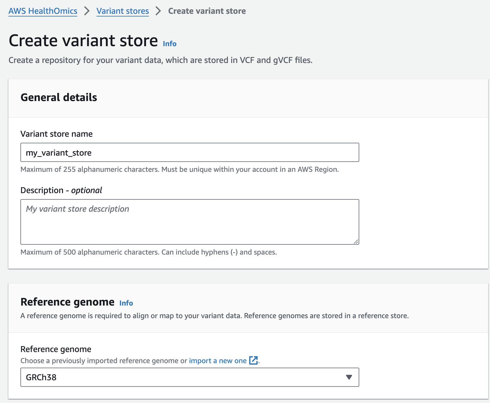](https://www.aws-ps-tech.kr/uploads/images/gallery/2024-06/screenshot-2024-06-14-at-10-45-15-pm.png)

### <span style="font-weight: bolder; margin-bottom: 0px;">변이스토어에 샘플 VCF 파일 가져오기</span>

Next, you are going to start a VCF import job. To do this:

1. From the AWS HealthOmics Console, navigate to **Analytics** &gt; [Variant stores<span class="awsui_icon-wrapper_4c84z_eu8v7_485" style="white-space: nowrap;"> <span class="awsui_icon_4c84z_eu8v7_485" style="display: inline-block;"><span class="awsui_icon_h11ix_1q8e6_101 awsui_icon-flex-height_h11ix_1q8e6_109 awsui_size-medium_h11ix_1q8e6_172 awsui_variant-normal_h11ix_1q8e6_229 awsui_name-external_h11ix_1q8e6_263" style="display: inline-flex; position: relative; vertical-align: top; align-items: center; box-sizing: border-box; inline-size: var(--size-icon-medium-6sroof,16px); color: currentcolor; height: 24px;"><svg aria-hidden="true" focusable="false" viewbox="0 0 16 16" xmlns="http://www.w3.org/2000/svg"><path class="stroke-linecap-square" d="M10 2h4v4"></path><path d="m6 10 8-8"></path><path class="stroke-linejoin-round" d="M14 9.048V14H2V2h5"></path></svg></span></span></span>](https://console.aws.amazon.com/omics/home#/variantStore)
2. Select the **Name** Variant store named **omicsvariantstore1** (or the one you created above as appropriate)
3. Select **Import variant data**. If this option isn't available select **Actions** &gt; **Import**.
4. Select **Create and use a new service role**
5. For **Select variant data from S3** provide the following S3 URI:

아래 s3 경로는 입력 VCF 파일의 S3 URI을 의미합니다.

```
s3://omics-eventbridge-solutio-healthomicsckaoutput6642-xbtuwqnxt8uw/outputs/9881593/out/output_vcf/NA12878.hg38.g.vcf.gz
```

[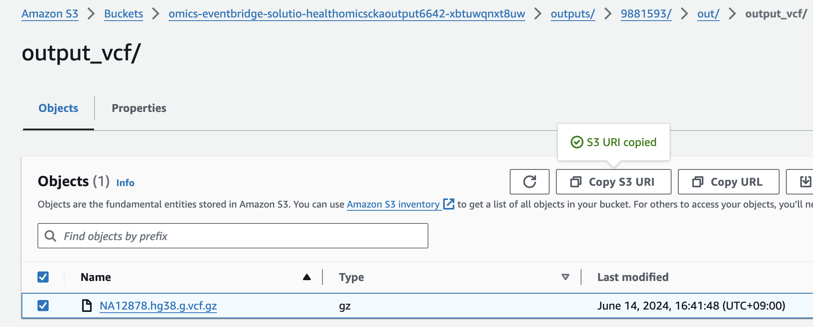](https://www.aws-ps-tech.kr/uploads/images/gallery/2024-06/screenshot-2024-06-14-at-10-46-45-pm.png)

**NOTE:** The region will differ based on deployment region.

6. Start the import with **Create import job**

You should now see something like this:

\- 적당한 Service role 이 없을 경우 새로 생성하여 사용하는 옵션을 선택할 수 있습니다.

\- 앞에서 설명한대로 입력하고자하는 VCF 파일의 S3 경로를 작성합니다.

[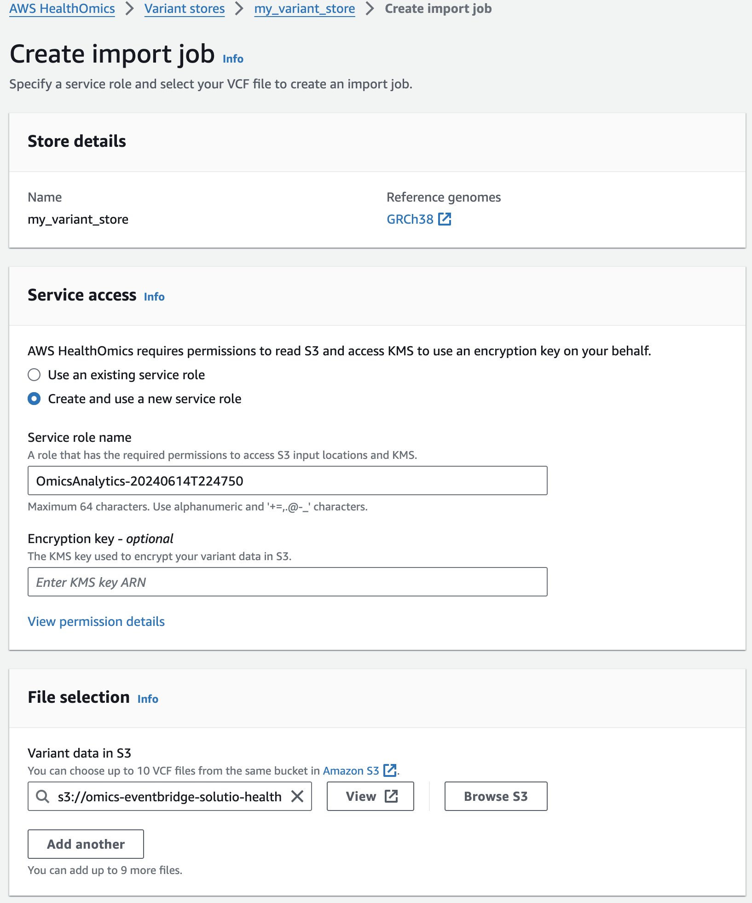](https://www.aws-ps-tech.kr/uploads/images/gallery/2024-06/screenshot-2024-06-14-at-10-48-13-pm.png)

콘솔에서 VCF Import작업시 제출되었음을 확인할 수 있습니다.

[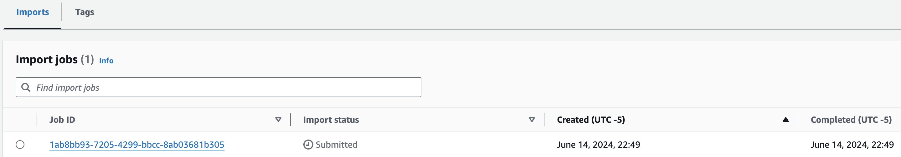](https://www.aws-ps-tech.kr/uploads/images/gallery/2024-06/screenshot-2024-06-14-at-10-49-27-pm.png)

## Annotation stores  


### 주석 스토어 생성

1. From the AWS HealthOmics Console, navigate to **Analytics** &gt; [Annotation stores<span class="awsui_icon-wrapper_4c84z_eu8v7_485" style="white-space: nowrap;"> <span class="awsui_icon_4c84z_eu8v7_485" style="display: inline-block;"><span class="awsui_icon_h11ix_1q8e6_101 awsui_icon-flex-height_h11ix_1q8e6_109 awsui_size-medium_h11ix_1q8e6_172 awsui_variant-normal_h11ix_1q8e6_229 awsui_name-external_h11ix_1q8e6_263" style="display: inline-flex; position: relative; vertical-align: top; align-items: center; box-sizing: border-box; inline-size: var(--size-icon-medium-6sroof,16px); color: currentcolor; height: 24px;"><svg aria-hidden="true" focusable="false" viewbox="0 0 16 16" xmlns="http://www.w3.org/2000/svg"><path class="stroke-linecap-square" d="M10 2h4v4"></path><path d="m6 10 8-8"></path><path class="stroke-linejoin-round" d="M14 9.048V14H2V2h5"></path></svg></span></span></span>](https://console.aws.amazon.com/omics/home#/annotationStore)
2. Select **Create annotation store**
3. For **Variant store name** provide "my\_annotation\_store".
4. For **Data file format** select **VCF file**
5. For **Reference genome** select "GRCh38" (this is a pre-provisioned reference, but you can alternatively select the reference you imported in the [Reference Store](https://catalog.workshops.aws/amazon-omics-end-to-end/en-US/020-xp-console/100-omics-storage/reference-stores) part of the workshop)
6. Finish with **Create annotation store**

[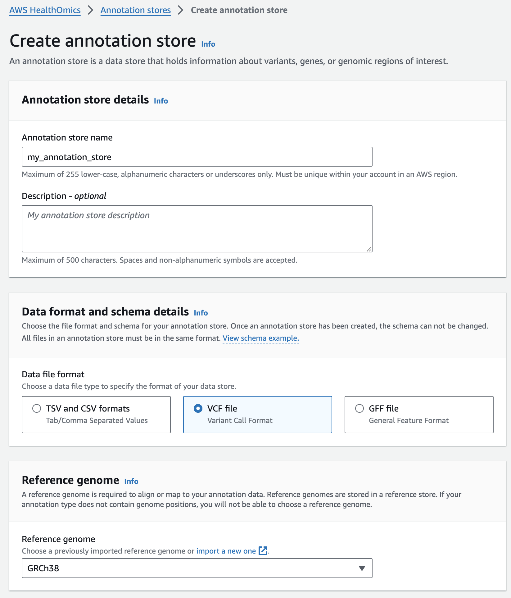](https://www.aws-ps-tech.kr/uploads/images/gallery/2024-06/screenshot-2024-06-14-at-10-51-05-pm.png)

### 주석 스토어에 VCF 파일 가져오기

Next, you are going to start an annotation import job to import [ClinVar<span class="awsui_icon-wrapper_4c84z_eu8v7_485" style="white-space: nowrap;"> <span class="awsui_icon_4c84z_eu8v7_485" style="display: inline-block;"><span class="awsui_icon_h11ix_1q8e6_101 awsui_icon-flex-height_h11ix_1q8e6_109 awsui_size-medium_h11ix_1q8e6_172 awsui_variant-normal_h11ix_1q8e6_229 awsui_name-external_h11ix_1q8e6_263" style="display: inline-flex; position: relative; vertical-align: top; align-items: center; box-sizing: border-box; inline-size: var(--size-icon-medium-6sroof,16px); color: currentcolor; height: 24px;"><svg aria-hidden="true" focusable="false" viewbox="0 0 16 16" xmlns="http://www.w3.org/2000/svg"><path class="stroke-linecap-square" d="M10 2h4v4"></path><path d="m6 10 8-8"></path><path class="stroke-linejoin-round" d="M14 9.048V14H2V2h5"></path></svg></span></span></span>](https://www.ncbi.nlm.nih.gov/clinvar/) annotations in VCF format into the pre-provisioned store.

1. From the AWS HealthOmics Console, navigate to **Analytics** &gt; [Annotation stores<span class="awsui_icon-wrapper_4c84z_eu8v7_485" style="white-space: nowrap;"> <span class="awsui_icon_4c84z_eu8v7_485" style="display: inline-block;"><span class="awsui_icon_h11ix_1q8e6_101 awsui_icon-flex-height_h11ix_1q8e6_109 awsui_size-medium_h11ix_1q8e6_172 awsui_variant-normal_h11ix_1q8e6_229 awsui_name-external_h11ix_1q8e6_263" style="display: inline-flex; position: relative; vertical-align: top; align-items: center; box-sizing: border-box; inline-size: var(--size-icon-medium-6sroof,16px); color: currentcolor; height: 24px;"><svg aria-hidden="true" focusable="false" viewbox="0 0 16 16" xmlns="http://www.w3.org/2000/svg"><path class="stroke-linecap-square" d="M10 2h4v4"></path><path d="m6 10 8-8"></path><path class="stroke-linejoin-round" d="M14 9.048V14H2V2h5"></path></svg></span></span></span>](https://console.aws.amazon.com/omics/home#/annotationStore)
2. Click on the name of the Annotation store named **omicsannotationstore1** (or the one you created above as appropriate)
3. Under **Store versions** click on the name of the only version listed (there should only be one at this time).
4. Select **Import VCF data**. If this option isn't available select **Actions** &gt; **Import**.
5. Select **Create and use a new service role**
6. For **Choose annotation data from S3** provide the following S3 URI, including the appropriate AWS region:

아래는 미리준비된 예제 clinvar 입니다.

```text
s3://aws-genomics-static-<aws-region>/omics-workshop/data/annotations/clinvar.vcf.gz
```

실제 clinvar 데이터는 [여기서](https://www.ncbi.nlm.nih.gov/clinvar/docs/maintenance_use/#download) 다운로드 할 수 있습니다.

예: [https://ftp.ncbi.nlm.nih.gov/pub/clinvar/vcf\_GRCh38/](https://ftp.ncbi.nlm.nih.gov/pub/clinvar/vcf_GRCh38/)

<div class="CodeBlock-module_codeBlock__2a1n0 CodeBlock-module_hasCopyAction__zdyx-" id="bkmrk--6" style="margin-bottom: 2rem; margin-top: 2rem; position: relative; color: rgb(22, 25, 31); font-family: 'Amazon Ember', 'Helvetica Neue', Roboto, Arial, sans-serif; font-size: 14px; font-style: normal; font-variant-ligatures: normal; font-variant-caps: normal; font-weight: 400; letter-spacing: normal; orphans: 2; text-align: start; text-indent: 0px; text-transform: none; widows: 2; word-spacing: 0px; -webkit-text-stroke-width: 0px; white-space: normal; background-color: rgb(255, 255, 255); text-decoration-thickness: initial; text-decoration-style: initial; text-decoration-color: initial;"><div class="CodeBlock-module_codeBlock__2a1n0 CodeBlock-module_hasCopyAction__zdyx-" style="margin-bottom: 2rem; margin-top: 2rem; position: relative; color: rgb(22, 25, 31); font-family: 'Amazon Ember', 'Helvetica Neue', Roboto, Arial, sans-serif; font-size: 14px; font-style: normal; font-variant-ligatures: normal; font-variant-caps: normal; font-weight: 400; letter-spacing: normal; orphans: 2; text-align: start; text-indent: 0px; text-transform: none; widows: 2; word-spacing: 0px; -webkit-text-stroke-width: 0px; white-space: normal; background-color: rgb(255, 255, 255); text-decoration-thickness: initial; text-decoration-style: initial; text-decoration-color: initial;"><span class="awsui_root_xjuzf_191w6_832 CodeBlock-module_copyAction__vokS-" style="margin: calc((var(--space-scaled-l-08jb88, 20px) + 1px)*2/2 - 6px); position: absolute; right: 0px; top: 0px; border-collapse: initial; border-spacing: 0px; box-sizing: border-box; caption-side: top; cursor: auto; direction: inherit; empty-cells: show; font-family: var(--font-family-base-4om3hr,'Amazon Ember','Helvetica Neue',Roboto,Arial,sans-serif); font-size: var(--font-size-body-m-pa3mqb,14px); font-stretch: normal; font-style: normal; font-variant: normal; font-weight: 400; hyphens: none; letter-spacing: normal; line-height: var(--line-height-body-m-2zx78l,22px); list-style: outside none disc; tab-size: 8; text-align: start; text-indent: 0px; text-shadow: none; text-transform: none; visibility: visible; white-space: normal; word-spacing: normal; -webkit-font-smoothing: auto; color: inherit;"><span class="awsui_trigger_xjuzf_191w6_868" id="bkmrk--7" style="color: inherit; display: inline-block; max-inline-size: 100%; text-align: inherit;"><button aria-label="Copy content" class="CopyButton-module_styledButton__1Jq7M awsui_button_vjswe_1ivyw_105 awsui_variant-normal_vjswe_1ivyw_156 awsui_button-no-text_vjswe_1ivyw_1095" data-analytics-funnel-value="button:r2s:" data-analytics-performance-mark="8-1718373001716-6708" data-testid="copy-button" style="font-family: var(--font-family-base-4om3hr,'Amazon Ember','Helvetica Neue',Roboto,Arial,sans-serif); font-size: var(--font-size-body-m-pa3mqb,14px); line-height: var(--line-height-body-m-2zx78l,22px); margin: 0px; overflow: visible; text-transform: none; appearance: button; padding-left: 0.7rem !important; padding-right: 0.7rem !important; opacity: 0.5; transition: all 0.4s cubic-bezier(0.25, 0.8, 0.25, 1) 0s; border-collapse: initial; border-spacing: 0px; box-sizing: border-box; caption-side: top; color: var(--color-text-button-normal-default-gpe171,#545b64); direction: inherit; empty-cells: show; font-stretch: normal; font-style: normal; font-variant: normal; hyphens: none; list-style: outside none disc; tab-size: 8; text-align: start; text-indent: 0px; text-shadow: none; visibility: visible; white-space: normal; word-spacing: normal; font-weight: var(--font-button-weight-s67y37,700); min-inline-size: 0px; word-break: break-word; -webkit-font-smoothing: var(--font-smoothing-webkit-8fiijr,auto); border-block: var(--border-field-width-yoy972,1px) solid; border-end-end-radius: var(--border-radius-button-8zlwjs,2px); border-end-start-radius: var(--border-radius-button-8zlwjs,2px); border-inline: var(--border-field-width-yoy972,1px) solid; border-start-end-radius: var(--border-radius-button-8zlwjs,2px); border-start-start-radius: var(--border-radius-button-8zlwjs,2px); cursor: pointer; display: inline-block; letter-spacing: var(--font-button-letter-spacing-kukfsk,.25px); padding-block: var(--space-scaled-xxs-t7ij38,4px); padding-inline-start: var(--space-button-icon-only-horizontal-xuxfmj,16px); padding-inline-end: var(--space-button-icon-only-horizontal-xuxfmj,16px); text-decoration: none; background: var(--color-background-button-normal-default-k8i6b0,#fff); border-color: var(--color-border-button-normal-default-bqhrgd,#545b64); position: relative;" title="Copy content" type="submit"><span class="awsui_icon_vjswe_1ivyw_1121 awsui_icon-left_vjswe_1ivyw_1121 awsui_icon_h11ix_1q8e6_101 awsui_size-normal-mapped-height_h11ix_1q8e6_157 awsui_size-normal_h11ix_1q8e6_153 awsui_variant-normal_h11ix_1q8e6_229" style="display: inline-block; position: relative; vertical-align: top; box-sizing: border-box; inline-size: var(--size-icon-normal-wflv4k,16px); block-size: var(--line-height-body-m-2zx78l,22px); padding-block: calc((var(--line-height-body-m-2zx78l, 22px) - var(--size-icon-normal-wflv4k, 16px))/2); padding-inline: 0px; color: currentcolor; inset-inline: 0px; margin-inline: auto;"><svg aria-hidden="true" focusable="false" viewbox="0 0 16 16" xmlns="http://www.w3.org/2000/svg"><path class="stroke-linejoin-round" d="M2 5h9v9H2z"></path><path class="stroke-linejoin-round" d="M5 5V2h9v9h-3"></path></svg></span></button></span></span><div aria-atomic="true" aria-live="polite" class="awsui_popover-inline-content_xjuzf_191w6_919" data-awsui-referrer-id=":r2r:" style="display: inline;">[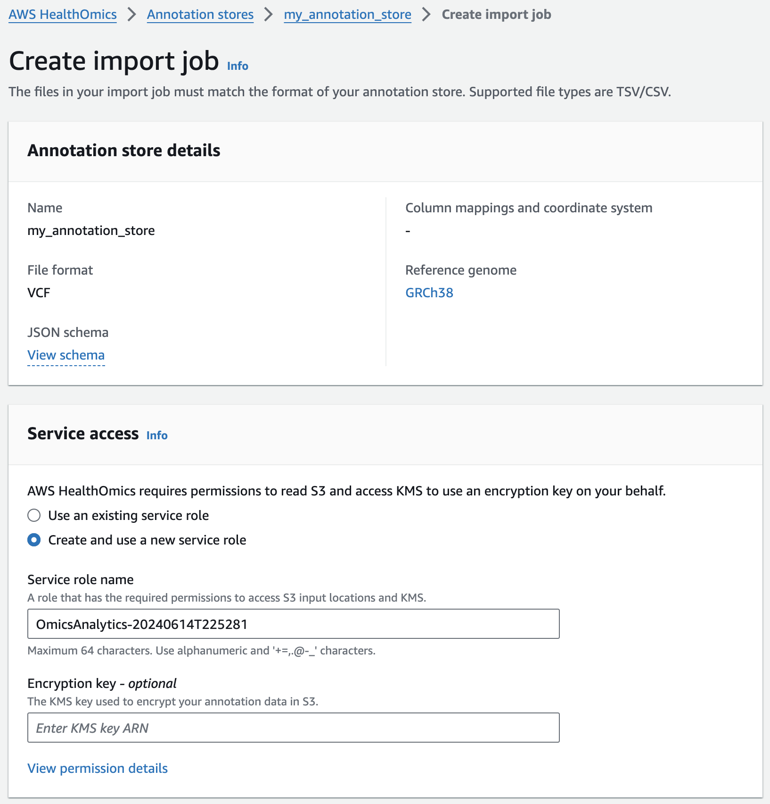](https://www.aws-ps-tech.kr/uploads/images/gallery/2024-06/screenshot-2024-06-14-at-10-53-49-pm.png)</div></div></div>[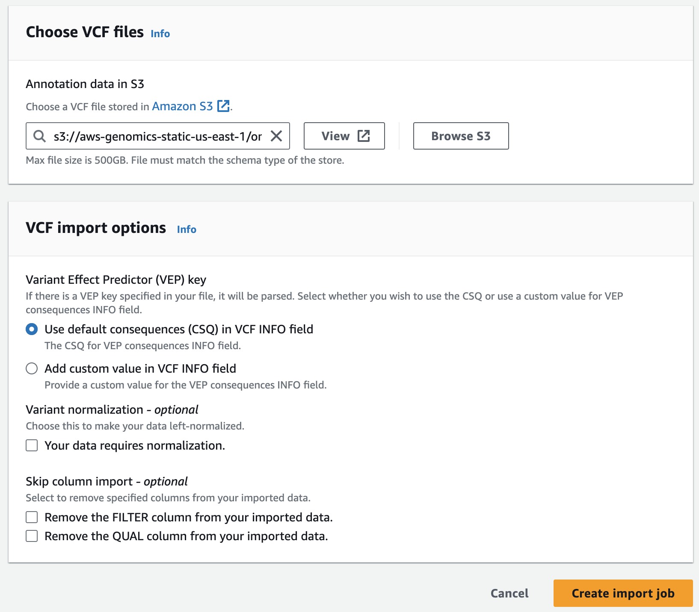](https://www.aws-ps-tech.kr/uploads/images/gallery/2024-06/screenshot-2024-06-14-at-10-54-04-pm.png)

## Querying variants and annotations  


이전 섹션에서 가져온 variant 및 annotation 데이터는 확장 가능한 쿼리가 가능한 열 형식의 저장소(**Apache Parquet**)로 변환됩니다. 데이터는 AWS 레이크 형성에서 공유 데이터베이스 및 테이블로 사용할 수 있습니다. 데이터를 쿼리하기 전에 Lake Formation 리소스 링크를 통해 액세스 권한을 제공하고 Athena 작업 그룹을 만드는 등 몇 가지 설정 단계를 수행해야 합니다.

- AWS Lake Formation을 사용하여 데이터 레이크 관리자 및 리소스 링크 생성하기
- Amazon Athena에서 작업 그룹을 생성하고 쿼리 편집기를 사용하여 변형 및 어노테이션 저장소에 대한 간단한 쿼리 실행하기
- AWS SDK for Pandas (aka AWS Wrangler)를 사용해 SageMaker 노트북에서 변형 및 어노테이션 저장소에 대해 쿼리 실행하기

[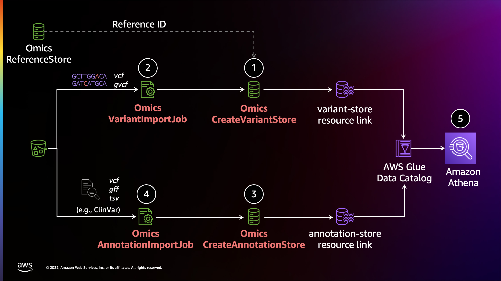](https://www.aws-ps-tech.kr/uploads/images/gallery/2024-06/omics-analytics.png)

### AWS Lake Formation 서비스 셋업  


Lake Formation Data Lake administrators are users and roles with permissions to create resource links (covered in the section below). In a real-world scenario, you would only need to setup data lake administrators once per account per region, or you would have IT support staff that serve this role.

For this workshop, you will need to verify that your current user role is a data lake administrator.

1\. Navigate to the [AWS Lake Formation console<span class="awsui_icon-wrapper_4c84z_eu8v7_485" style="white-space: nowrap;"> <span class="awsui_icon_4c84z_eu8v7_485" style="display: inline-block;"><span class="awsui_icon_h11ix_1q8e6_101 awsui_icon-flex-height_h11ix_1q8e6_109 awsui_size-medium_h11ix_1q8e6_172 awsui_variant-normal_h11ix_1q8e6_229 awsui_name-external_h11ix_1q8e6_263" style="display: inline-flex; position: relative; vertical-align: top; align-items: center; box-sizing: border-box; inline-size: var(--size-icon-medium-6sroof,16px); color: currentcolor; height: 24px;"><svg aria-hidden="true" focusable="false" viewbox="0 0 16 16" xmlns="http://www.w3.org/2000/svg"><path class="stroke-linecap-square" d="M10 2h4v4"></path><path d="m6 10 8-8"></path><path class="stroke-linejoin-round" d="M14 9.048V14H2V2h5"></path></svg></span></span></span>](https://console.aws.amazon.com/lakeformation/home).

2\. If you see the following screen, select **Get started**:

[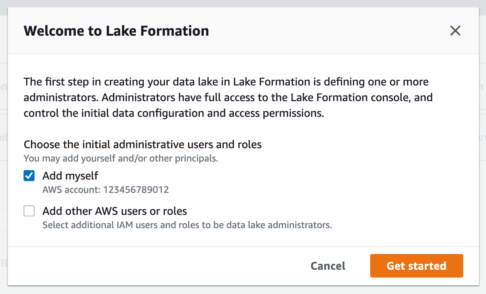](https://www.aws-ps-tech.kr/uploads/images/gallery/2024-06/lakeformation-get-started.png)

3\. From the navigation, go to **Administative roles and tasks**. Verify that `WSParticipantRole` is listed in the **Data lake administrators table**.

<span class="Image-module_imageContainer__3PIQv" style="display: inline-block; font-size: 0px; line-height: normal; transition: box-shadow 0.28s cubic-bezier(0.4, 0, 0.2, 1) 0s; box-shadow: rgba(0, 0, 0, 0.06) 0px 10px 20px; z-index: 1;"><span class="Image-module_imageWrapper__3HXhZ"><span aria-owns="rmiz-modal-1cb644293f45" data-rmiz="" style="position: relative;"><span data-rmiz-content="found" style="color: rgb(22, 25, 31); font-family: 'Amazon Ember', 'Helvetica Neue', Roboto, Arial, sans-serif; font-size: 0px; font-style: normal; font-variant-ligatures: normal; font-variant-caps: normal; font-weight: 400; letter-spacing: normal; orphans: 2; text-align: center; text-indent: 0px; text-transform: none; widows: 2; word-spacing: 0px; -webkit-text-stroke-width: 0px; white-space: normal; background-color: rgb(255, 255, 255); text-decoration-thickness: initial; text-decoration-style: initial; text-decoration-color: initial; visibility: visible;"></span></span></span></span>

4\. If `WSParticipantRole` is not listed as a data lake administrator, select **Choose administrators** and then choose `WSParticipantRole` under **IAM uesrs and roles**. Then select **Save** to add the role as a Data lake administrator.

#### **데이터베이스 생성**

Let's create a database that we'll use as a virtual container for our variants and annotations.

1\. AWS Lake Formation 콘솔에서 Databases 로 들어갑니다.

2\. Select **Create Database**.

3\. For **Name** provide **omicsdb**. <span class="Image-module_imageContainer__3PIQv" style="display: inline-block; font-size: 0px; line-height: normal; transition: box-shadow 0.28s cubic-bezier(0.4, 0, 0.2, 1) 0s;"><span class="Image-module_imageWrapper__3HXhZ"><span aria-owns="rmiz-modal-fe6fda8baf1c" data-rmiz="" style="position: relative;"><span data-rmiz-content="found" style="color: rgb(22, 25, 31); font-family: 'Amazon Ember', 'Helvetica Neue', Roboto, Arial, sans-serif; font-size: 0px; font-style: normal; font-variant-ligatures: normal; font-variant-caps: normal; font-weight: 400; letter-spacing: normal; orphans: 2; text-align: left; text-indent: 0px; text-transform: none; widows: 2; word-spacing: 0px; -webkit-text-stroke-width: 0px; white-space: normal; background-color: rgb(255, 255, 255); text-decoration-thickness: initial; text-decoration-style: initial; text-decoration-color: initial; visibility: visible;"></span></span></span></span>

4\. Accept all other defaults and finish with **Create database**.

#### **리소스 링크 생성**

Resource links connect resources shared by HealthOmics Analytics to new or existing databases in your AWS Glue Data Catalog. For this workshop, we'll create resource links within the **omicsdb** you created above that point to the Variant and Annotaiton stores you created in previous sections.

1\. AWS Lake Formation 콘솔에서 Tables 메뉴로 진입합니다.

2\. 앞에서 만들었던 변이 스토어 이름을 검색한 뒤 선택하고 새로운 리소스 링크를 만듭니다.

여기 예는 my\_variant\_store 입니다.

[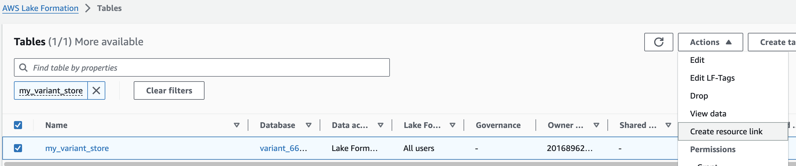](https://www.aws-ps-tech.kr/uploads/images/gallery/2024-06/screenshot-2024-06-14-at-11-02-20-pm.png)

For **Resource link name**, provide **omicsvariants**.

For **Database**, provide **omicsdb**.

[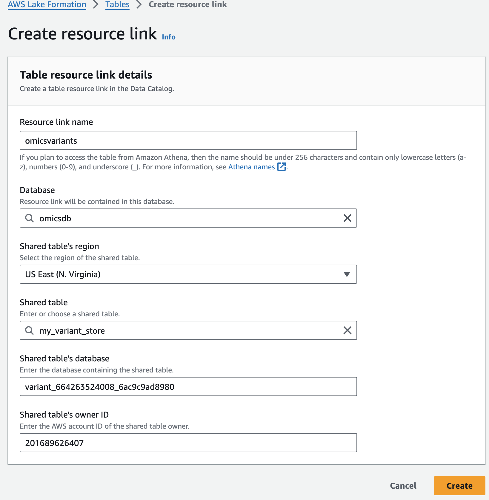](https://www.aws-ps-tech.kr/uploads/images/gallery/2024-06/screenshot-2024-06-14-at-11-04-32-pm.png)

주석 테이블에 대해 위의 단계를 반복하여 omicsdb 데이터베이스에 omicsannotations라는 리소스 링크를 만듭니다.

[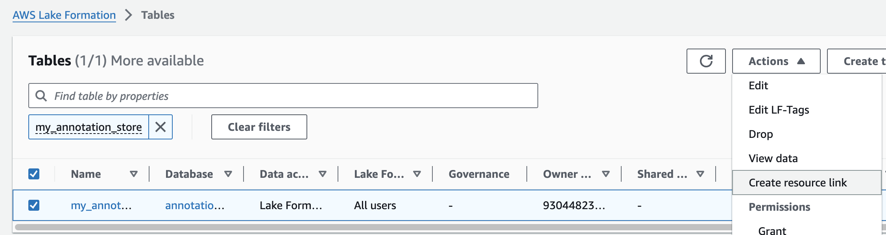](https://www.aws-ps-tech.kr/uploads/images/gallery/2024-06/screenshot-2024-06-14-at-11-05-25-pm.png)

[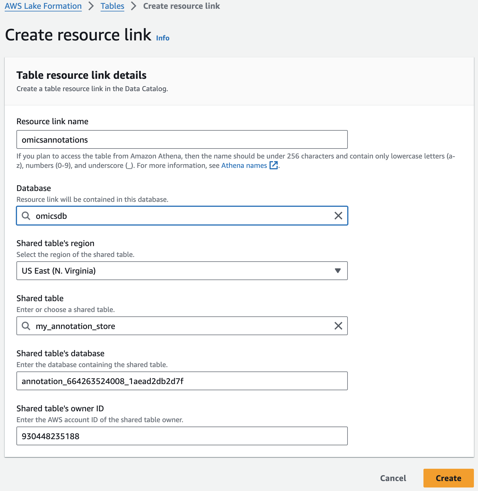](https://www.aws-ps-tech.kr/uploads/images/gallery/2024-06/screenshot-2024-06-14-at-11-05-45-pm.png)

### Amazon Athena 셋업

#### 쿼리 결과 디렉토리 지정

1. Open the [Amazon Athena console<span class="awsui_icon-wrapper_4c84z_eu8v7_485" style="white-space: nowrap;"> <span class="awsui_icon_4c84z_eu8v7_485" style="display: inline-block;"><span class="awsui_icon_h11ix_1q8e6_101 awsui_icon-flex-height_h11ix_1q8e6_109 awsui_size-medium_h11ix_1q8e6_172 awsui_variant-normal_h11ix_1q8e6_229 awsui_name-external_h11ix_1q8e6_263" style="display: inline-flex; position: relative; vertical-align: top; align-items: center; box-sizing: border-box; inline-size: var(--size-icon-medium-6sroof,16px); color: currentcolor; height: 24px;"><svg aria-hidden="true" focusable="false" viewbox="0 0 16 16" xmlns="http://www.w3.org/2000/svg"><path class="stroke-linecap-square" d="M10 2h4v4"></path><path d="m6 10 8-8"></path><path class="stroke-linejoin-round" d="M14 9.048V14H2V2h5"></path></svg></span></span></span>](https://console.aws.amazon.com/athena/home).
2. From the navigation, choose **Query editor**.
3. In the Query editor, choose the **Settings** tab and then choose **Manage**.
4. Click on **Browse S3**, select the bucket named **omics-output-{REGION}-{ACCOUNT-ID}**, and click **Choose**. This will fill the **Location of query result** with the S3 URI of the workshop output bucket. Append to this URI "/athena/" and select **Save**.

[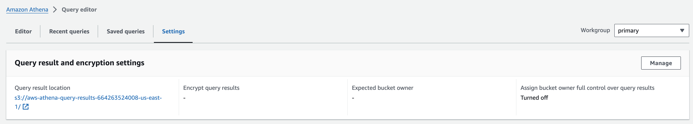](https://www.aws-ps-tech.kr/uploads/images/gallery/2024-06/screenshot-2024-06-14-at-11-07-15-pm.png)

#### 워킹 그룹 생성

1. Open the [Amazon Athena console<span class="awsui_icon-wrapper_4c84z_eu8v7_485" style="white-space: nowrap;"> <span class="awsui_icon_4c84z_eu8v7_485" style="display: inline-block;"><span class="awsui_icon_h11ix_1q8e6_101 awsui_icon-flex-height_h11ix_1q8e6_109 awsui_size-medium_h11ix_1q8e6_172 awsui_variant-normal_h11ix_1q8e6_229 awsui_name-external_h11ix_1q8e6_263" style="display: inline-flex; position: relative; vertical-align: top; align-items: center; box-sizing: border-box; inline-size: var(--size-icon-medium-6sroof,16px); color: currentcolor; height: 24px;"><svg aria-hidden="true" focusable="false" viewbox="0 0 16 16" xmlns="http://www.w3.org/2000/svg"><path class="stroke-linecap-square" d="M10 2h4v4"></path><path d="m6 10 8-8"></path><path class="stroke-linejoin-round" d="M14 9.048V14H2V2h5"></path></svg></span></span></span>](https://console.aws.amazon.com/athena/home).
2. From the navigation, choose **Workgroups**, and then **Create Workgroup**.
3. For **Workgroup name** provide **athena3**.
4. Select **Athena SQL** for the type of engine.
5. Under **Upgrade query engine** select **Manual**.
6. Under **Query Engine Version** select **Athena version 3**.
7. Finish with **Create workgroup**[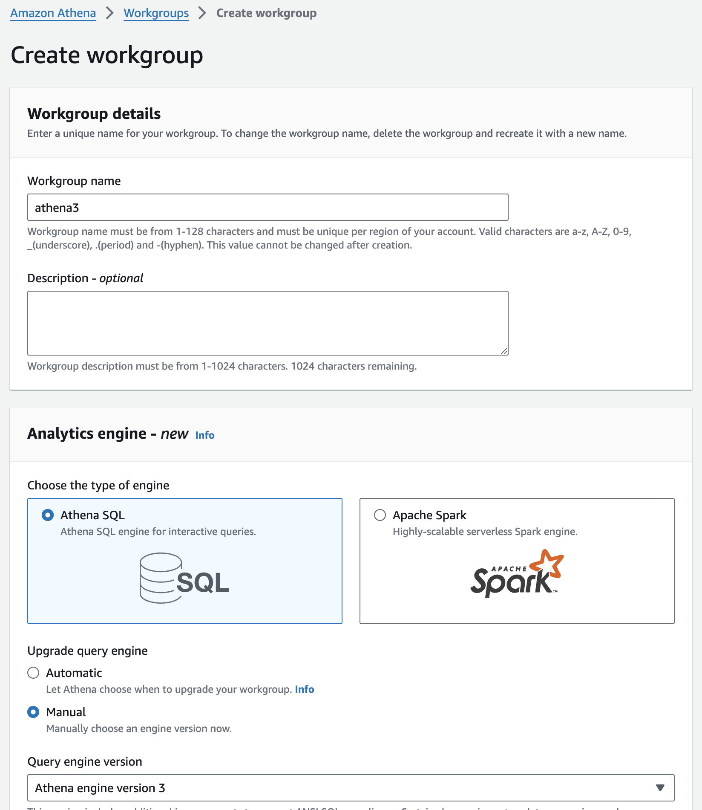](https://www.aws-ps-tech.kr/uploads/images/gallery/2024-06/screenshot-2024-06-14-at-11-07-56-pm.png)

### **Running queries - Amazon Athena** 

Now that we have Athena configured, let's run some queries.

1. Open the [Amazon Athena Query editor<span class="awsui_icon-wrapper_4c84z_eu8v7_485" style="white-space: nowrap;"> <span class="awsui_icon_4c84z_eu8v7_485" style="display: inline-block;"><span class="awsui_icon_h11ix_1q8e6_101 awsui_icon-flex-height_h11ix_1q8e6_109 awsui_size-medium_h11ix_1q8e6_172 awsui_variant-normal_h11ix_1q8e6_229 awsui_name-external_h11ix_1q8e6_263" style="display: inline-flex; position: relative; vertical-align: top; align-items: center; box-sizing: border-box; inline-size: var(--size-icon-medium-6sroof,16px); color: currentcolor; height: 24px;"><svg aria-hidden="true" focusable="false" viewbox="0 0 16 16" xmlns="http://www.w3.org/2000/svg"><path class="stroke-linecap-square" d="M10 2h4v4"></path><path d="m6 10 8-8"></path><path class="stroke-linejoin-round" d="M14 9.048V14H2V2h5"></path></svg></span></span></span>](https://console.aws.amazon.com/athena/home#/query-editor).
2. Under **Workgroup** select "athena3" (which you created above).
3. Make sure the **Data Source** is **AwsDataCatalog** and the **Database** is **omicsdb** (which you created previously). Both the **omicsvariants** and **omicsannotations** tables should be listed.

#### 간단한 쿼리

Preview the **omicsvariants** table, by running the following query:

```sql
SELECT * from omicsvariants limit 10
```

<div class="CodeBlock-module_codeBlock__2a1n0 CodeBlock-module_hasCopyAction__zdyx-" id="bkmrk--20" style="margin-bottom: 2rem; margin-top: 2rem; position: relative; color: rgb(22, 25, 31); font-family: 'Amazon Ember', 'Helvetica Neue', Roboto, Arial, sans-serif; font-size: 14px; font-style: normal; font-variant-ligatures: normal; font-variant-caps: normal; font-weight: 400; letter-spacing: normal; orphans: 2; text-align: start; text-indent: 0px; text-transform: none; widows: 2; word-spacing: 0px; -webkit-text-stroke-width: 0px; white-space: normal; background-color: rgb(255, 255, 255); text-decoration-thickness: initial; text-decoration-style: initial; text-decoration-color: initial;"><span class="awsui_root_xjuzf_191w6_832 CodeBlock-module_copyAction__vokS-" style="margin: calc((var(--space-scaled-l-08jb88, 20px) + 1px)*2/2 - 6px); position: absolute; right: 0px; top: 0px; border-collapse: initial; border-spacing: 0px; box-sizing: border-box; caption-side: top; cursor: auto; direction: inherit; empty-cells: show; font-family: var(--font-family-base-4om3hr,'Amazon Ember','Helvetica Neue',Roboto,Arial,sans-serif); font-size: var(--font-size-body-m-pa3mqb,14px); font-stretch: normal; font-style: normal; font-variant: normal; font-weight: 400; hyphens: none; letter-spacing: normal; line-height: var(--line-height-body-m-2zx78l,22px); list-style: outside none disc; tab-size: 8; text-align: start; text-indent: 0px; text-shadow: none; text-transform: none; visibility: visible; white-space: normal; word-spacing: normal; -webkit-font-smoothing: auto; color: inherit;"><span class="awsui_trigger_xjuzf_191w6_868" id="bkmrk--21" style="color: inherit; display: inline-block; max-inline-size: 100%; text-align: inherit;"><button aria-label="Copy content" class="CopyButton-module_styledButton__1Jq7M awsui_button_vjswe_1ivyw_105 awsui_variant-normal_vjswe_1ivyw_156 awsui_button-no-text_vjswe_1ivyw_1095" data-analytics-funnel-value="button:r46:" data-analytics-performance-mark="9-1718374093511-4132" data-testid="copy-button" style="font-family: var(--font-family-base-4om3hr,'Amazon Ember','Helvetica Neue',Roboto,Arial,sans-serif); font-size: var(--font-size-body-m-pa3mqb,14px); line-height: var(--line-height-body-m-2zx78l,22px); margin: 0px; overflow: visible; text-transform: none; appearance: button; padding-left: 0.7rem !important; padding-right: 0.7rem !important; opacity: 0.5; transition: all 0.4s cubic-bezier(0.25, 0.8, 0.25, 1) 0s; border-collapse: initial; border-spacing: 0px; box-sizing: border-box; caption-side: top; color: var(--color-text-button-normal-default-gpe171,#545b64); direction: inherit; empty-cells: show; font-stretch: normal; font-style: normal; font-variant: normal; hyphens: none; list-style: outside none disc; tab-size: 8; text-align: start; text-indent: 0px; text-shadow: none; visibility: visible; white-space: normal; word-spacing: normal; font-weight: var(--font-button-weight-s67y37,700); min-inline-size: 0px; word-break: break-word; -webkit-font-smoothing: var(--font-smoothing-webkit-8fiijr,auto); border-block: var(--border-field-width-yoy972,1px) solid; border-end-end-radius: var(--border-radius-button-8zlwjs,2px); border-end-start-radius: var(--border-radius-button-8zlwjs,2px); border-inline: var(--border-field-width-yoy972,1px) solid; border-start-end-radius: var(--border-radius-button-8zlwjs,2px); border-start-start-radius: var(--border-radius-button-8zlwjs,2px); cursor: pointer; display: inline-block; letter-spacing: var(--font-button-letter-spacing-kukfsk,.25px); padding-block: var(--space-scaled-xxs-t7ij38,4px); padding-inline-start: var(--space-button-icon-only-horizontal-xuxfmj,16px); padding-inline-end: var(--space-button-icon-only-horizontal-xuxfmj,16px); text-decoration: none; background: var(--color-background-button-normal-default-k8i6b0,#fff); border-color: var(--color-border-button-normal-default-bqhrgd,#545b64); position: relative;" title="Copy content" type="submit"><span class="awsui_icon_vjswe_1ivyw_1121 awsui_icon-left_vjswe_1ivyw_1121 awsui_icon_h11ix_1q8e6_101 awsui_size-normal-mapped-height_h11ix_1q8e6_157 awsui_size-normal_h11ix_1q8e6_153 awsui_variant-normal_h11ix_1q8e6_229" style="display: inline-block; position: relative; vertical-align: top; box-sizing: border-box; inline-size: var(--size-icon-normal-wflv4k,16px); block-size: var(--line-height-body-m-2zx78l,22px); padding-block: calc((var(--line-height-body-m-2zx78l, 22px) - var(--size-icon-normal-wflv4k, 16px))/2); padding-inline: 0px; color: currentcolor; inset-inline: 0px; margin-inline: auto;"><svg aria-hidden="true" focusable="false" viewbox="0 0 16 16" xmlns="http://www.w3.org/2000/svg"><path class="stroke-linejoin-round" d="M2 5h9v9H2z"></path><path class="stroke-linejoin-round" d="M5 5V2h9v9h-3"></path></svg></span></button></span></span></div>1. Copy the above query and paste it into the **Query Editor** under the **Query 1** tab.
2. Select **Run** to execute the query.

Results should return in a few seconds and look like:

[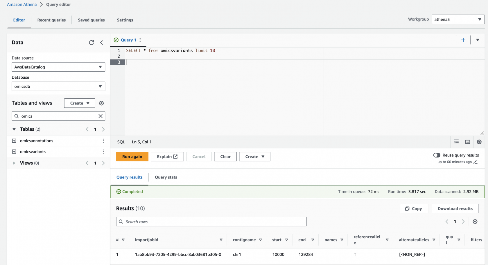](https://www.aws-ps-tech.kr/uploads/images/gallery/2024-06/screenshot-2024-06-14-at-11-09-08-pm.png)

#### 복잡한 쿼리

For a more complex query, you can run the following which displays variants with a 'Likely\_pathogenic' clinical significance by joining ClinVar annotations to variants.

1. Select the **+** on the top right to create a new query tab called **Query 2**.
2. Copy and paste the SQL below and select **Run**.

```sql
SELECT variants.sampleid,
  variants.contigname,
  variants.start,
  variants.referenceallele,
  variants.alternatealleles,
  variants.attributes AS variant_attributes,
  clinvar.referenceallele,
  clinvar.alternatealleles,
  clinvar.attributes AS clinvar_attributes 
FROM omicsvariants as variants 
INNER JOIN omicsannotations as clinvar ON 
  variants.contigname=CONCAT('chr',clinvar.contigname) 
  AND variants.start=clinvar.start 
  AND variants."end"=clinvar."end" 
  WHERE clinvar.attributes['CLNSIG']='Benign'

```

[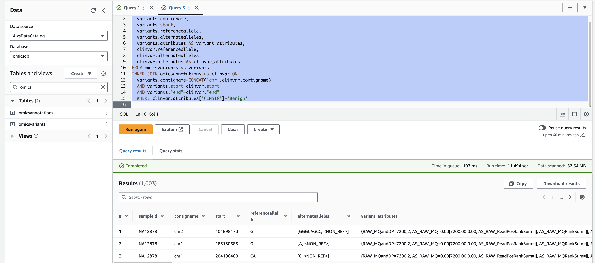](https://www.aws-ps-tech.kr/uploads/images/gallery/2024-06/screenshot-2024-06-14-at-11-27-02-pm.png)

또다른 예 (본인의 상황에 맞게 수정해야할 것입니다.)

```sql
SELECT variants.sampleid,
  variants.contigname,
  variants.start,
  variants.referenceallele,
  variants.alternatealleles,
  variants.attributes AS variant_attributes,
  clinvar.attributes AS clinvar_attributes 
FROM omicsvariants as variants 
INNER JOIN omicsannotations as clinvar ON 
  variants.contigname=CONCAT('chr',clinvar.contigname) 
  AND variants.start=clinvar.start 
  AND variants."end"=clinvar."end" 
  AND variants.referenceallele=clinvar.referenceallele 
  AND variants.alternatealleles=clinvar.alternatealleles 
WHERE clinvar.attributes['CLNSIG']='Likely_pathogenic'


```


## **참고** 

- [https://catalog.workshops.aws/amazon-omics-end-to-end/en-US/010-xp-console/300-omics-analytics](https://catalog.workshops.aws/amazon-omics-end-to-end/en-US/010-xp-console/300-omics-analytics)
- [https://github.com/aws-samples/amazon-omics-tutorials/blob/main/notebooks/200-omics\_analytics.ipynb](https://github.com/aws-samples/amazon-omics-tutorials/blob/main/notebooks/200-omics_analytics.ipynb)

- https://github.com/vcflib/vcflib/tree/master
- [https://github.com/Ensembl/ensembl-vep](https://github.com/Ensembl/ensembl-vep)
- echtvar 
    - [https://academic.oup.com/nar/article/51/1/e3/6775383](https://academic.oup.com/nar/article/51/1/e3/6775383)
    - [https://github.com/brentp/echtvar/wiki/why](https://github.com/brentp/echtvar/wiki/why)
- https://github.com/brentp/vcfanno

<div id="bkmrk--27"></div><div id="bkmrk--28"></div>