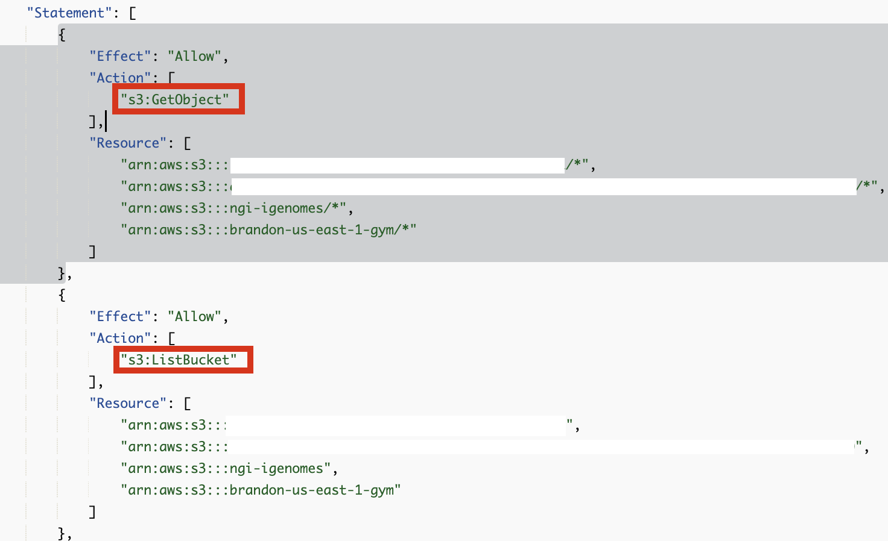
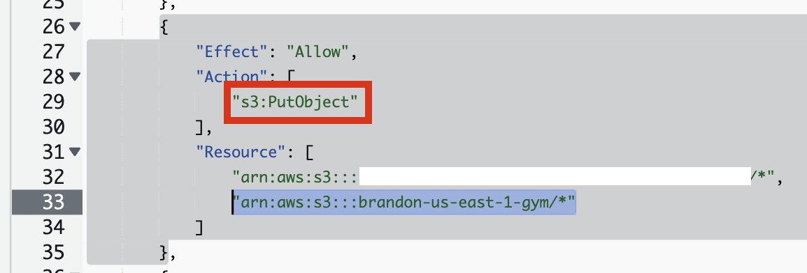

참고 문서: https://catalog.us-east-1.prod.workshops.aws/workshops/76d4a4ff-fe6f-436a-a1c2-f7ce44bc5d17/en-US

[이 문서를 참고](https://catalog.us-east-1.prod.workshops.aws/workshops/76d4a4ff-fe6f-436a-a1c2-f7ce44bc5d17/en-US/introduction/setting-up-environment)하여 환경을 준비합니다. 여기서는 이 과정은 생략합니다.

## 프로젝트 셋업

#### nf-core repository로부터 워크플로우 복제

```md
cd ~
git clone https://github.com/nf-core/rnaseq --branch 3.14.0 --single-branch
```

#### Docker Image Manifest의 생성

```md
cp  ~/amazon-ecr-helper-for-aws-healthomics/lib/lambda/parse-image-uri/public_registry_properties.json namespace.config
```

`inspect_nf.py` 를 실행합니다.

```
python3 amazon-omics-tutorials/utils/scripts/inspect_nf.py \
--output-manifest-file rnaseq_3140_docker_images_manifest.json \
 -n namespace.config \
 --output-config-file omics.config \
 --region <region> \
 ~/rnaseq/

```

생성되는 두 개의 출력은 `rnaseq_3140_docker_images_manifest.json` 과 `omics.config`입니다.

`rnaseq_3140_docker_images_manifest.json` 파일은 다음과 같은 모습이어야 합니다:

```json
{
    "manifest": [
        "quay.io/biocontainers/bbmap:39.01--h5c4e2a8_0",
        "quay.io/biocontainers/bedtools:2.30.0--hc088bd4_0",
        "quay.io/biocontainers/bioconductor-dupradar:1.28.0--r42hdfd78af_0",
        "quay.io/biocontainers/bioconductor-summarizedexperiment:1.24.0--r41hdfd78af_0",
        "quay.io/biocontainers/bioconductor-tximeta:1.12.0--r41hdfd78af_0",
        "quay.io/biocontainers/fastp:0.23.4--h5f740d0_0",
        "quay.io/biocontainers/fastqc:0.12.1--hdfd78af_0",
        "quay.io/biocontainers/fq:0.9.1--h9ee0642_0",
        "quay.io/biocontainers/gffread:0.12.1--h8b12597_0",
        "quay.io/biocontainers/hisat2:2.2.1--h1b792b2_3",
        "quay.io/biocontainers/kallisto:0.48.0--h15996b6_2",
        "quay.io/biocontainers/mulled-v2-1fa26d1ce03c295fe2fdcf85831a92fbcbd7e8c2:1df389393721fc66f3fd8778ad938ac711951107-0",
        "quay.io/biocontainers/mulled-v2-1fa26d1ce03c295fe2fdcf85831a92fbcbd7e8c2:59cdd445419f14abac76b31dd0d71217994cbcc9-0",
        "quay.io/biocontainers/mulled-v2-8849acf39a43cdd6c839a369a74c0adc823e2f91:ab110436faf952a33575c64dd74615a84011450b-0",
        "quay.io/biocontainers/mulled-v2-a97e90b3b802d1da3d6958e0867610c718cb5eb1:2cdf6bf1e92acbeb9b2834b1c58754167173a410-0",
        "quay.io/biocontainers/mulled-v2-cf0123ef83b3c38c13e3b0696a3f285d3f20f15b:64aad4a4e144878400649e71f42105311be7ed87-0",
        "quay.io/biocontainers/multiqc:1.19--pyhdfd78af_0",
        "quay.io/biocontainers/perl:5.26.2",
        "quay.io/biocontainers/picard:3.0.0--hdfd78af_1",
        "quay.io/biocontainers/preseq:3.1.2--h445547b_2",
        "quay.io/biocontainers/python:3.9--1",
        "quay.io/biocontainers/qualimap:2.3--hdfd78af_0",
        "quay.io/biocontainers/rseqc:5.0.3--py39hf95cd2a_0",
        "quay.io/biocontainers/salmon:1.10.1--h7e5ed60_0",
        "quay.io/biocontainers/samtools:1.16.1--h6899075_1",
        "quay.io/biocontainers/samtools:1.17--h00cdaf9_0",
        "quay.io/biocontainers/sortmerna:4.3.4--h9ee0642_0",
        "quay.io/biocontainers/stringtie:2.2.1--hecb563c_2",
        "quay.io/biocontainers/subread:2.0.1--hed695b0_0",
        "quay.io/biocontainers/trim-galore:0.6.7--hdfd78af_0",
        "quay.io/biocontainers/ucsc-bedclip:377--h0b8a92a_2",
        "quay.io/biocontainers/ucsc-bedgraphtobigwig:445--h954228d_0",
        "quay.io/biocontainers/umi_tools:1.1.4--py38hbff2b2d_1",
        "quay.io/nf-core/ubuntu:20.04"
    ]
}
```

#### 컨테이너 사설화

```
aws stepfunctions start-execution \
--state-machine-arn arn:aws:states:<region>:<your-account-id>:stateMachine:omx-container-puller \
--input file://rnaseq_3140_docker_images_manifest.json

```

#### nf-core project 코드 업데이트

```
mv omics.config rnaseq/conf

```

```
echo "includeConfig 'conf/omics.config'" >> rnaseq/nextflow.config 

```


## AWS HealthOmics 워크플로우 만들기

#### 단계1. AWS HealthOmics 파라미터 파일

`paramter-descrption.json`을 만들어 아래와 같이 저장합니다.

<p class="callout warning">새 워크플로마다 다른 매개변수를 사용할 수 있습니다. 위의 매개변수 템플릿 파일은 SCRNA-Seq nf-core 워크플로에만 해당됩니다. 새 파라미터 파일을 만들 때는 이 워크플로우에 대한 파라미터를 확인해야 합니다.  
  
NF-Core 워크플로우에 대한 파라미터를 찾으려면 설명서를 참조하세요(예: RNA-Seq 파이프라인 파라미터는 [여기](https://nf-co.re/rnaseq/3.14.0/parameters)).  
</p>

```
{
    "input": {
        "description": "S3 URI to samplesheet.csv. Rows therein point to S3 URIs for fastq data",
        "optional": false
    },
    "genome": {
        "description": "Name of iGenomes reference. - e.g. GRCh38",
        "optional": true
    },
    "igenomes_base": {
        "description": "URI base for iGenomes references. (e.g. s3://ngi-igenomes/igenomes/)",
        "optional": true
    },
    "fasta": {
        "description": "Path to FASTA genome file. This parameter is mandatory if --genome is not specified. If you don't have the appropriate alignment index available this will be generated for you automatically.",
        "optional": true
    },
    "gtf": {
        "description": "Path to GTF annotation file. This parameter is mandatory if --genome is not specified.",
        "optional": true
    },
    "gff": {
        "description": "Path to GFF3 annotation file. This parameter must be specified if `--genome` or `--gtf` are not specified.",
        "optional": true
    },
    "pseudo_aligner": {
        "description": "Specifies the pseudo aligner to use - available options are 'salmon'. Runs in addition to `--aligner`",
        "optional": true   
    },
    "transcript_fasta": {
        "description": "Path to FASTA transcriptome file.",
        "optional": true   
    },
    "additional_fasta": {
        "description": "FASTA file to concatenate to genome FASTA file e.g. containing spike-in sequences.",
        "optional": true   
    },
    "bbsplit_fasta_list": {
        "description": "Path to comma-separated file containing a list of reference genomes to filter reads against with BBSplit. You have to also explicitly set `--skip_bbsplit` false if you want to use BBSplit.",
        "optional": true   
    },
    "hisat2_index": {
        "description": "Path to directory or tar.gz archive for pre-built HISAT2 index.",
        "optional": true   
    },
    "salmon_index": {
        "description": "Path to directory or tar.gz archive for pre-built Salmon index.",
        "optional": true   
    },
    "rsem_index": {
        "description": "Path to directory or tar.gz archive for pre-built RSEM index",
        "optional": true   
    },
    "skip_bbsplit": {
        "description": "Skip BBSplit for removal of non-reference genome reads.",
        "optional": true   
    },
    "pseudo_aligner": {
        "description": "Specifies the pseudo aligner to use - available options are 'salmon'. Runs in addition to '--aligner'.",
        "optional": true   
    },
    "umitools_bc_pattern": {
        "description": "The UMI barcode pattern to use e.g. 'NNNNNN' indicates that the first 6 nucleotides of the read are from the UMI.",
        "optional": true   
    }
}
```

#### 단계2. 워크플로우 스테이징

```
zip -r rnaseq-workflow.zip rnaseq
```

```
aws s3 cp rnaseq-workflow.zip s3://<yourbucket>/workshop/rnaseq-workflow.zip

aws omics create-workflow \
  --name rnaseq-v3140 \
  --definition-uri s3://<yourbucket>//workshop/rnaseq-workflow.zip \
  --parameter-template file://parameter-description.json \
  --engine NEXTFLOW
```

#### 단계3. 워크플로우 생성 확인

```
aws omics list-workflows --name rnaseq-v3140
```

## 워크플로우 테스트하기

#### 입력파일 준비

##### samplesheet\_full

아래의 입력 파일들은 [여기](https://github.com/nf-core/rnaseq/blob/master/conf/test_full.config)를 참고하여 준비할 수 있습니다.

**레퍼런스 데이터 다운로드**

nf-core/rnaseq repository에 있는 [`igenomes.config`](https://github.com/nf-core/rnaseq/blob/master/conf/igenomes.config) 를 참고하여 필요한 GRCh37 레퍼런스 관련 파일들을 모두 healthomics의 사용 리전에 만든 버킷으로 준비합니다.

```
aws s3 sync s3://ngi-igenomes/igenomes/Homo_sapiens/ s3://{mybucketname}/workshop/igenomes/Homo_sapiens/
```

**샘플시트 예제 템플릿 다운로드**

```
wget https://raw.githubusercontent.com/nf-core/test-datasets/rnaseq/samplesheet/v3.10/samplesheet_full.csv
```

`parameter-description.json`에 사용된 것과 동일한 키를 사용하여 `input_rnaseq.json` 파일을 새로 만듭니다. 값은 워크플로에서 허용되는 실제 S3 경로 또는 문자열이 됩니다.

`samplesheet_full.csv` 파일을 새로 작성합니다. 이때 HealthOmics와 같은 리전에 있는 s3 bucket에 FASTQ 입력파일을 준비합니다. (aws s3 sync 나 aws s3 cp 와 같은 명령어 활용 가능)

예)

```
aws s3 sync s3://ngi-igenomes/test-data/rnaseq/ s3://{mybucketname}/workshop/
```

`samplesheet_full.csv` 예시

```
sample,fastq_1,fastq_2,strandedness
GM12878_REP1,s3://{mybucketname}/test-data/rnaseq/SRX1603629_T1_1.fastq.gz,s3://{mybucketname}/test-data/rnaseq/SRX1603629_T1_2.fastq.gz,reverse
GM12878_REP2,s3://{mybucketname}/test-data/rnaseq/SRX1603630_T1_1.fastq.gz,s3://{mybucketname}/test-data/rnaseq/SRX1603630_T1_2.fastq.gz,reverse
K562_REP1,s3://{mybucketname}/test-data/rnaseq/SRX1603392_T1_1.fastq.gz,s3://{mybucketname}/test-data/rnaseq/SRX1603392_T1_2.fastq.gz,reverse
K562_REP2,s3://{mybucketname}/test-data/rnaseq/SRX1603393_T1_1.fastq.gz,s3://{mybucketname}/test-data/rnaseq/SRX1603393_T1_2.fastq.gz,reverse
MCF7_REP1,s3://{mybucketname}/test-data/rnaseq/SRX2370490_T1_1.fastq.gz,s3://{mybucketname}/test-data/rnaseq/SRX2370490_T1_2.fastq.gz,reverse
MCF7_REP2,s3://{mybucketname}/test-data/rnaseq/SRX2370491_T1_1.fastq.gz,s3://{mybucketname}/test-data/rnaseq/SRX2370491_T1_2.fastq.gz,reverse
H1_REP1,s3://{mybucketname}/test-data/rnaseq/SRX2370468_T1_1.fastq.gz,s3://{mybucketname}/test-data/rnaseq/SRX2370468_T1_2.fastq.gz,reverse
H1_REP2,s3://{mybucketname}/test-data/rnaseq/SRX2370469_T1_1.fastq.gz,s3://{mybucketname}/test-data/rnaseq/SRX2370469_T1_2.fastq.gz,revers
```

**편집한 samplesheet 를 버킷으로 복사**

```
aws s3 mv samplesheet_full.csv s3://{mybucket}/workshop/
```

**`input_rnaseq_full.json`**

```
{
    "input": "s3://{mybucket}/workshop/samplesheet_full.csv",
    "genome": "GRCh37",
    "igenomes_base": "s3://{mybucket}/workshop/igenomes/",
    "pseudo_aligner": "salmon"
}
```

##### samplesheet\_test

아래의 입력 파일들은 [여기](https://github.com/nf-core/rnaseq/blob/master/conf/test.config)를 참고하여 준비할 수 있습니다.

앞의 samplesheet\_full.csv 와 달리 본 샘플시트 런은 미니 샘플이기때문에 관련 레퍼런스 및 파라미터 입력을 모두 준비해야 합니다.

```
wget https://raw.githubusercontent.com/nf-core/test-datasets/7f1614baeb0ddf66e60be78c3d9fa55440465ac8/reference/genome.fasta
wget https://raw.githubusercontent.com/nf-core/test-datasets/7f1614baeb0ddf66e60be78c3d9fa55440465ac8/reference/genes_with_empty_tid.gtf.gz
wget https://raw.githubusercontent.com/nf-core/test-datasets/7f1614baeb0ddf66e60be78c3d9fa55440465ac8/reference/genes.gff.gz
wget https://raw.githubusercontent.com/nf-core/test-datasets/7f1614baeb0ddf66e60be78c3d9fa55440465ac8/reference/transcriptome.fasta
wget https://raw.githubusercontent.com/nf-core/test-datasets/7f1614baeb0ddf66e60be78c3d9fa55440465ac8/reference/gfp.fa.gz
wget https://raw.githubusercontent.com/nf-core/test-datasets/7f1614baeb0ddf66e60be78c3d9fa55440465ac8/reference/bbsplit_fasta_list.txt
wget https://raw.githubusercontent.com/nf-core/test-datasets/7f1614baeb0ddf66e60be78c3d9fa55440465ac8/reference/hisat2.tar.gz
wget https://raw.githubusercontent.com/nf-core/test-datasets/7f1614baeb0ddf66e60be78c3d9fa55440465ac8/reference/salmon.tar.gz
wget https://raw.githubusercontent.com/nf-core/test-datasets/7f1614baeb0ddf66e60be78c3d9fa55440465ac8/reference/rsem.tar.gz
```

다운로드 받은 파일들을 s3 bucket 으로 업로드

```
aws s3 sync . s3://{mybucket}/workshop/reference/
```

**샘플시트 예제 템플릿 다운로드**

```
wget https://raw.githubusercontent.com/nf-core/test-datasets/rnaseq/samplesheet/v3.10/samplesheet_test.csv
```

`samplesheet_test.csv` 예시

```
sample,fastq_1,fastq_2,strandedness
WT_REP1,s3://{mybucketname}/workshop/test_fastq/SRR6357070_1.fastq.gz,s3://{mybucketname}/workshop/test_fastq/SRR6357070_2.fastq.gz,auto
WT_REP1,s3://{mybucketname}/workshop/test_fastq/SRR6357071_1.fastq.gz,s3://{mybucketname}/workshop/test_fastq/SRR6357071_2.fastq.gz,auto
WT_REP2,s3://{mybucketname}/workshop/test_fastq/SRR6357072_1.fastq.gz,s3://{mybucketname}/workshop/test_fastq/SRR6357072_2.fastq.gz,reverse
RAP1_UNINDUCED_REP1,s3://{mybucketname}/workshop/test_fastq/SRR6357073_1.fastq.gz,,reverse
RAP1_UNINDUCED_REP2,s3://{mybucketname}/workshop/test_fastq/SRR6357074_1.fastq.gz,,reverse
RAP1_UNINDUCED_REP2,s3://{mybucketname}/workshop/test_fastq/SRR6357075_1.fastq.gz,,reverse
RAP1_IAA_30M_REP1,s3://{mybucketname}/workshop/test_fastq/SRR6357076_1.fastq.gz,s3://{mybucketname}/workshop/test_fastq/SRR6357076_2.fastq.gz,reverse
```

**편집한 samplesheet 를 버킷으로 복사**

```
aws s3 mv samplesheet_test.csv s3://{mybucket}/workshop/
```

`input_rnaseq_test.json`

```json
{
    "input": "s3://{mybucketname}/workshop/samplesheet_test.csv",
    "fasta": "s3://{mybucketname}/workshop/reference/genome.fasta",
    "gtf": "s3://{mybucketname}/workshop/reference/genes_with_empty_tid.gtf.gz",
    "gff": "s3://{mybucketname}/workshop/reference/genes.gff.gz",
    "transcript_fasta": "s3://{mybucketname}/workshop/reference/transcriptome.fasta",
    "additional_fasta": "s3://{mybucketname}/workshop/reference/gfp.fa.gz",
    "bbsplit_fasta_list": "s3://{mybucketname}/workshop/reference/bbsplit_fasta_list.txt",
    "hisat2_index": "s3://{mybucketname}/workshop/reference/hisat2.tar.gz",
    "salmon_index": "s3://{mybucketname}/workshop/reference/salmon.tar.gz",
    "rsem_index": "s3://{mybucketname}/workshop/reference/rsem.tar.gz",
    "skip_bbsplit"        : false,
    "pseudo_aligner"      : "salmon",
    "umitools_bc_pattern" : "NNNN"
}
```

상기 bbsplit\_fasta\_list.txt 파일 내용도 s3 bucket을 지정합니다.

s3://{mybucket}/workshop/reference/bbsplit\_fasta\_list.txt 의 내용

```
sarscov2,s3://{mybucket}/workshop/reference/GCA_009858895.3_ASM985889v3_genomic.200409.fna
human,s3://{mybucket}/workshop/reference/chr22_23800000-23980000.fa
```

##### S3 policy 관련 참고사항

<p class="callout warning">위의 입력데이터로 필요한 S3 버킷에 대해 아래 Policy 준비에 반영되어야 합니다.  
마찬가지로 결과 데이터를 작성할 버킷에 대한 권한도 Policy 준비에 반영해주세요.  
</p>

s3:GetObject, s3:ListBucket 권한

[](https://www.aws-ps-tech.kr/uploads/images/gallery/2024-08/image.png)

s3:PutObject 권한

[](https://www.aws-ps-tech.kr/uploads/images/gallery/2024-08/eA3image.png)

#### Policy 준비

##### Prepare IAM service role to run AWS HealthOmics workflow

`omics_workflow_policy.json` 만들기

```
# 환경 변수 설정
export yourbucket="your-bucket-name"
export your_account_id="your-account-id"
export region="your-region"

# JSON 내용 생성 및 파일로 저장
cat << EOF > omics_workflow_policy.json
{
    "Version": "2012-10-17",
    "Statement": [
        {
            "Effect": "Allow",
            "Action": [
                "s3:GetObject"
            ],
            "Resource": [
                "arn:aws:s3:::${yourbucket}/*"
            ]
        },
        {
            "Effect": "Allow",
            "Action": [
                "s3:ListBucket"
            ],
            "Resource": [
                "arn:aws:s3:::${yourbucket}"
            ]
        },
        {
            "Effect": "Allow",
            "Action": [
                "s3:PutObject"
            ],
            "Resource": [
                "arn:aws:s3:::${yourbucket}/*"
            ]
        },
        {
            "Effect": "Allow",
            "Action": [
                "logs:DescribeLogStreams",
                "logs:CreateLogStream",
                "logs:PutLogEvents"
            ],
            "Resource": [
                "arn:aws:logs:${region}:${your_account_id}:log-group:/aws/omics/WorkflowLog:log-stream:*"
            ]
        },
        {
            "Effect": "Allow",
            "Action": [
                "logs:CreateLogGroup"
            ],
            "Resource": [
                "arn:aws:logs:${region}:${your_account_id}:log-group:/aws/omics/WorkflowLog:*"
            ]
        },
        {
            "Effect": "Allow",
            "Action": [
                "ecr:BatchGetImage",
                "ecr:GetDownloadUrlForLayer",
                "ecr:BatchCheckLayerAvailability"
            ],
            "Resource": [
                "arn:aws:ecr:${region}:${your_account_id}:repository/*"
            ]
        }
    ]
}
EOF

echo "omics_workflow_policy.json 파일이 생성되었습니다."
```

trust\_policy.json 만들기

```
# 환경 변수 설정
export your_account_id="your-account-id"
export region="your-region"  # 예: us-east-1

# JSON 내용 생성 및 파일로 저장
cat << EOF > trust_policy.json
{
    "Version": "2012-10-17",
    "Statement": [
        {
            "Effect": "Allow",
            "Principal": {
                "Service": "omics.amazonaws.com"
            },
            "Action": "sts:AssumeRole",
            "Condition": {
                "StringEquals": {
                    "aws:SourceAccount": "${your_account_id}"
                },
                "ArnLike": {
                    "aws:SourceArn": "arn:aws:omics:${region}:${your_account_id}:run/*"
                }
            }
        }
    ]
}
EOF

echo "trust_policy.json 파일이 생성되었습니다."
```

#### IAM Role 생성

```
aws iam create-role --role-name omics_start_run_role_v1 --assume-role-policy-document file://trust_policy.json
```

Policy document 생성

```
aws iam put-role-policy --role-name omics_start_run_role_v1 --policy-name OmicsWorkflowV1 --policy-document file://omics_workflow_policy.json
```

#### 워크플로우 실행

`--storage-type` 파라미터를 사용하지 않으면 기본값은 STATIC 입니다. ([참고](https://awscli.amazonaws.com/v2/documentation/api/latest/reference/omics/start-run.html))

동적 실행 스토리지 (DYNAMIC)는 정적 실행 스토리지 (STATIC) 보다 프로비저닝/디프로비저닝 시간이 더 빠릅니다. 빠른 설정은 자주 실행되는 소규모 워크플로우에 유리하며 개발/테스트 주기 동안에도 이점이 있습니다. 따라서 처음에 마이그레이션 하면서 테스트할 경우 이 옵션을 DYNAMIC으로 설정한 뒤 스토리지 사용량에 따라 STATIC으로 설정 하는 것을 추천드립니다.

```
aws omics start-run \
  --name rnaseq_workshop_run_1 \
  --role-arn arn:aws:iam::<your-account-id>:role/omics_start_run_role_v1 \
  --workflow-id <your-workflow-id> \
  --parameters file://input_rnaseq.json \
  --output-uri s3://<yourbucket>/output/ \
  --storage-type  DYNAMIC

```

```
aws omics start-run \
  --name rnaseq_workshop_run_1 \
  --role-arn arn:aws:iam::<your-account-id>:role/omics_start_run_role_v1 \
  --workflow-id <your-workflow-id> \
  --parameters file://input_rnaseq.json \
  --output-uri s3://<yourbucket>/output/
  --storage-type STATIC \
  --storage-capacity 2048
```

test 샘플로 할 경우 예시

```
aws omics start-run \
  --name rnaseq_workshop_test_run_1 \
  --role-arn arn:aws:iam::<your-account-id>:role/omics_start_run_role_v1 \
  --workflow-id <your-workflow-id> \
  --parameters file://input_rnaseq_test.json \
  --output-uri s3://<yourbucket>/output/

```

참고문서

\- https://github.com/aws-samples/amazon-omics-tutorials/tree/main/example-workflows/nf-core/workflows/rnaseq