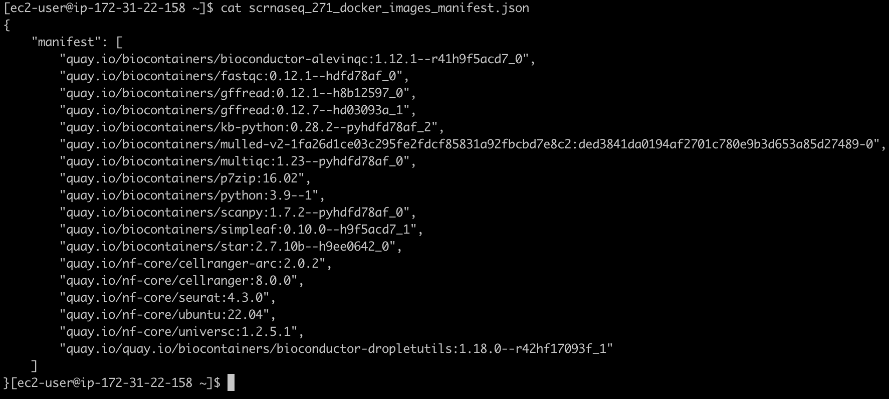
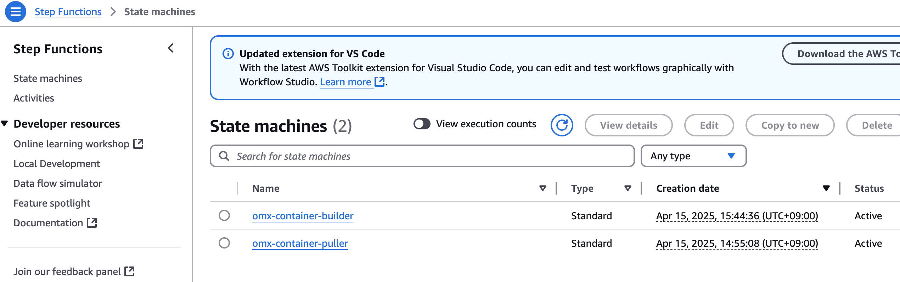
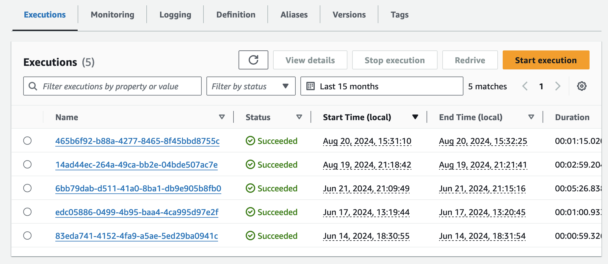

참고문서: https://catalog.us-east-1.prod.workshops.aws/workshops/76d4a4ff-fe6f-436a-a1c2-f7ce44bc5d17/en-US

[이 문서를 참고](https://catalog.us-east-1.prod.workshops.aws/workshops/76d4a4ff-fe6f-436a-a1c2-f7ce44bc5d17/en-US/introduction/setting-up-environment)하여 환경을 준비합니다. 여기서는 이 과정은 생략합니다.

2025년 6월 6일기준 scrnaseq v4.0.0 도 지원합니다. ([nextflow의 플러그인인 nf-scheam 지원 참고](https://docs.aws.amazon.com/omics/latest/dev/workflow-languages.html#workflow-languages-nextflow))

다만 현재 아래 내용은 2.7.1 기준으로 작성되었습니다.

## 프로젝트 셋업

**버킷 생성 및 Bash 환경변수 선언**

```bash
cd ~

export yourbucket="your-bucket-name"
export your_account_id="your-account-id"
export region="your-region"
export workflow_name="your-workflow-name"
export omics_role_name="your_omics_rolename"

# if not exist the bucket, let's create.
#aws s3 mb $yourbucket

```

#### nf-core repository로부터 워크플로우 복제

```md
cd ~
git clone https://github.com/nf-core/scrnaseq --branch 2.7.1 --single-branch
```

#### Docker Image Manifest의 생성

```md
cp  ~/amazon-ecr-helper-for-aws-healthomics/lib/lambda/parse-image-uri/public_registry_properties.json namespace.config
```

`inspect_nf.py` 를 실행합니다.

```
python3 amazon-omics-tutorials/utils/scripts/inspect_nf.py \
--output-manifest-file scrnaseq_271_docker_images_manifest.json \
 -n namespace.config \
 --output-config-file omics.config \
 --region $region \
 ~/scrnaseq/

```

생성되는 두 개의 출력은 `scrnaseq_271_docker_images_manifest.json`과 `omics.config`입니다.

`scrnaseq_271_docker_images_manifest.json` 파일은 예를들어 다음과 같은 모습이어야 합니다:

[](https://www.aws-ps-tech.kr/uploads/images/gallery/2025-04/screenshot-2025-04-18-at-4-47-02-pm.png)

#### 컨테이너 사설화 (into Amazon ECR)

```
aws stepfunctions start-execution \
--state-machine-arn arn:aws:states:$region:$your_account_id:stateMachine:omx-container-puller \
--input file://scrnaseq_271_docker_images_manifest.json

```

[step function 콘솔](https://console.aws.amazon.com/states/home)에서 state machines중에 `omx-container-puller`를 확인하여 Execution이 완료되었는지 확인합니다.

[](https://www.aws-ps-tech.kr/uploads/images/gallery/2025-04/screenshot-2025-04-15-at-3-52-46-pm.png)

[](https://www.aws-ps-tech.kr/uploads/images/gallery/2024-08/screenshot-2024-08-20-at-3-38-18-pm.png)

#### nf-core project 코드 업데이트

```
mv omics.config scrnaseq/conf

```

```
echo "includeConfig 'conf/omics.config'" >> scrnaseq/nextflow.config 

```


## AWS HealthOmics 워크플로우 만들기

#### 단계1. AWS HealthOmics 파라미터 파일

`parameter-description.json`을 만들어 아래와 같이 저장합니다.

```json
cat << EOF > parameter-description.json
{
    "input": {"description": "Samplesheet with sample locations.",
                "optional": false},
    "protocol" : {"description": "10X Protocol used: 10XV1, 10XV2, 10XV3",
                "optional": false},
    "aligner": {"description": "choice of aligner: alevin, star, kallisto",
            "optional": false},
    "barcode_whitelist": {"description": "Optional whitelist if 10X protocol is not used.",
            "optional": true},
    "gtf": {"description": "S3 path to GTF file",
            "optional": false},
    "fasta": {"description": "S3 path to FASTA file",
            "optional": false},
    "skip_emptydrops": {"description": "module does not work on small dataset",
            "optional": true}
}
EOF
```

#### 단계2. 워크플로우 스테이징

```
zip -r scrnaseq-workflow.zip scrnaseq -x "*/\.*" "*/\.*/**"
```

```

aws s3 cp scrnaseq-workflow.zip s3://${yourbucket}/workshop/scrnaseq-workflow.zip

aws omics create-workflow \
  --name ${workflow_name} \
  --definition-uri s3://${yourbucket}/workshop/scrnaseq-workflow.zip \
  --parameter-template file://parameter-description.json \
  --engine NEXTFLOW

```

#### 단계3. 워크플로우 생성 확인

```
workflow_id=$(aws omics list-workflows --name ${workflow_name} --query 'items[0].id' --output text)
echo $workflow_id
```

## 워크플로우 테스트하기

### **작은 크기의 예제 샘플**

#### 입력파일 준비

`parameter-description.json`에 사용된 것과 동일한 키를 사용하여 `input.json` 파일을 새로 만듭니다. 값은 워크플로에서 허용되는 실제 S3 경로 또는 문자열이 됩니다.

아래는 테스트 샘플의 파라미터 예시입니다. ([참고](https://github.com/nf-core/scrnaseq/blob/e0ddddbff9d8b8c2421c67ff07449a06f9ca02d2/conf/test.config#L26))

<details id="bkmrk-%EB%8D%B0%EC%9D%B4%ED%84%B0-%EC%A4%80%EB%B9%84-%EC%B0%B8%EA%B3%A0-%EC%98%88%EC%A0%9C-%EB%8D%B0%EC%9D%B4%ED%84%B0%EB%8A%94-%EB%8B%A4%EC%9D%8C"><summary>데이터 준비 참고</summary>

예제 데이터는 다음과 같이 다운로드 해볼 수 있습니다.

```bash
wget https://github.com/nf-core/test-datasets/raw/scrnaseq/samplesheet-2-0.csv
wget https://github.com/nf-core/test-datasets/raw/scrnaseq/reference/GRCm38.p6.genome.chr19.fa
wget https://github.com/nf-core/test-datasets/raw/scrnaseq/reference/gencode.vM19.annotation.chr19.gtf
```

이제 현재 디렉토리에 다운로드 된 파일들을 버킷에 업로드할 수 있습니다.

```bash
aws s3 sync . s3://omics-output-us-east-1-462922227709/workflow_migration_workshop/nfcore-scrnaseq-v4.0.0/
```

</details>**sample sheet 만들기**

```bash
cat << EOF > samplesheet-2-0.csv
sample,fastq_1,fastq_2,expected_cells,seq_center
Sample_X,s3://aws-genomics-static-${region}/workflow_migration_workshop/nfcore-scrnaseq-v2.3.0/Sample_X_S1_L001_R1_001.fastq.gz,s3://aws-genomics-static-${region}/workflow_migration_workshop/nfcore-scrnaseq-v2.3.0/Sample_X_S1_L001_R2_001.fastq.gz,5000,"Broad Institute"
Sample_Y,s3://aws-genomics-static-${region}/workflow_migration_workshop/nfcore-scrnaseq-v2.3.0/Sample_Y_S1_L001_R1_001.fastq.gz,s3://aws-genomics-static-${region}/workflow_migration_workshop/nfcore-scrnaseq-v2.3.0/Sample_Y_S1_L001_R2_001.fastq.gz,5000,"CRG Barcelona"
Sample_Y,s3://aws-genomics-static-${region}/workflow_migration_workshop/nfcore-scrnaseq-v2.3.0/Sample_Y_S1_L002_R1_001.fastq.gz,s3://aws-genomics-static-${region}/workflow_migration_workshop/nfcore-scrnaseq-v2.3.0/Sample_Y_S1_L002_R2_001.fastq.gz,5000,"CRG Barcelona"
EOF
```

**위에서 만든 samplesheet를 s3로 복사**

```bash
aws s3 cp samplesheet-2-0.csv s3://${yourbucket}/nfcore-scrnaseq/samplesheet-2-0.csv
```

**입력 json 만들기 (위 sample sheet경로가 아래 내용중 input에 값으로 들어가게됨)**

```bash
cat << EOF > input.json
{
        "input": "s3://${yourbucket}/nfcore-scrnaseq/samplesheet-2-0.csv",
        "protocol": "10XV2",
        "aligner": "star",
        "fasta": "s3://aws-genomics-static-${region}/workflow_migration_workshop/nfcore-scrnaseq-v2.3.0/GRCm38.p6.genome.chr19.fa",
        "gtf": "s3://aws-genomics-static-${region}/workflow_migration_workshop/nfcore-scrnaseq-v2.3.0/gencode.vM19.annotation.chr19.gtf",
        "skip_emptydrops": true
}
EOF
```

### **실제 크기의 샘플**

(출처: [참고](https://github.com/nf-core/scrnaseq/blob/c5a64459fec1506304f7064639f3f8e12d971269/conf/test_full.config))

**데이터 내 버킷내에 준비**

```bash
aws s3 sync s3://ngi-igenomes/test-data/scrnaseq/ s3://${yourbucket}/test-data/scrnaseq/ --exclude "*" --include "pbmc8k_S1_L00*"

```

**sample sheet 만들기**

```
cat << EOF > samplesheet_2.0_full.csv
sample,fastq_1,fastq_2,expected_cells
pbmc8k,s3://${yourbucket}/test-data/scrnaseq/pbmc8k_S1_L007_R1_001.fastq.gz,s3://${yourbucket}/test-data/scrnaseq/pbmc8k_S1_L007_R2_001.fastq.gz,10000
pbmc8k,s3://${yourbucket}/test-data/scrnaseq/pbmc8k_S1_L008_R1_001.fastq.gz,s3://${yourbucket}/test-data/scrnaseq/pbmc8k_S1_L008_R2_001.fastq.gz,10000
EOF
```

**위에서 만든 samplesheet를 s3로 복사**

```bash
aws s3 cp samplesheet_2.0_full.csv s3://${yourbucket}/nfcore-scrnaseq/samplesheet_2.0_full.csv
```

**입력 json 만들기 (위 sample sheet경로가 아래 내용중 input에 값으로 들어가게됨)**

```
cat << EOF > input_full.json
{
        "input": "s3://${yourbucket}/nfcore-scrnaseq/samplesheet_2.0_full.csv",
        "protocol": "10XV2",
        "aligner": "star",
        "fasta": "s3://aws-genomics-static-${region}/workflow_migration_workshop/nfcore-scrnaseq-v2.3.0/GRCm38.p6.genome.chr19.fa",
        "gtf": "s3://aws-genomics-static-${region}/workflow_migration_workshop/nfcore-scrnaseq-v2.3.0/gencode.vM19.annotation.chr19.gtf",
        "skip_emptydrops": true
}
EOF
```

<span style="color: rgb(34, 34, 34); font-family: 'Amazon Ember', 'Noto Sans KR', sans-serif; font-size: 1.666em; font-weight: 400;">Policy 준비</span>

##### Prepare IAM service role to run AWS HealthOmics workflow

<p class="callout warning">your-bucket-name, your-account-id, your-region을 모두 본인 환경에 맞게 수정하여 사용하세요.</p>

`omics_workflow_policy.json` 만들기

```bash

cat << EOF > omics_workflow_policy.json
{
    "Version": "2012-10-17",
    "Statement": [
        {
            "Effect": "Allow",
            "Action": [
                "s3:GetObject"
            ],
            "Resource": [
                "arn:aws:s3:::${yourbucket}/*",
                "arn:aws:s3:::aws-genomics-static-${region}/workflow_migration_workshop/nfcore-scrnaseq-v2.3.0/*"
            ]
        },
        {
            "Effect": "Allow",
            "Action": [
                "s3:ListBucket"
            ],
            "Resource": [
                "arn:aws:s3:::${yourbucket}",
                "arn:aws:s3:::aws-genomics-static-${region}/workflow_migration_workshop/nfcore-scrnaseq-v2.3.0",
                "arn:aws:s3:::aws-genomics-static-${region}/workflow_migration_workshop/nfcore-scrnaseq-v2.3.0/*"
            ]
        },
        {
            "Effect": "Allow",
            "Action": [
                "s3:PutObject"
            ],
            "Resource": [
                "arn:aws:s3:::${yourbucket}/*"
            ]
        },
        {
            "Effect": "Allow",
            "Action": [
                "logs:DescribeLogStreams",
                "logs:CreateLogStream",
                "logs:PutLogEvents"
            ],
            "Resource": [
                "arn:aws:logs:${region}:${your_account_id}:log-group:/aws/omics/WorkflowLog:log-stream:*"
            ]
        },
        {
            "Effect": "Allow",
            "Action": [
                "logs:CreateLogGroup"
            ],
            "Resource": [
                "arn:aws:logs:${region}:${your_account_id}:log-group:/aws/omics/WorkflowLog:*"
            ]
        },
        {
            "Effect": "Allow",
            "Action": [
                "ecr:BatchGetImage",
                "ecr:GetDownloadUrlForLayer",
                "ecr:BatchCheckLayerAvailability"
            ],
            "Resource": [
                "arn:aws:ecr:${region}:${your_account_id}:repository/*"
            ]
        }
    ]
}
EOF

echo "omics_workflow_policy.json 파일이 생성되었습니다."
```

`trust_policy.json` 만들기

```bash
cat << EOF > trust_policy.json
{
    "Version": "2012-10-17",
    "Statement": [
        {
            "Effect": "Allow",
            "Principal": {
                "Service": "omics.amazonaws.com"
            },
            "Action": "sts:AssumeRole",
            "Condition": {
                "StringEquals": {
                    "aws:SourceAccount": "${your_account_id}"
                },
                "ArnLike": {
                    "aws:SourceArn": "arn:aws:omics:${region}:${your_account_id}:run/*"
                }
            }
        }
    ]
}
EOF

echo "trust_policy.json 파일이 생성되었습니다."
```

#### IAM Role 생성

```
aws iam create-role --role-name ${omics_role_name} --assume-role-policy-document file://trust_policy.json

```

Policy document 생성

```
aws iam put-role-policy --role-name ${omics_role_name} --policy-name OmicsWorkflowV1 --policy-document file://omics_workflow_policy.json

```

#### 워크플로우 실행

작은 샘플의 예제는 `input.json`, 큰 샘플의 예제는 `input_full.json`

```
aws omics start-run \
  --name scrnaseq_workshop_test_run_1 \
  --role-arn arn:aws:iam::${your_account_id}:role/${omics_role_name}\
  --workflow-id ${workflow_id} \
  --parameters file://input.json \
  --output-uri s3://${yourbucket}/output/
```