<p class="callout info">2025년 5월 22일 현재 dev 버전 branch에서 테스트 되었습니다.</p>

<p class="callout info">연구 목적이며 반드시 실제 샘플과 시나리오상에서 개별적으로 결과데이터와 파이프라인 검증을 필요로 할 것입니다.</p>

<p class="callout warning">2025년 5/30일 경 nf-schema 지원을 위한 HealthOmics 업데이트가 예정되어 있습니다. 그전에는 nf-schema를 기존의구 플러그인인 nf-validation으로 변경해야 합니다. 워크플로우 내 코드 수정은 다음을 참고하여 모두 교체해주세요. ([링크](https://github.com/nf-core/spatialvi/compare/dev...hmkim:spatialvi:aho_dev))</p>

## 마이그레이션을 위한 환경 구성

### Step1 - Ec2 기반 환경 구성

<p class="callout info">Ec2기반이 아닌 CloudShell 기반으로도 세팅할 수 있습니다. ([참고](https://catalog.us-east-1.prod.workshops.aws/workshops/76d4a4ff-fe6f-436a-a1c2-f7ce44bc5d17/en-US/introduction/setting-up-environment/cloudshell-environment)) 선호하는 환경에서 작업하세요.</p>

- t2.medium
- Amazon linux 2023 AMI
- 64 bit x86

#### Specify instance type options

[](https://www.aws-ps-tech.kr/uploads/images/gallery/2025-05/image.png)

#### Generate key pairs

If you don't already have a key pair then select create keypair

[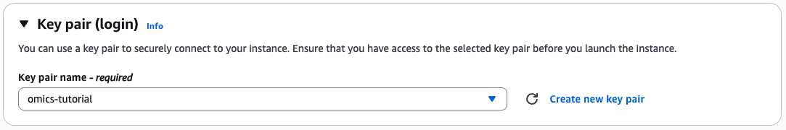](https://www.aws-ps-tech.kr/uploads/images/gallery/2025-05/iI6image.png)

Give the key pair a name and select the key pair type and format.

#### Security groups

Ensure that you have access to the instance via SSH.

[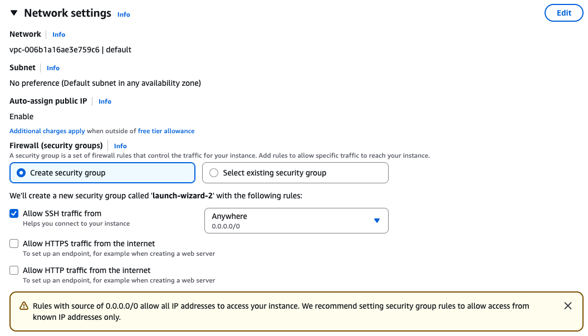](https://www.aws-ps-tech.kr/uploads/images/gallery/2025-05/E2Oimage.png)

#### Storage

Create a root volume of 20GB

[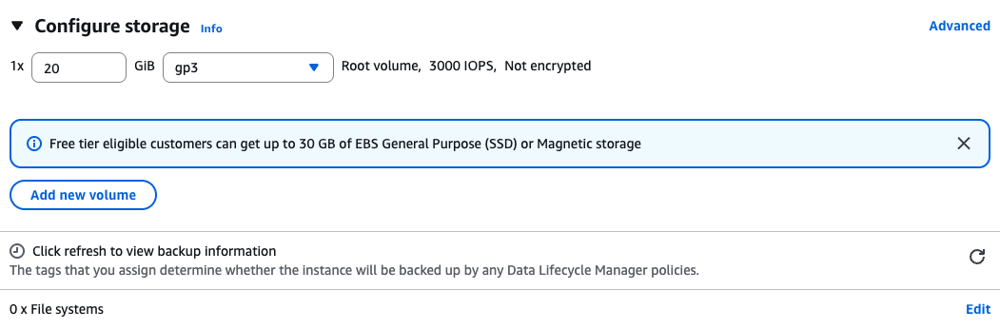](https://www.aws-ps-tech.kr/uploads/images/gallery/2025-05/5r8image.png)

#### Instance Profile

<p class="callout warning">We will create an IAM instance profile to allow administrator permissions for the EC2 instance, for the purpose of this workshop. However, in general, AWS security best practices recommendation is that you create an instance profile with least privilege. This configuration is not recommended in your own account, you should discuss organizational best-practices with your IT team to configure appropriate permissions.</p>

Advanced Details 토글

[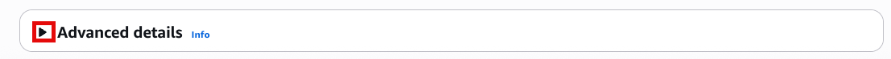](https://www.aws-ps-tech.kr/uploads/images/gallery/2025-05/GB4image.png)

IAM Instance profile에서 Create new IAM profile 선택

[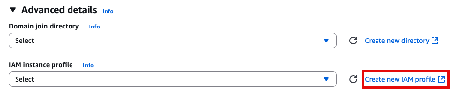](https://www.aws-ps-tech.kr/uploads/images/gallery/2025-05/0Egimage.png)

**AWS service, EC2 선택**

[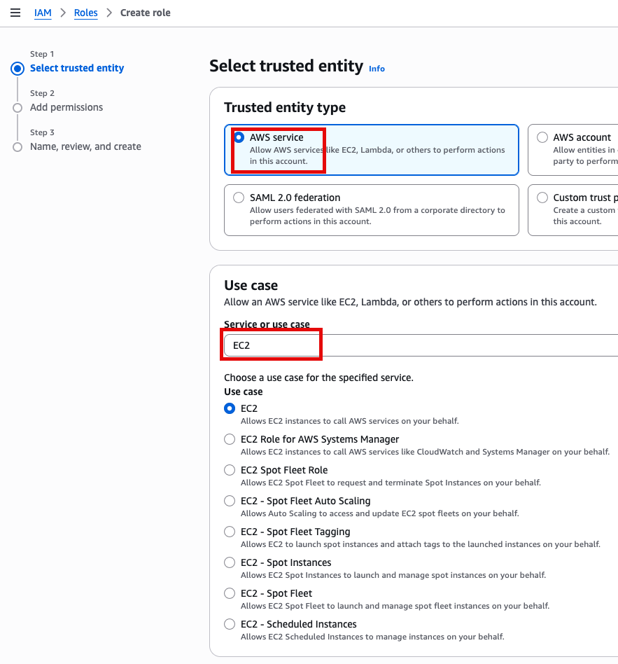](https://www.aws-ps-tech.kr/uploads/images/gallery/2025-05/KIdimage.png)

**Add Permissions 화면에서 AdministratorAccess 추가(선택)**

[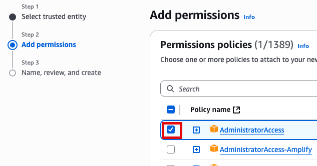](https://www.aws-ps-tech.kr/uploads/images/gallery/2025-05/5Hximage.png)

새로운 role name을 지정 (여기서는 EC2adminAccess라고 작성했음)

[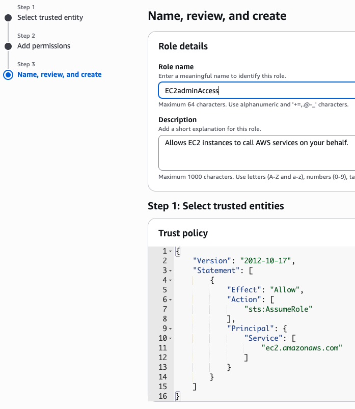](https://www.aws-ps-tech.kr/uploads/images/gallery/2025-05/8Otimage.png)

**이제 EC2 instance 실행 화면으로 돌아가서 앞에서 만든 EC2adminAccess 선택**

[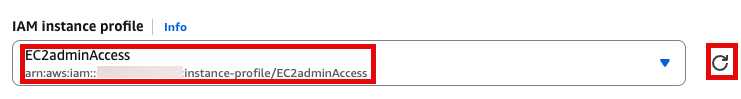](https://www.aws-ps-tech.kr/uploads/images/gallery/2025-05/APximage.png)

#### **User Data**

**맨 아래의 User data 섹션에 내용 추가**

```bash
#!/bin/bash

echo "Setting up NodeJS Environment"
curl https://raw.githubusercontent.com/nvm-sh/nvm/v0.34.0/install.sh | bash

echo 'export NVM_DIR="/.nvm"' >> /home/ec2-user/.bashrc
echo '[ -s "$NVM_DIR/nvm.sh" ] && . "$NVM_DIR/nvm.sh"  # This loads nvm' >> /home/ec2-user/.bashrc

# Dot source the files to ensure that variables are available within the current shell
. /.nvm/nvm.sh
. ~/.bashrc
nvm install --lts

python3 -m ensurepip --upgrade

pip3 install boto3
npm install -g aws-cdk
sudo yum -y install git
```

[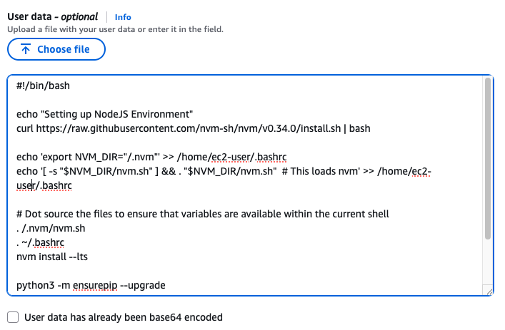](https://www.aws-ps-tech.kr/uploads/images/gallery/2025-05/jQZimage.png)

Launch instance 눌러서 인스턴스 실행

[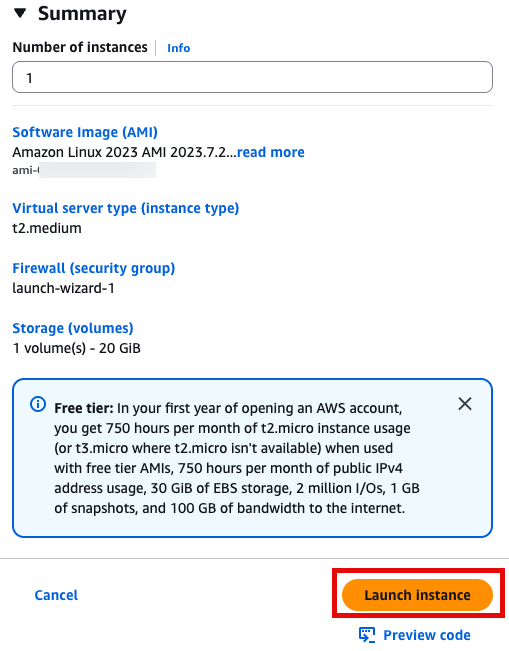](https://www.aws-ps-tech.kr/uploads/images/gallery/2025-05/QyAimage.png)

### **Step 2 - workflow migration code를 세팅하기**

**SSH 접속, 앞에서 만든 console로 접속합니다.**

[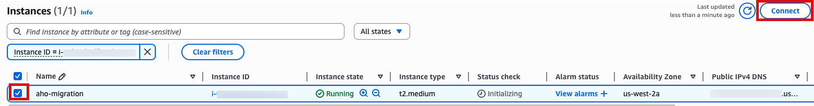](https://www.aws-ps-tech.kr/uploads/images/gallery/2025-05/2JAimage.png)

[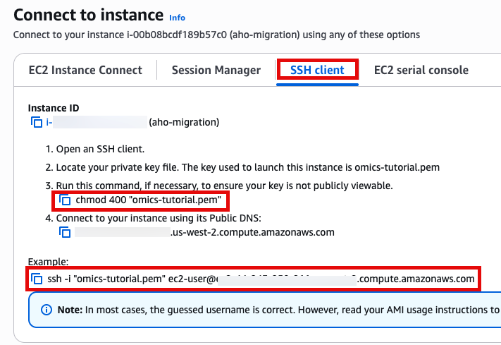](https://www.aws-ps-tech.kr/uploads/images/gallery/2025-05/26timage.png)

Use SSH to access the instance, you will need to ensure the key you created earlier is in the .ssh folder in your home directory and has the correct permissions(chmod 400). You will **need replace** ec2-user@10.11.12.123 with the IP address of your instance. This can be found in the EC2 management console.

```bash
ssh -i .ssh/omics-tutorial.pem ec2-user@10.11.12.123
```

Get the region using the `ec2-metadata command`. This handy oneliner stores it as a variable

```bash
REGION=$(ec2-metadata --availability-zone | sed 's/placement: \(.*\).$/\1/')
```

Get the account number (if you don't already know it)

```bash
ACCOUNT_NUMBER=$(aws sts get-caller-identity --query 'Account' --output text)
```

**Bootstraping**

Now you can bootstrap cdk replacing `ACCOUNT-NUMBER` with your account number nad using the `$REGION` variable created earlier.

```bash
cdk bootstrap aws://$ACCOUNT_NUMBER/$REGION
```

**Download the workflow migration code**

This step downloads the code which is used to migrate the workflow into AWS HealthOmics Workflows

```md
cd ~
git clone https://github.com/aws-samples/amazon-ecr-helper-for-aws-healthomics.git

git clone https://github.com/aws-samples/aws-healthomics-tutorials.git

cd amazon-ecr-helper-for-aws-healthomics

```

Install and deploy the code.

```md
npm install
cdk deploy --all
```

<div class="awsui_root_18wu0_fxrr2_920 awsui_box_18wu0_fxrr2_172 awsui_color-default_18wu0_fxrr2_172 awsui_font-size-default_18wu0_fxrr2_188 awsui_font-weight-default_18wu0_fxrr2_228" id="bkmrk--15"><div class="MarkdownRenderer-module_markdown__35_09"><div class="CodeBlock-module_codeBlock__2a1n0 CodeBlock-module_hasCopyAction__zdyx-"><span class="awsui_root_xjuzf_13bmg_1091 CodeBlock-module_copyAction__vokS-"><span class="awsui_trigger_xjuzf_13bmg_1131" id="bkmrk--16"><button aria-label="Copy content" class="CopyButton-module_styledButton__1Jq7M awsui_button_vjswe_1379u_157 awsui_variant-normal_vjswe_1379u_205 awsui_button-no-text_vjswe_1379u_556" data-analytics-funnel-value="button:r7g:" data-analytics-performance-mark="32-1747876049491-1634" data-testid="copy-button" title="Copy content" type="submit"><span class="awsui_icon_vjswe_1379u_585 awsui_icon-left_vjswe_1379u_585 awsui_icon_h11ix_npnzo_189 awsui_size-normal-mapped-height_h11ix_npnzo_248 awsui_size-normal_h11ix_npnzo_244 awsui_variant-normal_h11ix_npnzo_320"><svg aria-hidden="true" focusable="false" viewbox="0 0 16 16" xmlns="http://www.w3.org/2000/svg"><path class="stroke-linejoin-round" d="M15 5H5v10h10V5Z"></path><path class="stroke-linejoin-round" d="M13 1H1v11"></path></svg></span></button></span></span></div></div></div>## 프로젝트 셋업

이제 원하는 nf-core의 워크플로우를 HealthOmics private workflow에 마이그레이션을 하기 위해 다음 과정이 필요합니다.

- Cloning a workflow from nf-core
- Generating artifacts for migration
- Privatizing containers by migrating them to your private Amazon ECR

**버킷 생성 및 Bash 환경변수 선언**

```bash
export yourbucket="your-bucket-name"
export your_account_id="your-account-id" #ACCOUNT_NUMBER
export region="your-region"
export workflow_name="your-workflow-name"
export omics_role_name="your_omics_rolename"

# if not exist the bucket, let's create.
#aws s3 mb $yourbucket
```


#### Clone nf-core repository that you want to migrate

```md
cd ~
git clone https://github.com/nf-core/spatialvi.git
```

#### Docker Image Manifest의 생성

```md
cp  /home/workshop/amazon-ecr-helper-for-aws-healthomics/lib/lambda/parse-image-uri/public_registry_properties.json namespace.config
```

준비된 namespace.config파일의 내용은 다음과 같습니다.

[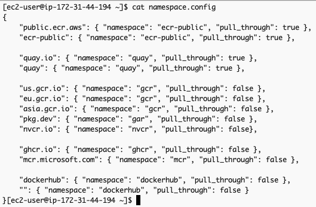](https://www.aws-ps-tech.kr/uploads/images/gallery/2025-05/25bimage.png)

This file will be used as one of the inputs for the `inspect_nf.py` script. This script parses the entire nextflow workflow project and identifies all public docker images across all the tools and generates a manifest which will be passed as an input to the migration tool.

`inspect_nf.py` 를 실행합니다.

```
python3 aws-healthomics-tutorials/utils/scripts/inspect_nf.py \
--output-manifest-file spatialvi_dev_docker_images_manifest.json \
 -n namespace.config \
 --output-config-file omics.config \
 --region $region \
 ~/spatialvi/

```

생성되는 두 개의 출력은 `spatialvi_dev_docker_images_manifest.json` 과 `omics.config`입니다.

`spatialvi_dev_docker_images_manifest.json` 파일은 예를들어 다음과 같은 모습이어야 합니다:

[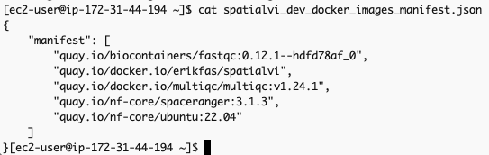](https://www.aws-ps-tech.kr/uploads/images/gallery/2025-05/2keimage.png)

<p class="callout warning">해당 파일의 내용을 다음과 같이 수정합니다. (기존의 container 주소가 더이상 작동하지 않는 것이 많아서 임의로 공개된 것을 찾아 수정하였습니다, 예를들어 [spaceranger에 대한 컨테이너 주소 quay.io/nf-core/spaceranger:3.1.3](https://github.com/nf-core/spatialvi/blob/caeb4ff3768e6cba7a45f4a92220e9e9bf4efa28/modules/nf-core/spaceranger/count/main.nf#L5) 가 작동하지 않아서 dockerhub의 공개 Image로부터 검색하여 대응시켰습니다. [https://hub.docker.com/search?q=spaceranger](https://hub.docker.com/search?q=spaceranger)</p>

```json
{
    "manifest": [
        "quay.io/biocontainers/fastqc:0.12.1--hdfd78af_0",
        "erikfas/spatialvi:latest",
        "multiqc/multiqc:v1.24.1",
        "cumulusprod/spaceranger:3.1.3",
        "ubuntu:22.04"
    ]
}
```

The omics.config output file is also generated, which needs to be added to the nextflow workflow project. The purpose of this config is to inform nextflow to use the ECR docker image locations instead of the ones specified in the nextflow project code. The omics.config should look like this:

[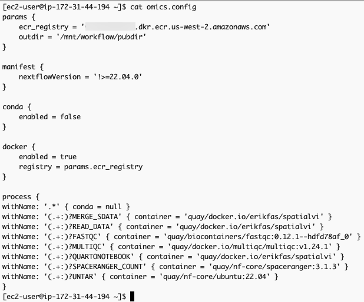](https://www.aws-ps-tech.kr/uploads/images/gallery/2025-05/H6Nimage.png)

`omics.config` 내용 중 process에 정의된 내용도 아래와 같이 변경합니다.

```
process {
withName: '.*' { conda = null }
withName: '(.+:)?MERGE_SDATA' { container = 'erikfas/spatialvi' }
withName: '(.+:)?READ_DATA' { container = 'erikfas/spatialvi' }
withName: '(.+:)?FASTQC' { container = 'quay/biocontainers/fastqc:0.12.1--hdfd78af_0' }
withName: '(.+:)?MULTIQC' { container = 'multiqc/multiqc:v1.24.1' }
withName: '(.+:)?QUARTONOTEBOOK' { container = 'erikfas/spatialvi' }
withName: '(.+:)?SPACERANGER_COUNT' { container = 'quay/nf-core/spaceranger:3.1.3' }
withName: '(.+:)?UNTAR' { container = 'quay/nf-core/ubuntu:22.04' }
}
```

#### 컨테이너 사설화 (into Amazon ECR)

```
aws stepfunctions start-execution \
--state-machine-arn arn:aws:states:$region:$your_account_id:stateMachine:omx-container-puller \
--input file://spatialvi_dev_docker_images_manifest.json

```

[step function 콘솔](https://console.aws.amazon.com/states/home)에서 state machines중에 `omx-container-puller`를 확인하여 Execution이 완료되었는지 확인합니다.

[](https://www.aws-ps-tech.kr/uploads/images/gallery/2025-04/screenshot-2025-04-15-at-3-52-46-pm.png)

[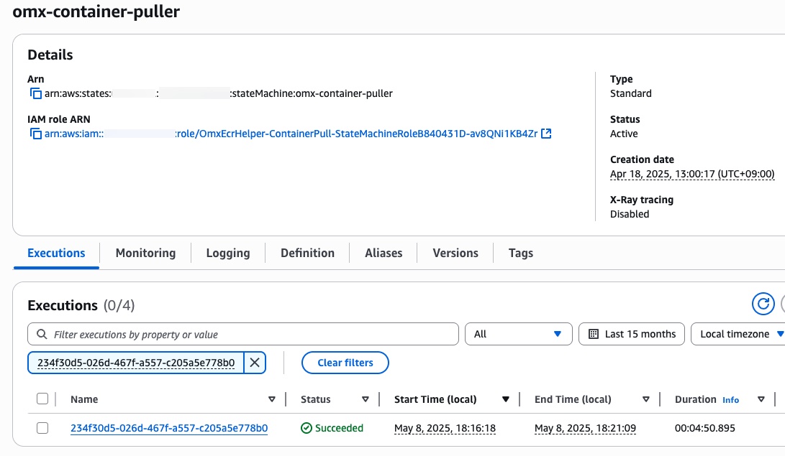](https://www.aws-ps-tech.kr/uploads/images/gallery/2025-05/24Eimage.png)

#### nf-core project 코드 업데이트

To use the newly migrated containers for our workflow, copy the omics.config generated from inspect\_nf.py in the /conf dir of the spatialvi project.

```
mv omics.config spatialvi/conf
```

Update the nextflow.config file in the root dir of the scrnaseq project by adding to the bottom of the file:

```
echo "includeConfig 'conf/omics.config'" >> spatialvi/nextflow.config 
```


## 신규 HealthOmics 워크플로우 만들기

#### 단계1. 파라미터 파일

`parameter-description.json`을 만들어 아래와 같이 저장합니다.

```json
cat > parameter-description.json <<EOF
{
   "input":{
      "description":"CSV samplesheet containing sample information",
      "optional":false
   },
   "spaceranger_probeset":{
      "description":"Probe set file for Space Ranger analysis",
      "optional":false
   },
   "spaceranger_reference":{
      "description":"Reference genome tarball for Space Ranger",
      "optional":false
   },
   "qc_min_counts":{
      "description":"Minimum count threshold for QC filtering",
      "optional":true
   },
   "qc_min_genes":{
      "description":"Minimum number of genes threshold for QC filtering",
      "optional":true
   }
}
EOF
```

#### 단계2. 워크플로우 스테이징

```
zip -r spatialvi.zip spatialvi/ -x "*/\.*" "*/\.*/**"
```

```bash
aws s3 cp spatialvi.zip s3://${yourbucket}/workshop/spatialvi.zip

aws omics create-workflow \
  --name ${workflow_name} \
  --definition-uri s3://${yourbucket}/workshop/spatialvi-workflow.zip \
  --parameter-template file://parameter-description.json \
  --engine NEXTFLOW
```

#### 단계3. 워크플로우 생성 확인

```
workflow_id=$(aws omics list-workflows --name ${workflow_name} --query 'items[0].id' --output text)
echo $workflow_id
```

## 워크플로우 테스트하기

#### 입력파일 준비

`parameter-description.json`에 사용된 것과 동일한 키를 사용하여 `input.json` 파일을 새로 만듭니다. 값은 워크플로에서 허용되는 실제 S3 경로 또는 문자열이 됩니다.

아래는 테스트 샘플의 파라미터 예시입니다. ([참고](https://github.com/nf-core/scrnaseq/blob/e0ddddbff9d8b8c2421c67ff07449a06f9ca02d2/conf/test.config#L26))

<details id="bkmrk-%EB%8D%B0%EC%9D%B4%ED%84%B0-%EC%A4%80%EB%B9%84-%EC%B0%B8%EA%B3%A0-%EC%98%88%EC%A0%9C-%EB%8D%B0%EC%9D%B4%ED%84%B0%EB%8A%94-%EB%8B%A4%EC%9D%8C"><summary>데이터 준비 참고</summary>

예제 데이터는 다음과 같이 다운로드 해볼 수 있습니다.

```bash
wget "https://raw.githubusercontent.com/nf-core/test-datasets/spatialvi/testdata/human-brain-cancer-11-mm-capture-area-ffpe-2-standard_v2_ffpe_cytassist/samplesheet_spaceranger.csv"
wget "https://raw.githubusercontent.com/nf-core/test-datasets/spatialvi/testdata/human-brain-cancer-11-mm-capture-area-ffpe-2-standard_v2_ffpe_cytassist/outs/probe_set.csv"
wget "https://raw.githubusercontent.com/nf-core/test-datasets/spatialvi/testdata/homo_sapiens_chr22_reference.tar.gz"
```

이제 현재 디렉토리에 다운로드 된 파일들을 버킷에 업로드할 수 있습니다.

```bash
aws s3 mv samplesheet_spaceranger.csv s3://${yourbucket}/spatialvi/
aws s3 mv probe_set.csv s3://${yourbucket}/spatialvi/
aws s3 mv homo_sapiens_chr22_reference.tar.gz s3://${yourbucket}/spatialvi/
```

</details>**sample sheet 만들기**

```bash
cat << EOF > samplesheet_spaceranger.csv
sample,fastq_dir,cytaimage,slide,area,manual_alignment,slidefile
CytAssist_11mm_FFPE_Human_Glioblastoma_2,s3://${bucket}/spatialvi/fastq_dir.tar.gz,s3://${bucket}/spatialvi/CytAssist_11mm_FFPE_Human_Glioblastoma_image.tif,V52Y10-317,B1,,s3://${bucket}/spatialvi/V52Y10-317.gpr
EOF
```

**위에서 만든 samplesheet를 s3로 복사**

```bash
aws s3 cp samplesheet_spaceranger.csv s3://${yourbucket}/spatialvi/samplesheet_spaceranger.csv
```

**입력 json 만들기 (위 sample sheet경로가 아래 내용중 input에 값으로 들어가게됨)**

<p class="callout info">마찬가지로 probe\_set.csv, homo\_sapiens\_chr22\_reference.tar.gz도 모두 버킷에 준비해야합니다.</p>

```bash
cat > input.json <<EOF
{
	"input": "s3://${yourbucket}/spatialvi/samplesheet_spaceranger.csv",
	"spaceranger_probeset": "s3://${yourbucket}/spatialvi/probe_set.csv",
	"spaceranger_reference": "s3://${yourbucket}/spatialvi/homo_sapiens_chr22_reference.tar.gz",
	"qc_min_counts": 5,
	"qc_min_genes": 3
}
EOF
```

<span style="color: rgb(34, 34, 34); font-family: 'Amazon Ember', 'Noto Sans KR', sans-serif; font-size: 1.666em; font-weight: 400;">Policy 준비</span>

##### Prepare IAM service role to run AWS HealthOmics workflow

<p class="callout warning">your-bucket-name, your-account-id, your-region을 모두 본인 환경에 맞게 수정하여 사용하세요.</p>

`omics_workflow_policy.json` 만들기

```bash

cat << EOF > omics_workflow_policy.json
{
    "Version": "2012-10-17",
    "Statement": [
        {
            "Effect": "Allow",
            "Action": [
                "s3:GetObject"
            ],
            "Resource": [
                "arn:aws:s3:::${yourbucket}/*",
                "arn:aws:s3:::aws-genomics-static-${region}/workflow_migration_workshop/nfcore-scrnaseq-v2.3.0/*"
            ]
        },
        {
            "Effect": "Allow",
            "Action": [
                "s3:ListBucket"
            ],
            "Resource": [
                "arn:aws:s3:::${yourbucket}",
                "arn:aws:s3:::aws-genomics-static-${region}/workflow_migration_workshop/nfcore-scrnaseq-v2.3.0",
                "arn:aws:s3:::aws-genomics-static-${region}/workflow_migration_workshop/nfcore-scrnaseq-v2.3.0/*"
            ]
        },
        {
            "Effect": "Allow",
            "Action": [
                "s3:PutObject"
            ],
            "Resource": [
                "arn:aws:s3:::${yourbucket}/*"
            ]
        },
        {
            "Effect": "Allow",
            "Action": [
                "logs:DescribeLogStreams",
                "logs:CreateLogStream",
                "logs:PutLogEvents"
            ],
            "Resource": [
                "arn:aws:logs:${region}:${your_account_id}:log-group:/aws/omics/WorkflowLog:log-stream:*"
            ]
        },
        {
            "Effect": "Allow",
            "Action": [
                "logs:CreateLogGroup"
            ],
            "Resource": [
                "arn:aws:logs:${region}:${your_account_id}:log-group:/aws/omics/WorkflowLog:*"
            ]
        },
        {
            "Effect": "Allow",
            "Action": [
                "ecr:BatchGetImage",
                "ecr:GetDownloadUrlForLayer",
                "ecr:BatchCheckLayerAvailability"
            ],
            "Resource": [
                "arn:aws:ecr:${region}:${your_account_id}:repository/*"
            ]
        }
    ]
}
EOF

echo "omics_workflow_policy.json 파일이 생성되었습니다."
```

`trust_policy.json` 만들기

```bash
cat << EOF > trust_policy.json
{
    "Version": "2012-10-17",
    "Statement": [
        {
            "Effect": "Allow",
            "Principal": {
                "Service": "omics.amazonaws.com"
            },
            "Action": "sts:AssumeRole",
            "Condition": {
                "StringEquals": {
                    "aws:SourceAccount": "${your_account_id}"
                },
                "ArnLike": {
                    "aws:SourceArn": "arn:aws:omics:${region}:${your_account_id}:run/*"
                }
            }
        }
    ]
}
EOF

echo "trust_policy.json 파일이 생성되었습니다."
```

#### IAM Role 생성

```
aws iam create-role --role-name ${omics_role_name} --assume-role-policy-document file://trust_policy.json

```

Policy document 생성

```
aws iam put-role-policy --role-name ${omics_role_name} --policy-name OmicsWorkflowV1 --policy-document file://omics_workflow_policy.json

```

#### 워크플로우 실행

작은 샘플의 예제는 `input.json`, 큰 샘플의 예제는 `input_full.json`

```
aws omics start-run \
  --name spatialvi_test_run_1 \
  --role-arn arn:aws:iam::${your_account_id}:role/${omics_role_name}\
  --workflow-id ${workflow_id} \
  --parameters file://input.json \
  --output-uri s3://${yourbucket}/output/
```

**참고문서**

- [https://catalog.us-east-1.prod.workshops.aws/workshops/76d4a4ff-fe6f-436a-a1c2-f7ce44bc5d17/en-US/workshop/project-setup](https://catalog.us-east-1.prod.workshops.aws/workshops/76d4a4ff-fe6f-436a-a1c2-f7ce44bc5d17/en-US/workshop/project-setup)