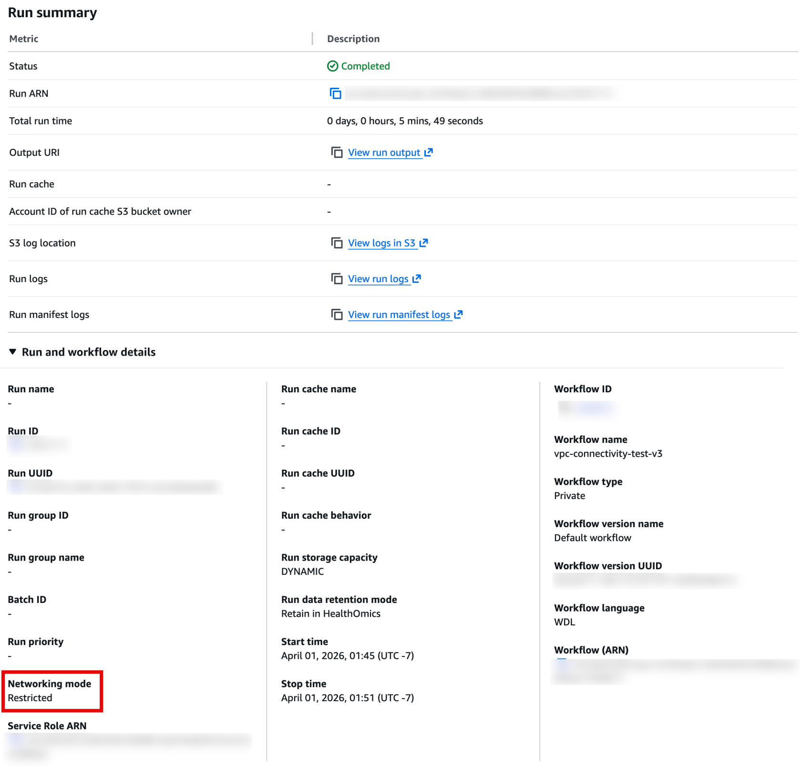
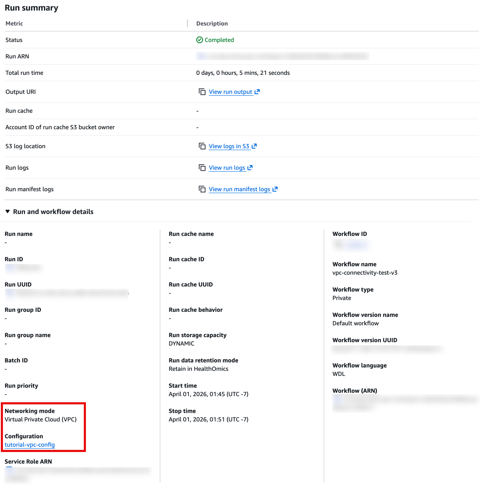

## 개요

2026년 3월, AWS HealthOmics에 **VPC-Connected Workflows** 기능이 추가되었습니다. 이 기능을 사용하면 HealthOmics 워크플로우가 고객이 관리하는 VPC를 통해 네트워크 트래픽을 라우팅할 수 있어, 기존 RESTRICTED 모드의 네트워크 제한을 해소할 수 있습니다.

본 게시물에서는 이 기능의 동작 원리, 실제 테스트 결과, 그리고 CDK를 활용한 인프라 구성 방법을 소개합니다.

---

## 기존 RESTRICTED 모드의 한계

HealthOmics 워크플로우의 기본 네트워킹 모드는 **RESTRICTED**입니다. 이 모드에서 워크플로우 태스크는 같은 리전의 S3와 ECR에만 접근할 수 있으며, 그 외의 네트워크 통신은 모두 차단됩니다.

이로 인해 다음과 같은 일반적인 생물정보학 워크플로우 시나리오가 제한됩니다:

- **공개 데이터베이스 접근 불가**: NCBI, Ensembl 등 공개 생물정보학 데이터베이스에서 레퍼런스 데이터를 다운로드할 수 없음
- **외부 API 호출 불가**: 라이선스 서버, REST API, 알림 웹훅 등에 연결할 수 없음
- **크로스 리전 S3 접근 불가**: 다른 AWS 리전의 S3 버킷에 저장된 유전체 데이터셋에 접근할 수 없음

특히 크로스 리전 S3의 경우, RESTRICTED 모드에서는 `StartRun` API 호출 시점에 S3 버킷의 리전을 검증하여, 다른 리전의 S3 URI가 포함되어 있으면 워크플로우가 시작조차 되지 않습니다.

---

## VPC 모드: 어떻게 동작하는가

VPC 모드에서는 HealthOmics가 워크플로우 태스크의 ENI(Elastic Network Interface)를 고객의 VPC 프라이빗 서브넷에 생성합니다. 이 ENI를 통해 트래픽이 VPC의 NAT 게이트웨이를 거쳐 인터넷 또는 다른 리전의 AWS 서비스로 라우팅됩니다.

```
┌──────────────────────────────────────────────────────┐
│  VPC (10.0.0.0/16)                                   │
│                                                      │
│  ┌──────────────┐  ┌──────────────┐  ┌────────────┐  │
│  │ Private Sub-a│  │ Private Sub-b│  │Private Sub-c│ │
│  │  HealthOmics │  │  HealthOmics │  │ HealthOmics│  │
│  │  ENIs        │  │  ENIs        │  │ ENIs       │  │
│  └──────┬───────┘  └──────┬───────┘  └─────┬──────┘  │
│         └─────────────────┼────────────────┘         │
│                           │                          │
│                  ┌────────▼────────┐                 │
│                  │   NAT Gateway   │                 │
│                  │  (Public Subnet) │                │
│                  └────────┬────────┘                 │
│                           │                          │
│  S3 Gateway Endpoint ─── 같은 리전 S3 (비용 없음)      │
│  Security Group: 아웃바운드 HTTPS 443만 허용            │
└───────────────────────────┼──────────────────────────┘
                            │
              ┌─────────────┼─────────────┐
              ▼             ▼             ▼
    ┌──────────────┐ ┌──────────────┐ ┌──────────────┐
    │  퍼블릭      │ │ 크로스 리전  │ │ 외부         │
    │  인터넷      │ │ S3 버킷      │ │ REST API     │
    │ (NCBI 등)    │ │ (us-east-1)  │ │ (GitHub 등)  │
    └──────────────┘ └──────────────┘ └──────────────┘
```

**트래픽 경로 요약**:
- **같은 리전 S3**: S3 Gateway 엔드포인트를 통해 직접 접근 (데이터 전송 비용 없음)
- **인터넷/크로스 리전**: 프라이빗 서브넷 → NAT 게이트웨이 → 인터넷 게이트웨이

> **참고**: 모든 HealthOmics 워크플로우 실행은 HealthOmics 서비스가 소유·관리하는 VPC 내에서 실행됩니다. VPC 모드를 설정하면 고객 VPC에 ENI가 추가로 생성되어 네트워크 접근이 확장되는 것이며, HealthOmics 관리형 VPC 자체에는 영향을 주지 않습니다.

---

## 콘솔에서 확인하기

HealthOmics 콘솔의 Run summary에서 두 모드의 차이를 확인할 수 있습니다.

### RESTRICTED 모드 실행 화면

RESTRICTED 모드로 실행한 경우, **Networking mode** 항목에 `Restricted`로 표시됩니다. Configuration 항목은 표시되지 않으며, 워크플로우는 HealthOmics의 기본 네트워크 환경에서 실행됩니다. 같은 리전의 S3와 ECR만 접근 가능하고, 외부 인터넷 연결은 불가합니다.

[](https://www.aws-ps-tech.kr/uploads/images/gallery/2026-04/restricted-networking-mode.png)

### VPC 모드 실행 화면

VPC 모드로 실행한 경우, **Networking mode** 항목에 `Virtual Private Cloud (VPC)`로 표시되며, 그 아래에 **Configuration** 항목이 추가로 나타납니다. 여기에는 연결된 VPC Configuration의 이름(예: `tutorial-vpc-config`)이 링크로 표시되어, 클릭하면 해당 Configuration의 상세 정보(VPC ID, 서브넷, 보안 그룹 등)를 확인할 수 있습니다.

[](https://www.aws-ps-tech.kr/uploads/images/gallery/2026-04/vpc-mode.png)

두 실행 모두 동일한 워크플로우(`vpc-connectivity-test-v3`, WDL)를 사용했으며, 실행 시간도 유사합니다(RESTRICTED: 5분 49초, VPC: 5분 21초).

---

## 실제 테스트 결과

ap-northeast-2(서울) 리전에서 동일한 WDL 워크플로우를 RESTRICTED 모드와 VPC 모드로 각각 실행하여 연결성을 비교 테스트했습니다.

### 테스트 항목

**카테고리 A — 인터넷 접근**:
- A1: `curl https://checkip.amazonaws.com` (아웃바운드 HTTPS + NAT 퍼블릭 IP 확인)
- A2: `wget https://ftp.ncbi.nlm.nih.gov/robots.txt` (NCBI 공개 리소스 다운로드)
- A3: `curl https://api.github.com` (외부 REST API 접근)

**카테고리 B — 크로스 리전 S3 접근** (us-east-1 → ap-northeast-2):
- B1: `aws s3 cp` (크로스 리전 파일 다운로드)
- B2: `aws s3 ls` (크로스 리전 버킷 목록 조회)

### 결과 비교

| 테스트 | RESTRICTED 모드 | VPC 모드 |
|--------|----------------|----------|
| A1 — checkip.amazonaws.com | **FAIL** (타임아웃) | **PASS** (NAT IP 반환) |
| A2 — NCBI robots.txt 다운로드 | **FAIL** (타임아웃) | **PASS** (파일 다운로드 성공) |
| A3 — GitHub API 호출 | **FAIL** (타임아웃) | **PASS** (HTTP 200) |
| B1 — 크로스 리전 S3 다운로드 | **API에서 차단** | **PASS** (파일 다운로드 성공) |
| B2 — 크로스 리전 S3 목록 조회 | **API에서 차단** | **PASS** (객체 목록 반환) |

RESTRICTED 모드에서는 인터넷 테스트가 모두 타임아웃으로 실패하며, 크로스 리전 S3는 `StartRun` API 호출 자체가 `ValidationException: S3 bucket not located in ap-northeast-2 region`으로 거부됩니다.

VPC 모드에서는 5개 테스트 모두 성공합니다.

---

## CDK를 활용한 인프라 구성

VPC 모드를 사용하려면 HealthOmics 요구사항에 맞는 VPC와 HealthOmics Configuration을 생성해야 합니다. 이를 간소화하기 위해 **HealthOmicsVpc CDK L3 Construct**를 활용할 수 있습니다.

이 CDK Construct는 `cdk deploy` 한 번으로 다음을 모두 생성합니다:

- **VPC**: HealthOmics 지원 AZ에 자동 배치된 퍼블릭/프라이빗 서브넷
- **NAT 게이트웨이**: development(1개) 또는 production(AZ당 1개) 모드 선택
- **보안 그룹**: 최소 권한 원칙 (아웃바운드 HTTPS 443만 허용)
- **S3 Gateway 엔드포인트**: 같은 리전 S3 접근 시 데이터 전송 비용 없음
- **VPC Flow Logs**: CloudWatch Logs로 자동 전송
- **HealthOmics Configuration**: Custom Resource를 통해 자동 생성 및 수명 주기 관리

### 사용 예시

```typescript
import { HealthOmicsVpc } from './lib';

new HealthOmicsVpc(stack, 'HealthOmicsVpc', {
  networkingConfigurationName: 'my-vpc-config',
  deploymentMode: 'development',    // NAT GW 1개 (비용 절감)
  vpcEndpoints: ['s3'],             // S3 Gateway 엔드포인트
});
```

### 배포 절차

```bash
# 환경 변수 설정
export AWS_REGION=us-east-1
export AWS_ACCOUNT_ID=$(aws sts get-caller-identity --query Account --output text)

# CDK 배포
cd healthomics-vpc-cdk-main
npm install
npx cdk bootstrap aws://${AWS_ACCOUNT_ID}/${AWS_REGION}
npx cdk deploy --require-approval never
```

배포 후 Configuration이 `ACTIVE` 상태가 되면 (최대 15분 소요) VPC 모드로 워크플로우를 실행할 수 있습니다.

---

## 워크플로우 실행 방법

### RESTRICTED 모드 (기본)

```bash
aws omics start-run \
    --workflow-id <WORKFLOW_ID> \
    --role-arn <ROLE_ARN> \
    --output-uri s3://my-bucket/output/ \
    --parameters '{"output_s3_uri": "s3://my-bucket/report.json"}'
```

### VPC 모드

```bash
aws omics start-run \
    --workflow-id <WORKFLOW_ID> \
    --role-arn <ROLE_ARN> \
    --output-uri s3://my-bucket/output/ \
    --networking-mode VPC \
    --configuration-name my-vpc-config \
    --parameters '{
        "output_s3_uri": "s3://my-bucket/report.json",
        "cross_region_s3_uri": "s3://bucket-in-other-region/data.txt"
    }'
```

차이점은 `--networking-mode VPC`와 `--configuration-name` 두 가지 파라미터의 추가입니다.

---

## 알아두면 좋은 점

### 컨테이너 이미지 설정

HealthOmics는 **Amazon ECR 프라이빗 리포지토리**에 호스팅된 컨테이너 이미지를 지원합니다. ECR 리포지토리는 워크플로우와 **같은 리전**에 있어야 하며, x86_64 아키텍처만 지원합니다 (ARM 컨테이너 미지원). Apple Mac 등 ARM 기반 로컬 머신에서는 `docker build --platform amd64`로 빌드해야 합니다.

**퍼블릭 레지스트리 이미지 사용**: Docker Hub, Public ECR 등의 퍼블릭 이미지를 직접 참조할 수는 없지만, **ECR Pull Through Cache**를 활용하면 이러한 이미지를 프라이빗 리포지토리로 자동 동기화하여 사용할 수 있습니다. 지원되는 업스트림 레지스트리는 다음과 같습니다:

- Amazon ECR Public
- Docker Hub
- Quay
- GitHub Container Registry
- GitLab Container Registry
- Kubernetes container image registry
- Microsoft Azure Container Registry

Pull Through Cache를 사용하면 수동으로 이미지를 마이그레이션할 필요 없이, 업스트림 레지스트리의 변경 사항이 자동으로 동기화됩니다. 또한 HealthOmics가 ECR 프라이빗 URI를 업스트림 레지스트리 URI로 자동 매핑하므로, 워크플로우 정의에서 URI를 수동으로 변경할 필요가 없습니다.

**ECR 리포지토리 접근 정책**: IAM 역할 권한 외에 ECR 리포지토리 자체에 `omics.amazonaws.com` 서비스 프린시플에 대한 접근 정책을 설정해야 합니다.

```bash
aws ecr set-repository-policy \
    --repository-name my-repo \
    --policy-text '{
        "Version": "2012-10-17",
        "Statement": [{
            "Effect": "Allow",
            "Principal": {"Service": "omics.amazonaws.com"},
            "Action": [
                "ecr:BatchGetImage",
                "ecr:GetDownloadUrlForLayer",
                "ecr:BatchCheckLayerAvailability"
            ]
        }]
    }'
```

**컨테이너 이미지 주의사항**:
- 컨테이너 이미지에 `ENTRYPOINT`를 지정하지 마세요. HealthOmics 워크플로우 엔진이 bash 스크립트를 command override로 주입합니다.
- `/tmp` 경로에 공유 파일시스템이 마운트되므로, 이 경로에 빌드된 데이터나 도구는 덮어씌워집니다.
- 워크플로우 정의는 `/mnt/workflow`에 읽기 전용으로 마운트됩니다.

### S3 파라미터 검증

HealthOmics는 `StartRun` 호출 시 워크플로우 파라미터의 S3 URI를 검증합니다:
- 참조하는 S3 객체가 **존재**해야 합니다 (출력 경로의 경우 플레이스홀더 생성 필요)
- RESTRICTED 모드에서는 S3 버킷이 **같은 리전**에 있어야 합니다

### Configuration 관련

- Configuration 생성 시 `CREATING` → `ACTIVE` 상태 전환에 **최대 15분**이 소요됩니다.
- 워크플로우 실행은 **실행 시작 시점의 Configuration 스냅샷**을 사용합니다. 따라서 실행 중에 Configuration을 수정하거나 삭제해도 진행 중인 실행에는 영향이 없습니다.
- 활성 워크플로우 실행에서 사용 중인 Configuration은 삭제할 수 없습니다.

### ENI 관련 주의사항

- HealthOmics가 고객 VPC에 생성하는 ENI는 `Service: HealthOmics`, `eniType: CUSTOMER` 태그가 부여됩니다.
- **HealthOmics가 생성한 ENI를 수정하거나 삭제하지 마세요.** 서비스 지연이나 워크플로우 실행 중단이 발생할 수 있습니다.
- 리전당 기본 ENI 한도는 5,000개입니다. 워크로드에 따라 필요한 ENI 수가 달라지므로, EC2 콘솔에서 ENI 사용량을 모니터링하세요.

### 성능 영향

- VPC 모드는 ENI 프로비저닝으로 인해 시작 시간이 약 30~60초 더 소요됩니다. 워크플로우 태스크 자체의 실행 시간에는 유의미한 차이가 없습니다.
- 네트워크 스루풋은 **10 Gbps에서 시작하여 시간이 지남에 따라 100 Gbps까지 스케일링**됩니다. 즉시 높은 스루풋이 필요한 경우 사전 워밍을 요청하세요.

### 비용 고려

| 리소스 | 비용 | 비고 |
|--------|------|------|
| NAT 게이트웨이 | 시간당 ~$0.045 + 데이터 처리 | 가장 큰 비용 항목 |
| S3 Gateway 엔드포인트 | 무료 | 같은 리전 S3 접근 |
| VPC Flow Logs | CloudWatch Logs 수집 비용 | 트러블슈팅에 유용 |

테스트나 개발 목적이라면 development 모드(NAT 게이트웨이 1개)를 사용하고, **테스트 완료 후 즉시 리소스를 정리**하여 불필요한 비용을 방지하세요. AWS 서비스 접근에는 NAT 게이트웨이 대신 **VPC 엔드포인트**를 사용하면 데이터 처리 비용을 절감할 수 있습니다.

### VPC 네트워킹 쿼터

| 리소스 | 기본 한도 | 조정 가능 |
|--------|----------|----------|
| 계정당 최대 Configuration 수 | 10 | Yes |
| Configuration당 최대 보안 그룹 수 | 5 | No |
| Configuration당 최대 서브넷 수 | 16 | No |
| AZ당 최대 서브넷 수 | 1 | No |
| 리전당 ENI 수 (고객 VPC) | 5,000 | Yes |

### 지원 리전

| 리전 | AZ 수 |
|------|-------|
| us-east-1 (버지니아 북부) | 4 |
| us-west-2 (오레곤) | 3 |
| eu-west-1 (아일랜드) | 3 |
| eu-west-2 (런던) | 3 |
| eu-central-1 (프랑크푸르트) | 3 |
| ap-southeast-1 (싱가포르) | 3 |
| ap-northeast-2 (서울) | 3 |
| il-central-1 (텔아비브) | 3 |

---

## 정리

VPC-Connected Workflows는 HealthOmics 워크플로우의 네트워크 접근성을 크게 확장하는 기능입니다. 외부 데이터베이스 접근, API 호출, 크로스 리전 데이터 활용이 필요한 생물정보학 파이프라인에서 특히 유용하며, CDK L3 Construct를 활용하면 복잡한 VPC 인프라 구성을 단일 명령으로 완료할 수 있습니다.

### 참고 문서

- [Container images for private workflows](https://docs.aws.amazon.com/omics/latest/dev/workflows-ecr.html)
- [Connecting HealthOmics workflows to a VPC](https://docs.aws.amazon.com/omics/latest/dev/workflows-vpc-networking.html)