### VPC 생성

1\. VPC를 생성합니다.

[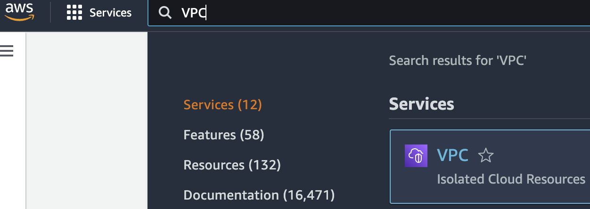 ](https://www.aws-ps-tech.kr/uploads/images/gallery/2024-04/screenshot-2024-04-18-at-11-32-14-pm.png)[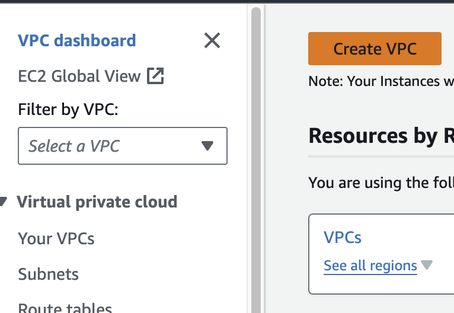](https://www.aws-ps-tech.kr/uploads/images/gallery/2024-04/screenshot-2024-04-18-at-11-35-04-pm.png)

다른 모든 사항은 기본값으로 하여 Name만 지정해주었습니다.

[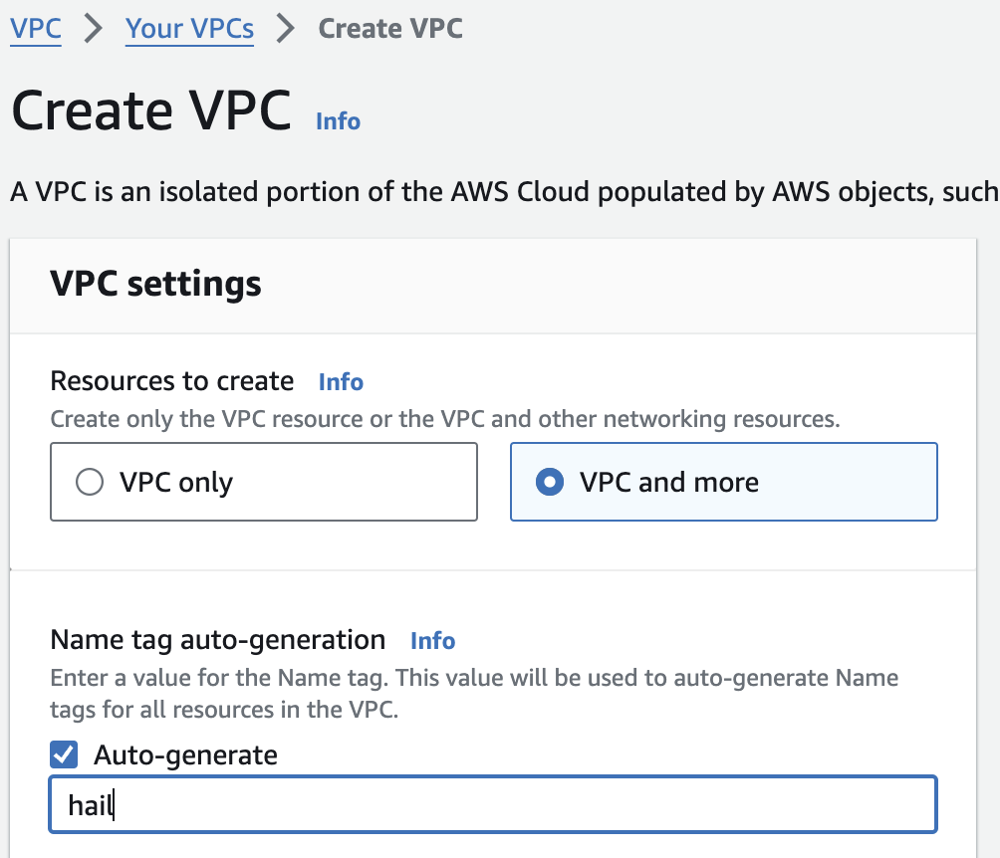](https://www.aws-ps-tech.kr/uploads/images/gallery/2024-04/screenshot-2024-04-18-at-11-36-34-pm.png)

### VPC 생성 확인

만들어진 `hail-vpc` 이름의 VPC ID 를 확인합니다.

[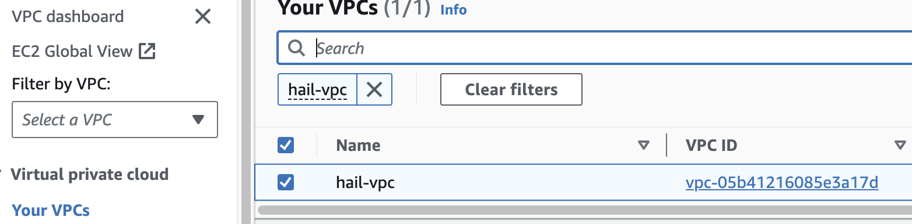](https://www.aws-ps-tech.kr/uploads/images/gallery/2024-04/screenshot-2024-04-18-at-11-38-25-pm.png)

2\. 보안 그룹을 2개 생성합니다. 이때 앞에서 만든 VPC를 선택해야 합니다.

여기서는 `emr-primary-sg` 와 `emr-core-sg` 로 이름을 지정했습니다.

[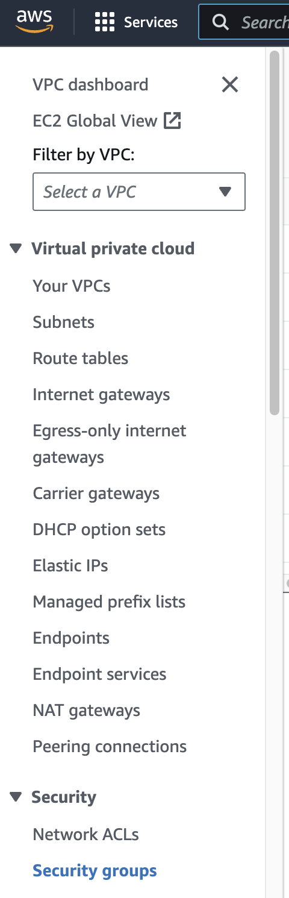](https://www.aws-ps-tech.kr/uploads/images/gallery/2024-04/screenshot-2024-04-18-at-11-37-33-pm.png)[ ](https://www.aws-ps-tech.kr/uploads/images/gallery/2024-04/screenshot-2024-04-18-at-11-39-07-pm.png)[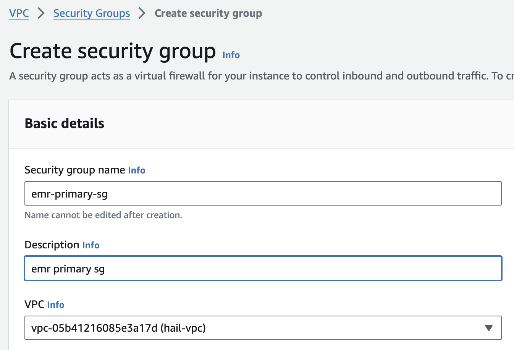](https://www.aws-ps-tech.kr/uploads/images/gallery/2024-04/screenshot-2024-04-18-at-11-40-01-pm.png)


AWS CloudFormation 을 사용하는 방법도 있습니다. [여기를 참고](https://catalog.us-east-1.prod.workshops.aws/workshops/c86bd131-f6bf-4e8f-b798-58fd450d3c44/en-US/setup/selfpaced/prerequisites)하세요.

[Stack 실행하기](https://us-east-1.console.aws.amazon.com/cloudformation/home?region=us-east-1#/stacks/quickcreate?stackName=emr-workshop&amp;templateURL=https://ws-assets-prod-iad-r-iad-ed304a55c2ca1aee.s3.us-east-1.amazonaws.com/c86bd131-f6bf-4e8f-b798-58fd450d3c44/emr-dev-exp-self-paced.template)


### EMR 클러스터 생성

1\. EMR 콘솔로 접속합니다.

[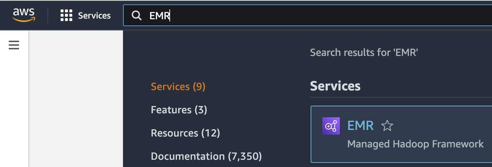](https://www.aws-ps-tech.kr/uploads/images/gallery/2024-04/screenshot-2024-04-18-at-11-40-57-pm.png)

2\. EMR on EC2 &gt; Clusters 메뉴를 선택하고 클러스터를 새로 생성합니다.

#### Name and applications

Application bundle은 `Custom` 을 선택합니다.

<table id="bkmrk-option-configuration" style="width: 90.7143%; height: 212.4px;"><thead><tr style="height: 29.8px;"><th style="width: 29.6938%; height: 29.8px;">Option</th><th style="width: 70.186%; height: 29.8px;">Configuration</th></tr></thead><tbody><tr style="height: 29.8px;"><td style="width: 29.6938%; height: 29.8px;">Release</td><td style="width: 70.186%; height: 29.8px;">emr-7.1.0</td></tr><tr style="height: 46.6px;"><td style="width: 29.6938%; height: 46.6px;">Software</td><td style="width: 70.186%; height: 46.6px;">\*Hadoop, Hive, Spark, Livy and JupyterHub, JupyterEnterpriseGateway</td></tr><tr style="height: 29.8px;"><td style="width: 29.6938%; height: 29.8px;">Multi-master support</td><td style="width: 70.186%; height: 29.8px;">Leave as deafult</td></tr><tr style="height: 46.6px;"><td style="width: 29.6938%; height: 46.6px;">AWS Glue Data Catalog Settings</td><td style="width: 70.186%; height: 46.6px;">Select 1. Use for Hive table metadata, 2. Use for Spark table metadata</td></tr><tr style="height: 29.8px;"><td style="width: 29.6938%; height: 29.8px;">Amazon Linux Release</td><td style="width: 70.186%; height: 29.8px;">Leave as deafult</td></tr></tbody></table>

[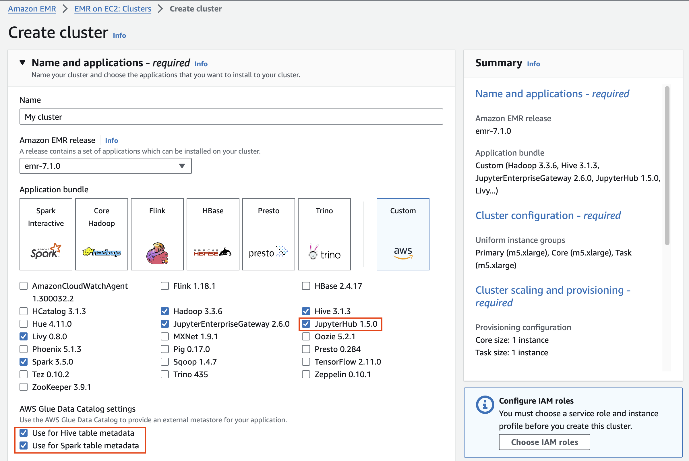](https://www.aws-ps-tech.kr/uploads/images/gallery/2024-04/screenshot-2024-04-18-at-11-42-51-pm.png)

#### Cluster configuration

Cluster configuration 에서 Task 노드는 삭제합니다.

[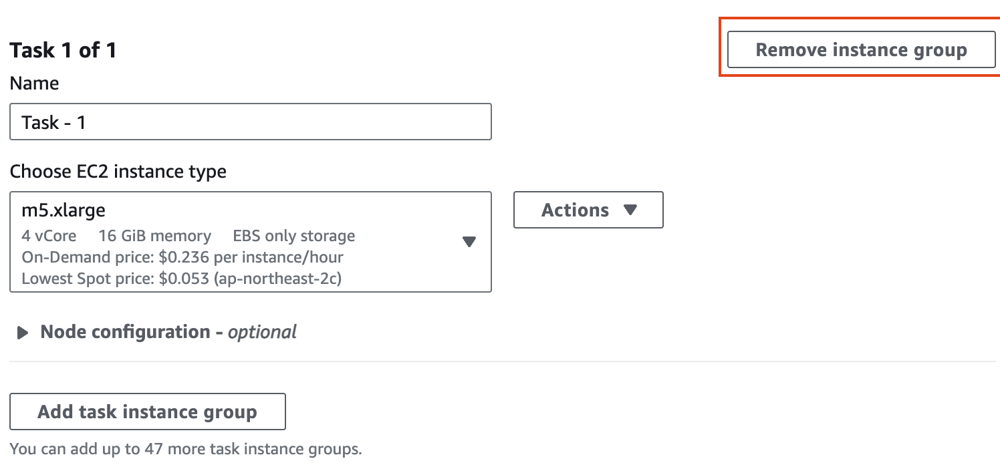](https://www.aws-ps-tech.kr/uploads/images/gallery/2024-04/screenshot-2024-04-18-at-11-45-17-pm.png)

인스턴스 그룹에서 기본의 경우 m5d.4xlarge(스토리지 추가)를 선택하고, 코어의 경우 m5.4xlarge를 선택한 후 작업 노드를 제거합니다(작업 노드는 작업 실행에만 사용되며 HDFS에 데이터를 저장하지 않습니다).

[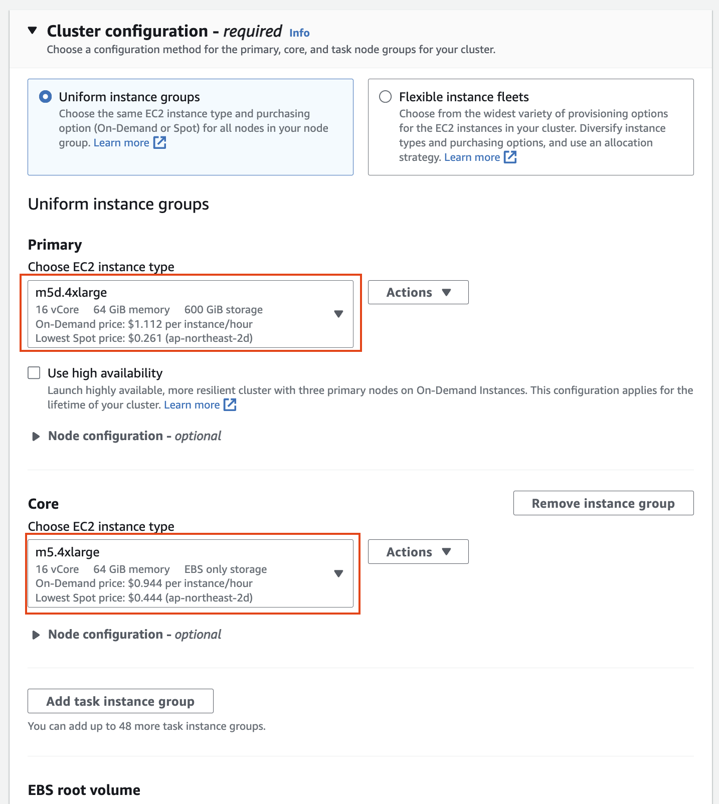](https://www.aws-ps-tech.kr/uploads/images/gallery/2024-04/screenshot-2024-04-18-at-11-46-31-pm.png)


#### Networking

Networking 설정에서 vpc는 앞에서 만들었던 hail-vpc에 해당하는 VPC ID 를 선택합니다.

<p class="callout info">Stack을 이용해 Networking을 구성했다면 EMR-Dev-Exp-VPC 라는 이름의 VPC를 선택해야 할 수도 있습니다.  
</p>

[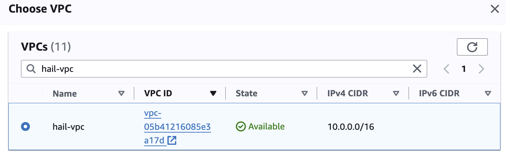](https://www.aws-ps-tech.kr/uploads/images/gallery/2024-04/screenshot-2024-04-18-at-11-47-46-pm.png)

Subnet은 public 중에 선택합니다.

[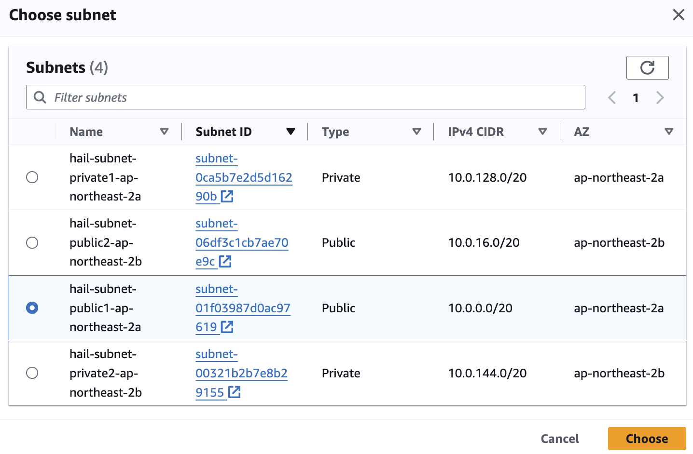](https://www.aws-ps-tech.kr/uploads/images/gallery/2024-04/screenshot-2024-04-18-at-11-49-02-pm.png)

[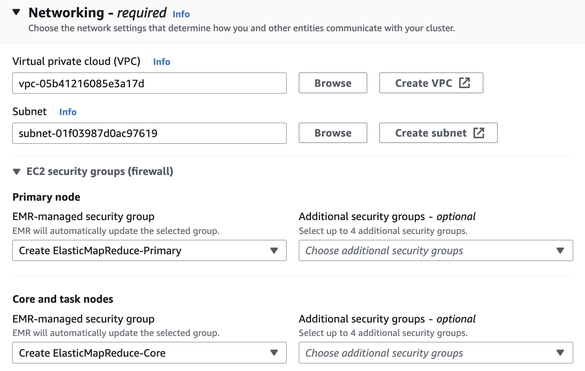](https://www.aws-ps-tech.kr/uploads/images/gallery/2024-04/screenshot-2024-04-18-at-11-50-55-pm.png)

[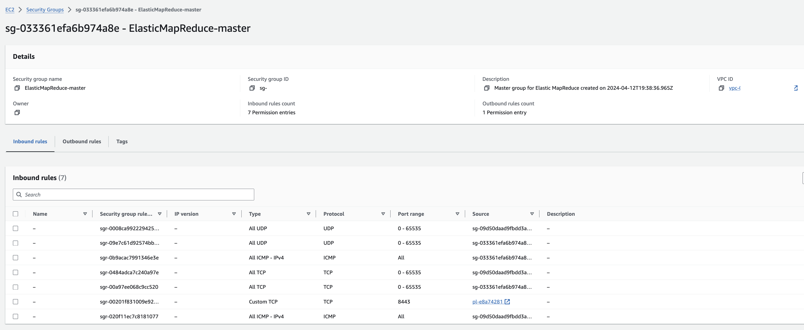](https://www.aws-ps-tech.kr/uploads/images/gallery/2024-04/Nn0screenshot-2024-04-19-at-9-32-13-am.png)

#### <span style="color: rgb(0, 7, 22); font-family: 'Amazon Ember', 'Helvetica Neue', Roboto, Arial, sans-serif; font-size: 20px; font-style: normal; font-variant-ligatures: normal; font-variant-caps: normal; font-weight: bold; letter-spacing: -0.3px; orphans: 2; text-align: start; text-indent: 0px; text-transform: none; widows: 2; word-spacing: 0px; -webkit-text-stroke-width: 0px; white-space: normal; background-color: rgb(255, 255, 255); text-decoration-thickness: initial; text-decoration-style: initial; text-decoration-color: initial; display: inline !important; float: none;">Cluster termination and node replacement</span>

Cluster termination and node replacement &gt; Termination option에서 `Manually terminate cluster` 를 선택합니다.

[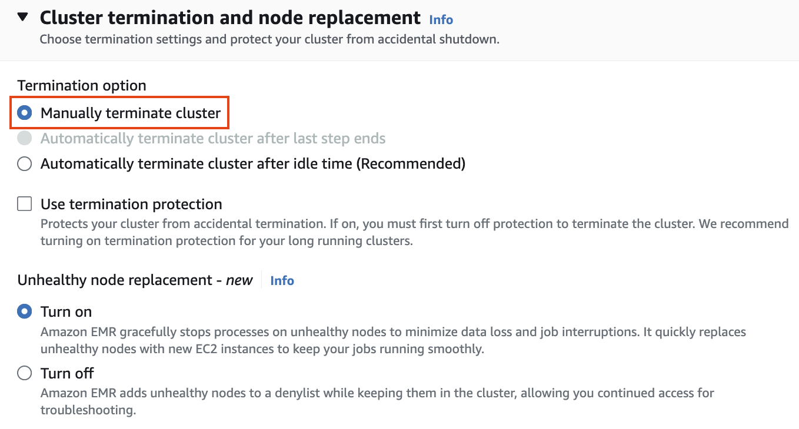](https://www.aws-ps-tech.kr/uploads/images/gallery/2024-04/screenshot-2024-04-18-at-11-51-22-pm.png)

#### Cluster logs

클러스터 로그 설정에서 클러스터별 로그를 Amazon S3에 게시를 선택한 다음 S3 찾아보기를 클릭합니다. "emr-dev-exp-xxxxx"가 있는 버킷을 선택하고 /logs/ 접미사를 추가합니다.

[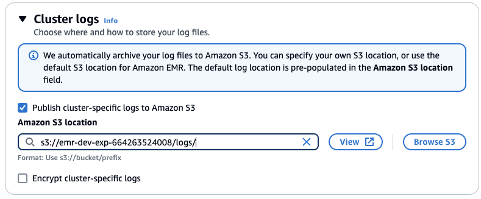](https://www.aws-ps-tech.kr/uploads/images/gallery/2024-05/screenshot-2024-05-10-at-11-24-41-am.png)

#### <span style="color: rgb(0, 7, 22); font-family: 'Amazon Ember', 'Helvetica Neue', Roboto, Arial, sans-serif; font-size: 20px; font-style: normal; font-variant-ligatures: normal; font-variant-caps: normal; font-weight: bold; letter-spacing: -0.3px; orphans: 2; text-align: start; text-indent: 0px; text-transform: none; widows: 2; word-spacing: 0px; -webkit-text-stroke-width: 0px; white-space: normal; background-color: rgb(255, 255, 255); text-decoration-thickness: initial; text-decoration-style: initial; text-decoration-color: initial; display: inline !important; float: none;">Security configuration and EC2 key pair</span>

보안 구성 및 EC2 키 쌍에서 키 쌍을 만들고 ssh용 .pem 키 파일을 저장합니다.

[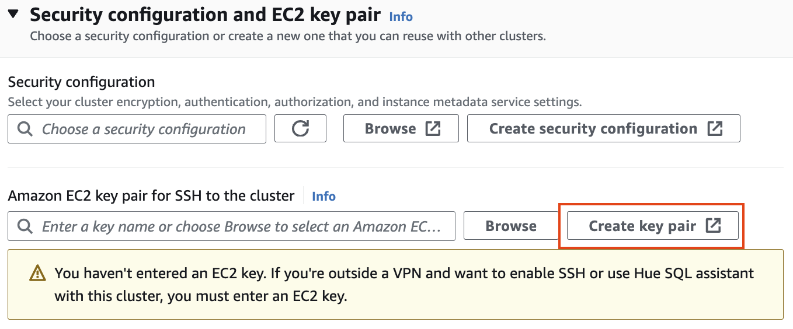](https://www.aws-ps-tech.kr/uploads/images/gallery/2024-04/screenshot-2024-04-18-at-11-52-53-pm.png)

[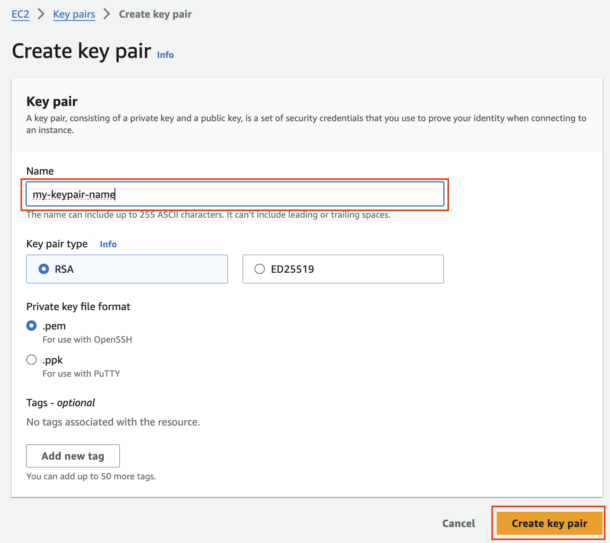](https://www.aws-ps-tech.kr/uploads/images/gallery/2024-04/screenshot-2024-04-18-at-11-53-19-pm.png)

#### <span style="color: rgb(0, 7, 22); font-family: 'Amazon Ember', 'Helvetica Neue', Roboto, Arial, sans-serif; font-size: 20px; font-style: normal; font-variant-ligatures: normal; font-variant-caps: normal; font-weight: bold; letter-spacing: -0.3px; orphans: 2; text-align: start; text-indent: 0px; text-transform: none; widows: 2; word-spacing: 0px; -webkit-text-stroke-width: 0px; white-space: normal; background-color: rgb(255, 255, 255); text-decoration-thickness: initial; text-decoration-style: initial; text-decoration-color: initial; display: inline !important; float: none;">Identity and Access Management (IAM) roles</span>

ID 및 액세스 관리 역할에서 서비스 역할 및 인스턴스 프로필 만들기를 선택할 수도 있습니다.

[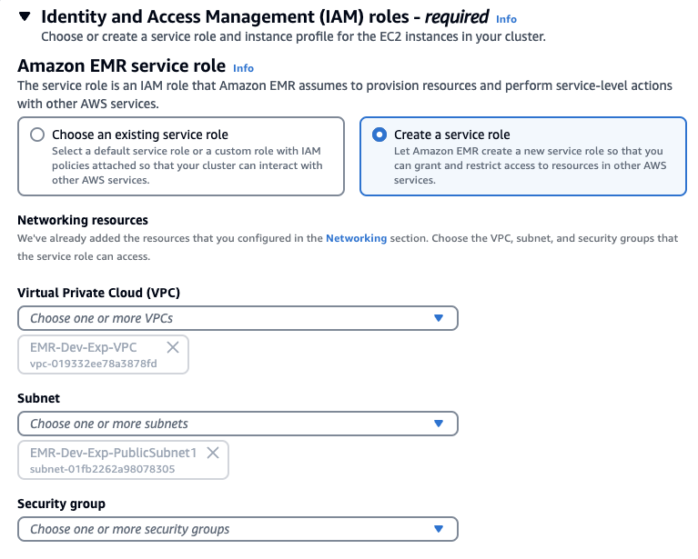](https://www.aws-ps-tech.kr/uploads/images/gallery/2024-05/screenshot-2024-05-10-at-11-26-08-am.png)

<p class="callout info">Stack을 사용햇다면 아래처럼 기존에 존재하는 Role을 선택하고 EMRDevExp-EMRClusterServiceRole을 선택합니다. 마찬가지로 EC2 instance profile에 대해서도 스택에 의해 만들어져있는 EMRDevExp-EMR\_EC2\_Restricted\_Role을 선택합니다.  
</p>

[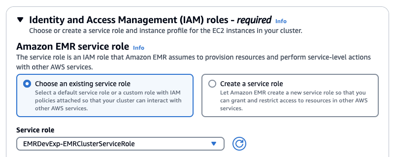](https://www.aws-ps-tech.kr/uploads/images/gallery/2024-05/screenshot-2024-05-10-at-11-25-22-am.png)

[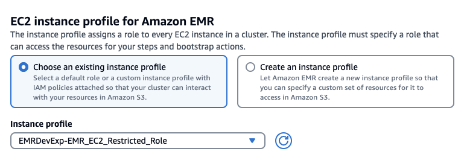](https://www.aws-ps-tech.kr/uploads/images/gallery/2024-05/screenshot-2024-05-10-at-11-26-48-am.png)

### 클러스터 생성 확인  


다음과 같이 EMR 클러스터 생성을 확인합니다.

[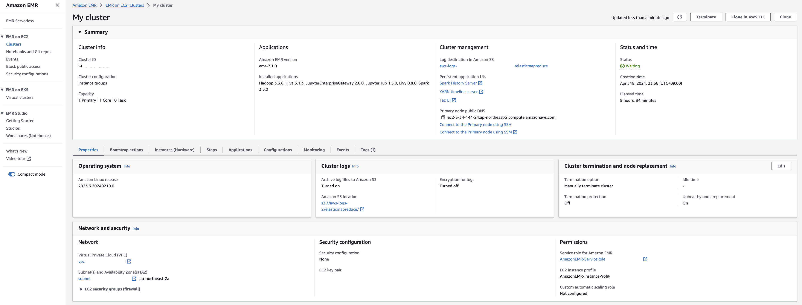](https://www.aws-ps-tech.kr/uploads/images/gallery/2024-04/BhMscreenshot-2024-04-19-at-9-31-02-am.png)

EMR-master 에 대한 Security group 확인을 해봅니다. Edit inbound rules를 눌러 ssh 로 접속할 수 있도록 룰을 추가합니다.

[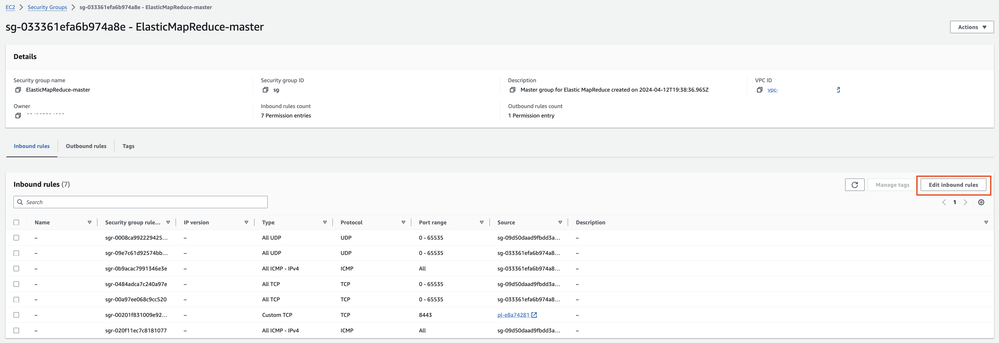](https://www.aws-ps-tech.kr/uploads/images/gallery/2024-04/8c8screenshot-2024-04-19-at-9-47-48-am.png)

EMR-slave에 대한 Security group 확인

[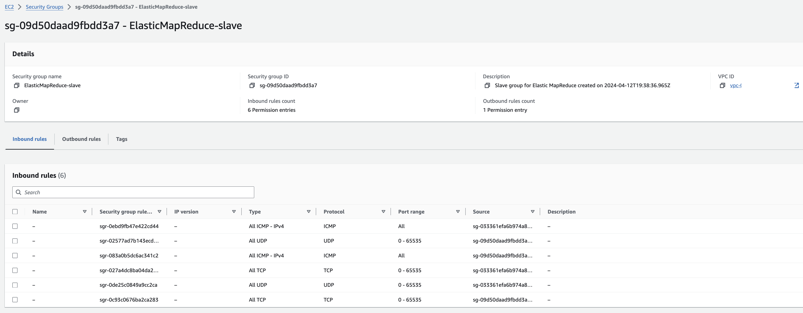](https://www.aws-ps-tech.kr/uploads/images/gallery/2024-04/dI2screenshot-2024-04-19-at-9-33-11-am.png)

#### Installing &amp; Running Hail on Primary Node

cluster 접속

```
aws emr ssh --cluster-id <cluster-id> --key-pair-file <path to pem>
```

hail 설치 (참고)

```
sudo yum install git lz4 lz4-devel openblas-devel lapack-devel 

git clone https://github.com/hail-is/hail.git

cd hail/hail

export JAVA_HOME=/usr/lib/jvm/java-1.8.0-amazon-corretto
export PATH=$PATH:/home/hadoop/.local/bin

make install-on-cluster HAIL_COMPILE_NATIVES=1 SCALA_VERSION=2.12.18 SPARK_VERSION=3.5.0
```

hail test ([참고](https://hail.is/docs/0.2/install/try.html#next-steps))

```
import hail
mt = hail.balding_nichols_model(n_populations=3,
                              n_samples=10,
                              n_variants=100)
mt.show()

```

**Running with Spark (중요)**

```
from pyspark.sql import SparkSession
import hail as hail
hail_dir = "/home/hadoop/.local/lib/python3.9/site-packages/hail" # Edit the path accordingly.

spark = SparkSession.builder \
    .config("spark.jars", f"{hail_dir}/backend/hail-all-spark.jar") \
    .config("spark.driver.extraClassPath", f"{hail_dir}/backend/hail-all-spark.jar") \
    .config("spark.executor.extraClassPath", "./hail-all-spark.jar") \
    .config("spark.kryo.registrator", "is.hail.kryo.HailKryoRegistrator") \
    .config("spark.serializer", "org.apache.spark.serializer.KryoSerializer") \
    .getOrCreate()


hail.init(spark.sparkContext)


#hail.stop() #if previous session is still open
```


#### 참고 링크

- [Git repository](https://github.com/ryerobinson/quickstart-hail)
- [EMR COntainers Best Practices Guides](https://aws.github.io/aws-emr-containers-best-practices/troubleshooting/docs/change-log-level/)

#### 트러블 슈팅

py4j.protocol.Py4JJavaError: An error occurred while calling z:is.hail.backend.spark.SparkBackend.apply.  
: is.hail.utils.HailException: This Hail JAR was compiled for Spark 3.3.0, cannot run with Spark 3.5.0-amzn-1.  
 The major and minor versions must agree, though the patch version can differ.

**export JAVA\_HOME**

[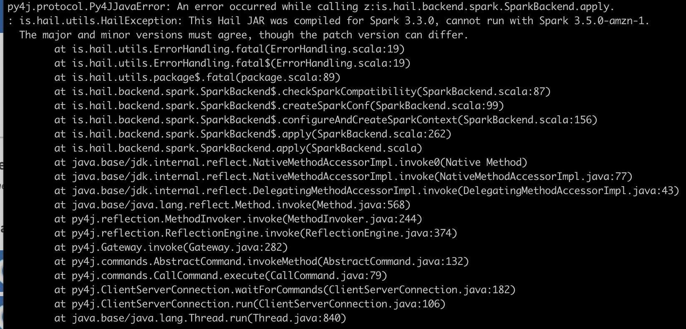](https://www.aws-ps-tech.kr/uploads/images/gallery/2024-04/screenshot-2024-04-19-at-9-53-10-am.png)

export PATH=$PATH:/home/hadoop/.local/bin

[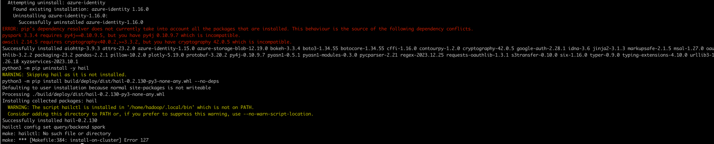](https://www.aws-ps-tech.kr/uploads/images/gallery/2024-04/screenshot-2024-04-19-at-10-36-37-am.png)