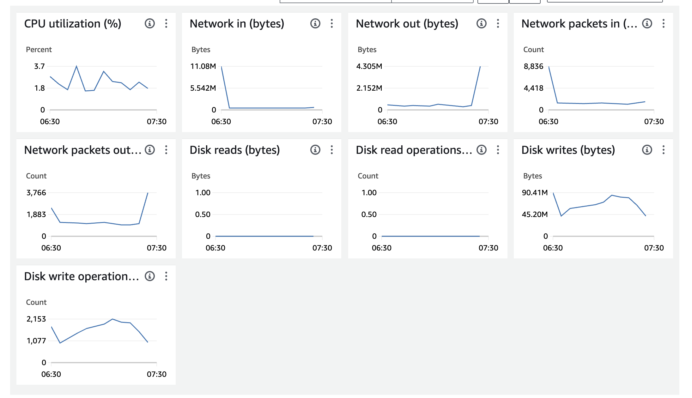
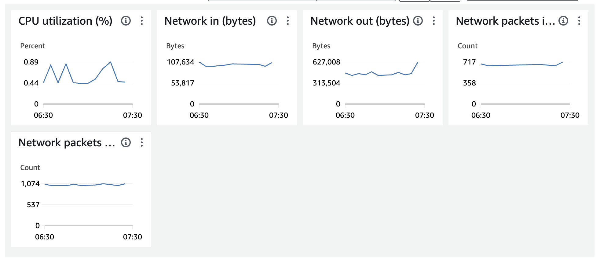

### 노트북 셋업

1. EMR 스튜디오에서 동일한 VPC에 새 스튜디오를 만듭니다.
2. 생성한 스튜디오에 대한 새 작업 공간(노트북)을 생성하면 완료되면 jupyterHub에 대한 새 탭이 자동으로 열립니다.
3. python3 커널을 사용하여 새 노트북을 시작합니다.

### EMR 노트북에 Hail 설치

```
pip install hail
```

**추후 S3a 프로토콜 사용을 위한 내용** ([Hadoop-AWS module](https://hadoop.apache.org/docs/stable/hadoop-aws/tools/hadoop-aws/index.html))

1. Ssh into primary node (**as sudo user**)
2. Go to the jars directory: `cd /home/emr-notebook/.local/lib/python3.9/site-packages/pyspark/jars`
3. Download the 2 jar files with the following command in the directory: 
    1. sudo curl -sSL https://search.maven.org/remotecontent?filepath=org/apache/hadoop/hadoop-aws/3.3.2/hadoop-aws-3.3.2.jar &gt; ./hadoop-aws-3.3.2.jar
    2. sudo curl -sSL https://search.maven.org/remotecontent?filepath=com/amazonaws/aws-java-sdk-bundle/1.12.99/aws-java-sdk-bundle-1.12.99.jar &gt; ./aws-java-sdk-bundle-1.12.99.jar

<details id="bkmrk-%EC%9D%98%EC%A1%B4%EC%84%B1-%EC%84%A4%EC%B9%98-https%3A%2F%2Frepo1"><summary>의존성 설치</summary>

[https://repo1.maven.org/maven2/org/apache/hadoop/hadoop-aws/3.3.6/](https://repo1.maven.org/maven2/org/apache/hadoop/hadoop-aws/3.3.6/)

[https://repo1.maven.org/maven2/com/amazonaws/aws-java-sdk-bundle/](https://repo1.maven.org/maven2/com/amazonaws/aws-java-sdk-bundle/)

</details><span style="caret-color: rgb(0, 0, 0); color: rgb(0, 0, 0); font-family: -webkit-standard; font-size: medium; font-style: normal; font-variant-caps: normal; font-weight: 400; letter-spacing: normal; orphans: auto; text-align: start; text-indent: 0px; text-transform: none; white-space: normal; widows: auto; word-spacing: 0px; -webkit-text-stroke-width: 0px; text-decoration: none; display: inline !important; float: none;">There are 2 jars missing in the java class path the notebook is using. Using python shell directly from the cluster does not need to do this (but only need to point </span>`SPARK_HOME`<span style="caret-color: rgb(0, 0, 0); color: rgb(0, 0, 0); font-family: -webkit-standard; font-size: medium; font-style: normal; font-variant-caps: normal; font-weight: 400; letter-spacing: normal; orphans: auto; text-align: start; text-indent: 0px; text-transform: none; white-space: normal; widows: auto; word-spacing: 0px; -webkit-text-stroke-width: 0px; text-decoration: none; display: inline !important; float: none;"> to the jars because the required dependencies are already there if run from hadoop environment) as Notebook hosts a different environment for all dependencies installed. Also, the hadoop version (uses aws version of hadoop) and package is slightly different from what we get in the hadoop environment in </span>`SPARK_HOME;`<span style="caret-color: rgb(0, 0, 0); color: rgb(0, 0, 0); font-family: -webkit-standard; font-size: medium; font-style: normal; font-variant-caps: normal; font-weight: 400; letter-spacing: normal; orphans: auto; text-align: start; text-indent: 0px; text-transform: none; white-space: normal; widows: auto; word-spacing: 0px; -webkit-text-stroke-width: 0px; text-decoration: none; display: inline !important; float: none;"> Notebook environment uses the external hadoop client, meaning that it will not be able to connect to S3. </span>  
<span style="caret-color: rgb(0, 0, 0); color: rgb(0, 0, 0); font-family: -webkit-standard; font-size: medium; font-style: normal; font-variant-caps: normal; font-weight: 400; letter-spacing: normal; orphans: auto; text-align: start; text-indent: 0px; text-transform: none; white-space: normal; widows: auto; word-spacing: 0px; -webkit-text-stroke-width: 0px; text-decoration: none; display: inline !important; float: none;">We need to download aws sdk jar and hadoop aws jar and put them into Notebook’s environment jar collection. </span>

<span style="caret-color: rgb(0, 0, 0); color: rgb(0, 0, 0); font-family: -webkit-standard; font-size: medium; font-style: normal; font-variant-caps: normal; font-weight: 400; letter-spacing: normal; orphans: auto; text-align: start; text-indent: 0px; text-transform: none; white-space: normal; widows: auto; word-spacing: 0px; -webkit-text-stroke-width: 0px; text-decoration: none; display: inline !important; float: none;">Primary 노드의 인스턴스 EC2 Monitoring</span>

[](https://www.aws-ps-tech.kr/uploads/images/gallery/2024-05/screenshot-2024-05-21-at-4-34-18-pm.png)

**Core 노드의 인스턴스 EC2 Monitoring**

[](https://www.aws-ps-tech.kr/uploads/images/gallery/2024-05/screenshot-2024-05-21-at-4-35-31-pm.png)

**예제 노트북 다운로드**

[hail-tutorial.zip](https://www.aws-ps-tech.kr/attachments/1)

### **참고문서**

- [https://hail.is/docs/0.2/tutorials/01-genome-wide-association-study.html#Quality-Control](https://hail.is/docs/0.2/tutorials/01-genome-wide-association-study.html#Quality-Control)
- [https://github.com/hmkim/quickstart-hail/tree/main/packer-files/scripts](https://github.com/hmkim/quickstart-hail/tree/main/packer-files/scripts)
- **EMR on EC2로 Hail 쥬피터를 사용하기 위한 EMR 노트북 환경 구성**
    - [https://catalog.us-east-1.prod.workshops.aws/workshops/c86bd131-f6bf-4e8f-b798-58fd450d3c44/en-US/emr-notebooks-sagemaker](https://catalog.us-east-1.prod.workshops.aws/workshops/c86bd131-f6bf-4e8f-b798-58fd450d3c44/en-US/emr-notebooks-sagemaker)
- **EMR Serverless 로 Hail 작업제출하기**
    - https://catalog.us-east-1.prod.workshops.aws/workshops/f9855d43-62e3-441b-ba02-7f37a278c077/en-US/5-emr-serverless