Deploy an [EMR cluster on AWS](https://aws.amazon.com/emr/), with Spark, [Hail](https://hail.is/index.html), [Zeppelin](https://zeppelin.apache.org/) and [Ensembl VEP](https://ensembl.org/info/docs/tools/vep/index.html) using CloudFormation service.

This tool requires the following programs to be previously installed in your computer:

- Amazon's `Command Line Interface (CLI)` utility
- Git

To install the required software open a terminal and execute the following:

For Mac:

```
# Installs homebrew
ruby -e "$(curl -fsSL https://raw.githubusercontent.com/Homebrew/install/master/install)"

# Installs AWS CLI
brew install awscli
```

For Debian / Ubuntu (apt-get):

```
curl "https://awscli.amazonaws.com/awscli-exe-linux-x86_64.zip" -o "awscliv2.zip"
unzip awscliv2.zip
sudo ./aws/install

sudo apt-get install -y git
```

For Fedora (dnf/yum):

```
curl "https://awscli.amazonaws.com/awscli-exe-linux-x86_64.zip" -o "awscliv2.zip"
unzip awscliv2.zip
sudo ./aws/install

sudo dnf install git # or sudo yum install git
```

For Amazon Linux 2023:

```
sudo dnf install git
```

# CloudFormation stack preparation

1\. Prepare the AWS credentials and apply them in the terminal.

```bash
export AWS_DEFAULT_REGION="{AWS_REGION}"
export AWS_ACCESS_KEY_ID="{ACCESS_KEY}"
export AWS_SECRET_ACCESS_KEY="{SECRET_ACCESS_KEY}"
export AWS_SESSION_TOKEN="{SESSION_TOKEN}"
```

2\. Create an S3 bucket in the region where you want to launch this CloudFormation stack.

```
aws s3 mb s3://{bucket name} --region {region}
```

Download and unzip the content from this repository, then place the downloaded content into the S3 bucket you created earlier.

```bash
export AWS_BUCKET={bucket name}
git clone https://github.com/hmkim/quickstart-hail.git
cd quickstart-hail
aws s3 sync . s3://$AWS_BUCKET/quickstart-hail/ --exclude ".git/*"
```

3\. Connect to the Amazon S3 console and check the bucket and directory.

[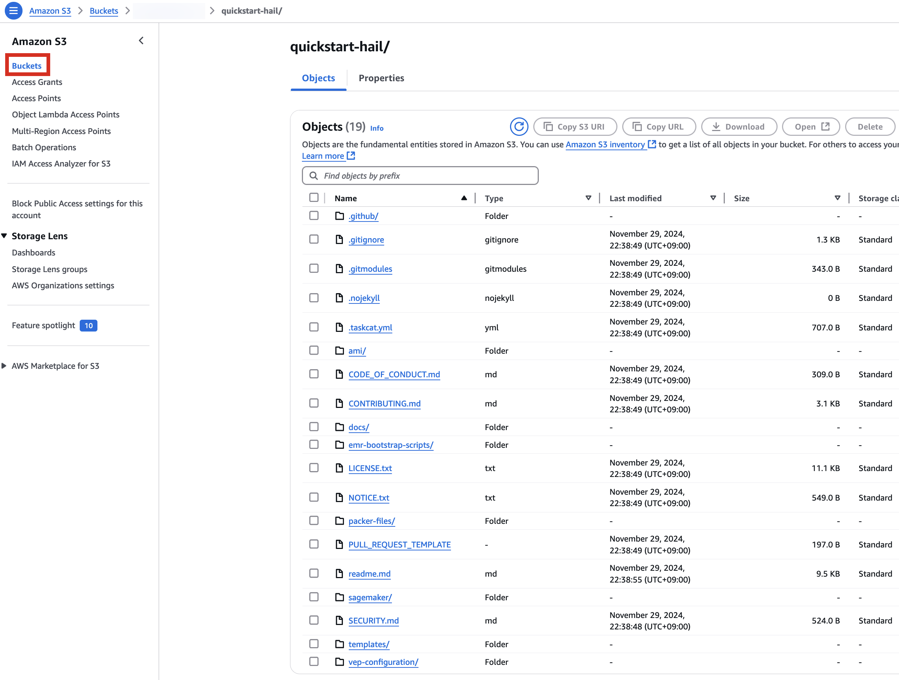](https://www.aws-ps-tech.kr/uploads/images/gallery/2024-12/uaCimage.png)

# Run the CloudFormation stack

1\. Go to the [CloudFormation](https://us-east-1.console.aws.amazon.com/cloudformation/home?region=us-east-1) console.


2\. Creates a new stack. At this time, select **`With new resources (standard)`**.


3\. Go to the Amazon S3 console, select `hail-launcher.template.yaml` in the template directory you uploaded earlier, and click `<strong>Copy URL</strong>`. The path is as follows:

**{bucket name} &gt; quickstart-hail &gt; templates &gt; hail-launcher.template.yaml**

[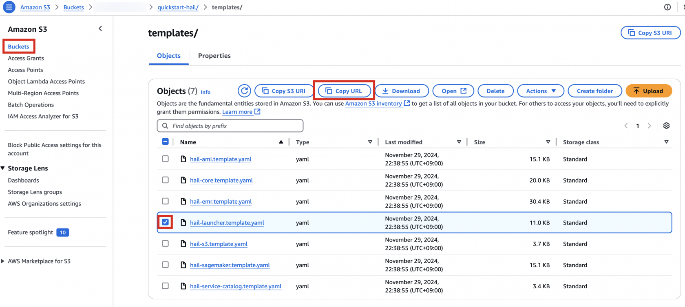](https://www.aws-ps-tech.kr/uploads/images/gallery/2024-12/image.png)

When creating a CloudFormation stack, enter this URL and create the stack.

[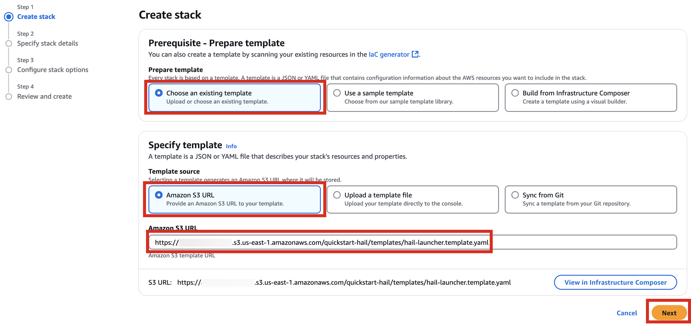](https://www.aws-ps-tech.kr/uploads/images/gallery/2024-12/Whlimage.png)

4\. Proceed with entering information to create a stack.

Type an name for the stack.

[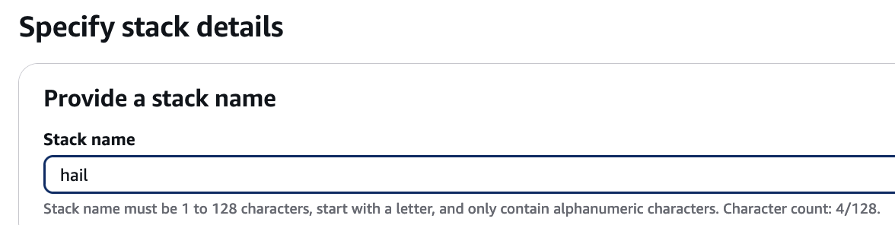](https://www.aws-ps-tech.kr/uploads/images/gallery/2024-12/JI3image.png)

Select a VPC. Select one subnet within the same VPC. For this exercise, select public.


Let's set it up to create additional buckets as needed.

Enter the name of the existing bucket where the `quickstart-hail` folder was uploaded, and check the region.

Here, the bucket name `awsimd-us-east-1` was used, and the `Hail S3 bucket name` and `Sagemaker home directory S3 bucket name` were suffixed with `-s3` and `-sm`, respectively. Modify the bucket names as appropriate.


5\. Finally, press the **`Next`** button to create the stack.


6\. Check stack creation in CloudFormation.


If the following portfolio appears in the output along with the **`CREATE_COMPLETE`** message in the top stack, you can confirm that it was executed correctly.


# Create an AMI for Hail and VEP

## Pre-downloading VEP Data and Storing in Bucket

For VEP, you can pre-download the data and store it in the bucket created or specified through the stack (using the `bucketHail` value from CloudFormation's Outputs).

[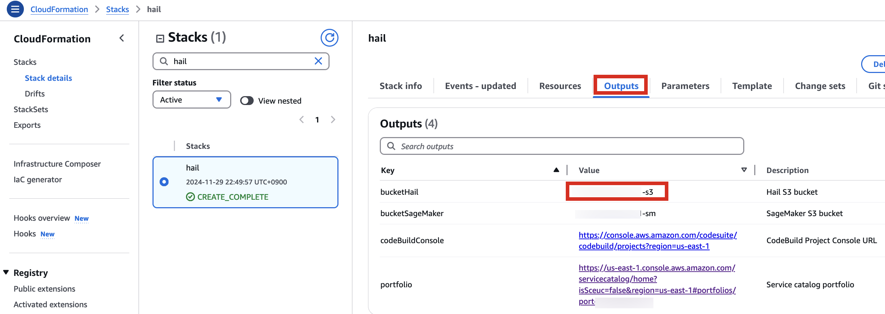](https://www.aws-ps-tech.kr/uploads/images/gallery/2024-12/jY3image.png)


Download VEP data using the wget command:

```
wget ftp://ftp.ensembl.org/pub/release-112/variation/vep/homo_sapiens_vep_112_GRCh37.tar.gz
```

Upload the downloaded file to your bucket: (<span style="color: rgb(224, 62, 45);">I emphasize that this is the value for the `BucketHail` key confirmed in CloudFormation Outputs</span>)

```bash
aws s3 cp homo_sapiens_vep_112_GRCh37.tar.gz s3://{defined Hail S3 bucket}/vep/cache/
```

## AMI Build  


1\. Access the [CodeBuild console ](https://us-east-1.console.aws.amazon.com/codesuite/codebuild/projects?region=us-east-1)and initiate the build process for each new AMI. Select Start build &gt; Start with overrides.

[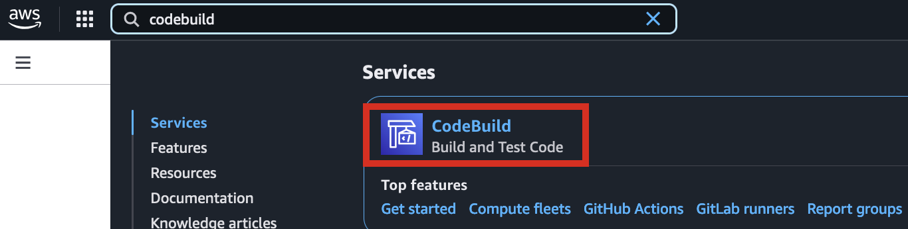](https://www.aws-ps-tech.kr/uploads/images/gallery/2024-12/t6qimage.png)

[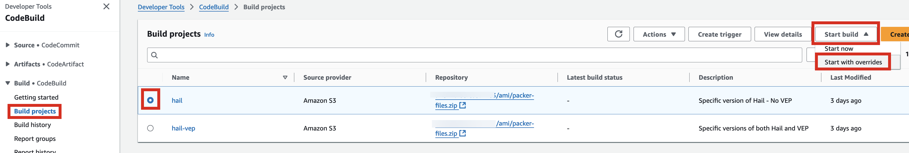](https://www.aws-ps-tech.kr/uploads/images/gallery/2024-12/zwjimage.png)

2\. In the Environment section, expand Additional configuration and input the required values.

[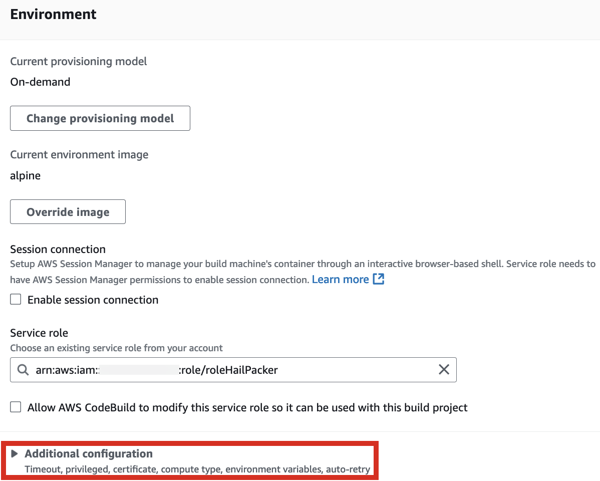](https://www.aws-ps-tech.kr/uploads/images/gallery/2024-12/Nz5image.png)

[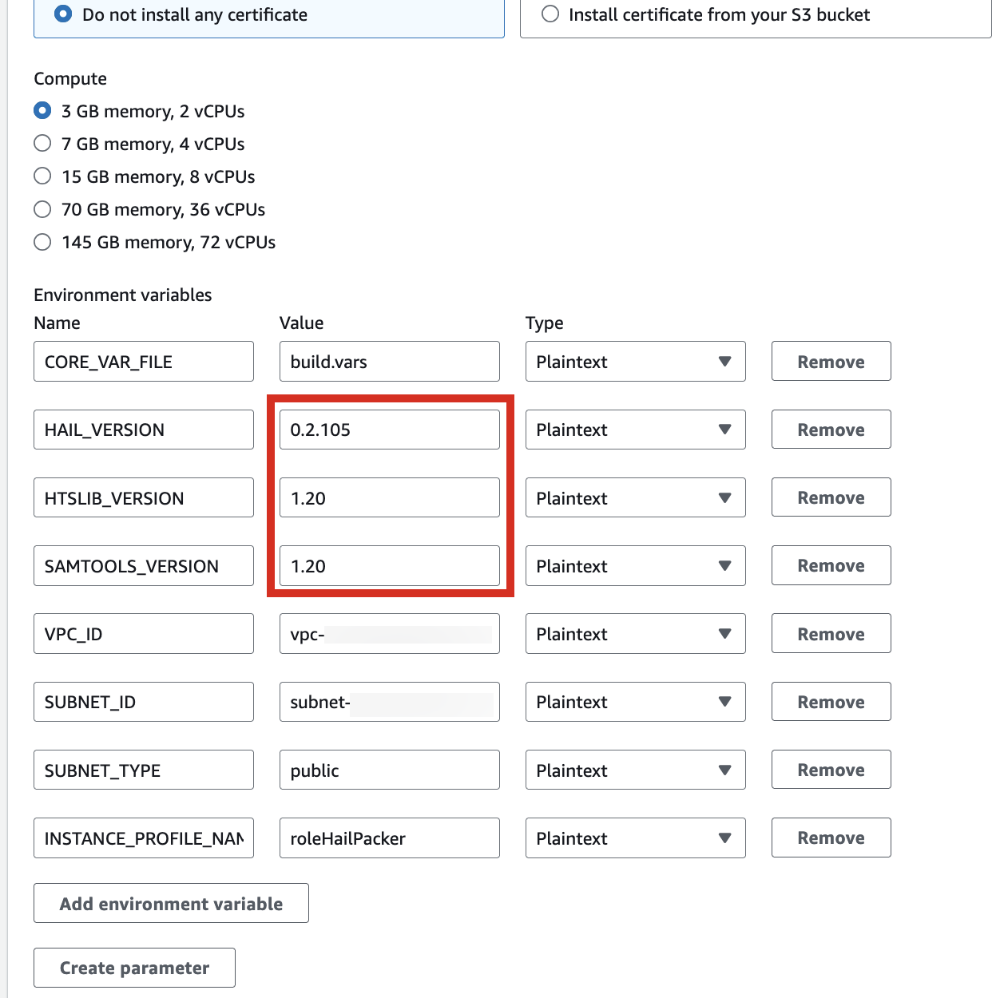](https://www.aws-ps-tech.kr/uploads/images/gallery/2024-12/6rnimage.png)

<table id="bkmrk-hail_version-0.2.105" style="width: 26.4286%; height: 89.4px;"><thead><tr style="height: 29.8px;"><th style="width: 70.0901%; height: 29.8px;">HAIL\_VERSION</th><th style="width: 29.2492%; height: 29.8px;">0.2.105</th></tr></thead><tbody><tr style="height: 29.8px;"><td style="width: 70.0901%; height: 29.8px;">HTSLIB\_VERSION</td><td style="width: 29.2492%; height: 29.8px;">1.20</td></tr><tr style="height: 29.8px;"><td style="width: 70.0901%; height: 29.8px;">SAMTOOLS\_VERSION</td><td style="width: 29.2492%; height: 29.8px;">1.20</td></tr></tbody></table>

\* For building with hail-vep option (includes VEP installation):

<table id="bkmrk-hail_version-0.2.105-1"><thead><tr><th>HAIL\_VERSION</th><th>0.2.105</th></tr></thead><tbody><tr><td>HTSLIB\_VERSION</td><td>1.20</td></tr><tr><td>SAMTOOLS\_VERSION</td><td>1.20</td></tr><tr><td>VEP\_VERSION</td><td>107</td></tr><tr><td>**RODA\_BUCKET**</td><td>**value for the `BucketHail` key in CloudFormation Outputs** </td></tr></tbody></table>

[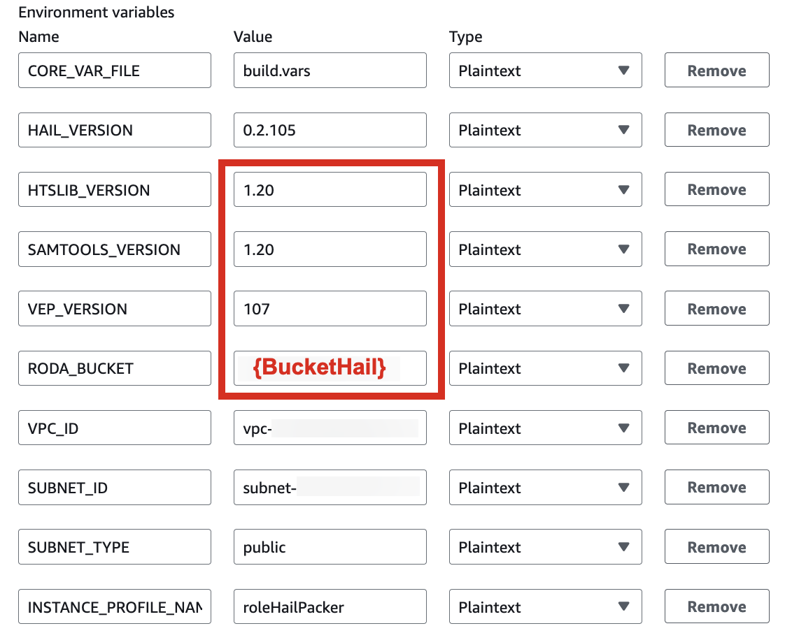](https://www.aws-ps-tech.kr/uploads/images/gallery/2024-12/rYGimage.png)

3\. Check the build status in CodeBuild

**Hail (without VEP):** The Hail image build completes in about 20 minutes.

[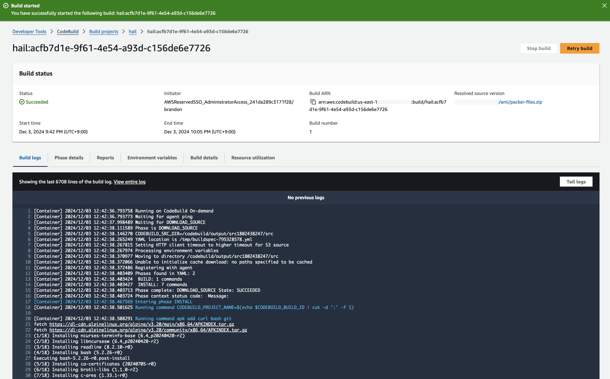](https://www.aws-ps-tech.kr/uploads/images/gallery/2024-12/9Wlimage.png)

[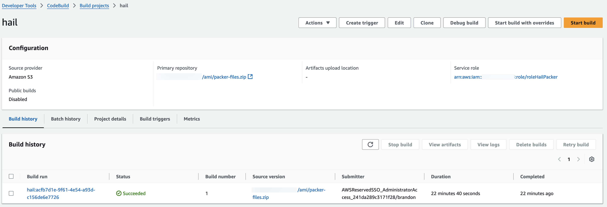](https://www.aws-ps-tech.kr/uploads/images/gallery/2024-12/VdYimage.png)

**Hail (VEP)**: The VEP version build takes approximately 1 hour and 38 minutes to complete.


You can find the \*\*AMI results\*\* in either the AMI menu of [Amazon EC2 console](https://console.aws.amazon.com/ec2/) or CodeBuild logs.

[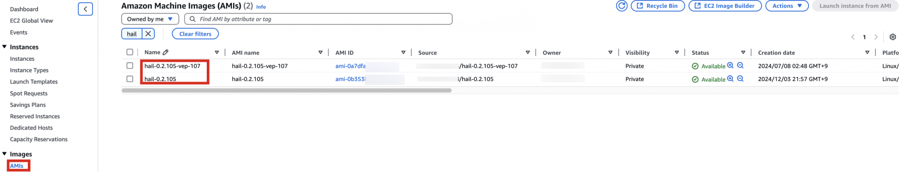](https://www.aws-ps-tech.kr/uploads/images/gallery/2024-12/IgJimage.png)

# **EMR Cluster Setup and Jupyter Environment Configuration**

## EMR Cluster Setup

1\. In the CloudFormation service console's Outputs tab, click the portfolio.

[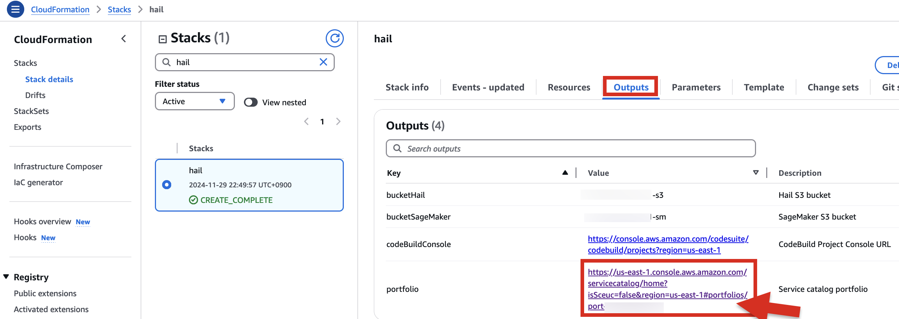](https://www.aws-ps-tech.kr/uploads/images/gallery/2024-12/9emimage.png)

2\. In the portfolio of AWS Service Catalog, locate the relevant Product, click the Access tab, then select Grant access.

[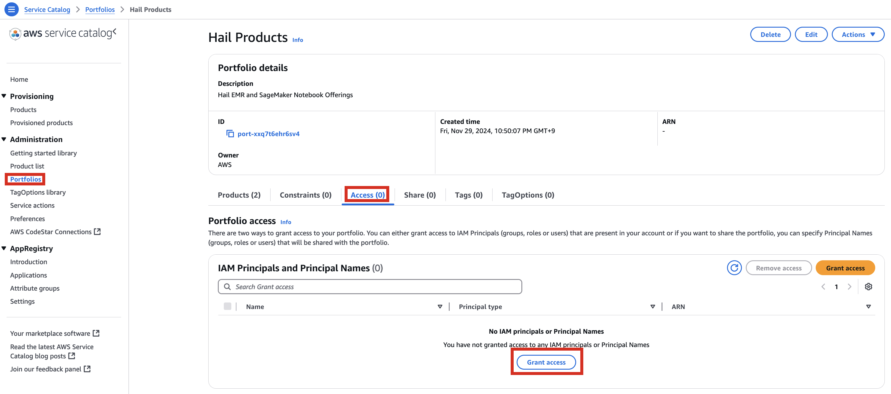](https://www.aws-ps-tech.kr/uploads/images/gallery/2024-12/qjKimage.png)

3\. Add permissions. Check the user that suits you and grant them access to Hail Products. Search for it, select it, and click Grant access.

[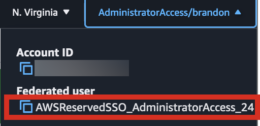](https://www.aws-ps-tech.kr/uploads/images/gallery/2024-12/A2zimage.png)

[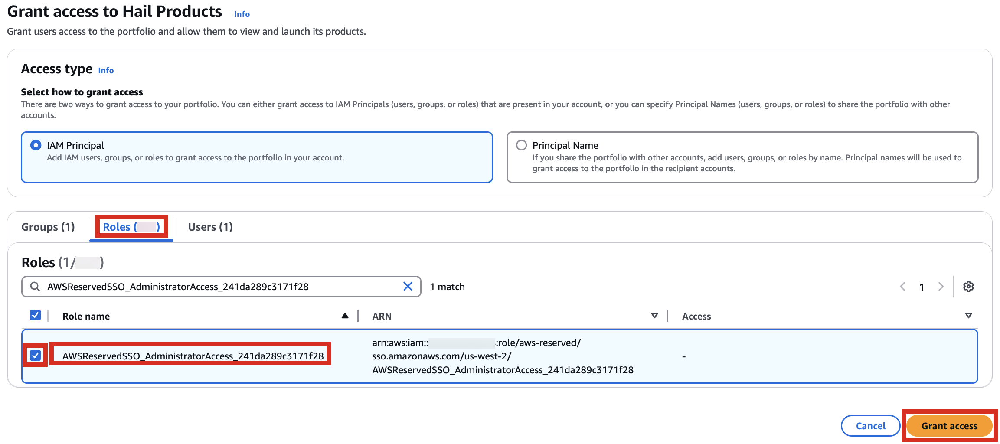](https://www.aws-ps-tech.kr/uploads/images/gallery/2024-12/0lWimage.png)

4\. After confirming access permissions, navigate to the Product in the Provisioning menu.

[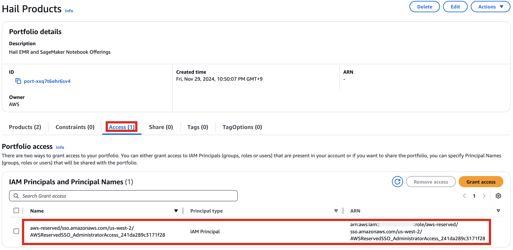](https://www.aws-ps-tech.kr/uploads/images/gallery/2024-12/UvRimage.png)

5\. With permissions granted, you should now see 2 Products listed.

[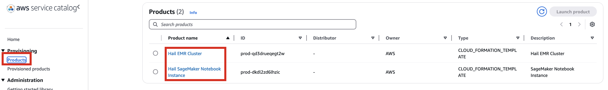](https://www.aws-ps-tech.kr/uploads/images/gallery/2024-12/ZYiimage.png)

6\. Select the Hail EMR Cluster product and click Launch product.


7\. Enter the required launch information.

Either enter a name manually or click Generate name.


Specify the Hail AMI you created earlier. You can find the AMI ID in the EC2 service's AMIs section (as previously described).


Input the Cluster name and Hail AMI ID. You can leave all other settings at their default values.


8\. Click Launch product at the bottom of the page.


## SageMaker Notebook Setup

1\. Similarly, select Launch product in the Product menu.

[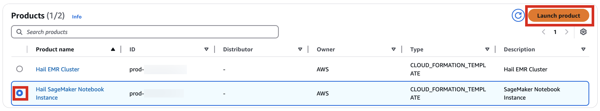](https://www.aws-ps-tech.kr/uploads/images/gallery/2024-12/p2Eimage.png)

2\. Provide a name for your Hail notebook instance. Keep all other settings at their defaults.


3\. Click Launch product at the bottom of the page.


*\*Note: You can monitor the product deployment progress through CloudFormation.*

[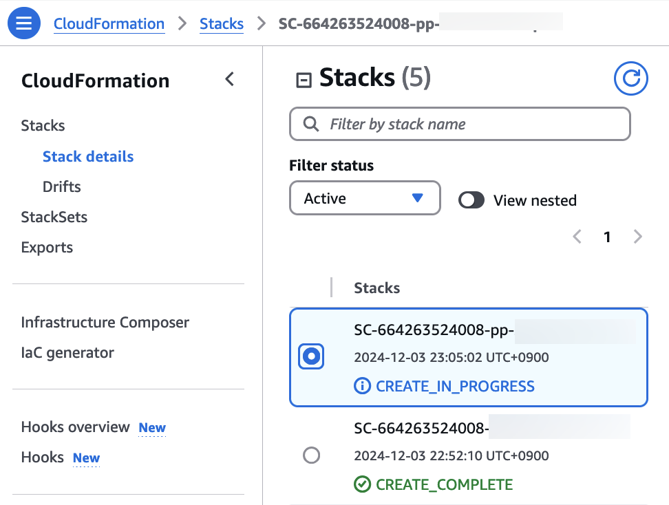](https://www.aws-ps-tech.kr/uploads/images/gallery/2024-12/CrLimage.png)

## numpy reinstall

<p class="callout warning">The issue occurs when running as it is currently. **As of Mar 14, 2025**</p>

Therefore, it is necessary to check the cluster created by Amazon EMR as shown below, connect to the Primary instance, delete and reinstall the numpy module.

[](https://www.aws-ps-tech.kr/uploads/images/gallery/2025-03/image.png)

[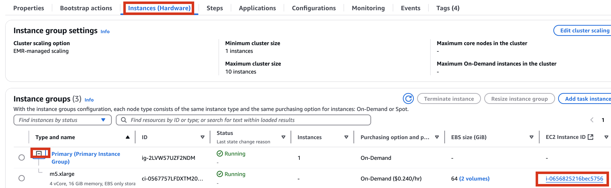](https://www.aws-ps-tech.kr/uploads/images/gallery/2025-03/sxXimage.png)[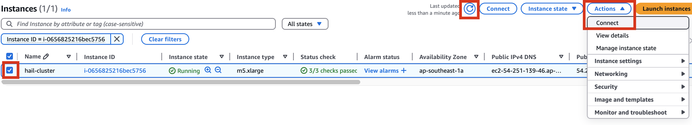](https://www.aws-ps-tech.kr/uploads/images/gallery/2025-03/xd0image.png)

[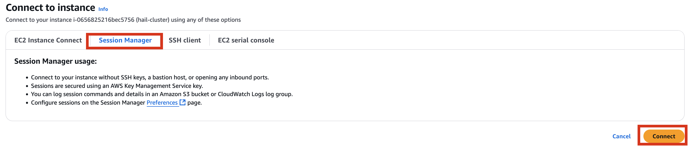](https://www.aws-ps-tech.kr/uploads/images/gallery/2025-03/opximage.png)

```
sudo python3 -m pip uninstall -y numpy

sudo python3 -m pip install  numpy -U
```

# GWAS Practice using Hail

1\. Launch your notebook. Find the URL in CloudFormation's Outputs tab. Clicking it will automatically connect you to your notebook instance in Amazon SageMaker.


2\. Select Open JupyterLab to start the notebook interface.


3\. We'll work with two notebooks in this practice session:

- common-notebooks/plotting-tutorail.ipynb
- common-notebooks/GWAS-tutorial.ipynb


Locate your previously created EMR cluster and update the Cluster Name in the second cell.

You can execute notebook cells in sequence by placing your cursor in the cell where you want to begin.


When the tutorial code runs successfully, you should see results similar to these:


# Additional Information

## VEP configuration

In the S3 bucket, select the json file object and click Copy S3 URI.


Ex: vep-configuration-GRCh37.json

```bash
{
        "command": [
                "/opt/ensembl-vep/vep",
                "--format", "vcf",
                "--dir_plugins", "/opt/vep/plugins",
                "--dir_cache", "/opt/vep/cache",
                "--json",
                "--everything",
                "--allele_number",
                "--no_stats",
                "--cache", "--offline",
                "--minimal",
                "--assembly", "GRCh37",
                "--plugin", "LoF,human_ancestor_fa:/opt/vep/loftee_data/human_ancestor.fa.gz,filter_position:0.05,min_intron_size:15,conservation_file:/opt/vep/loftee_data/phylocsf_gerp.sql,gerp_file:/opt/vep/loftee_data/GERP_scores.final.sorted.txt.gz",
                "-o", "STDOUT"
        ],
        "env": {
                "PERL5LIB": "/opt/vep"
        },
    "vep_json_schema": "Struct{assembly_name:String,allele_string:String,ancestral:String,colocated_variants:Array[Struct{aa_allele:String,aa_maf:Float64,afr_allele:String,afr_maf:Float64,allele_string:String,amr_allele:String,amr_maf:Float64,clin_sig:Array[String],end:Int32,eas_allele:String,eas_maf:Float64,ea_allele:String,ea_maf:Float64,eur_allele:String,eur_maf:Float64,exac_adj_allele:String,exac_adj_maf:Float64,exac_allele:String,exac_afr_allele:String,exac_afr_maf:Float64,exac_amr_allele:String,exac_amr_maf:Float64,exac_eas_allele:String,exac_eas_maf:Float64,exac_fin_allele:String,exac_fin_maf:Float64,exac_maf:Float64,exac_nfe_allele:String,exac_nfe_maf:Float64,exac_oth_allele:String,exac_oth_maf:Float64,exac_sas_allele:String,exac_sas_maf:Float64,id:String,minor_allele:String,minor_allele_freq:Float64,phenotype_or_disease:Int32,pubmed:Array[Int32],sas_allele:String,sas_maf:Float64,somatic:Int32,start:Int32,strand:Int32}],context:String,end:Int32,id:String,input:String,intergenic_consequences:Array[Struct{allele_num:Int32,consequence_terms:Array[String],impact:String,minimised:Int32,variant_allele:String}],most_severe_consequence:String,motif_feature_consequences:Array[Struct{allele_num:Int32,consequence_terms:Array[String],high_inf_pos:String,impact:String,minimised:Int32,motif_feature_id:String,motif_name:String,motif_pos:Int32,motif_score_change:Float64,strand:Int32,variant_allele:String}],regulatory_feature_consequences:Array[Struct{allele_num:Int32,biotype:String,consequence_terms:Array[String],impact:String,minimised:Int32,regulatory_feature_id:String,variant_allele:String}],seq_region_name:String,start:Int32,strand:Int32,transcript_consequences:Array[Struct{allele_num:Int32,amino_acids:String,appris:String,biotype:String,canonical:Int32,ccds:String,cdna_start:Int32,cdna_end:Int32,cds_end:Int32,cds_start:Int32,codons:String,consequence_terms:Array[String],distance:Int32,domains:Array[Struct{db:String,name:String}],exon:String,gene_id:String,gene_pheno:Int32,gene_symbol:String,gene_symbol_source:String,hgnc_id:String,hgvsc:String,hgvsp:String,hgvs_offset:Int32,impact:String,intron:String,lof:String,lof_flags:String,lof_filter:String,lof_info:String,minimised:Int32,polyphen_prediction:String,polyphen_score:Float64,protein_end:Int32,protein_start:Int32,protein_id:String,sift_prediction:String,sift_score:Float64,strand:Int32,swissprot:String,transcript_id:String,trembl:String,tsl:Int32,uniparc:String,variant_allele:String}],variant_class:String}"
}

```

You can modify and implement the following content in the **[vep-tutorial](https://github.com/hmkim/quickstart-hail/blob/main/sagemaker/common-notebooks/vep-tutorial.ipynb)** code using the S3 object URI you copied above.


## VEP Plugin Installation

If you need to modify VEP plugin installations (additions, etc.), you'll need to rebuild the AMI. The VEP installation code is in **[vep\_install.sh](https://github.com/hmkim/quickstart-hail/blob/main/packer-files/scripts/vep_install.sh)**. Modify this script and rebuild the AMI as needed.

For customizing Hail, VEP tool installation, and AMI building, refer to these resources:


- [Hail AMI Creation via AWS CodeBuild](https://github.com/hmkim/quickstart-hail/blob/main/docs/hail-ami.md)
- [vep-install.md](https://github.com/hmkim/quickstart-hail/blob/main/docs/vep-install.md)
- [Building a Custom Hail AMI](https://github.com/hmkim/quickstart-hail/blob/main/docs/ami-creation.md)

## Dynamically Expanding EMR Cluster EBS (HDFS) Volume  


When working with large datasets, you may find the initially configured cluster volume capacity insufficient. You can dynamically expand the EBS volume by following the guidance in this blog post:

<u><span lang="EN-US" style="font-family: 'Malgun Gothic',sans-serif; color: #4472c4; mso-ansi-language: EN-US;">[https://aws.amazon.com/ko/blogs/big-data/dynamically-scale-up-storage-on-amazon-emr-clusters/](https://aws.amazon.com/ko/blogs/big-data/dynamically-scale-up-storage-on-amazon-emr-clusters/)</span></u>

## FAQ

### Codebuild

CLIENT\_ERROR: error while downloading key ami/packer-files.zip, error: RequestError: send request failed caused by: Get "https://{bucket name}.s3.amazonaws.com/ami/packer-files.zip": dial tcp 3.5.30.46:443: i/o timeout for primary source