이번 세션에서는 특수 목적의 헬스 AI 서비스(AWS HealthOmics, AWS HealthLake, AWS HealthImaging)로 멀티모달 데이터를 저장할 수 있습니다.

각 데이터 유형 별로 알맞는 서비스에 저장하려면 해당 폴더에 있는 아티팩트를 따르세요.

- genomic - Run the notebook `store-multimodal-data/genomic/store-analyze-genomicdata-with-awshealthomics.ipynb`. This creates AWS HealthOmics data stores (Reference Store, Variant Store, and Annotation Store) to import reference genome, VCF files, and ClinVar annotation file.
- clinical - Follow the instructions in `store-multimodal-data/clinical/README.md `to create AWS HealthLake data store and import NDJSON files.
- medical imaging - First, run the notebook `store-multimodal-data/medical_imaging/store-imagingdata-with-awshealthimaging.ipynb` to create AWS HealthImaging data stores and import DICOM files. Then, run preprocess-multimodal-date/medical-imaging/imaging-radiomics.ipynb to generate radiomic features from multimple images in parallel using Amazon SageMaker Preprocessing.

### Store multimodal data

[Store multimodal data](https://github.com/aws-solutions-library-samples/guidance-for-multi-modal-data-analysis-with-aws-health-and-ml-services/tree/main/store-multimodal-data) 의 각 폴더의 가이드 또는 코드를 참고하여 진행해주세요.

#### Genomic (유전체학 데이터)  


보다 자세한 참고링크는 https://catalog.workshops.aws/amazon-omics-end-to-end/en-US/020-xp-code/300-omics-analytics/310-querying-data

##### VCF 가져오기 (AWS HealthOmics)  


샘플 VCF를 Import하는데 예시에서 보듯 30분 정도 소요됩니다. 본 예제에서는 889개의 샘플 VCF (0.1Megabyte)를 모두 가져오는데 걸린 시간입니다.

`s3://guidance-multimodal-hcls-healthai-machinelearning-us-east-1/genomic/fastq/Abe604_Frami345_b8dd1798-beef-094d-1be4-f90ee0e6b7d5_dna.vcf`

[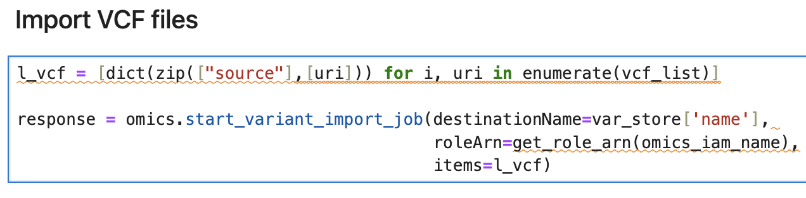](https://www.aws-ps-tech.kr/uploads/images/gallery/2024-01/screenshot-2024-01-30-at-5-21-38-pm.png)

[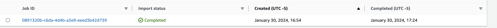](https://www.aws-ps-tech.kr/uploads/images/gallery/2024-01/screenshot-2024-01-30-at-5-34-37-pm.png)

annotation data 도 마찬가지로 가져옵니다. 이 예에서는 59메가바이트 정도의 파일을 가지고 오는데 5분정도 소요되었습니다.

`s3://guidance-multimodal-hcls-healthai-machinelearning-us-east-1/genomic/annotation/clinvar.vcf.gz`

[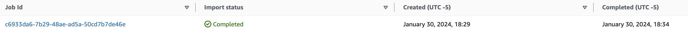](https://www.aws-ps-tech.kr/uploads/images/gallery/2024-01/screenshot-2024-01-30-at-6-44-00-pm.png)


[여기](https://github.com/aws-solutions-library-samples/guidance-for-multi-modal-data-analysis-with-aws-health-and-ml-services/tree/main/preprocess-multimodal-data)를 참고하면 아래의 수동 생성과정이 불필요할 수 있음.

<div class="Box-sc-g0xbh4-0 fSWWem" id="bkmrk-provide-necessary-pe" style="box-sizing: border-box; padding: 0px; color: rgb(230, 237, 243); font-family: -apple-system, 'system-ui', 'Segoe UI', 'Noto Sans', Helvetica, Arial, sans-serif, 'Apple Color Emoji', 'Segoe UI Emoji'; font-size: 14px; font-style: normal; font-variant-ligatures: normal; font-variant-caps: normal; font-weight: 400; letter-spacing: normal; orphans: 2; text-align: start; text-indent: 0px; text-transform: none; widows: 2; word-spacing: 0px; -webkit-text-stroke-width: 0px; white-space: normal; background-color: rgb(13, 17, 23); text-decoration-thickness: initial; text-decoration-style: initial; text-decoration-color: initial; --sticky-pane-height: calc(100vh - (max(0px, 0px)));"><div class="Box-sc-g0xbh4-0 kPPmzM" style="box-sizing: border-box; max-width: 100%; margin-left: auto; margin-right: auto; display: flex; flex-wrap: wrap;"><div class="Box-sc-g0xbh4-0 cIAPDV" style="box-sizing: border-box; display: flex; flex: 1 1 100%; flex-wrap: wrap; max-width: 100%;"><div class="Box-sc-g0xbh4-0 emFMJu" style="box-sizing: border-box; display: flex; flex-direction: column; order: 2; flex: 1 1 0px; -webkit-box-flex: 1; min-width: 1px; margin-right: auto;"><div class="Box-sc-g0xbh4-0 hlUAHL" style="box-sizing: border-box; width: 1485px; max-width: 100%; margin-left: auto; margin-right: auto; -webkit-box-flex: 1; flex-grow: 1; padding: 0px;"><div class="Box-sc-g0xbh4-0 iStsmI" data-selector="repos-split-pane-content" style="box-sizing: border-box; margin-left: auto; margin-right: auto; flex-direction: column; padding-bottom: 40px; max-width: 100%; margin-top: 0px; outline: none;" tabindex="0"><div class="Box-sc-g0xbh4-0 MERGN" style="box-sizing: border-box; margin-left: 16px; margin-right: 16px;"><div class="Box-sc-g0xbh4-0 yfPnm" style="box-sizing: border-box; display: flex; flex-direction: column; gap: 16px;"><div class="Box-sc-g0xbh4-0 faROye" style="box-sizing: border-box; min-width: 0px; display: flex; flex-direction: row; -webkit-box-pack: justify; justify-content: space-between; gap: 16px;"><div class="Box-sc-g0xbh4-0 hcmQVs" id="bkmrk-provide-necessary-pe-1" style="box-sizing: border-box; border-radius: 6px; width: 1453px; border: 1px solid var(--borderColor-default,var(--color-border-default,#30363d));"><div class="Box-sc-g0xbh4-0 bJMeLZ js-snippet-clipboard-copy-unpositioned" data-hpc="true" style="box-sizing: border-box; padding: 32px; overflow: auto;"><article class="markdown-body entry-content container-lg" style="box-sizing: border-box; display: block; max-width: 1012px; margin-right: auto; margin-left: auto; font-family: -apple-system, BlinkMacSystemFont, 'Segoe UI', 'Noto Sans', Helvetica, Arial, sans-serif, 'Apple Color Emoji', 'Segoe UI Emoji'; font-size: 16px; line-height: 1.5; overflow-wrap: break-word;"><span style="color: rgb(236, 240, 241);">Provide necessary permissions to the role</span>

1. Get the execution role of your SageMaker domain. Click on the default user profile and note down the execution role on the right hand side of the page. The role will look like `arn:aws:iam::111122223333:role/service-role/AmazonSageMaker-ExecutionRole-XXXX`. Note down the `AmazonSageMaker-ExecutionRole-XXXX` part as it will be used in the next steps.
2. Go to **Lake Formation** service page and choose **Administrative roles and tasks**.
3. Go to the **Data lake administrators** section and click on **Add**. Under **IAM users and roles**, choose the execution role created in the previous step. Click on **Confirm**.
4. Go to **IAM** service page. Click on **Roles**. Search for the execution role created in the previous step. Click on the execution role.
5. Click on **Add permissions** and **Attach policies**. Select **AmazonAthenaFullAccess** and **Add permissions**.
6. Go back to the SageMaker domain in your SageMaker console. Under **User profiles**, click on **Launch** and select **Studio**. Wait for the Studio to launch.

</article></div></div></div></div></div></div></div><div class="Box-sc-g0xbh4-0" style="box-sizing: border-box;">  
</div></div></div></div></div>##### 데이터베이스 생성 (AWS Lake Formation) 및 Workgroup 생성 (Amazon Athena)  


<p class="callout info">워크그룹 생성</p>

[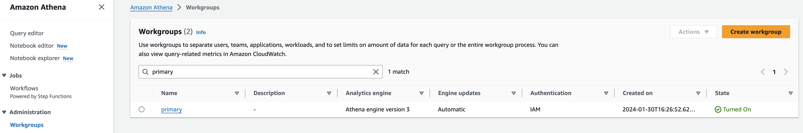](https://www.aws-ps-tech.kr/uploads/images/gallery/2024-01/screenshot-2024-01-30-at-5-39-53-pm.png)

omics라는 이름으로 workgroup을 생성합니다.

[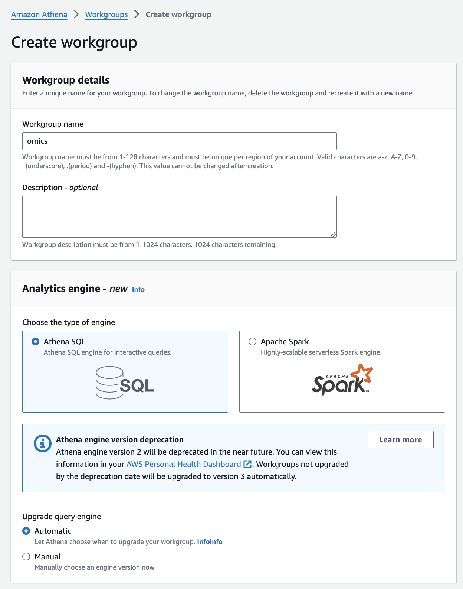](https://www.aws-ps-tech.kr/uploads/images/gallery/2024-01/screenshot-2024-01-30-at-5-38-18-pm.png)

Athena쿼리를 위해 Lake Formation에서 데이터베이스를 사전에 생성하여 리소스를 링크합니다.


<p class="callout info">데이터베이스 생성</p>

[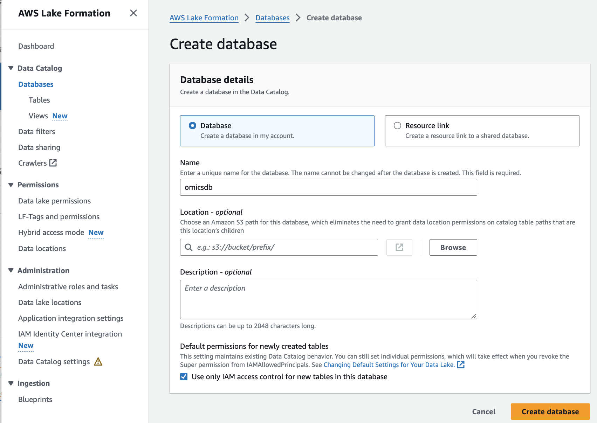](https://www.aws-ps-tech.kr/uploads/images/gallery/2024-01/screenshot-2024-01-30-at-5-00-42-pm.png)

다음과 같이 Database가 생성된 것을 확인할 수 있습니다.

[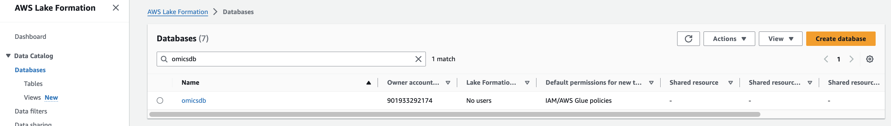](https://www.aws-ps-tech.kr/uploads/images/gallery/2024-01/screenshot-2024-01-30-at-5-42-09-pm.png)


[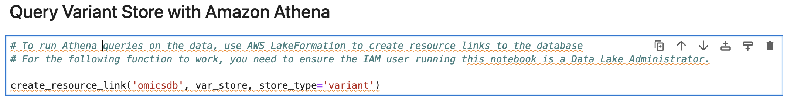](https://www.aws-ps-tech.kr/uploads/images/gallery/2024-01/screenshot-2024-01-30-at-4-59-27-pm.png)

\# 데이터에 대해 아테나 쿼리를 실행하려면, AWS Lake Formation을 사용해 데이터베이스에 대한 리소스 링크를 생성하세요.  
\# 다음 기능이 작동하려면 이 노트북을 실행하는 IAM 사용자가 데이터 레이크 관리자인지 확인해야 합니다.

[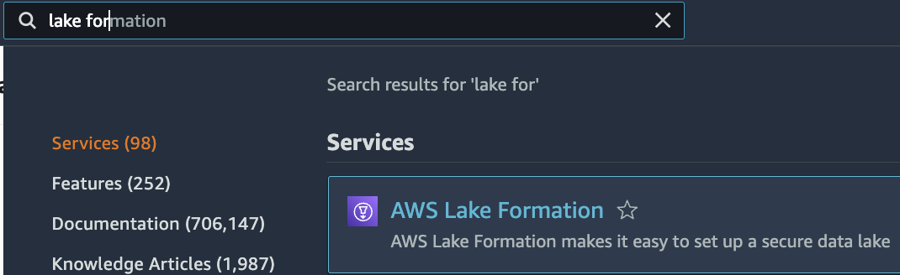](https://www.aws-ps-tech.kr/uploads/images/gallery/2024-01/screenshot-2024-01-30-at-5-00-12-pm.png)

<p class="callout info">리소스 연결</p>

앞에서 VCF 를 HealthOmics에 Import 정상적으로 했다면 AWS Lake Formation의 Tables 목록에서 확인할 수 있습니다.

해당되는 테이블을 체크하고 grant on target를 선택한 뒤 권한을 부여합니다.

[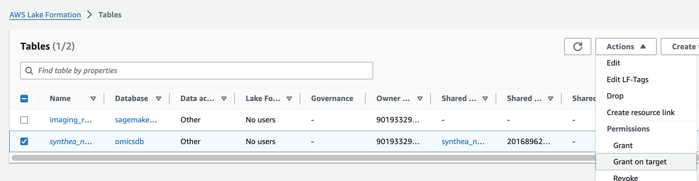](https://www.aws-ps-tech.kr/uploads/images/gallery/2024-01/screenshot-2024-01-30-at-6-28-37-pm.png)

[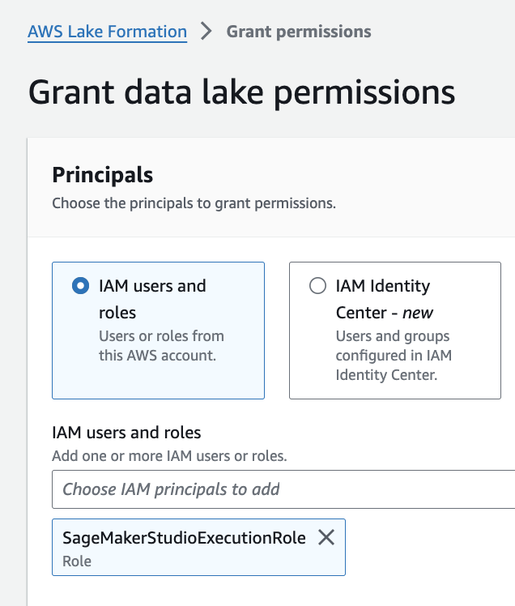](https://www.aws-ps-tech.kr/uploads/images/gallery/2024-01/screenshot-2024-01-30-at-6-28-46-pm.png)

[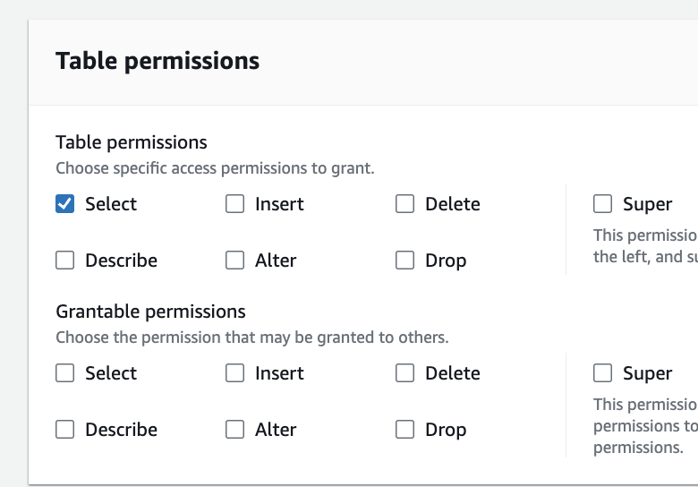](https://www.aws-ps-tech.kr/uploads/images/gallery/2024-01/screenshot-2024-01-30-at-7-04-01-pm.png)

[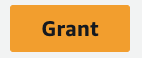](https://www.aws-ps-tech.kr/uploads/images/gallery/2024-01/screenshot-2024-01-30-at-6-29-07-pm.png)

Jupyter에서 불러온 Annotation 테이블 결과 예시입니다.

[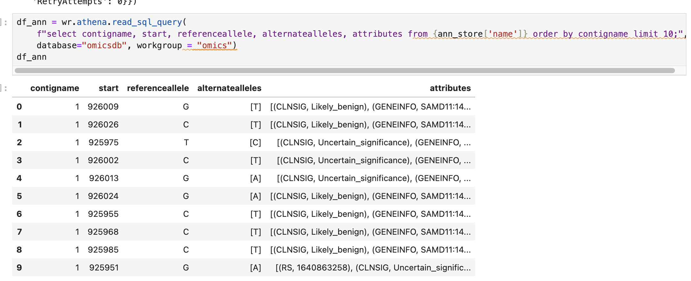](https://www.aws-ps-tech.kr/uploads/images/gallery/2024-01/screenshot-2024-01-30-at-7-02-32-pm.png)


#### Clinical (임상정보 데이터)   


AWS HealthLake 서비스를 사용하여 임상정보를 저장하고 활용할 수 있습니다. [여기](https://github.com/aws-solutions-library-samples/guidance-for-multi-modal-data-analysis-with-aws-health-and-ml-services/blob/main/store-multimodal-data/clinical/README.md)에 있는 것 처럼 처음에 가장 먼저 할일은 Clinical data를 저장하는 것부터 입니다.

AWS HealthLake 서비스 접속 후 새로운 데이터 스토어 생성

[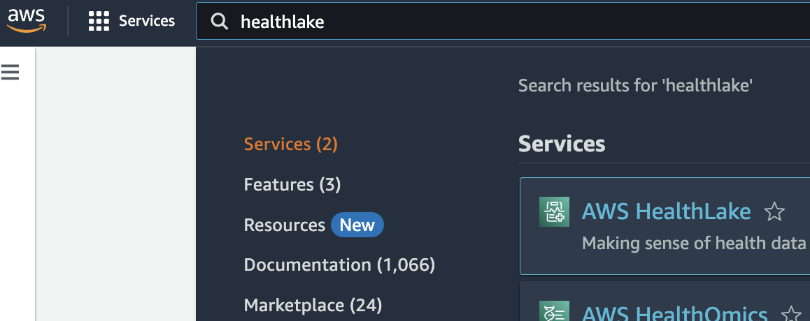](https://www.aws-ps-tech.kr/uploads/images/gallery/2024-02/screenshot-2024-02-08-at-6-28-09-pm.png)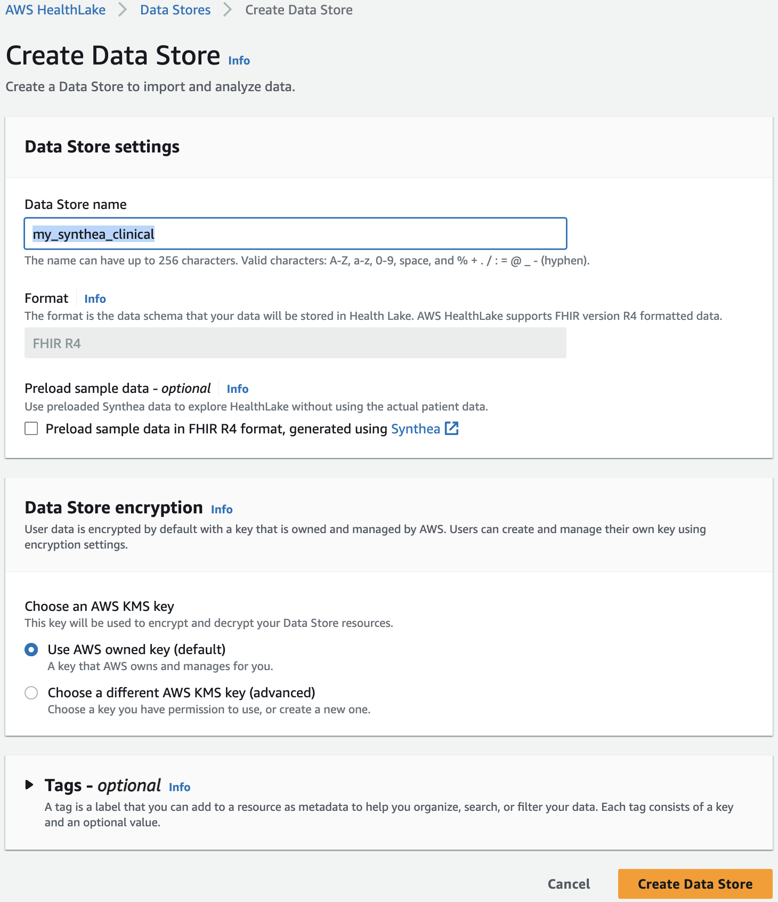

사전 준비 필요

```bash
pip install s3fs
```

#### Medical imaging (의료이미지 데이터)

preprocess-imaging.ipynb 을 사용해서 FeatureStore에 저장

[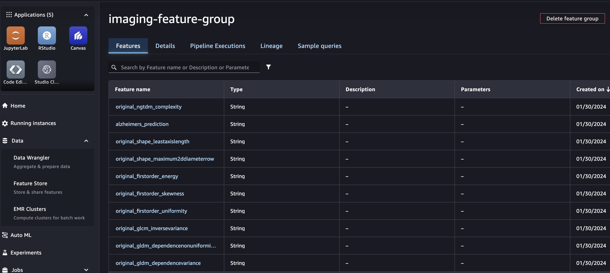](https://www.aws-ps-tech.kr/uploads/images/gallery/2024-01/screenshot-2024-01-30-at-9-04-15-pm.png)

imaging-radiomics.ipynb 을 사용해 다음 진행

이때 입력이 되는 dicom 경로를 적절히 수정해야함.

[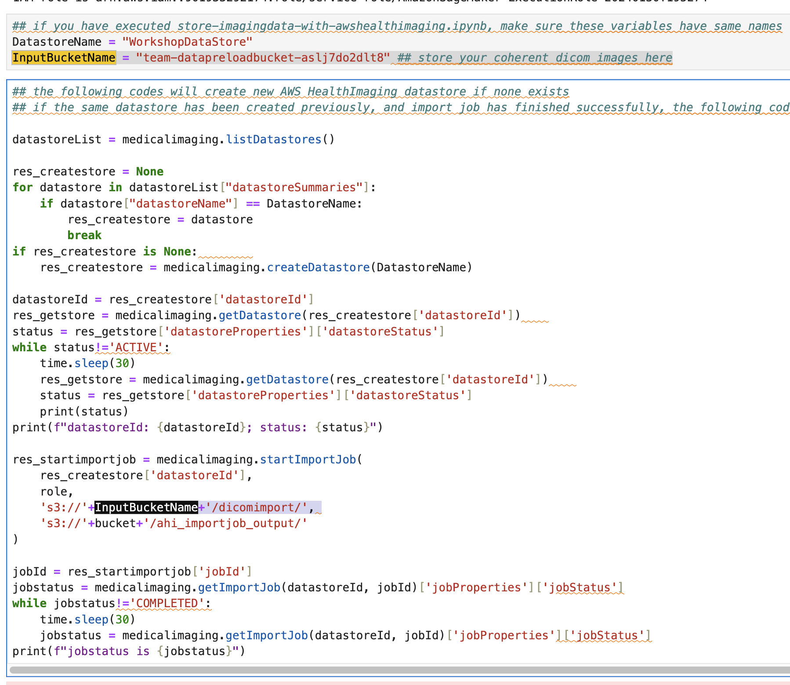](https://www.aws-ps-tech.kr/uploads/images/gallery/2024-01/screenshot-2024-01-30-at-9-14-31-pm.png)

[여기](https://docs.aws.amazon.com/healthimaging/latest/devguide/getting-started-setting-up.html#setting-up-create-iam-role-import)를 참고하여 SagaMaker 도메인에 적용된 IAM에 필요한 Policy, Trusted policy 적용

[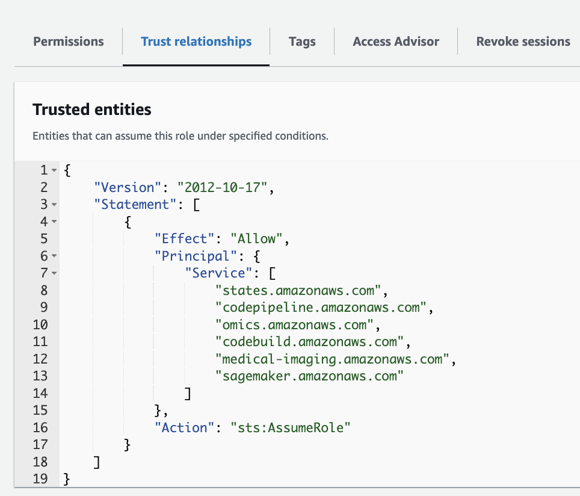](https://www.aws-ps-tech.kr/uploads/images/gallery/2024-01/screenshot-2024-01-30-at-11-11-51-pm.png)

이때 아래 policy 참고 (codebuild:CreatProject 와 iam:PassRole)

[https://raw.githubusercontent.com/aws-samples/amazon-sagemaker-immersion-day/master/iam-policy-sm-cb.txt](https://raw.githubusercontent.com/aws-samples/amazon-sagemaker-immersion-day/master/iam-policy-sm-cb.txt)

AWSCodePipeline에 대한 Policy도 있어야 함.

[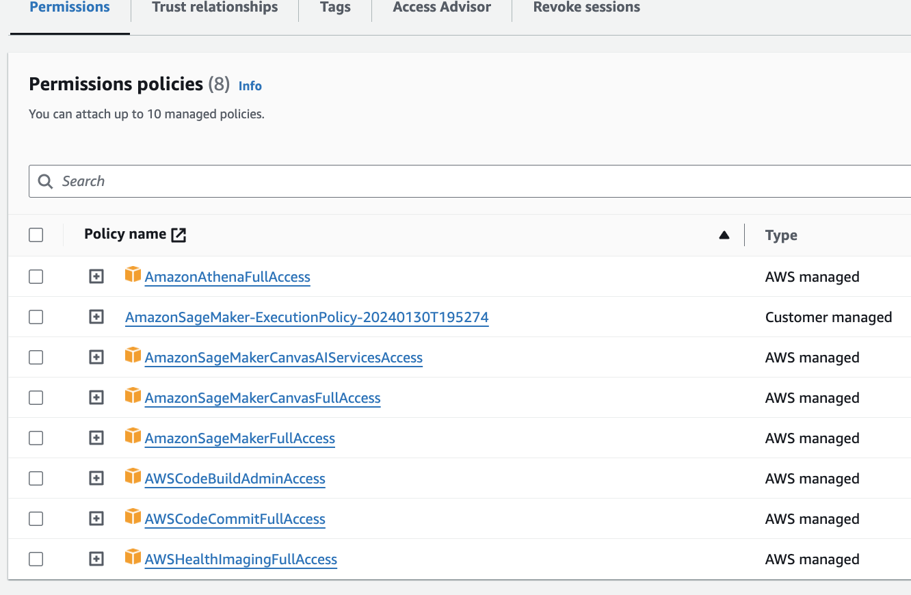](https://www.aws-ps-tech.kr/uploads/images/gallery/2024-01/screenshot-2024-01-30-at-11-21-05-pm.png)

### Preprocess multimodal data  


[preprocess-multimodal-data](https://github.com/aws-solutions-library-samples/guidance-for-multi-modal-data-analysis-with-aws-health-and-ml-services/tree/main/preprocess-multimodal-data) 폴더의 각 폴더별 지침/코드를 참고하여 진행해주세요.

<p class="callout info">이때 SageMaker domain은 새로 생성할 필요 없이 [앞에서 만들었던 domain](https://www.aws-ps-tech.kr/books/omics-on-aws/page/65b9e)을 사용할 수 있습니다.</p>