본 문서는 [Guidance for Multi-Modal Data Analysis with AWS Health and ML Services](https://aws.amazon.com/solutions/guidance/multi-modal-data-analysis-with-aws-health-and-ml-services/) 를 참고하였으며 여기에 있는 [Open sample code](https://github.com/aws-solutions-library-samples/guidance-for-multi-modal-data-analysis-with-aws-health-and-ml-services)를 참고하여 정리하였습니다.

### 소개

상기 [Repository](https://github.com/aws-solutions-library-samples/guidance-for-multi-modal-data-analysis-with-aws-health-and-ml-services)에는 AWS Health 및 머신 러닝 서비스를 사용한 멀티모달 데이터 분석을 위한 AWS 가이드와 관련된 코드 샘플이 포함되어 있습니다. 주어진 지침에 따라 게놈, 임상 및 의료 이미징 데이터를 저장, 통합 및 분석하기 위한 엔드투엔드 프레임워크를 구축할 수 있습니다.

예를 들어, FHIR 리소스, MRI DICOM 이미지, 게놈 데이터, 생리학적 데이터(예: 심전도), 간단한 임상 기록이 포함된 오픈 소스 합성 데이터 세트인 [Synthea Coherent Data Set](https://registry.opendata.aws/synthea-coherent-data/)를 사용할 것입니다. 모든 데이터 유형은 FHIR로 서로 연결됩니다. 데모를 위해 이미 게놈 데이터(원래는 변이체 및 주석 정보가 포함된 CSV 파일로 제공됨)를 AWS HealthOmics와 호환되는 VCF 형식으로 변환했습니다. 마찬가지로 임상 데이터도 AWS 헬스레이크와 호환되는 NDJSON 파일로 준비했습니다. 사용 편의성을 위해 이 파생된 데이터 세트를 Amazon S3 버킷(s3://guidance-multimodal-hcls-healthai-machinelearning)에서 공개 액세스를 통해 사용할 수 있도록 했습니다. 일관된 데이터 세트는 심혈관 질환에 초점을 맞추고 있으므로 고혈압, 뇌졸중, 관상동맥 심장 질환, 알츠하이머병과 같은 환자의 결과를 예측하는 사용 사례를 고려하고 있습니다.

[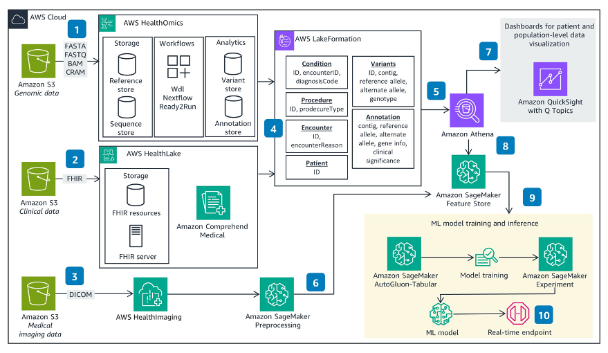](https://www.aws-ps-tech.kr/uploads/images/gallery/2024-01/architecture-diagram.png)

### 계정 내 사전 준비

모든 데이터 분석 및 AI 모델링은 [Amazon SageMaker](https://aws.amazon.com/sagemaker/)를 사용하여 수행됩니다. 원클릭 배포로 [Amazon SageMaker 도메인](https://docs.aws.amazon.com/ko_kr/sagemaker/latest/dg/sm-domain.html)을 만들 수 있습니다.

[](https://console.aws.amazon.com/cloudformation/home?region=us-east-1#/stacks/create/template?stackName=sagemakerstack&templateURL=https://aws-opendata-demo.s3.amazonaws.com/sagemaker_template.yaml)

[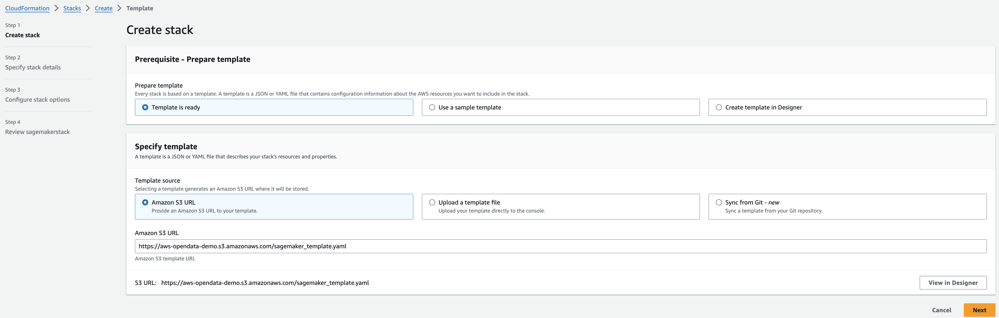](https://www.aws-ps-tech.kr/uploads/images/gallery/2024-01/screenshot-2024-01-30-at-4-15-52-pm.png)

ParameterSubnet1Id, ParameterSubnet2Id, ParameterVPCId 값을 본인의 계정에 맞게 선택하면 됩니다.

[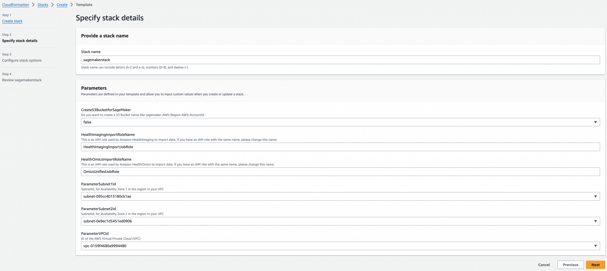](https://www.aws-ps-tech.kr/uploads/images/gallery/2024-01/screenshot-2024-01-30-at-4-16-13-pm.png)

[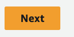](https://www.aws-ps-tech.kr/uploads/images/gallery/2024-01/screenshot-2024-01-30-at-4-16-35-pm.png)

체크박스에 체크를 하고 Submit을 누릅니다.

[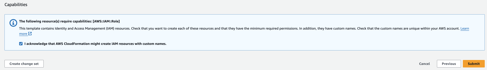](https://www.aws-ps-tech.kr/uploads/images/gallery/2024-01/screenshot-2024-01-30-at-4-16-24-pm.png)

### SageMaker 도메인 확인  


앞에서 만들었던 CloudFormation의 Stack이 정상적으로 만들어졌다면, 이제 SageMaker를 사용할 준비가 완료되었습니다.

[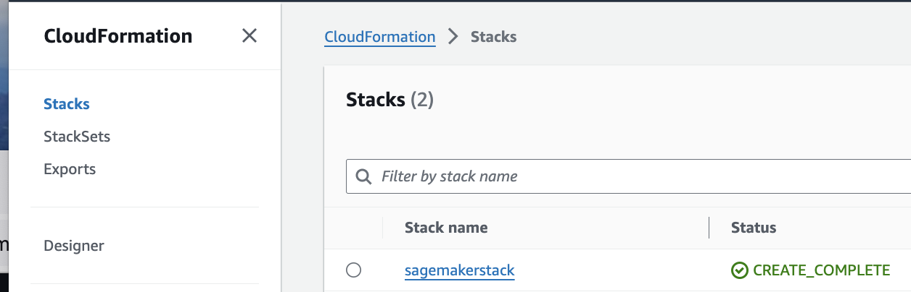](https://www.aws-ps-tech.kr/uploads/images/gallery/2024-01/screenshot-2024-01-30-at-4-19-22-pm.png)

만들어진 stack에서는 resources 탭을열어보면 관련된 리소스들을 볼 수 있습니다. 관련 IAM Role들이 생성된 것을 확인할 수 있습니다.

[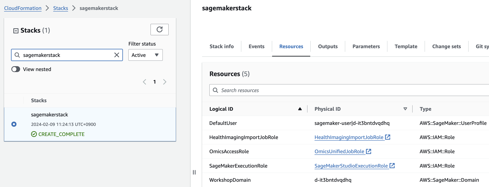](https://www.aws-ps-tech.kr/uploads/images/gallery/2024-02/screenshot-2024-02-09-at-11-32-36-am.png)

Amazon SageMaker서비스로 진입합니다.

[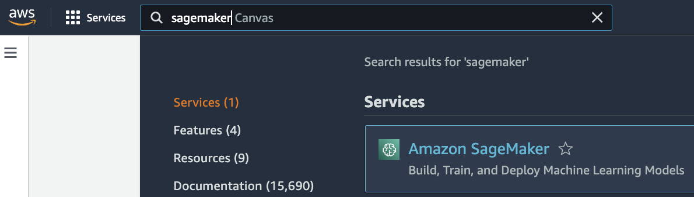](https://www.aws-ps-tech.kr/uploads/images/gallery/2024-01/screenshot-2024-01-30-at-4-18-25-pm.png)

아래와 같이 Domain에서 만들어진 도메인 목록을 확인할 수 있습니다.

[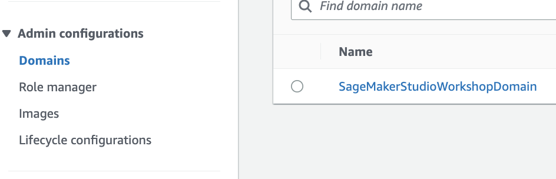](https://www.aws-ps-tech.kr/uploads/images/gallery/2024-01/screenshot-2024-01-30-at-4-18-54-pm.png)

Domain settings 메뉴에서 해당 도메인에서 사용되는 Execution Role을 확인해볼 수 있습니다.

여기서는 Role 이름은 `SageMakerStudioExecutionRole` 입니다.

[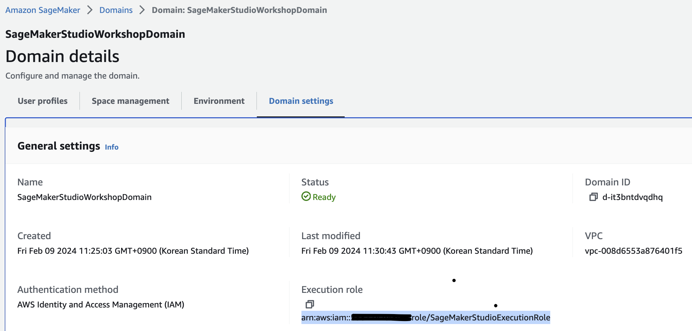](https://www.aws-ps-tech.kr/uploads/images/gallery/2024-02/screenshot-2024-02-09-at-11-36-03-am.png)

생성된 도메인 내에서 Launch버튼을 눌러 Studio 앱을 실행합니다.

[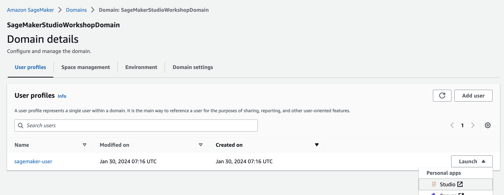](https://www.aws-ps-tech.kr/uploads/images/gallery/2024-01/screenshot-2024-01-30-at-4-20-24-pm.png)

Amazon SageMaker Studio 환경에 접속하였습니다!

[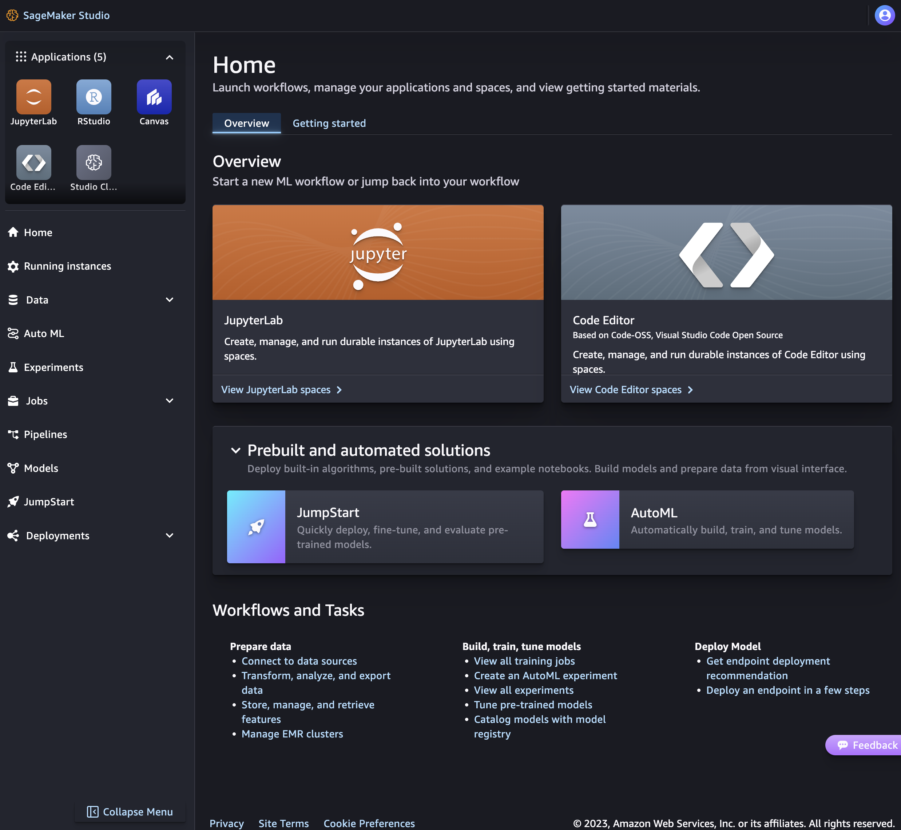](https://www.aws-ps-tech.kr/uploads/images/gallery/2024-01/screenshot-2024-01-30-at-4-20-47-pm.png)

Create JupyterLab space를 눌러서 쥬피터 환경을 만듭니다.

[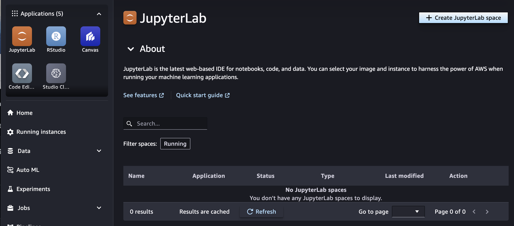](https://www.aws-ps-tech.kr/uploads/images/gallery/2024-01/screenshot-2024-01-30-at-4-21-46-pm.png)목록으로 돌아가 환경이 만들어질때까지 대기합니다.

[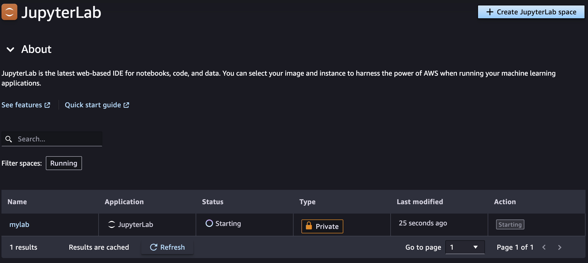](https://www.aws-ps-tech.kr/uploads/images/gallery/2024-01/screenshot-2024-01-30-at-4-23-08-pm.png)

환경이 만들어졌다면 Open 을 선택하여 Jupyter Lab 환경을 시작합니다.

[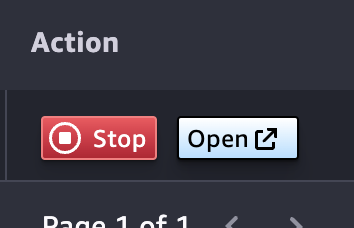](https://www.aws-ps-tech.kr/uploads/images/gallery/2024-01/screenshot-2024-01-30-at-4-24-01-pm.png)

터미널을 열고 git clone 명령어로 repository를 로컬로 복제합니다.

[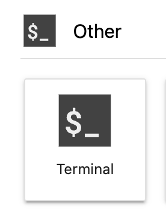](https://www.aws-ps-tech.kr/uploads/images/gallery/2024-01/screenshot-2024-01-30-at-4-24-50-pm.png)

```bash
git clone https://github.com/aws-solutions-library-samples/guidance-for-multi-modal-data-analysis-with-aws-health-and-ml-services.git
```

[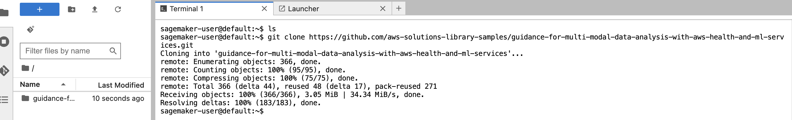](https://www.aws-ps-tech.kr/uploads/images/gallery/2024-01/screenshot-2024-01-30-at-4-24-54-pm.png)